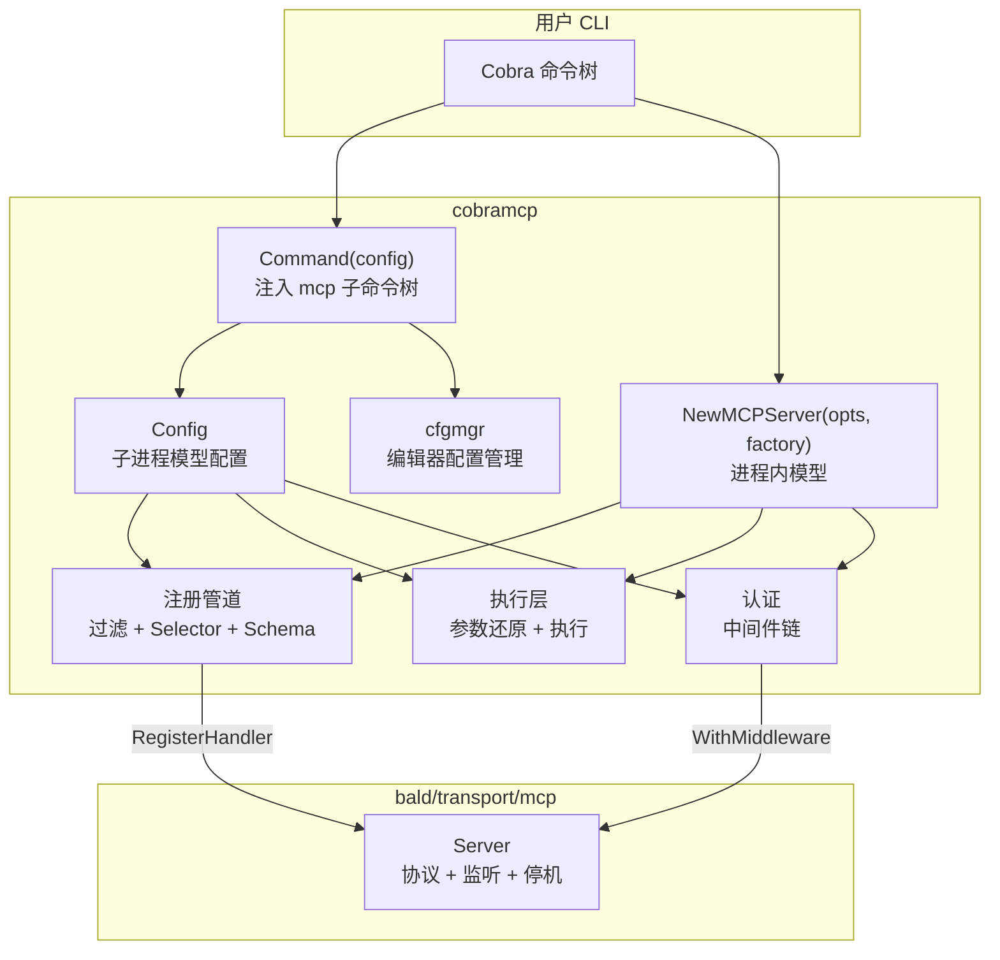

# cobramcp 设计文档

cobramcp 把任意 Cobra CLI 转换为 MCP（Model Context Protocol）服务器：它遍历 Cobra 命令树，把每条命令翻译成一个 MCP 工具（含 JSON Schema），并处理工具调用到 CLI 执行的往返。

## 1. 定位与边界

cobramcp 是 bald 生态中 **"Cobra → MCP 工具" 的桥接层**，只回答一个问题：**工具从哪来**。协议、监听、生命周期、日志都不由它拥有：

| 关注点 | 归属 |
| --- | --- |
| MCP 协议实现、监听、优雅停机、`Endpoint()` | `bald/transport/mcp`（`Start` 同步绑定端口并返回真实地址） |
| 日志输出 | `bald/log` 契约；进程内模型用宿主装配的 Logger，自带 CLI 子命令安装 stderr 后端 |
| 进程信号（SIGINT/SIGTERM）与生命周期编排 | 宿主（appkit / bootstrap）；本包不捕获信号 |
| 工具来源（Cobra 命令树 → MCP 工具） | **本包** |

依赖方向单向：`cobramcp → transport/mcp → bald/log`，反向不存在。只想要 MCP 传输的消费者不会被拖入 cobra / pflag / jsonschema。

cobramcp 的 `MCPServer` 满足 bald 的 `transport.Server` 契约（`Start` 阻塞至 ctx 取消、`Stop` 优雅停机、`Endpoint` 返回真实监听地址），可直接交给 `appkit` 装配。

**依赖**（`cobramcp/go.mod`）：

- `github.com/spf13/cobra` + `pflag`：被转换的 CLI 框架
- `github.com/mark3labs/mcp-go`：MCP 类型与传输（经 `transport/mcp` 使用）
- `github.com/google/jsonschema-go`：JSON Schema 生成
- `github.com/kalandramo/bald/log`、`github.com/kalandramo/bald/transport/mcp`

## 2. 总体架构



### 2.1 代码地图

```
cobramcp/
├── doc.go              包文档（双模型说明、用法示例）
├── root.go             Command()：注入 mcp 子命令树
├── config.go           Config（子进程模型）+ serveStdio/serveHTTP/newTransportServer
├── server.go           MCPServer（进程内模型）+ MCPOptions
├── start.go            mcp start   → stdio
├── stream.go           mcp stream  → SSE
├── restcmd.go / rest.go  mcp rest  → 纯 REST
├── tools.go            mcp tools   → 导出工具清单 JSON
├── auth.go             认证中间件构建（钩子 + 静态 token）
├── selector.go         Selector 类型 + 工具创建（buildFlatSchema/createToolFromCmd）
├── selectors.go        Selector 构造器（AllowCmds/ExcludeFlags/NoFlags 等）
├── schema.go           ToolInput / ToolOutput 结构
├── args.go             位置参数解析（cmd.Use token → ArgSpec）
├── annotations.go      MCP 工具注解（readOnlyHint 等）
├── execute.go          子进程执行 + 扁平参数切分还原
├── logger.go           stderr 日志后端（bald/log 契约实现）
├── utils.go            parseLogLevel
└── internal/
    ├── bridge/flags/   pflag flag → JSON Schema 映射
    ├── schema/         JSON Schema 缓存工具
    └── cfgmgr/         编辑器配置管理（vscode / cursor）
        ├── manager/    泛型 Manager + 各编辑器配置实现
        └── cmd/        各编辑器的 enable/disable/list 命令
```

## 3. 双执行模型

cobramcp 支持两种执行模型，差别在**一次工具调用如何执行**。

### 3.1 子进程模型（`Command` / `Config`）

`root.go` 的 `Command(config)` 向用户 CLI 注入 `mcp` 管理子命令树；`config.go` 的 `Config` 承担工具发现与子进程执行。

每次工具调用**重新执行自身二进制**（`execute.go` 的 `execSubprocess`）：进程启动时解析一次 `os.Executable()`，调用时 `exec.CommandContext(ctx, executablePath, args...)`。

- **适用**：命令全部状态可由 CLI flag 重建（如 `make`、`kubectl` 包装器）。
- **优点**：天然进程隔离、并发安全、崩溃不影响服务器。
- **代价**：每次调用冷启动（重新加载配置、重建依赖）。

### 3.2 进程内模型（`NewMCPServer` / `MCPServer`）

`server.go` 的 `NewMCPServer(opts, cmdFactory)` 接收一个**命令树工厂函数**：

- 构造时调用一次（只读遍历，取 schema）；
- 此后**每次工具调用再调用一次**生成全新命令树。

因为每次调用都是新树，所有 `Options` 结构、flag 值、闭包捕获变量都是调用私有的——**并发调用天然安全，无需加锁，也无需 reset**。

- **适用**：命令依赖进程内不可序列化的状态（API 客户端、DB 句柄、业务对象）。
- **优点**：依赖在构造期注入、只读共享，无需为每次调用重建。
- **代价**：每次调用的分配开销。

### 3.3 对比

| | 子进程模型 | 进程内模型 |
| --- | --- | --- |
| 接入 | `AddCommand(cobramcp.Command(cfg))` | `NewMCPServer(opts, factory)` |
| 一次调用怎么执行 | 还原参数 → 重新执行自身二进制 | 当前进程内执行（每次新建命令树） |
| 传输 | stdio / SSE / REST | SSE |
| 生命周期 | 自带 `mcp start/stream/rest` 自行管理 | 交宿主，满足 `transport.Server` 契约 |
| 日志后端 | CLI 子命令自动装 stderr 后端 | 不装，由宿主经 `bald/log` 决定 |

## 4. 命令 → 工具注册管道

注册分三阶段：**安全过滤 → Selector 匹配 → Schema 生成**。前者不可被 Selector 绕过。

### 4.1 基础安全过滤（恒生效）

`cmdFilter`（`config.go` / `server.go`）排除：

- `Hidden` 或 `Deprecated` 的命令；
- 没有 `Run` / `RunE` / `PreRun` / `PreRunE` 的命令（不可执行）；
- 内建命令：cobramcp 命令组自身（用 `CommandName` 定位）、`help`、`completion`。

内建命令用**精确路径段匹配**（`hasPathSegment`，`selectors.go`），不是子串匹配——否则 `helper`、`completion-status`、`mcp-tools` 这类名字会被误排除。

flag 层面（`buildFlatSchema`，`selector.go`）恒排除：`--help`、`Hidden`、`Deprecated` 的 flag。

### 4.2 Selector 体系

`Selector`（`selector.go`）控制暴露面。多个 Selector 按声明顺序求值，**第一个命中的生效**，后续不再评估。

```go
type Selector struct {
    CmdSelector           CmdSelector    // 命令是否匹配；nil 表示全匹配
    LocalFlagSelector     FlagSelector   // 命令自身 flag 的筛选
    InheritedFlagSelector FlagSelector   // persistent flag 的筛选
    Middleware            MiddlewareFunc // 工具执行中间件
}
```

可直接使用的构造器（`selectors.go`）：

| 构造器 | 匹配对象 | 语义 |
| --- | --- | --- |
| `AllowCmdsContaining(...)` / `ExcludeCmdsContaining(...)` | `cmd.CommandPath()` 子串 | 路径**含**任一短语 |
| `AllowCmds(...)` / `ExcludeCmds(...)` | `cmd.CommandPath()` 全等 | 路径**等于**其中之一 |
| `AllowFlags(...)` / `ExcludeFlags(...)` | `pflag.Flag.Name` | flag 名白/黑名单 |
| `NoFlags` | — | 排除全部 flag |

要点：

- 匹配的是**完整命令路径**（含根命令名），不是工具名。
- flag 分两组：`LocalFlagSelector` 管命令自身 flag，`InheritedFlagSelector` 管 persistent flag。想让入参干净，`InheritedFlagSelector: cobramcp.NoFlags` 是最常用的一行。
- 约定「具体规则在前、兜底规则在后」。`Config.Selectors` 为空时默认等价于一个全收 `Selector{}`。

### 4.3 Middleware

`Selector.Middleware` 包在真正的执行外面（`selector.go` 的 `execute`），可做超时、日志、结果改写、错误转换。执行本身已自带 panic 恢复（panic 变成工具错误结果）。

```go
Middleware: func(ctx context.Context, req mcp.CallToolRequest, in cobramcp.ToolInput,
    next cobramcp.ExecuteFunc) (*mcp.CallToolResult, cobramcp.ToolOutput, error) {
    ctx, cancel := context.WithTimeout(ctx, time.Minute)
    defer cancel()
    return next(ctx, req, in)
}
```

## 5. 扁平 JSON Schema

工具入参是**扁平结构**：所有 flag 与位置参数都是顶层属性，没有嵌套的 `flags` / `args` 子对象。这减少 LLM 的嵌套层数与出错面。

```json
{
  "type": "object",
  "properties": {
    "namespace": { "type": "string", "description": "namespace to use" },
    "level":     { "type": "integer", "default": 1 },
    "module":    { "type": "string", "description": "The on-call module name (e.g. 'bke')" }
  },
  "required": ["module"],
  "additionalProperties": { "not": {} }
}
```

`additionalProperties` 用 `{"not":{}}` 表达「不允许任何额外字段」；模型多传字段会被判为不合法。

### 5.1 flag → JSON Schema 映射

`internal/bridge/flags/flags.go` 的 `AddFlagToSchema` 按 pflag 类型映射：

| pflag 类型 | JSON Schema |
| --- | --- |
| `bool` | `boolean` |
| `int` / `int8..64` / `uint` / `uint8..64` / `count` | `integer` |
| `float32` / `float64` | `number` |
| `string` | `string`（可用 flag 注解 `jsonschema` 覆盖成任意子 schema） |
| `stringSlice` / `stringArray` | `array<string>` |
| `intSlice` / `int32Slice` / `int64Slice` / `uintSlice` | `array<integer>` |
| `float32Slice` / `float64Slice` | `array<number>` |
| `boolSlice` | `array<boolean>` |
| `stringToString` | `object<string>`（描述追加 `(format: key-value pairs)`） |
| `stringToInt` / `stringToInt64` | `object<integer>`（描述追加 `(format: key-value pairs with integer values)`） |
| `duration` | `string` + Go duration 正则 |
| `ip` / `ipNet` / `ipMask` / `bytesHex` / `bytesBase64` | `string` + 对应正则或格式说明 |
| 未知类型 | `string`，描述追加 `(type: <原类型>)` |

- **必填**：`cmd.MarkFlagRequired("x")` 的 flag 进 `required`（通过 `cobra.BashCompOneRequiredFlag` 注解识别，`isFlagRequired`）。
- **默认值**：从 `flag.DefValue` 写入 `default`（`default.go` 的 `setDefaultFromFlag`）。空字符串与空数组 `[]` 不写；数组按 pflag 的 `[a,b]` 形式解析，对象按 `k=v` 解析。无效元素跳过并告警。
- **自定义 schema**：给 flag 加 `Annotations["jsonschema"] = []string{<JSON Schema 字符串>}` 可覆盖默认类型推导（如把 `string` flag 声明为任意 JSON 对象）。

### 5.2 位置参数

`args.go` 的 `parseArgSpecs` 从 `cmd.Use` 解析位置参数 token：

| token 形式 | 含义 |
| --- | --- |
| `<name>` | 必填，单值 |
| `[name]` | 可选，单值 |
| `<name...>` | 必填，变参（schema 为 `array<string>`） |
| `[name...]` | 可选，变参 |
| `[flags]` | cobra 哨兵，忽略 |

参数名归一化：转小写、非字母数字换 `_`（`normaliseName`）。

描述默认由 token 生成（英文），可用注解改写——**下标从 0 开始**：

```go
cmd := &cobra.Command{
    Use:   "oncall <module> [title]",
    Short: "发起 oncall",
    Annotations: map[string]string{
        cobramcp.AnnotationArgPrefix + "0": "值班模块名（如 bke、kafka）",
        cobramcp.AnnotationArgPrefix + "1": "一句话事件标题",
    },
}
```

**同名冲突会被拒绝注册**：若位置参数名（归一化后）与某个 flag 名相同，`buildFlatSchema` 返回错误而非降级——否则扁平 schema 会有两个写入源，执行期切分会把同一输入值同时当作 flag 和位置参数。命令树中存在这类命令时，注册整体失败。

### 5.3 工具名与描述

工具名（`selector.go` 的 `toolName`）：

- **子进程模型**：`<前缀>_<子命令路径>`，段间空格换下划线。前缀默认是根命令名，可用 `Config.ToolNamePrefix` 覆盖（应对 MCP 的 64 字符工具名上限）。例如 `myapp sre open` → `myapp_sre_open`。
- **进程内模型**：前缀为空，工具名不含根命令名（根名可能含 MCP 工具名非法字符如 `/`）。

描述（`toolDescription`）：取 `cmd.Long`，为空回退 `cmd.Short`，再回退 `Execute the <name> command`；`cmd.Example` 非空会追加为 `Examples:` 段落。

### 5.4 工具注解

`annotations.go` 把 `cmd.Annotations` 映射为 `mcp.ToolAnnotation`：

| 常量 | 键 | 作用 |
| --- | --- | --- |
| `AnnotationTitle` | `title` | 人类可读标题 |
| `AnnotationReadOnly` | `readOnlyHint` | 只读、不改环境 |
| `AnnotationDestructive` | `destructiveHint` | 可能造成破坏 |
| `AnnotationIdempotent` | `idempotentHint` | 重复调用无额外副作用 |
| `AnnotationOpenWorld` | `openWorldHint` | 会与外部实体交互 |

布尔值用 `strconv.ParseBool` 解析，解析失败只告警并跳过该键，不会让工具注册失败。

## 6. 工具执行

### 6.1 注册期元数据

注册时每条工具记下 `toolMeta`（`selector.go`）：

- `cmdPath`：Cobra 子命令路径（去掉根命令名），如 `["sre", "open"]`；
- `flagNames`：进 schema 的 flag 名集合；
- `argSpecs`：位置参数规格（有序）。

**`cmdPath` 必须注册期记录，不能从工具名反解**：工具名把空格换成下划线，而命令名本身可能含下划线（如 `get_all`），编码后与嵌套路径（`get all`）无法区分。

### 6.2 输入解码

MCP 客户端把所有参数作为扁平顶层 map 发送。`decodeToolInput`（`config.go`）把请求参数与注册期元数据组装成 `ToolInput`（`schema.go`）：

```go
type ToolInput struct {
    CmdPath   []string           // 注册期记录的子命令路径
    FlatInput map[string]any     // 客户端发来的扁平参数
    FlagNames map[string]struct{} // flag 名集合
    ArgNames  []string           // 位置参数名（有序）
}
```

### 6.3 扁平参数 → CLI 参数还原

`execute.go` 的 `splitFlatInput` 把 `FlatInput` 拆成 flag map 与有序位置参数切片，`buildCommandArgs` 拼成 CLI 参数：

- **flag 转换**（`buildFlagArgs`）：bool `true` → `--flag`；标量 → `--flag value`；`[]any` → 每个元素一个 `--flag`；`map` → `--flag key=value`。flag 名按**字典序**迭代，保证参数序列确定（便于日志与复现）。
- **位置参数**：按 `ArgNames` 顺序追加；变参展开为多个值。

### 6.4 执行

- **子进程模型**（`execute.go` 的 `execute`）：`execSubprocess` 重新执行自身二进制，捕获 stdout/stderr。非零退出码放进 `ToolOutput.ExitCode`，不作为 Go error；只有子进程**无法启动**才返回 error。
- **进程内模型**（`server.go` 的 `runInProcess`）：调用 `cmdFactory()` 造新树，`root.ExecuteContext(...)` 执行。执行用 `context.WithoutCancel(ctx)` 保留 ctx 值（trace、租户等）但屏蔽取消——避免上游「拿到结果就 cancel」把已在途的工作打断。未知工具名 fail-closed（返回错误，不执行根命令）。

### 6.5 输出转换

`toolOutputToResult`（`config.go`）把 `ToolOutput` 转成 `mcp.CallToolResult`：stdout + stderr 合并；`ExitCode != 0` 时作为工具错误结果返回（MCP 协议层不视为传输错误）。

## 7. 服务暴露形态

| 形态 | 命令 / API | 传输 | 场景 |
| --- | --- | --- | --- |
| stdio | `mcp start`（`start.go`） | `ServeStdio` | 编辑器拉起的本地子进程 |
| SSE | `mcp stream`（`stream.go`） | mcp-go SSEServer | 远程 / 容器接入 |
| REST | `mcp rest`（`restcmd.go` / `rest.go`） | 原生 `http.ServeMux` | 非 MCP 消费方（curl、CI、脚本） |
| 进程内 SSE | `NewMCPServer().Start()`（`server.go`） | SSE | 嵌入长驻应用 |

### 7.1 REST 接口

每条命令一个路由，路径就是工具名：

| 项 | 约定 |
| --- | --- |
| 请求 | `POST /{toolName}`；body 是扁平 JSON，空 body 视为零参数 |
| 成功响应 | HTTP 200 + `{"stdout":"...","stderr":"...","exitCode":0}`——命令失败也是 200，要看 `exitCode` |
| HTTP 400 | body 不是合法 JSON |
| HTTP 404 | 工具名不存在 |
| HTTP 405 | 用了 POST 以外的方法 |
| HTTP 500 | 子进程无法拉起 |

REST 复用与 MCP 相同的参数还原与子进程执行路径（`restToolHandler` 调 `buildCommandArgs` + `execSubprocess`）。

### 7.2 停机

- stdio：客户端断开（stdin EOF）即结束，`serveStdio` 用 `select { <-ctx.Done(); <-srv.Done() }` 感知；
- SSE：等待 ctx 取消后优雅停机；
- 停机等待上限 5 秒（`shutdownTimeout`，`config.go`）。

## 8. 认证

认证作用于 HTTP 暴露的形态（SSE / REST）；stdio 无网络面，由宿主/OS 进程隔离负责。

**为什么在 HTTP 中间件层**：mcp-go 的 `SSEContextFunc` / `HTTPContextFunc` 只返回 `context.Context`，**无 error 返回位**，无法拒绝请求；hooks 同样无返回值。唯一能拒绝请求的位置是包在传输 handler 外层的 `http.Handler` 中间件。`transport/mcp` 为此提供 `Middleware` 类型与 `WithMiddleware` 选项。

cobramcp 提供三层能力：

1. **钩子**：`Config.AuthMiddleware` / `MCPOptions.AuthMiddleware`，类型 `func(http.Handler) http.Handler`（与 `transport/http3`、`transport/sse` 的 `Middleware` 别名同底层类型，可直接复用）。
2. **内置静态 token**：`Config.AuthToken` / `--auth-token`，校验 `Authorization: Bearer <token>`，用 `crypto/subtle.ConstantTimeCompare` 常数时间比较防时序攻击（`auth.go`）。
3. **OAuth 资源元数据**（RFC 9728）：`Config.OAuthProtectedResource` / `--oauth-resource`，暴露 `/.well-known/oauth-protected-resource`。端点路径由 `ProtectedResourceMetadataPath(Resource)` 派生。

组合规则（`auth.go` 的 `buildAuthMiddleware`）：`AuthMiddleware` 在**外层**（先执行），`AuthToken` 在内层；两者都未配置时不启用认证。

**安全不变量**：well-known 发现端点必须**免认证**——客户端在未持 token 时也要能取，否则 OAuth 发现流程死锁。内置静态 token 中间件自动放行（`Config.publicAuthPaths`）；自定义 `AuthMiddleware` 需自行放行。

**SSE 流式注意点**：自定义中间件若包装 `http.ResponseWriter`，必须透传 `http.Flusher`（SSE 依赖 `Flush()`）。内置中间件不包装 ResponseWriter，故安全。

## 9. 编辑器配置管理（internal/cfgmgr）

`enable` / `disable` / `list` 子命令读写 VSCode / Cursor 的 MCP 配置文件。

### 9.1 泛型 Manager

`internal/cfgmgr/manager/manager.go` 用泛型统一两种编辑器的配置操作：

```go
type Manager[S Server, C Config[S]] struct { configPath string; config C }
// C 实现 HasServer/AddServer/RemoveServer/Print
```

构造器 `NewVSCodeManager` / `NewCursorManager` 各自绑定目标平台（默认路径含 darwin/linux/windows 平台特定文件，用 build tag 区分）：

| 编辑器 | 默认路径 | 配置形态 |
| --- | --- | --- |
| VSCode | `.vscode/mcp.json`（workspace）或用户级 `mcp.json` | `servers` 键；支持 stdio/http 类型 |
| Cursor | `.cursor/mcp.json` 或用户级 | `mcpServers` 键 |

写入行为：

- 保存前把现有文件备份为同目录 `<name>.backup.json`（同名备份每次覆盖）；
- 目标目录自动 `MkdirAll`；文件不存在时按空配置初始化；
- 文件必须是严格 JSON（带注释/尾逗号的 JSONC 会报错，不静默覆盖）；
- 保存是整份重新序列化，未建模的顶层键会丢失。

### 9.2 enable 的装配逻辑

`enable`（`internal/cfgmgr/cmd/{vscode,cursor}/enable.go`）写入的条目：

```json
{
  "servers": {
    "my-cli": {
      "type": "stdio",
      "command": "/usr/local/bin/my-cli",
      "args": ["mcp", "start"],
      "env": { "PATH": "/opt/homebrew/bin:/usr/bin:/bin" }
    }
  }
}
```

- `command` = `os.Executable()` 当前二进制绝对路径；
- `args` = `GetCmdPath(cmd, commandName)` 的结果 + `"start"`。`GetCmdPath`（`manager/utils.go`）从**当前命令路径**中定位 cobramcp 命令段，使命令挂在任意子命令层级下仍能正确重建启动路径；
- `env` = `Config.DefaultEnv` 合并用户 `--env`，**用户值优先**；
- 服务器名默认 `DeriveServerName`（可执行文件 basename 去扩展名），可用 `--server-name` 覆盖。

## 10. 配置参考

### 10.1 Config（子进程模型）

| 字段 | 说明 |
| --- | --- |
| `CommandName` | 顶层命令名，默认 `mcp`。同时用于 `GetCmdPath` 定位与内建过滤 |
| `Selectors` | 工具暴露规则（见 §4.2）；空则全暴露 |
| `DefaultEnv` | `enable` 写入编辑器配置时的默认环境变量（典型：捕获 PATH） |
| `ToolNamePrefix` | 替换工具名中的根命令名段 |
| `BaseURL` | SSE 对外可见基址（在代理后面时用） |
| `AuthMiddleware` | HTTP 认证中间件（SSE / REST） |
| `AuthToken` | 内置静态 Bearer token 校验 |
| `OAuthProtectedResource` | RFC 9728 OAuth 资源元数据端点配置 |

### 10.2 MCPOptions（进程内模型）

| 字段 | 说明 |
| --- | --- |
| `Enabled` | false 时 `Start` 直接返回，不绑端口（特性开关） |
| `Addr` | 监听地址；`Enabled=true` 时必填，否则 `Start` 立即报错 |
| `Name` / `Version` | 服务端对外标识 |
| `BaseURL` | SSE 对外可见基址 |
| `AuthMiddleware` / `AuthToken` / `OAuthProtectedResource` | 同 Config（`AuthMiddleware` 为函数类型，不参与配置绑定） |

### 10.3 CLI 子命令

`cobramcp.Command(nil)` 注入的子命令树（默认命令名 `mcp`）：

```
mcp
├── start            # stdio 服务端
├── stream           # SSE 服务端
├── rest             # 纯 REST 服务端
├── tools            # 导出工具清单为 ./mcp-tools.json
├── vscode           # enable / disable / list
└── cursor           # enable / disable / list
```

`start` / `stream` / `rest` / `tools` 都接受 `--log-level`（`debug`/`info`/`warn`/`error`，大小写不敏感，未知值回退 `info`）。

`stream` / `rest` 额外接受：

| flag | 说明 |
| --- | --- |
| `--host` / `--port` | 监听地址（`stream` 默认 port 8080） |
| `--base-url` | 仅 `rest`：启动日志中的对外基址 |
| `--auth-token` | 静态 Bearer token |
| `--oauth-resource` | 资源标识 URI，启用 OAuth 元数据端点 |
| `--oauth-auth-server` | 授权服务器 issuer（可重复） |

`enable` / `disable` / `list` 的参数：

| 子命令 | 参数 |
| --- | --- |
| `enable` | `--config-path`、`--server-name`、`--env`/`-e`（可重复）、`--workspace`（vscode/cursor）、`--log-level` |
| `disable` | `--config-path`、`--server-name`、`--workspace`（幂等：条目不存在时只告警） |
| `list` | `--config-path`、`--workspace` |

## 11. 日志

cobramcp 不持有自己的日志后端配置：所有日志经 `bald/log` 契约输出。

- **进程内模型**：不安装后端，用宿主（appkit / bootstrap）经 `bald/log.SetLogger` 装配的 Logger；未装配时为静默 nop。
- **自带 CLI 子命令**（`mcp start/stream/rest/tools`）：运行期安装 stderr 后端（`logger.go` 的 `installStderrLogger`）。因为 stdio 模式下 **stdout 是 MCP 协议通道**，日志必须写 stderr。

内建 `stderrLogger` 只依赖标准库（`log/slog` + `os.Stderr`），不给本模块引入文件轮转等额外依赖。

## 12. 扩展点

- **注册非 Cobra 来源的工具**：用 `MCPServer.Transport()` 拿到底层 `transport/mcp` 服务端，直接 `RegisterHandler`。
- **自定义工具入参 schema**：给 flag 加 `jsonschema` 注解，覆盖类型推导。
- **改写工具执行**：`Selector.Middleware`（超时、日志、结果改写、错误转换）。
- **自定义认证**：`AuthMiddleware` 注入任意 `http.Handler` 中间件（注意放行 well-known 路径、透传 `Flusher`）。
- **自定义服务端生命周期**：直接用 `transport/mcp` 的 `NewServer` + 选项组合。
