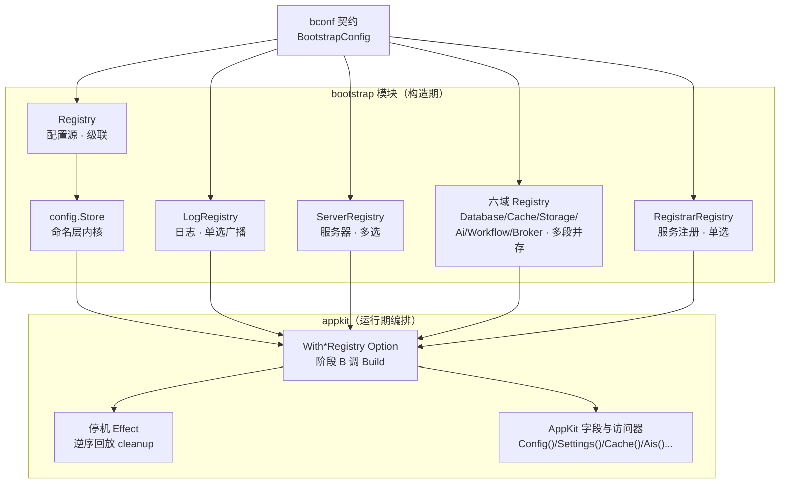

# Bald Bootstrap 设计

> Title: bootstrap——把契约翻译为可运行组件的显式装配层
>
> Author(s): bald 团队
>
> Last updated: 2026-09-18
>
> Status: Accepted（对应实现 `bootstrap` module，tag `bootstrap/v0.6.0`）

## 摘要

bootstrap 是 bald 的启动装配层：读取 bconf 契约（`BootstrapConfig`），把其中
各段声明翻译为可运行组件——配置源层列表、日志 Logger、协议服务器列表、以及
**九个域客户端的实例表**。整个模块只有一个核心承诺：**装配的每一步都发生在
你自己的代码里，依赖图全程可见**。为此我们放弃了 go-wind 的 blank import +
`init()` 自注册，选择显式 Registry，注册序即优先级，失败即栈式回滚，
cleanup 责任归构造方。本文论证这套设计及被放弃的备选。

模块共 21 个顶层源文件（+ config 子包 3 个）、3022 行，核心是**九个 Registry
+ 一个 Store 内核 + 一个 health 叠加器**：

| 类别 | Registry | 契约段 | 装配语义 | Build 产出 |
|---|---|---|---|---|
| 配置源 | `Registry` | `Config` | **级联**（注册序即层优先级） | `[]config.Layer` |
| 日志 | `LogRegistry` | `Logger` | **单选广播**（`backends[]`） | `log.Logger` |
| 服务器 | `ServerRegistry` | `Server` | **多选**（配了就建） | `[]transport.Server` |
| 域客户端 ×6 | `Database`/`Cache`/`Storage`/`Ai`/`Workflow`/`Broker` Registry | 各自段 | **多段并存** | `map[段名]any` |
| 服务注册 | `RegistrarRegistry` | `Registry` | **单选**（`type` 字段） | `registry.Registrar` |

九种语义**刻意不统一**（见 §「三种 Build 语义不统一，各自显式」及 §「第七域
为何单选」）；health 不是 Registry，是叠加在 gRPC server 上的就绪推送器。

> 2026-09-15 增量：六域客户端 Registry（Database/Cache/Storage/Ai/Workflow/
> Broker）自 pkg/appkit 迁入本模块——「契约段 → 实例」的工厂与注册表归装配层，
> 实例的运行期编排（With\* Option 桥接/Effect/停机序/AppKit 字段与访问器）留
> appkit。判定规则见 §「与 appkit 的协作」与 `registry.go` 包注释。
>
> 2026-09-17 增量：`RegistrarRegistry` 同因迁入（registry 契约下放为独立
> module 后，Provider 签名不再引用主模块包，模块循环约束消失）。
>
> 2026-09-18：六域 Registry 深展开（本文此前只在总览表一行带过），
> 并补 broker/workflow 两域「未实现段」处理方式的差异记录。

本文是 bootstrap 模块的完整专文。配置系统的三环总览见
《[Bald 配置系统设计.md](Bald 配置系统设计.md)》§3，源层接口契约见
《[Bald 配置源层设计.md](Bald 配置源层设计.md)》，应用侧约定装配（appkit 如何
消费本模块）见《[AppKit FromBootstrap 约定装配.md](AppKit FromBootstrap 约定装配.md)》。

## 背景与动机

### 名字先说明白：为什么叫 bootstrap 而不叫「启动器」

这个模块原名 `bconfinit`——只看名字，它该管「conf 的 init」。但实际 scope 从
第一天起就不止 conf：它装配配置源、日志后端、协议服务器三类组件（2026-09-05
更名，见 `registry.go` 包注释）。「启动器」同样名不副实：launcher 暗示拉起进程，
而这里的全部工作是**装配**——把静态的契约声明变成持有资源（连接、文件句柄、
goroutine）的运行期对象，并在失败时把它们按相反顺序拆掉。所以我们用 bootstrap：
应用由此启动，语义重心在装配。

### 痛点：隐式装配的三宗罪

模块的前身是 go-wind 风格的配置初始化：`import _ "x/apollo"` 触发 `init()`
把工厂塞进包级 `map[string]ConfigAction`，框架启动时遍历全局表装配。这套模式
有三处硬伤（论证详见《Bald 配置系统设计.md》§3.2，此处只列结论）：

1. **依赖不透明**：blank import 读代码看不出 apollo 被装配了，IDE 跳不到、
   重构工具追不到。
2. **装配顺序失控**：多个 provider 的 `init()` 执行序由 Go 导入图决定，无法
   表达「先 file 后 etcd」——而层优先级恰恰是装配语义的核心。
3. **与 appkit 体系冲突**：bald 已有 `Provides/Requires/Resolve`（capability.go
   显式能力声明）、`Registry.Mount/Unmount`（mount.go 显式运行期装配）、
   `Component` 显式生命周期（component.go：Start/Dispose，纳入 stopAll 五阶段
   停机编排）——全是显式装配哲学。在显式体系里塞一个隐式全局态的异类，等于
   自己破坏自己的架构一致性。

go-wind 的 ConfigAction 还有一个隐患：工厂返回无参清理闭包，实例藏于包级全局
变量——不支持多实例，测试之间互相污染。这些是我们放弃它的直接理由。

### 历史包袱的清偿

bootstrap 的 config 子包自己也退役过一个前任：viper。旧方案「底层重置」问题
（remote 重载会冲掉 local 覆盖）与 toml/hcl/ini 等格式蔓延，都在 2026-09-05
收编自独立 module `bald/config` 时一并清算——装载内核重写为「命名层 + map 深合并」，
格式收敛到 yaml/yml/json（proto-first 框架不需要更多）。这段历史决定了本文
Design 一节的形状。

## 设计

### 总览：九个 Registry，各对齐组件本质



九种语义刻意不同，各自对齐组件的本质：配置源是**有序覆盖**关系（apollo 的值
覆盖 etcd 的值，叠加成一棵树）；日志后端是**并列分流**关系（同一条日志复制到
本地文件和远程 loki，谁也不覆盖谁）；协议服务器是**独立端点**关系（grpc 与
http 各监听各的端口）；域客户端是**多段并存**（主库 + 检索库 + 时序库同时存在）；
服务注册是**单选**（一个进程只注册到一个注册中心，多注册中心 fan-out 无消费方）。

用一套统一的「多选」语义硬套九者，要么丢掉层优先级，要么丢掉广播，要么制造
语义空洞——我们选择让语义各自显式。

依赖方向（`registry.go` 包注释）：

```
bootstrap → bootstrap/config（Store 内核）
bootstrap → bconf（契约）
bootstrap → bconfig/*（源）
bootstrap → registry（服务注册契约，零依赖；仅 registrar.go 引用）
bconfig/* → 零契约依赖（源层保持纯净）
```

最后一条是 provider 适配层的存在理由，见 §「Provider 矩阵」。

### 三件套之一：Registry——显式实例，注册序即优先级

声明（`registry.go`）：

```go
type Provider func(ctx context.Context, cfg *bootstrapv1.BootstrapConfig) (
    *config.Layer, func(), error)

type Registry struct {
    mu        sync.RWMutex
    providers map[string]Provider
    order     []string // 注册序 = 默认级联优先级（先注册者优先级高）
}

func NewRegistry() *Registry
func (r *Registry) Register(name string, p Provider) error
func (r *Registry) MustRegister(name string, p Provider)
```

用法（`_example/bald` 与 `registry_test.go` 的真实形状）：

```go
r := bootstrap.NewRegistry()
r.MustRegister("env", bootstrap.EnvProvider())   // 先注册：优先级最高
r.MustRegister("file", bootstrap.FileProvider()) // 后注册：被 env 覆盖

layers, cleanup, err := r.Build(ctx, cfg)
if err != nil { /* 已回滚，无需调 cleanup */ }
defer cleanup()
```

边界与语义：

- **Registry 是实例，不是全局单例**。每个测试、每个应用持有自己的 Registry，
  装配什么、以什么顺序，全写在调用方代码里。测试互不污染是直接收益。
- **重名报错不覆盖**（`Register` fail-fast）：同一 Registry 里多次注册同名
  provider 是程序 bug，静默覆盖会吞掉优先级错误。
- **`MustRegister` 只许在 main() 用**。包注释明文禁止任何包在 `init()` 里调用
  它——这是与 go-wind 模式的根本区别，防线写在文档约定而非语言机制上。
- **`Build` 不长时间持锁**：入口先 `snapshot()` 拷贝注册表再遍历（`registry.go`），
  装配慢（远程源建连）不阻塞并发注册——虽然实践中注册都发生在 Build 之前。

### 三件套之二：Provider——nil 即「未配置」，cleanup 归构造方

Provider 是配置源工厂。它的三返回值语义是整个模块最细的契约
（`registry.go` Provider 注释）：

- **layer 为 nil** 表示「该源未在契约中配置」，Build 跳过（非错误）；
- **layer.Reader 为 nil** 是装配错误，Build 短路回滚；
- **Watch=true 但 Reader 不实现 `bconfig.ValueWatcher`** 是装配错误，Build
  短路回滚（`build.go:51-56`）；
- **cleanup 非 nil** 时释放 provider 持有的资源（含 reader 本身），可为 nil。

「nil layer = 跳过」这个决定值得单独说。备选是让 provider 在未配置时返回
error——但契约里 Config 段的 9 个子段（env/file/http/apollo/consul/etcd/
nacos/vault/kubernetes）本是可选项，把「用户没配 nacos」当错误，等于强迫每个
应用配置全部 9 种源。nil 跳过让「注册能力」与「启用能力」分离：代码声明支持哪些
源，契约决定启用哪些。

与 go-wind ConfigAction 的关键差异在可见性：Provider 返回**可见的 layer**，
实例不藏全局变量，天然支持多实例（两个应用、或同一应用内多个 Registry 各自
装配同名源）。

### 三件套之三：Build——出错即栈式回滚

`Build`（`build.go`）遍历注册序，逐个调用 provider，全部成功后返回层列表与
cleanup。失败路径的处理原则是**宁可带伤走完，也不中途泄漏**：

```go
// build.go（节选）
for _, name := range names {
    l, closer, err := providers[name](ctx, cfg)
    if err != nil {
        runClosers(closers) // 逆序释放已构造的源
        return nil, nil, fmt.Errorf("bootstrap: provider %s: %w", name, err)
    }
    ...
}
```

`runClosers` 逆序执行（`build.go:74-78`）：后构造的资源先释放，与装配相反。
这是栈式生命周期的直接表达——第 3 个源装配失败时，前两个源可能已经握着它的
句柄（不太可能，但逆序是无需思考的安全默认）。失败时 cleanup 返回 nil，
Build 内部已回滚，调用方无需判断「失败的 Build 要不要调 cleanup」
（`TestBuild_RollbackOnError` 钉死逆序：`[ok2 ok]`）。

成功的 cleanup 同样逆序。层名回填：provider 返回的 layer.Name 为空时 Build
填注册名（`TestBuild_NameFallback`），保证日志与错误信息永远能定位到源。

### Store 内核：命名层归一模型（bootstrap/config）

Build 产出的层列表最终交给 `config.Load`（`config/config.go`，552 行）。这个
内核 viper 已退役，重写为唯一一种动态源机制——**命名层**：

```
加载优先级（高 → 低）：
flag > 环境变量 > 本地文件 > 契约源层（列表首最高）> 远程桥（基准）
```

`Load` 内部的层装配（`config/config.go:159-212`）：远程桥（`Options.Remote`，
kratos 桥便捷入口）垫底为基准层；契约源层逆序 append（`layerM` 索引 0 优先级
最低）；本地文件层由 `discoverLocalFile` 按规则查找（显式 `ConfigFile` >
`Name-Env.yaml/json` > `Name.yaml/json`，搜 `.` / `./configs` / `$HOME/.config/Name`），
缺失不报错（允许纯远程/纯 flag 应用）；env 层与 flag 层静态缓存。

四个行为承诺（各有测试钉死，见 §「实现与验证」）：

1. **快照隔离**：`Settings()` 返回深拷贝，已发布快照不受后续热更新影响；
   `deepMerge` 每层新建 map（copy-on-write），旧引用天然稳定。
2. **flag 只取显式传入**（`Changed==true`）：零值 flag 压过 env/文件是 viper
   时代最常见的反直觉行为，重写时第一个修掉。引导 flag（`--config`）不落树
   ——它由装载器自己消费，且契约顶层有同名 message 字段，字符串落树会在
   Unmarshal 时触发 coerce 报错（T7 冒烟暴露过：`serve --config=...` 无法启动）。
3. **热更新全量重合并**：任一层 watch 触发 → decode → 更新该层缓存 → 全量
   `remerge()`。层缓存仍在，天然保证「上层覆盖不污染底层基准、底层更新不
   冲掉上层覆盖」——旧 viper 的底层重置问题在结构上不可能复现。
4. **单层装配超时**（`DefaultLoadTimeout = 10s`）：远端配置中心不可达时快速
   失败而非无限阻塞启动；负值禁用（信任源自身超时，如 etcd dial timeout）。

watch 转发的鲁棒性（`config/config.go:305-352`）：源关闭通道（监听器致命错误）时
退避 1s 重建监听，重连后主动拉一次全量弥补断连期间可能丢失的变更；解码失败
（如编辑中途半写状态）保留旧层缓存但仍触发 OnChange——坏状态可观测而非静默。
无 OnChange 回调时干脆不建 watch goroutine（没人消费变更，空转无意义）。

**职责分离的 Close**：`Store.Close` 只停自己的转发 goroutine 并释放自建源
（本地文件 watch 源，`selfClosers`）；Registry 装配的契约源 reader 归
`Build` 返回的 cleanup 释放。构造方管理自己造的资源，Store 不重复关闭别人
的（双关即 use-after-close）。

**kratos 桥**（`config/source.go`）：`RemoteSource` 接口（Read + Watch 回调）
+ `FromKratosSource` 适配器，复用 kratos contrib 已实现的 etcd/consul/nacos/
apollo 后端。多 KV 返回（如 file source 按目录返回多个文件）合并为单一文档，
不静默丢配置。桥接器实现 `formatAware` 动态声明格式，与契约源层共用同一层
机制——远程桥没有特殊通道，它就是优先级最低的那个层。

### Provider 矩阵：九个源，一种模式

九个配置源 provider（`env.go`/`file.go`/`http.go`/`apollo.go`/`consul.go`/
`etcd.go`/`nacos.go`/`vault.go`/`kubernetes.go`），全部同构：

```go
func XxxProvider() Provider {
    return func(_ context.Context, cfg *bootstrapv1.BootstrapConfig) (*config.Layer, func(), error) {
        c := cfg.GetConfig().GetXxx()
        if c == nil {
            return nil, nil, nil // 未配置该源，跳过
        }
        // 契约字段 → 源 Option 逐项映射
        src, err := xxx.New(opts...)
        if err != nil {
            return nil, nil, fmt.Errorf("bootstrap: build xxx source: %w", err)
        }
        return &config.Layer{Reader: src, ...}, cleanup, nil
    }
}
```

**适配层的存在理由**：provider 知道「契约里 `Config.GetNacos()` 返回什么字段」
与「`nacos.New` 接受什么 Option」，因此 `bconfig/nacos` 包无需 import bconf
——**源层保持零契约依赖**。没有这层适配，9 个源包都要依赖 proto 生成物，
依赖图立刻烂掉。

三个正交语义轴，构成 9 源的完整矩阵：

| 源 | Watch | 层格式 | cleanup |
|---|---|---|---|
| env | false（静态，无 ValueWatcher） | 回退 yaml | nil（无资源） |
| file | 契约 `watch` 字段 | 契约 format > 扩展名推断 > yaml | 关闭文件源 |
| apollo | true（原生推送） | yaml 回退 | nil（agollo 无关闭接口） |
| consul | true（watch plan） | yaml 回退 | nil（client 无需显式释放） |
| etcd | true（原生 watch） | yaml 回退 | 关闭 client |
| nacos | true（ListenConfig） | 契约 format 透传 | nil（SDK 无关闭接口） |
| vault | true（轮询模拟，契约 poll_interval 缺省 30s） | yaml 回退 | nil（api.Client 无关闭接口） |
| kubernetes | true（ConfigMap watch） | yaml 回退 | nil（clientset 无关闭接口） |
| http | true（ETag 条件轮询，契约 poll_interval 缺省 30s） | 契约 format | 关闭 client 空闲连接 |

读法：Watch 列回答「层是否参与热更新」；层格式列回答「文档怎么解码」（yaml.v3
是 JSON 超集，回退 yaml 对 JSON 文档天然兼容）；cleanup 列回答「谁持有资源」。
三列都没有「特例走特殊路径」——vault/http 的轮询模拟 watch 也是正经的
ValueWatcher 实现，只是推送由轮询驱动。

### LogRegistry：日志是必需品，nil 即报错

`LoggerProvider`（`log.go:26`）与配置源 Provider 形状相似，语义有一处关键
差异：**返回 nil Logger 视为错误**（`buildBackend` 报 `produced nil logger`），
不是「跳过」。理由写在注释里：日志是必需品，与配置源「nil=跳过」的级联语义
不同——没配 nacos 的应用能跑，没有 Logger 的应用每一行错误输出都无处可去。

`BuildLogger`（`log.go:83`）的装配链：

1. 契约 `logger.backends[]` 逐项按 `type` 字符串查表（type 未注册时报错并
   **列出可用项**——错误信息自解释）；
2. 全部成功后，单项直通（不包广播层，零包装）、多项用 `log.NewMultiLogger`
   广播合并；
3. 出口统一包一层 `log.NewFilterLogger(out, cfg.GetFilterKeys()...)`——全局
   脱敏只包一次，不管几个后端；
4. 任一项失败，逆序回滚已构造项的 cleanup
   （`TestBuildLogger_MultiBackends_FailFastRollback`）。

注意 cleanup 顺序与配置源 Build 相反：这里**构造序正放**（`log.go:111-115`），
与单后端「先关先开」一致——日志后端之间没有层叠依赖，先开的先关即可。

内置 `BslogLoggerProvider`（契约 type="slog"）演示适配器写法：契约字段映射
`bslog.Options`，多输出（output_paths 非空优先，回退单值 output_path）、轮转
零值回退默认（100MB/7 份/30 天/gzip）。远程后端（loki/aliyun 等）的 provider
不在本模块，在各自 `log/<backend>/contract` 包按同模式注册（5 个：loki/
aliyun/tencent/sentry/charm）——本模块只定义工厂签名与查表装配。

### ServerRegistry：服务器是端点，多选且必须至少一个

`ServerProvider`（`server.go:33`）从契约 `Server` 段构造 `transport.Server`。
与配置源的第三个差异：**多选语义**——`BuildServers` 遍历全部注册 provider，
各自判断契约中自己的段是否存在（`GrpcServerProvider` 见 `cfg.GetGrpc() == nil`
返回 nil server，跳过）。「只配了 http」时 grpc provider 返回 nil 是预期而非
错误；但**全部 provider 都返回 nil**（一个协议都没配）时报错——进程至少要
监听一个端口（`server.go:116`）。

业务依赖经 **Option 显式注入**，不用包级全局变量（go-wind 的另一个反面教材）：

```go
// 拦截器链、service 注册、就绪探针——都是代码声明的业务能力
bootstrap.GrpcServerProvider(
    bootstrap.WithGRPCRegister(registerGRPCService),
    bootstrap.WithGRPCUnary(grpcOpts...),
    bootstrap.WithGRPCHealth(healthChecker, 0),
)
```

`WithGRPCRegister` 注入 `pb.RegisterXxxServer` 回调，`WithHTTPHandler` 注入
业务 handler，`WithGatewayRegister` 注入 gateway 转码注册——配置驱动参数
（地址/TLS/超时），代码声明能力（路由/拦截器/探针），分工与 appkit
FromBootstrap 的约定完全一致。

**gateway 是模式不是服务器**（`server.go:225` 附近 `gateway.NewGatewayServer`
调用）：`HttpServerProvider` 内部按「注入了 gatewayRegister 且契约 driver 为
`grpc-gateway`（或留空）」分支——走 `gateway.NewGatewayServer`（REST→gRPC 转码）
或纯 `httpserver.NewHTTPServer`（业务 handler 直挂）。同一 `server.http` 段
只跑一个面，模式由契约驱动。`BuildServers` 遍历前 `sort.Strings(names)` 保证
确定性顺序——多选语义下 map 迭代序不稳定，错误信息与构造序必须可复现。

### 六域客户端 Registry：多段并存，同构但各有边界

六域（Database/Cache/Storage/Ai/Workflow/Broker）自 2026-09-15 迁入本模块，
加上 2026-09-17 迁入的 RegistrarRegistry，共 **7 个域注册表**。它们的实现
高度同构——每个都是 `XxxProvider` 签名 + `Register`/`MustRegister`/`Build`
三方法 + 段枚举表：

```go
type XxxProvider func(ctx context.Context, cfg *bootstrapv1.Xxx) (any, func(), error)

type XxxRegistry struct {
    mu        sync.Mutex
    providers map[string]XxxProvider
}

func (r *XxxRegistry) Register(typ string, p XxxProvider) error  // 空名/nil/重名 fail-fast
func (r *XxxRegistry) MustRegister(typ string, p XxxProvider)    // panic 版，仅 main()
func (r *XxxRegistry) Build(ctx, cfg) (map[string]any, func(), error)
```

`Build` 的公共骨架：快照注册表（不持锁）→ 遍历段枚举 → 段缺失跳过 →
段存在但未注册 Provider **fail-fast** → 构建失败**逆序回滚** → 返回
`map[段名]any` + 聚合 cleanup（无 cleanup 时返回 nil，与配置源 Build 一致）。

各域的差异点才是文档价值所在：

| 域 | 段数 | 段枚举 | 独有语义 |
|---|---|---|---|
| `database` | 8 | sql/mongodb/clickhouse/doris/elasticsearch/opensearch/influxdb/cassandra | **any 类型边界论证**（见下） |
| `cache` | 2 | local/redis | 段最少；cleanup 语义「缓存先关」 |
| `storage` | 2 | minio/s3 | 与 oss 域 contract 配对 |
| `ai` | 3 | openai/langchaingo/eino | **三后端 cleanup 均 nil**；organization 消费注记 |
| `workflow` | 1(+3 声明) | argo | **独立的 `declaredWorkflowSections` 表**（见下） |
| `broker` | 13 | kafka/rabbitmq/redis/rocketmq(+9 声明) | **`implemented` 内联标志**（见下） |
| `registrar` | 1 | 按 `type` 单选 | **单选分发 + 返回单实例**（见 §第七域） |

#### database：any 类型边界

`database.go` 的注释记录了 why-any 的论证：引擎客户端异构
（`*gorm.Client` / `*mongo.Client` …），Provider 返回 `any` 是装配层的必然；
**类型安全在消费侧恢复**——SQL 客户端接 `contrib/store-gorm` 变
`store.DBProvider[T]`。关键是 `any` 不向框架内部扩散：本包只保存与转发，
不做任何断言。这是「异构多段并存」与「类型安全」之间的平衡点。

段枚举表的注释还记了一条纪律：新引擎在 bconf 加段后必须在此追加，
**编译期漏加 = 该段配置静默无消费**，由「契约字段须全有消费者」审查兜底。

#### broker 与 workflow：「契约已声明但未实现」的两种处理

这是本模块唯一一处**同问题两种实现**，值得单独记录。

背景：bconf 契约是**超集契约**（先声明后实现），broker 声明 13 段、workflow
声明 4 段，但本仓只实现了其中一部分。若配置里写了未实现的段，Build 必须
**fail-fast**——否则用户以为消息代理接上了、实际什么都没发生（fail-open）。

两种实现：

**broker**（`broker.go`）——`implemented bool` 内联在段结构里：

```go
var brokerSections = []brokerSection{
    {"kafka",    true,  func(b *bootstrapv1.Broker) bool { return b.GetKafka() != nil }},
    {"rabbitmq", true,  ...},
    {"redis",    true,  ...},
    {"nats",     false, ...},   // 契约有声明，本仓无实现
    {"mqtt",     false, ...},
    ...
    {"rocketmq", true,  ...},
}
```

Build 遍历时先判 `implemented`：`false` 且段存在 → 报错
`broker.%s is declared in the contract but not implemented by any backend`。

**workflow**（`workflow.go`）——独立的 `declaredWorkflowSections` 表：

```go
var workflowSections = []workflowSection{
    {"argo", func(w *bootstrapv1.Workflow) bool { return w.GetArgo() != nil }},
}

var declaredWorkflowSections = []struct{...}{
    {"temporal", ...}, {"conductor", ...}, {"goworkflows", ...},
}
```

Build 在遍历已实现段**之前**先扫这张表，命中即报错。

**两者的取舍差异**：broker 的表在段结构内联（一个表、一处维护），workflow
的表分离（`workflowSections` 只列已实现，`declaredWorkflowSections` 只列未实现）。
内联版的优势是「加实现时改一个 bool」；分离版的优势是「已实现段表保持干净，
不被未实现段污染」。**这是历史演进留下的不一致，不是设计意图**——两处都
满足 fail-fast 不变量，但后续新增域时应统一到一种（建议内联版，改动面最小）。

#### ai：organization 字段的消费不对称

`ai.go` 的注释记录了契约字段消费注记：`ai.*.cloud.organization` 仅
openai/langchaingo 消费（SDK 支持）；eino-ext openai 无 organization 概念，
eino 段配了该字段会 **fail-fast 报错**（见 `ai/eino/contract.buildConfig`），
不静默忽略——organization 常承载访问隔离语义，静默失效是安全风险。

ai 的另一个特点：三后端（openai/langchaingo/eino）的 cleanup **均为 nil**
（模型对象无连接池资源）。Build 因此返回 `aggregated = nil`，appkit 侧
Effect 是「预留未来语义」。

#### 六域的停机序

各 `Build` 的注释记录了注册顺序与逆序回放语义（appkit 挂停机 Effect 逆序）：

```
注册序（构造）: database → cache → storage → ai → workflow → broker
停机序（逆序回放）: broker → workflow → ai → storage → cache → database
```

语义：**broker 最先关**（in-flight 消息先 drain）、**database 最后关**
（连接池最后释放）、缓存居中（加速层，关了不影响正确性）。服务器 drain
则更早（servers 注册在 database 之前）。完整 12 段 Effect 序见
《[AppKit FromBootstrap 约定装配.md](AppKit%20FromBootstrap%20约定装配.md)》。

### 第七域：RegistrarRegistry 为何单选

`registrar.go` 的头部注释开篇即说明它是「与六域 Registry 同族的第七个域
注册表」，但与 config Registry 有**两点本质差异**：

1. **按契约 `registry.type` 单选分发**，不做 optional 子消息迭代多选
   （go-wind `resolveRegistry` 的做法）——多注册中心 fan-out 无消费方，
   语义空洞。
2. **Provider 必须返回注册中心实例**（而非仅 cleanup）——真正的
   Register/Deregister 生命周期由 appkit 驱动（start 后注册、stopAll 前反注册），
   这是 go-wind `RegistryAction`（实例被 `_ = reg` 丢弃）缺失的一环。cleanup
   只负责 client 生命周期，停机 Effect 回放。

因此它的 `Build` 签名与六域不同——返回**单个** `registry.Registrar` 而非
`map[string]any`：

```go
func (r *RegistrarRegistry) Build(ctx context.Context, cfg *bootstrapv1.Registry) (registry.Registrar, func(), error)
```

且 nil/空 type/未注册 type 全部 fail-fast（显式注册的天然收益）。

**位置沿革**（值得记录，因为它解释了模块边界的一次移动）：2026-09-17 之前
本文件必须放 `pkg/appkit`——Provider 签名引用主模块的 `pkg/registry.Registrar`，
放 bootstrap module 会形成 `bald ⇄ bald/bootstrap` 的模块循环（appkit import
bootstrap module）。registry 契约下放为独立 module（零依赖）后该约束消失，
本文件随之迁入 bootstrap。**这是「归位判别」判据的一次实证**：产物只依赖
bconf + registry 两个独立 module，命中「归 bootstrap」；若 registry 契约仍
依赖主模块，它就只能留在 appkit。

### health：不是 Registry，是就绪推送叠加器

`health.go`（101 行）与九个 Registry 无关——它是 `grpcHealthServer`，在
`grpcserver.GRPCServer` 之上叠加「就绪状态推送」：后台轮询 `health.Health`
并把结果 `SetServingStatus` 给 gRPC 标准健康服务（`""` = 整体服务），使
K8s grpc 探针与 HTTP `/readyz` 同源。

**分层理由**（注释原文）：gRPC health 是拉模型（探针主动 Check），必须由服务端
推状态；但「判断业务就绪」不属于协议实现。注册标准健康服务留在
`transport/grpc`，推送留在装配层（见《Bald 健康检查装配设计》）。

两个入口：手工装配用 `NewGRPCHealthServer(srv, h, interval)`（`interval <= 0`
回退默认 2s）；走 bootstrap 装配的路径由 `GrpcServerProvider` 的
`WithGRPCHealth` 自动完成。`Start` 起轮询后阻塞启动，`Serve` 返回即取消轮询
（不残留 goroutine）——`Start`/`Stop` 都对 `cancel` 做了加锁保护。

### 与 appkit 的协作

bootstrap 不感知 appkit。appkit 的 `FromBootstrap` 是本模块的第一个也是主要
消费者：Config 段经 `bootstrap.Registry.Build` 产出配置层（cleanup 挂 Effect
停机释放）、Logger 段经 `LogRegistry.BuildLogger`、Server 段经
`ServerRegistry.BuildServers`、六域经各自 Registry 的 `Build`——「与直用
bootstrap 的路径同一实现（消除双真相源）」。分工细节与停机链序（12 段 Effect
逆序回放）见《[AppKit FromBootstrap 约定装配.md](AppKit%20FromBootstrap%20约定装配.md)》。

**模块归属分界：启动必需品归 bootstrap，业务运行期资源归 appkit。** 本模块
原本只装 Config/Logger/Server 三段，不是能力不够，是分界使然：没有配置拿不到
参数、没有日志无法观测启动期、没有服务器进程没有存在意义——三者缺一，
Build 就该失败。2026-09-15 起，六域客户端 Registry 也归本模块——它们的本质
同样是「契约段 → 实例」的构造期工厂；appkit 保留 `With*Registry` Option、
阶段 B 调 Build、实例存 AppKit 字段与访问器、cleanup 挂 Effect 逆序回放。
仍留 appkit 的两类 Registry（Tracer/Metrics）因依赖根模块包（otel），迁入会
造成循环依赖；`RegistrarRegistry` 自 2026-09-17 起不再受此约束（见 §第七域）。

判定口诀：**问「产物是不是纯契约段 → 实例的构造」**——是且仅依赖
bconf/标准库/独立 module，归 bootstrap；需要根模块包或运行期编排，归 appkit。
（appkit 曾预置全局插件注册表 + `init()` 自注册范式，与本模块的显式装配
哲学矛盾且产品代码零消费，已删除，见 `pkg/appkit/registry.go` 包注释。）

## 理由与取舍

### 放弃 blank import + init() 自注册

被放弃方案：go-wind 的 `import _ "x/apollo"` + `init()` 注册进全局 map。
放弃理由即背景一节的三宗罪：依赖不透明、顺序失控、与显式体系冲突。补一个
反驳过的替代缓解：**就算给全局表加上优先级字段**，依赖不透明依旧——读 main
还是看不出装配了什么；且测试隔离需要给全局表加 reset 钩子，这本身就是坏味道
的实锤。显式 Registry 的代价是业务 main() 多写几行 `MustRegister`，换来的是
依赖图写在代码里、每个测试自有实例。这笔账划算。

### 放弃全局单例 Registry

被放弃方案：包级 `var DefaultRegistry = NewRegistry()`，业务往里注册。
它比 init() 自注册好一点（至少注册调用是显式的），但「同一个进程里两个应用
各持一套装配」立刻名存实亡，测试之间的隔离也只能靠 reset 钩子。Registry
实例化的成本是一行 `NewRegistry()`，我们不为省这一行放弃隔离性。

### cleanup 归构造方，Store 不代劳

被放弃方案：Store.Close 顺带关闭所有层 reader。表面上省了调用方一个 cleanup，
实际上引入双关风险：契约源 reader 归 Build 的 cleanup 释放、本地文件源归
Store 的 selfClosers 释放，若 Store 也关契约源，同一 reader 被关两次——
file watcher 的 use-after-close 在停机路径上极难排查。职责分离后规则只有一句：
**谁构造，谁释放**。`TestBuild_RollbackOnError` 与 `Store.Close` 的注释
（`config/config.go:357-361`）各自钉死一半。

### Watch 校验前置到 Build，不留到 Store 装配

被放弃方案：Build 不校验，让 Store.Load 里的同款校验兜底
（`config/config.go:181-185` 确实有）。前置的理由是**报错时机**：Watch=true
但 Reader 不实现 ValueWatcher 是 provider 实现的 bug（EnvProvider 就正确地
返回 Watch=false），在 Build 阶段报错，调用栈直接指向装配代码；留到 Load
报错，栈里隔了 Load 的层装配循环，定位多绕一跳。两处校验都保留——防御纵深，
但主战场在 Build。

### 三种 Build 语义不统一，各自显式

被放弃方案：统一为一个泛型 `Build[T]` 或统一「多选」语义。表面上代码复用，
实际上语义（级联/单选广播/多选/多段并存/单选）返回类型不同（Layer 列表/
单个 Logger/Server 列表/`map[string]any`/单个 Registrar）、nil 语义不同
（跳过/错误/跳过但全空报错）、cleanup 顺序不同（逆序/正放/逆序）。强行统一
会把这些关键差异埋进泛型参数与 if 分支，读者要靠读实现分辨语义——不如九个
显式 API，签名即文档。

### 配置侧保留 kratos 桥，注册中心侧直连

被放弃方案：两侧都直连（配置后端也全部自研）或都走桥。配置侧保留桥
（`source.go` 注释）：kratos contrib 的 etcd/consul/nacos/apollo 后端成熟，
重写没有增量价值；注册中心侧改走 `registry/<backend>` 直连（2026-09-17 前在
contrib/registry 下，随契约下放一并上移），因为 naming 语义
（健康检查、实例订阅）与 config 语义差异大，桥接层反而碍事。这个不对称是
务实取舍，不是疏漏。

### 六域 Registry 不抽泛型基类

被放弃方案：七个域注册表的 `Register`/`MustRegister`/`Build` 骨架几乎逐字
相同，抽一个泛型基类能省几百行。**不抽的理由**：①各域的段枚举类型不同
（`aiSection`/`brokerSection`/`workflowSection`…），泛型化要么引入类型参数
爆炸，要么退化成 `any` 丢失类型；②`registrar` 的 Build 签名本就不同（返回
单实例、单选分发），是泛型化的反例；③**同构复制在这里是特性**——每个域
独立可读，改动一个域不波及另一个，代价是几百行样板。这与 `encoding` 域
「同形复制而非复用」是同一取舍（三者在独立 module，共享需引入公共包）。

## 兼容性

### v0.5.0 → v0.6.0：LoggerProvider 签名变更（破坏性）

`LoggerProvider` 的第二参数从 `*bootstrapv1.Logger` 改为
`*bootstrapv1.Logger_Backend`，`LoggerView` 视图函数删除。这是一次破坏性变更，
开门见山承认。动机：provider 本身始终只见单个后端项（多后端广播由
BuildLogger 循环负责），而旧签名为复用「按整个 Logger 配置构造」的形状，需要
`LoggerView` 把 Backend 的字段平移成一个伪造的 Logger 传给 provider——类型
谎言：形状相同，语义不同（视图里没有 backends 列表，却有不该看的单 type 字段）。
新签名让 provider 直接见到真实的单后端项，视图层整个删掉。

迁移路径：自定义 LoggerProvider 的实现把参数类型改为
`*bootstrapv1.Logger_Backend`，函数体内原先从 LoggerView 取字段的代码改为
直接从 Backend 取——机械替换，编译器逐处指路。内置 BslogLoggerProvider 与
五个远程日志后端（loki/aliyun/tencent/sentry/charm，在各自 `log/<backend>/contract`
包）已随 v0.6.0 全部迁移。

### 前置更名：bconfinit → bootstrap（module path 变更）

2026-09-05 更名，module path 从 `bald/bconfinit` 变为 `bald/bootstrap`。
下游需改 import 路径；API 面在此前已稳定，无其他语义变更。

### bald/config 收编为 bootstrap/config

同日，独立 module `bald/config` 收编为子包，viper 退役。对下游的影响集中在
装载入口：`config.Load(opts)` 签名不变；`Remote` 语义降级为「kratos 桥便捷
入口，垫底基准层」，推荐路径改为契约源层（`Options.Layers`）。旧 yaml 配置
文件无需改动——四源优先级链（flag > env > 本地文件 > 远程）对外呈现不变。

### 六域 Registry 自 appkit 迁入（import 路径变更）

2026-09-15：`pkg/appkit.NewDatabaseRegistry` 等 → `bootstrap.NewDatabaseRegistry`。
下游需改 import 路径；`With*Registry` Option 与 AppKit 访问器（`AppKit.Cache()`
等）位置不变，语义无变更。

### go-wind 迁移对照

从 go-wind 迁移的应用：删掉 blank import 与全局变量注册，改为 main() 里
`MustRegister` 序列；ConfigAction 的无参清理闭包改为 Provider 的三返回值；
全局单例状态改为注入 Registry 实例。迁移成本主要是机械劳动，一次性付清。

## 实现与验证

### 落地节奏

1. **三件套先行**（Registry/Provider/Build + registry_test.go 10 测）：
   Register/MustRegister 语义、注册序即优先级、nil 跳过、nil Reader 拒绝、
   Watch 不匹配拒绝、失败逆序回滚、空配置报错、nil cfg 报错。
2. **config 内核重写**（config 子包 38 测：config_test 21 + layer_test 9 +
   proto_test 8）：全优先级链、快照隔离、双向热更新互不冲掉（local watch
   保留 remote 基准 / remote watch 保留 local 覆盖）、flag 显式传入语义、
   坏配置保留旧值、kratos 桥多 KV 合并。
3. **provider 矩阵**（providers_test.go 7 测 + providers_remote_test.go
   17 测）：每源三类测试——Unconfigured（nil 跳过）、ParameterFail（构造
   错误短路）、ContractMapping（契约字段 → Option 映射）；http/vault 另有
   EndToEnd（httptest 服务器真实拉取）。
4. **log/server 装配**（log_test.go 12 测、server_test.go 10 测）：单选查表、
   多后端广播与 fail-fast 回滚、脱敏单次包装、多选装配、gateway 模式分支、
   reflection 契约开关。
5. **六域客户端装配**（ai_test 2 + broker_test 4 + cache_test 3 +
   database_test 3 + storage_test 2 + workflow_test 3 + registrar_test 2）：
   每域覆盖段枚举、fail-fast（未注册/未实现）、回滚。
6. **端到端**：`_example/bald` 经 appkit.FromBootstrap 消费全部 Registry
   （默认/grpcgw/nacos 三种构建组合），e2e 与生产共用同一 `newApp` 构造
   ——「测的=跑的」。

合计 **113 个测试**（bootstrap 主包 75 + config 子包 38）。

### 与其他文档的分工

| 文档 | 视角 | 与本文关系 |
|---|---|---|
| 《Bald 配置系统设计.md》 | 配置系统三环（源/契约/初始化）总览 | 其 §3 是本文的概述视角；本文是其 §3 的模块全貌展开 |
| 《Bald 配置源层设计.md》 | bconfig 源层专文 | 本文只消费其 Reader/ValueWatcher 接口，源实现细节归它 |
| 《Bald 配置契约设计.md》 | bconf 契约层专文 | 本文消费其生成的 BootstrapConfig，契约形状归它 |
| 《AppKit FromBootstrap 约定装配.md》 | 应用侧约定装配 | 本文 §「与 appkit 的协作」的上游全景在其 §「FromBootstrap 内化的约定」 |
| 《Bald 健康检查装配设计.md》 | health 域装配 | 本文 §「health」的分层理由其有全展开 |
| 《六域 Registry 迁入 bootstrap.md》 | 迁移决策记录 | 本文 §「与 appkit 的协作」的历史依据 |

### 回答可预见的问题

**Q：为什么 provider 工厂返回 `Provider` 而不是直接一个函数？**
`EnvProvider() Provider` 的双层结构让「构造工厂」本身可以捕获参数（如
`GrpcServerProvider(opts...)` 的业务依赖注入），而 Provider 签名保持与契约
无关的统一形状。单例场景（EnvProvider）返回的字面量闭包零开销。

**Q：Build 为什么不做并发装配？**
配置源之间可能有顺序依赖的副作用（远程源建连顺序影响 fallback 缓存），
且启动路径的瓶颈是网络 IO 而非循环开销。若未来出现「多远程源并行装配」
的真实需求，可在 Build 内改为 errgroup——对外签名不变，无需提前。

**Q：层名只是日志标识，为什么 Build 要回填？**
错误信息的可定位性是装配层的生命线：`config: load layer "nacos": ...`
比 `config: load layer "": ...` 少一次人肉映射。回填成本一行，收益每一报错。

**Q：为什么九域 Registry 的 `Register` 都要校验空名/nil/重名？**
显式注册的价值在于「错误在启动期暴露」。空名会让错误信息无法定位源、
nil provider 会在 Build 时 panic（延后且栈深）、重名会静默吞掉优先级语义。
三条校验各对应一类真实故障，成本各两行。

**Q：六域 Registry 的 `Build` 返回 `map[string]any`，为什么不用泛型？**
段名在运行期才确定（契约驱动），泛型参数无法表达「运行期字符串键」。且
各域客户端类型本就异构（见 §database 的 any 类型边界），`any` 是装配层的
必然选择——关键是它不向框架内部扩散。

## 附录

### 关键锚点速查

```
registry.go                    Provider 三返回值语义 / Registry 实例（107 行）
build.go:51-56                 Watch 校验前置（fail-fast）
build.go:74-78                 runClosers 逆序释放
log.go:26                      LoggerProvider 签名（v0.6.0 后）
log.go:83                      BuildLogger 装配链
log.go:111-115                 cleanup 构造序正放（与配置源相反）
server.go:33                   ServerProvider 签名
server.go:116                  全 nil 报错（至少要监听一个端口）
server.go:225                  gateway 模式分支（NewGatewayServer）
config/config.go:159-212       Load 层装配（优先级链）
config/config.go:181-185       Store 侧 Watch 校验（与 Build 双保险）
config/config.go:305-352       watch 转发（退避重建 + 重连拉全量）
config/config.go:357-361       Close 职责分离注释
ai.go                          AiRegistry（3 段，cleanup 均 nil）
broker.go                      BrokerRegistry（13 段，implemented 内联标志）
cache.go                       CacheRegistry（2 段）
database.go                    DatabaseRegistry（8 段，any 类型边界论证）
storage.go                     StorageRegistry（2 段）
workflow.go                    WorkflowRegistry（1 段 + declaredWorkflowSections）
registrar.go                   RegistrarRegistry（第七域，单选 + 返回单实例）
health.go                      grpcHealthServer（就绪推送叠加器，非 Registry）
```

### 文件清单（21 个顶层源文件 + config 子包，共 3022 行）

| 文件 | 行数 | 职责 |
|---|---|---|
| `registry.go` | 107 | 配置源 Registry + 包注释（归位判别 + 依赖方向） |
| `build.go` | 78 | 配置源 Build + runClosers |
| `log.go` | 222 | LogRegistry + BuildLogger + BslogLoggerProvider |
| `server.go` | 233 | ServerRegistry + grpc/http/gateway Provider + Option |
| `ai.go` | 131 | AiRegistry（六域之一） |
| `broker.go` | 148 | BrokerRegistry（13 段，implemented 标志） |
| `cache.go` | 131 | CacheRegistry |
| `database.go` | 141 | DatabaseRegistry（8 段） |
| `storage.go` | 126 | StorageRegistry |
| `workflow.go` | 148 | WorkflowRegistry + declaredWorkflowSections |
| `registrar.go` | 114 | RegistrarRegistry（第七域） |
| `health.go` | 101 | grpcHealthServer 就绪推送 |
| `apollo/consul/etcd/file/http/kubernetes/nacos/vault/env.go` | 43~66 | 九个配置源 Provider 适配器 |
| `config/`（子包） | 552+ | Store 内核（命名层 + 热更新 + kratos 桥） |
