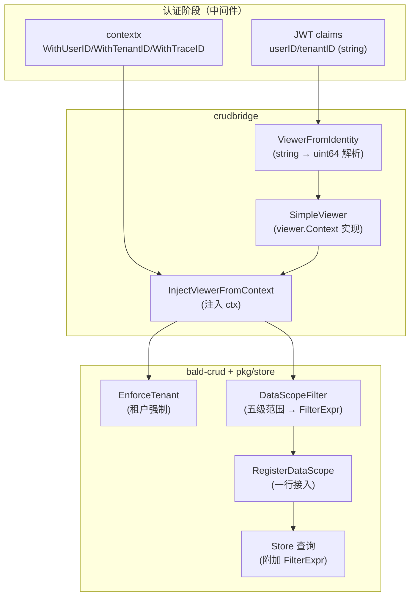

# Bald CRUD 桥接设计

> Title: crudbridge——bald 身份体系到 bald-crud viewer 体系的桥接
>
> 适用包：`pkg/crudbridge`
>
> Author(s): bald 团队
>
> Last updated: 2026-09-18
>
> Status: Accepted（已实现）

## 摘要

`pkg/crudbridge` 回答一件事：**bald 的请求身份怎么变成 bald-crud 能用的 viewer**。

两套体系的类型不匹配是问题根源——bald 的请求级身份是 **string 型**（`contextx.UserID`/`TenantID`/`TraceID`，从 JWT claims 来），而 bald-crud 的 `viewer.Context` 是 **uint64 型**且承载权限、角色、数据范围、视图判定。不接通，bald-crud 的 `EnforceTenant`（租户强制）与 `DataScope`（行级范围）在 bald 服务的请求链路里就形同虚设。

本包提供两件东西：**身份桥接**（`SimpleViewer` + 构造/注入函数）与**数据范围翻译**（五级 viewer 范围 → `storev1.FilterExpr` 布尔树）。

> 本文为补缺而生：`crudbridge` 此前**无专属设计文档**，公开 API 面只能从源码读取。

## 背景与动机

### 为什么会有两套身份体系

bald 框架侧只定**最小身份**：`pkg/contextx` 存五个标准键（user/username/trace_id/request_id/tenant_id），全是 string——因为它们的来源（JWT claims、HTTP header）本就是字符串，框架不预设 ID 的类型语义。

bald-crud 是**业务数据层**，需要更强的身份：不是「谁」，而是「谁能看哪些行」。它的 `viewer.Context` 因此是 uint64（数据库主键类型）+ 权限集 + 数据范围列表，并被 `EnforceTenant`/`DataScope` 消费。

**桥接的必要性**：不桥接，两条路都走不通——业务要么在 bald 侧重写一套 viewer，要么放弃 bald-crud 的租户隔离/数据范围能力。

### 安全语义优先于便利

包注释开篇即列两条安全语义，是设计的第一约束：

1. **`IsSystemContext() == true` 会被 `EnforceTenant` 视为系统视图、跳过租户强制**。因此 `System` 标志**必须显式设置**，绝不基于「UserID 为空」等隐式条件推断——否则匿名请求会被误判为系统视图，绕过租户隔离。
2. **`TenantID` 无法解析为正整数时按平台视图（0）处理**——若租户 ID 不是数字字符串，必须自行实现 `viewer.Context`，不能用默认转换。

## 设计

### 数据流



### 身份桥接：SimpleViewer 与三条构造路径

`SimpleViewer` 是 `viewer.Context` 的**直白实现**——字段全部导出（`UserIDValue`/`TenantIDValue`/`PermsValue`/...），供业务用 JWT claims 或 session 自由构造，**避免隐式转换语义**。编译期断言 `var _ viewer.Context = (*SimpleViewer)(nil)` 保证实现完整。

三条构造/注入路径，按「信息量」排序：

| 路径 | 信息源 | 携带 perms/roles | 推荐场景 |
|---|---|---|---|
| `InjectViewerFromIdentity(ctx, userID, tenantID, traceID, perms, roles)` | 显式平铺字段 | ✅ | **认证中间件推荐入口** |
| `InjectViewerFromContext(ctx)` | 仅 contextx 已有的三键 | ❌ | 快速接入（无权限信息） |
| `InjectViewer(ctx, vc)` | 业务自建 viewer | 由业务决定 | **推荐主路径**（最灵活） |

**为什么 `ViewerFromIdentity` 不依赖 `pkg/authn`**：包注释明确「本包不依赖 authn，避免 crudbridge ↔ authn 循环依赖」。`authn` 侧有 `ContextWithAuthClaims`（写 contextx），`crudbridge` 若 import `authn` 取 claims，就会形成循环。因此设计为**平铺字段传参**——调用方（中间件）从 claims 取字段再传入。

> **精确边界**：这条约束只作用于**身份桥接路径**（`crudbridge.go` 确实零 authn import）。`data_scope.go` 的 `RegisterDataScope` 回调签名带 `*authn.AuthClaims` 参数（`func(ctx, *authn.AuthClaims) *storev1.FilterExpr`），故 `data_scope.go` **import 了 `pkg/authn`**。依赖方向单向（crudbridge → authn），不构成循环——循环只会在 authn 反过来 import crudbridge 时产生。

**全部字段为空时返回 noop**（`viewer.NewNoopContext()`）：三视图全 false → `EnforceTenant` fail-closed。这是「匿名请求不应看到任何行」的默认。

### 视图判定：三态互斥

`SimpleViewer` 的三个判定方法构成**互斥三态**：

| 方法 | 条件 | 语义 |
|---|---|---|
| `IsSystemContext()` | `System == true` | 系统后台任务（**绕过租户强制的唯一开关**） |
| `IsPlatformContext()` | `!System && TenantID == 0` | 平台管理视图 |
| `IsTenantContext()` | `!System && TenantID > 0` | 租户业务视图 |

三者互斥且穷尽（`!System` 时按 TenantID 是否为零二分）。`System` 是显式字段而非推断——这是上面安全语义①的落实。

`HasPermission(action, resource)` 用 `action + ":" + resource` 拼接匹配 `PermsValue`——与 OAuth scope 格式（`user:read`）直接对上，故 `perms` 建议传 scopes。

### 数据范围翻译：五级 → 布尔树

`DataScopeFilter(vc, fields)` 把 viewer 携带的 `[]viewer.DataScope` 翻译为 `storev1.FilterExpr` 布尔树。**多范围之间是 OR 组合**：

| viewer 范围类型 | 翻译结果 |
|---|---|
| `ScopeTypeAll` | 放行（返回 nil，不附加任何条件） |
| `ScopeTypeSelf` | `owner 字段 = 当前 UserID` |
| `ScopeTypeUser` | `owner 字段 IN TargetIDs` |
| `ScopeTypeUnit` | `unit 字段 IN TargetIDs`（TargetIDs 空则回退 `OrgUnitID`） |
| `ScopeTypeNone` | 不贡献任何行 |
| 未知类型 | 不猜语义（`return nil`，宁缺勿假） |

**fail-closed 约定**（核心安全设计）：

- `vc == nil` → `store.Or(nil)`（**空 OR = 恒假**）
- 范围列表为空 → 同样恒假
- 只有 NONE/未知类型（无有效分支）→ 恒假

理由写在注释里：「调用方既然对实体启用了数据范围管控，匿名/未配置身份就不应看到任何行」。**恒假而非恒真是刻意的**——宁可不显示，不可越权显示。

三个优化细节：①`ALL` 短路——扫描到任一 ALL 直接放行（ALL 覆盖 OR 的一切分支）；②单分支不包 OR（减少嵌套）；③字段名可配（`DataScopeFields{Owner, Unit}`，默认 `created_by`/`dept_id`）。

### 一行接入：RegisterDataScope

```go
crudbridge.RegisterDataScope(crudbridge.DataScopeFields{})              // 默认 created_by/dept_id
crudbridge.RegisterDataScope(crudbridge.DataScopeFields{Owner: "owner_id"})
```

内部从 context 读取已注入的 `viewer.Context`（认证中间件已注入）并翻译，经 `store.RegisterDataScopeExpr` 注册到 `pkg/store` 的查询链。业务**只需一行**即可让某实体启用数据范围管控。

## 理由与取舍

### 为什么 SimpleViewer 字段全导出而非封装

**被放弃方案**：提供 `NewSimpleViewer(opts...)` 构造器 + 私有字段。放弃理由是**显式优于隐式**——包注释说「字段全部显式暴露，供业务用 JWT claims / session 自由构造，避免隐式转换语义」。业务直接填结构体比走构造器链更透明，且 JWT claims 的字段映射本就千变万化，构造器难以穷举。

代价是调用方可构造出「不一致」的 viewer（如 `System: true` 且 `TenantID` 非零）——但这是**显式意图**，与隐式推断的风险性质不同。

### 为什么桥接层不 import authn

见上文——避免 `crudbridge ↔ authn` 循环依赖。代价是 `ViewerFromIdentity` 需要 5 个平铺参数（而非一个 claims 对象），调用略啰嗦；收益是依赖图干净（`crudbridge.go → contextx + viewer`，不碰 authn）。

注意 `data_scope.go` 例外：它 import `pkg/authn`（`RegisterDataScope` 的回调签名需要 `*authn.AuthClaims`）。这是**单向依赖**，不构成循环——循环只在 authn 反向 import crudbridge 时成立。

### 为什么恒假而非恒真

数据范围是**安全边界**，不是便利功能。恒假（空 OR）在「身份缺失」时拒绝一切访问，是 fail-closed；恒真则会放行一切，是 fail-open。安全边界的默认必须是拒绝。

### 为什么未知范围类型不猜语义

`scopeBranch` 的 `default` 分支返回 nil（不贡献谓词）而非保守放行或报错。理由：未知类型意味着**语义不可知**，猜「放行」是越权、猜「拒绝」是误伤；返回 nil 让它在 OR 组合中不贡献分支，若最终无有效分支则整体恒假（fail-closed）。注释写「宁缺勿假」——不伪造一个可能错误的语义。

## 兼容性

### 依赖 bald-crud 的 viewer 包

本包 import `github.com/kalandramo/bald-crud/viewer`——**外部 module 依赖**。`viewer.Context` 接口的方法集若变更（如新增方法），`SimpleViewer` 的编译期断言会立刻报错（这是断言的价值）。

### TenantID 必须是数字字符串

`ViewerFromIdentity` 用 `strconv.ParseUint(tenantID, 10, 64)` 解析；失败则**静默按 0（平台视图）处理**。若租户 ID 是非数字（如 UUID），此路径不可用——须自行实现 `viewer.Context` 或直接构造 `SimpleViewer`。包注释明确警告了这一点。

## 实现与验证

### 测试覆盖

`crudbridge_test.go` + `data_scope_test.go` 覆盖身份构造、视图判定、范围翻译与 fail-closed 路径。

### 消费方

- **认证中间件**：`AuthnInterceptor` 认证成功后调用 `InjectViewerFromContext` 或 `InjectViewerFromIdentity`（与 `contextx.WithTenantID` 同一位置）；
- **业务实体**：`RegisterDataScope` 一行接入数据范围；
- **bald-crud**：消费注入的 viewer 执行 `EnforceTenant`/`DataScope`。

### 与其他文档的分工

| 文档 | 关系 |
|---|---|
| [认证与授权抽象设计](./认证与授权抽象设计.md) | `pkg/authn`/`pkg/authz` 的抽象（本包消费其产出的 contextx 键） |
| [数据存储设计](./数据存储设计.md) | `pkg/store`（本包经 `RegisterDataScopeExpr` 接入其查询链） |
| [上下文契约设计](./上下文契约设计.md) | `contextx` 五键（本包的身份来源） |
| [框架契约总览](./框架契约总览.md) | 速查表（**此前缺 crudbridge 节**） |

### FAQ

**Q：为什么 `ViewerFromContext` 拿不到权限/角色？**
因为 `contextx` 只存五键（user/username/trace_id/request_id/tenant_id），不含 perms/roles。需要权限判定时走 `InjectViewerFromIdentity`（显式传 scopes/roles），或业务自建 viewer 走 `InjectViewer`。

**Q：`DataScopeFilter` 返回 nil 与返回 `Or(nil)` 有何区别？**
`nil` = 放行（不附加条件，如 ALL 范围）；`Or(nil)` = 恒假（拒绝一切行，如身份缺失）。**两者语义相反**，调用方不可混淆——这是本包最容易误读的一点。

**Q：多个范围为什么是 OR 而非 AND？**
viewer 的 `[]DataScope` 表达「我能看这些范围的并集」（如「自己创建的」+「本部门的」），故 OR。AND 会变成「同时满足两个范围」——那不是权限叠加语义。
