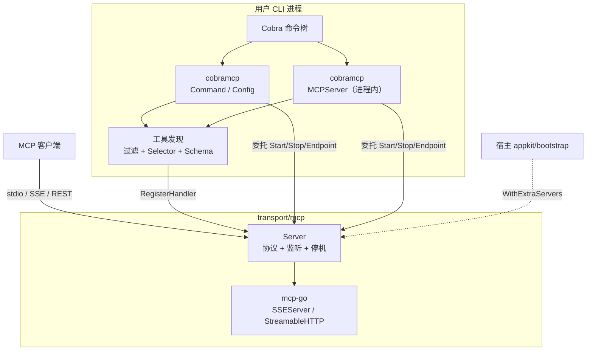

# Bald Cobra MCP 桥接设计：工具从哪来归 cobramcp，协议与生命周期归 transport/mcp

> Author(s): bald 团队
>
> Last updated: 2026-09-20
>
> Discussion at: 源码 `cobramcp/`、`transport/mcp/`；模块内部设计见 `cobramcp/docs/design.md`；操作手册见 `docs/guide/zh-CN/Bald Cobra MCP 桥接使用.md`
>
> Status: Accepted（已落地）

## 摘要

bald 把「Cobra CLI → MCP 工具」这件事拆成两个平级的顶层独立 module：

- **`github.com/kalandramo/bald/cobramcp`**：桥接层，回答「工具从哪来」；
- **`github.com/kalandramo/bald/transport/mcp`**：协议层，回答「工具怎么对外服务」。

分工被一句话钉死：

| 关注点 | 归属 |
|---|---|
| MCP 协议实现、监听、优雅停机、`Endpoint()` | `transport/mcp` |
| 日志后端 | `bald/log` 契约（进程内模型用宿主装配的 Logger；自带 CLI 子命令安装 stderr 后端） |
| 进程信号与生命周期编排 | 宿主（appkit / bootstrap）；cobramcp **不**捕获信号 |
| **工具从哪来**（Cobra 命令树 → MCP 工具） | `cobramcp` |

## 为什么拆成两个 module

### 分层判据

**协议实现只承诺协议形状**：监听、TLS、`Start`/`Stop`/`Endpoint`、工具注册插槽。它不认识「Cobra」「编辑器配置」这类业务语义。

**桥接层只回答"东西从哪来"**：工具来源归 cobramcp，传输与运行期契约归框架。

**依赖方向单向**：`cobramcp → transport/mcp → bald/log`，反向不存在。

### 依赖隔离的实测依据

`transport/mcp` 只依赖 `bald/log` 与 `mark3labs/mcp-go`——**不 import cobra / pflag**（源码 grep 无命中），因此只想要 MCP 传输的消费者不会被拖入整个 Cobra 生态。

`cobramcp` 额外依赖 `spf13/cobra`、`spf13/pflag`、`google/jsonschema-go`，是「Cobra 命令树 → MCP 工具」翻译所需。

把 cobramcp 塞进 `transport/mcp` 内的问题：传输实现里出现「编辑器配置管理」无法自洽，且只想要 MCP 传输的消费者被迫编译 cobra/pflag/jsonschema。独立成顶层 module 与 bald 既有惯例一致（顶层目录 + 独立 go.mod = 可独立发布的桥接/插件模块）。

## 分工契约

### `transport/mcp` 提供什么

```go
// 服务端：实现 bald 的 transport.Server 契约（Start/Stop/Endpoint）
func NewServer(opts ...ServerOption) *Server

// 传输类型
const (
    ServerTypeSSE       ServerType = "SSE"
    ServerTypeHTTP      ServerType = "HTTP"
    ServerTypeSTDIO     ServerType = "STDIO"
    ServerTypeInProcess ServerType = "IN_PROCESS"
)

// 工具注册插槽
func (s *Server) RegisterHandler(tool mcp.Tool, handler server.ToolHandlerFunc) error
func (s *Server) RegisterHandlerWithJsonString(jsonString string, handler server.ToolHandlerFunc) error
func (s *Server) RegisterHandlerWithJsonSchema(name, description, jsonSchemaString string, handler server.ToolHandlerFunc) error

// 生命周期
func (s *Server) Start(ctx context.Context) error
func (s *Server) Stop(ctx context.Context) error
func (s *Server) Endpoint() string
func (s *Server) Done() <-chan struct{}
```

选项（`transport/mcp/options.go`）：

| 选项 | 作用 |
|---|---|
| `WithServerName` / `WithServerVersion` | 服务端对外标识 |
| `WithMCPServeType` / `WithMCPServeAddress` | 传输类型与监听地址 |
| `WithMCPServerOptions(...)` | 透传 mcp-go 的 `server.ServerOption` |
| `WithSSEOptions(...)` | 透传 mcp-go 的 SSE 选项（如 `WithBaseURL`） |
| `WithMiddleware(...)` | SSE/HTTP 最外层 HTTP 中间件链（认证挂点） |
| `WithSSEProtectedResourceMetadata(...)` | RFC 9728 OAuth 资源元数据端点（SSE） |

### 生命周期契约（`transport.Server`）

```go
type Server interface {
    Start(ctx context.Context) error   // 阻塞直到 ctx 取消或出错
    Stop(ctx context.Context) error    // 优雅停止，ctx 携带停机超时
    Endpoint() string                  // 实际监听地址；绑定 ":0" 时在 Start 后返回已解析地址
}
```

`transport/mcp.Server` 的实现要点：

- **`Start` 同步绑定**：SSE/HTTP 先 `net.Listen`，失败立刻 `return err`——不会出现「启动成功却没在听」。stdio 在后台 goroutine 里 `ServeStdio`。
- **`Endpoint()` 只在 Start 之后有值**：由真实 listener 推导（`:0` → 系统分配端口），Start 之前为空，上层可据此区分「未监听」与「已监听」。
- **`Stop` 真正停机**：SSE 先 `CloseSessions()`（长连接不关，`Shutdown` 会等到 ctx 超时）再 `http.Server.Shutdown(ctx)`。
- **`Done() <-chan struct{}`**：stdio 场景客户端断开（stdin EOF）后服务即结束，CLI 据此退出进程——`Start` 是非阻塞的，没有这个通道就无法知道「对端走了」。

### `cobramcp` 提供什么

```go
// 子进程模型：向用户 CLI 注入 mcp 子命令树
func Command(config *Config) *cobra.Command

// 进程内模型：把命令树暴露为 SSE 服务端
func NewMCPServer(opts MCPOptions, cmdFactory func() *cobra.Command, serverOpts ...ServerOption) (*MCPServer, error)
```

`MCPServer` 是 `transport/mcp.Server` 的包装：

```go
type MCPServer struct {
    opts       MCPOptions
    transport  *mcptransport.Server // 协议与生命周期都在这
    cmdFactory func() *cobra.Command
    // ...工具与元数据
}
```

- 构造时把 Cobra 工具逐个 `RegisterHandler` 进 transport 服务端；
- `Start(ctx)`：`!Enabled` → 直接返回；`Addr == ""` → fail-fast；否则 `transport.Start` 后 `<-ctx.Done()`；
- `Stop(ctx)` / `Endpoint()` 直接委托；`Transport()` 暴露底层服务端（注册非 Cobra 来源的工具）；
- 不捕获进程信号——信号归宿主，appkit 在 ctx 取消后调 `Stop`。

`Config`（子进程模型）把「工具发现」与「服务端构造」解耦：

```go
registerTools(cmd)                  // 只发现：填充 tools / toolMetas / toolSelectors
newTransportServer(cmd, type, addr) // 按本次传输类型构造并注册
serveStdio / serveHTTP              // start → 等 ctx.Done 或 srv.Done() → Stop（带 5s 超时）
```

每条工具记下自己的 `Selector`（`toolSelectors`），注册逻辑推迟到服务端构造时执行；子进程 handler 是「还原参数 → 重新执行自身二进制」。

## 数据流



## 日志与信号

- **日志只走契约**：所有调用点用 `baldlog.{Debug,Info,Warn,Error}(ctx, ...)`。进程内模型不安装任何后端——日志由宿主（appkit/bootstrap 经 `bald/log.SetLogger`）决定，未装配时为静默 nop。
- **CLI 子命令自装 stderr 后端**：`mcp start/stream/rest/tools` 运行期调 `installStderrLogger(parseLogLevel(f.logLevel))`。stdio 模式下 **stdout 是协议通道**，日志必须写 stderr。后端是包内的 `stderrLogger`（实现 `bald/log.Logger`，底层 `slog` + `os.Stderr`），刻意不复用 `log/bslog`——避免为 CLI 场景引入 lumberjack 轮转依赖。
- **信号归宿主**：cobramcp 不 `signal.Notify`。CLI 形态下 stdio 对端断开即结束；宿主形态下由 appkit 在 ctx 取消后调 `Stop`。

## 与宿主装配

进程内模型满足 `transport.Server` 契约，可经 `appkit.WithExtraServers`（`pkg/appkit/bootstrap.go`）交给宿主并行启停：

```go
srv, _ := cobramcp.NewMCPServer(cobramcp.MCPOptions{
    Enabled: true, Addr: ":8090", Name: "myapp", Version: "1.0.0",
}, factory)

appkit.New(
    appkit.WithExtraServers(srv),
    // ...
)
```

宿主负责 `Start`/`Stop` 的编排与 `Endpoint()` 轮询（`transport.Server` 契约要求 `Start` 后 `Endpoint()` 返回真实地址，便于注册到服务发现）。cobramcp 不自行处理进程信号。

## 认证边界

认证是传输层关注点，落在 `transport/mcp`（协议层持有 `http.Handler`）+ `cobramcp`（配置透传层）：

- `transport/mcp` 提供 `Middleware` 类型（`func(http.Handler) http.Handler`，与 `transport/http3`、`transport/sse` 同形）与 `WithMiddleware` 选项；
- `cobramcp` 的 `Config.AuthMiddleware` / `AuthToken` / `OAuthProtectedResource` 透传到该选项。

为什么必须在 `http.Handler` 层：mcp-go 的 `SSEContextFunc` / `HTTPContextFunc` 只返回 `context.Context`、**无 error 返回位**，无法拒绝请求；hooks 同样无返回值。唯一能拒绝请求的位置是包在传输 handler 外层的 HTTP 中间件。

**安全不变量**：OAuth well-known 发现端点（`/.well-known/oauth-protected-resource`）必须免认证——客户端未持 token 时也要能取，否则 OAuth 发现流程死锁。

## 依赖与版本

| module | 关键依赖 |
|---|---|
| `transport/mcp` | `bald/log`、`mark3labs/mcp-go`（**不依赖** cobra/pflag） |
| `cobramcp` | `bald/log`、`bald/transport/mcp`、`spf13/cobra`、`spf13/pflag`、`google/jsonschema-go`、`mark3labs/mcp-go` |

`cobramcp/examples/*` 三个子 module 各自带 `replace` 指向本仓的 `cobramcp` / `log` / `transport/mcp`，仅供本地开发（Go 只认主模块的 replace，依赖模块内的 replace 对外部消费者无效）。
