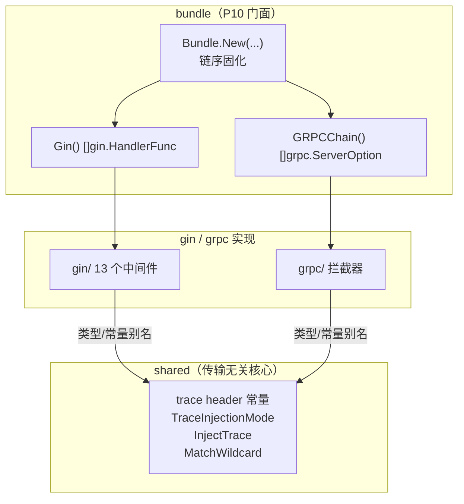

# Bald 中间件设计

> Title: 中间件——横切关注点的双传输装配（gin/gRPC）与链序固化
>
> 适用包：`pkg/middleware`（含 `gin` / `grpc` / `bundle` / `shared` 四子包）
>
> Author(s): bald 团队
>
> Last updated: 2026-09-18
>
> Status: Accepted（bundle 链序由 11 个契约测试固化；shared 收敛随 P9/R1 落地）

## 摘要

`pkg/middleware` 提供 HTTP（gin）与 gRPC 两条传输链的中间件/拦截器，并把**横切关注点的正确链序**从「文档里的纪律」固化成「代码里的构造」——这是 `bundle` 子包存在的理由。

四个子包分工：

| 子包 | 行数 | 职责 |
|---|---|---|
| `gin/` | 903 | gin 中间件实现（13 个） |
| `grpc/` | 948 | gRPC 拦截器实现（unary + stream） |
| `bundle/` | 258 | **门面**：一次构造、双传输产出、链序固化 |
| `shared/` | 104 | **传输无关核心**：trace header 常量、注入模式、通配匹配 |
| 顶层 `tracing.go` | — | `LogTraceIDs`（跨协议日志关联） |

合计 2248 行、**50 个测试**（bundle 11 / gin 13 / grpc 20 / shared 4 / 顶层 2）。

> 本文为补缺而生：`pkg/middleware` 此前**无专属设计文档**——其设计意图散落在《架构优化路线》P10、《设计评审-第三轮》批 I、《认证与授权抽象设计》三处。本文是首次收敛。

## 背景与动机

### 隐性知识税：链序只活在纪律里

`pkg/middleware/gin` 的 13 个中间件与 grpc 的对应拦截器此前**全部散装手挂**，而正确链序只写在文档与坑清单里——《架构优化路线》P10 的原话：「正确链序只活在文档里……是当前最大的『隐性知识税』」（该文档记坑清单中 2 条即链序）。

链序为什么重要：**顺序错了不会报错，只会静默失效**。例如审计若注册在认证外侧，就永远读不到认证注入的 subject；错误收口若不在最外层，`*berrors.Error` 会被 `status.Convert` 兜底成空 `Unknown`。

### 两处真实故障驱动

1. **重复税**（R1 合并前）：gin 与 grpc 两份 `observability.go` 逐行重复——trace header 常量、`TraceInjectionMode`、`matchWildcard`、`injectTrace` 各一份。「SpanKind 修复又改了两份，重复税已实缴」（评审批 I 原话）。
2. **双命名空间**（P9 前）：REST 与 gRPC 的 RBAC 用不同 object/action 命名（HTTP 用 path、gRPC 用 FullMethod），同一份策略无法通用。

## 设计

### 总览：三层结构



### Bundle：链序由构造固化

`bundle.New(opts...)` 一次构造，`Gin()` 与 `GRPCChain()` 双传输产出。**依赖经构造器注入**（`bundle.Authn(a)`/`Authz`/`Audit`/`Metrics`），未注入的层直接省略（零开销）。

**gin 链序（注册序即外→内）**：

```
Recovery → RequestID → Logging → CORS → Secure → Authn → Audit → Authz
```

**gRPC 链序（slice 序即外→内）**：

```
Error → Recovery → RequestID → Observability → Authn → Audit → Authz
```

两条链的三个**关键位置**及其理由（bundle.go 注释原文）：

- **Audit 夹在 Authn 与 Authz 之间**：在 Authn 内侧（注册序靠后）才能从 ctx 读到 Authn 注入的 subject/tenant；在 Authz 外侧（注册序靠前）才能在 `c.Next()`/handler 返回后捕获 deny 的最终 result。**两个约束夹出一个位置**——这是链序里最不显然的一条。
- **Error 必须 gRPC 最外层**：handler/内层拦截器返回的 `*berrors.Error` 若不经 `grpcerr.ToStatus` 收口，会被 `status.Convert` 兜底成空 `Unknown`。
- **Recovery 紧随 Error（第二外层）**：panic 被捕获并转为 `*berrors.Internal`，再由最外层 Error 收口为 gRPC status——与 gin 链首道 Recovery 对称（决策 D5）。

**零破坏**：散装手挂路径完整保留，Bundle 只是预组装。业务可继续手动 `router.Use(...)`。

### 显式注入，不吃全局兜底

Bundle 的审计层有一个刻意的语义：**auditor 未注入时显式接 `audit.NopAuditor()`**，而非回退到 `audit.GetAuditor()` 全局句柄。

理由（注释原文）：「Bundle 语义是完全显式注入，不吃 `audit.GetAuditor()` 全局兜底，避免测试间全局污染」。代价是若业务只设了 `Metrics` 没设 `Audit`，审计事件进 Nop——但**指标仍 emit**（审计中间件是指标埋点的载体，两者同源）——故 `auditor != nil || recorder != nil` 才挂审计层。

### 认证失败的审计盲区（D3）

链序中 Audit 在 Authn 内侧，意味着**认证失败 abort 后审计层不再执行**。这不是遗漏，而是被显式补偿：`ginAuthn()`/`grpcAuthn()` 把 bundle 的 auditor 注入 authn 层（`AuthnWithAuditor`），**authn abort 路径的审计事件由 authn 层自己发出**——与请求审计同一后端。

即：审计有两个发送点（authn 层的失败路径 + audit 层的成功/拒绝路径），合起来覆盖全路径。这是「审计不丢事件」的结构保证。

### shared：传输无关核心的收敛

R1 合并把两份 `observability.go` 的共性抽到 `shared`：

| `shared` 导出 | 用途 |
|---|---|
| 4 个 header 常量（`traceparent`/`X-Trace-Id`/`X-Request-Id`/`tracestate`） | trace 注入的 header 名 |
| `TraceInjectionMode`（4 模式：W3C / TraceIDOnly / Both / None） | 注入策略 |
| `InjectTrace(mode, customHeader, spanCtx, set)` | header 计算 + 经 `set` 回调写出 |
| `MatchWildcard(text, pattern)` | gin 路径跳过与 gRPC 方法跳过共用 |

**`InjectTrace` 的 `set func(key, value string)` 回调设计**是收敛的关键：gin 侧直接传 `c.Header`（签名恰好匹配），gRPC 侧传 `md.Set` 的单值闭包。**一份计算逻辑，两种写出方式**——这是传输无关核心的正确抽象线。

**收敛后的 API 稳定策略**：gin/grpc 两侧以**类型别名 + 常量别名**维持既有导出 API（`type TraceInjectionMode = shared.TraceInjectionMode`），零 breaking。

**什么留在各侧**（刻意不共享）：span 起法、日志结构、跳过语义（gin 用 method 前缀 pattern + 路径前缀匹配，grpc 用 `matchMethod`）；`Option`/`WithLogger`/`resolveLogger` 因选项结构体字段差异（`SkipPaths` vs `SkipMethods`）保持各侧——共享需引入泛型体操，收益不抵复杂度。

### 中间件清单

**gin（13 个）**：

| 文件 | 导出 |
|---|---|
| `recovery.go` | `Recovery` |
| `requestid.go` | `RequestIDMiddleware` |
| `logging.go` | `Logging` |
| `cors.go` | `CORS`、`DefaultCORS` |
| `secure.go` | `Secure` |
| `context.go` | `TraceContext` |
| `observability.go` | `Observability`、`WithLogger`、`WithSkipMetrics` |
| `authn.go` | `AuthnMiddleware`、`AuthnWithAuditor` |
| `authz.go` | `AuthzMiddleware`、`With{Object,Action,Subject}Resolver` |
| `audit.go` | `AuditMiddleware`、`AuditWith{Object,Action,Subject}Resolver`、`AuditWithAuditor`、`AuditWithMetrics` |

**grpc**：`ErrorInterceptor`、`RecoveryInterceptor`、`RequestIDInterceptor`、`UnaryObservability`/`StreamObservability`、`AuthnInterceptor`、`AuthzInterceptor`、`AuditInterceptor`、`DefaulterInterceptor`、`ValidatorInterceptor`，各带 `With*` Option。

### 顶层 tracing：零配置也有可关联日志

`LogTraceIDs(ctx) (traceID, spanID)` 从 ctx 取 SpanContext；**无效时（no-op tracer 未装配全局 TracerProvider，SpanContext 恒全零）生成随机 ID 兜底**。

动机：no-op 下 `trace_id`/`span_id` 固定为 32/16 个 0，无法按请求关联日志；随机 ID 让「零配置也有可关联的日志链路」。

边界诚实：`crypto/rand` 失败时**返回空串而非全零**——注释写「全零会被误读为有效占位」。

## 理由与取舍

### 为什么 Bundle 用构造器注入而非全局句柄

**被放弃方案**：回退 `audit.GetAuditor()` 等全局句柄。放弃理由：全局句柄在测试间互相污染（一个测试设了全局 auditor，另一个测试意外继承）。显式注入的代价是调用方多传几个 Option，收益是测试隔离与依赖可见。

### 为什么 shared 只收敛传输无关部分

见上文「什么留在各侧」。判据是：**能否用同一签名表达**。`InjectTrace` 的回调 `set func(key, value string)` 能同时表达 gin 与 gRPC 的写出方式，故可共享；`Option` 的字段差异（`SkipPaths` vs `SkipMethods`）无法用同一结构体表达，故不共享。硬共享需泛型体操，**复杂度不抵收益**。

### 为什么保留散装手挂路径

Bundle 覆盖常见链序，但不强制。理由：①渐进迁移（存量部署可先不动）；②特殊场景需要自定义链序时不被门面挡住。Bundle 注释明写「零破坏：散装手挂路径完整保留」。

### 为什么归一化默认开启（D7）

`bundle.New()` 的 `normalized` **默认 true**——而 `Normalized()` Option 保留为显式声明（幂等），`Raw()` 供 opt-out。

理由（注释原文）：「P9 的核心收益——根治 REST/gRPC 双命名空间 RBAC——不应依赖调用方记得 opt-in」。这是**安全相关的默认值选择**：默认正确（归一化）优于默认兼容（原始双命名空间）。

## 兼容性

### D7 归一化默认开启（行为变更）

D7 之前归一化需显式 `Normalized()`；D7 起默认开启。依赖旧双命名空间语义（HTTP object=path、gRPC object=FullMethod）的存量部署需显式 `Raw()` opt-out。

### shared 收敛保 API 稳定

R1 合并在 `v0.2.5`（commit `916a9e1`）落地——通过类型别名 + 常量别名，gin/grpc 侧的既有导出 API 零 breaking。

### 两个 audit 发送点的语义

认证失败的审计事件由 authn 层发（非 audit 层）——这是 D3 的补偿设计。审计后端实现需能处理来自两个发送点的事件（同一 `audit.Auditor` 接口，无差异）。

## 实现与验证

### 测试覆盖（50 个）

| 包 | 测试数 | 覆盖重点 |
|---|---|---|
| `bundle` | 11 | **链序契约**（allow/deny 双路径）、Authn→Authz subject 传递、审计对 deny/error 的捕获、Error 最外层 berrors→status 收口、未开归一化时的 P7 兼容 |
| `grpc` | 20 | 各拦截器 + Error 收口 + Observability SpanKind + Validator 不绑库 |
| `gin` | 13 | 各中间件 + authz deny |
| `shared` | 4 | `InjectTrace` 四模式 × 采样位 × 自定义 header × 无效 spanCtx；`MatchWildcard` 通配矩阵 |
| 顶层 | 2 | `LogTraceIDs` |

### 与其他文档的分工

| 文档 | 关系 |
|---|---|
| [架构优化路线](./架构优化路线.md) | P10 Bundle 的原始决策与链序记录 |
| [设计评审-第三轮-2026-09-12](./设计评审-第三轮-2026-09-12.md) | 批 I（R1 shared 收敛）的评审记录 |
| [认证与授权抽象设计](./认证与授权抽象设计.md) | `Authn*`/`Authz*` 中间件依赖的 P7/P9 抽象 |
| [Bald 审计设计](./Bald%20审计设计.md) | 审计中间件的后端契约与 D3 盲区 |
| [Bald 指标设计](./Bald%20指标设计.md) | 审计中间件同源 emit 的指标 |
| [框架契约总览](./框架契约总览.md) | §9 中间件速查表（§9.1 符号名 2026-09-18 已修正） |

### FAQ

**Q：为什么 gin 链与 gRPC 链的层数不同？**
gin 有 CORS/Secure（HTTP 特有），gRPC 有 Error/Defaulter（协议特有）；共有的 Recovery/RequestID/Logging/Authn/Audit/Authz 两层结构对称。

**Q：`DefaulterInterceptor` 与 `ValidatorInterceptor` 为何不在 Bundle 链里？**
它们是**业务参数处理**（默认值填充、消息校验），与链序无关——业务在自己的 handler 前按需挂载，不属于横切关注点门面的范围。

**Q：`LogTraceIDs` 与 `Observability` 中间件的关系？**
`Observability` 起 span 并把 SpanContext 注入 ctx；`LogTraceIDs` 消费它。**没有 Observability 时 `LogTraceIDs` 仍有值**（随机兜底）——这是两者解耦的设计：日志关联不依赖 trace 后端是否装配。
