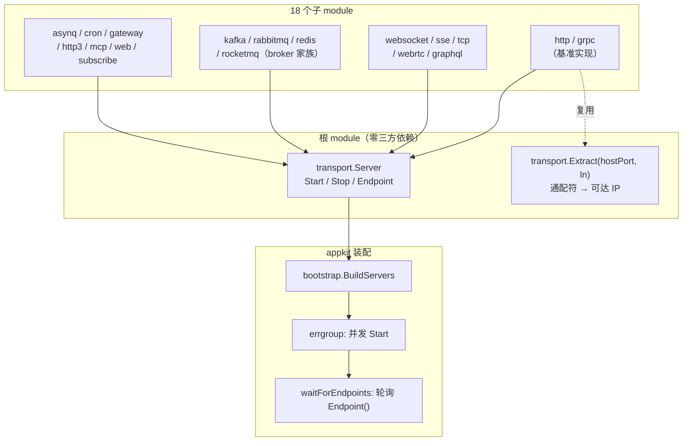

# Bald 传输层设计：统一 Server 契约，18 个后端各自独立 module

> Author(s): bald 团队
>
> Last updated: 2026-09-18
>
> Discussion at: 源码 `transport/{server,endpoint}.go` 与 18 个子 module；装配面 `pkg/appkit/bootstrap.go`（servers 启动 + Endpoint 轮询）、`bootstrap/server.go`；契约 `bconf/proto/bootstrap/v1/server.proto`
>
> Status: Accepted（契约与 18 后端已落地；**死代码/幽灵契约引用/SessionManager 竞态已于 2026-09-18 修复**，见「兼容性」；Endpoint 语义统一留待单独设计，见 §4）

## 摘要

`transport` 是 bald 的传输层，**19 个 module**（根 + 18 子）：根 module 只定义一条契约 `transport.Server`（三个方法），18 个子 module 是具体协议后端。

设计上做了三个取舍：

1. **契约极窄**。`transport.Server` 只有 `Start(ctx) error` / `Stop(ctx) error` / `Endpoint() string`。任何带生命周期的服务器都能满足它——`appkit` 只依赖这一条契约（`servers []transport.Server`）。
2. **一个后端一个 module**。19 个 `go.mod` 各自维护依赖，用哪个引哪个。代价是本地 `task verify` 必须逐个显式列出（CI 用 `find go.mod` 自动发现）。
3. **兼容 kratos**。契约刻意兼容 `github.com/go-kratos/kratos/v3/transport.Server`（Start/Stop），并**扩展** `Endpoint()` 以支持动态端口（`:0`）的服务注册。

## 背景与动机

### 为什么 `Endpoint()` 是必需的扩展

kratos 的 `Server` 只有 Start/Stop。bald 加上 `Endpoint()` 是为了解决**服务注册**问题：服务绑定 `:0`（动态端口）时，必须能从 listener 取回真实端口，否则注册到服务发现的地址是 `:0`——其他节点无法直连。

`transport/endpoint.go:24` 的注释明确写着：

> 该逻辑是服务注册可达性的关键修复点，请勿退回为裸 `s.ln.Addr().String()`。

## 设计

### 契约与装配



### 后端矩阵

| module | 协议 | `transport.Server` 断言 | Endpoint 实现 | 备注 |
|--------|------|------------------------|---------------|------|
| `http` | net/http | ❌ | `transport.Extract` ✅ | **基准实现**（持锁写 ln、快照后 Extract） |
| `grpc` | gRPC | ❌ | `transport.Extract` ✅ | **基准实现** |
| `websocket` | WebSocket | ✅ | 手工 SplitHostPort → localhost | 有 SessionManager |
| `sse` | SSE | ✅ | 手工 SplitHostPort → localhost | |
| `tcp` | 原生 TCP | ✅ | 手工 SplitHostPort → localhost | 有 SessionManager |
| `webrtc` | WebRTC | ❌ | 预解析 `s.endpoint` | 有 SessionManager（含锁） |
| `graphql` | GraphQL | ✅ | 手工 SplitHostPort → localhost | |
| `mcp` | MCP | ❌ | 预解析 `s.endpoint` | 复用 `bald/transport/mcp` |
| `http3` | HTTP/3 | ❌ | 原样返回 `s.Addr` ⚠️ | 连 `:0` 都不解析 |
| `gateway` | gRPC-Gateway | ❌ | — | |
| `asynq` | Asynq 任务队列 | ✅ | — | 需 Redis |
| `cron` | 定时任务 | ✅ | — | |
| `kafka` | Kafka | ❌ | 返回 `""` | broker 家族 |
| `rabbitmq` | RabbitMQ | ❌ | 返回 `""` | broker 家族 |
| `redis` | Redis | ❌ | 返回 `""` | broker 家族 |
| `rocketmq` | RocketMQ | ❌ | 返回 `""` | broker 家族 |
| `web` | gin 请求流水线 | — | — | **非 Server**，是 handler 层 |
| `subscribe` | 订阅类型 | — | — | **非 Server**，是纯类型 |

> **断言缺口**：18 个后端中仅 6 个有 `var _ transport.Server` 编译期断言。缺断言的 12 个（含 http/grpc 两个基准实现、整个 broker 家族）靠结构化满足，编译器不保证。**这是本轮未修的项**——见「实现与过渡」。

### `Extract` 语义

```go
func Extract(hostPort string, ln net.Listener) (string, error)
```

| 输入 | 输出 |
|------|------|
| `":8080"`（通配符） | `<首个可达 IP>:8080` |
| `"0.0.0.0:8080"` | `<首个可达 IP>:8080` |
| `"[::]:0"`（动态端口） | `<首个可达 IP>:<listener 实际端口>` |
| `"10.0.0.5:8080"` | 原样（尊重用户指定的发布 IP） |

内部枚举网卡取首个全局单播 IP（优先 IPv4），无任何可达 IP 时返回空字符串。

## 理由与取舍

### 为什么 broker 家族（kafka/rabbitmq/redis/rocketmq）`Endpoint()` 返回 `""`

它们不是网络**监听**服务——是消息中间件的**客户端**。没有"本进程监听的地址"这个概念。返回 `""` 是诚实的表达，`appkit.waitForEndpoints` 会跳过空 endpoint。

### 为什么 SessionManager 有三份

`tcp`/`websocket`/`webrtc` 各有一份 `SessionManager`。表面同名，但**语义已分叉**：

| | tcp | websocket | webrtc |
|---|---|---|---|
| 方法可见性 | 未导出（`addSession`） | 全导出（`AddSession`） | 未导出 + `snapshot`/`closeAllAndWait` |
| observer 锁 | ✅（2026-09-18 补） | ✅（2026-09-18 补） | ✅（原有） |
| add/remove 幂等 | ✅（2026-09-18 补） | ✅（2026-09-18 补） | ✅（原有，LoadOrStore） |

三者不构成可共享 API（方法集与可见性都不同）。**取舍**：接受三份，换取模块独立（与 oss 的 `isNilReader` 复制同理）。

## 兼容性

### 1. `transport/listen.go` 死代码 —— ✅ 已删（2026-09-18）

未导出函数 `listen(addr) (net.Listener, error)` 全仓零调用（`grep` 确认唯一匹配即定义本身），功能被 `net.Listen` 直接覆盖。整文件删除。

### 2. 幽灵契约引用 —— ✅ 已修（2026-09-18）

四处注释引用 `server.Server`，但仓库内**无 `package server`**——实际契约是 `transport.Server`（`server.go:16`）：

- `transport/http/http_server.go:47`
- `transport/grpc/grpc_server.go:74`
- `pkg/appkit/component.go:28`
- `pkg/appkit/reconcile_test.go:17`

顺带修正 `Options()` 的注释——它声称"实现 `transport.Server` 契约的 `Options()`"，但该接口只有 `Start`/`Stop`/`Endpoint`，**不含 `Options()`**。改为如实描述为额外访问器。

> `transport/mcp` 里的 `server.ServerOption` 是 **mcp-go 库的类型**，非幽灵引用。

### 3. SessionManager 竞态与语义分叉 —— ✅ 已修（2026-09-18）

**现象 A（竞态）**：`tcp`/`websocket` 的 `observer` 字段在 `RegisterObserver`（写）与 `addSession`/`removeSession`（读）之间**无任何同步**。`-race` 实测 4 处 `DATA RACE`。

**现象 B（非幂等）**：两处用裸 `Store`/`Delete`，同一 session 重复 add 会重复触发 `OnSessionAdded`。

**现象 C（语义相反）**：`tcp.rangeSessions` **忽略** `fn` 返回值，而注释声称 "returns true, the iteration is stopped"；`websocket.RangeSessions` 则**尊重**返回值。更棘手的是**调用方传值也相反**——`tcp` 的 `BroadcastRawData` 传 `return false`（期望"继续"）、`websocket` 传 `return true`。

**修法**：加 `observerMu sync.RWMutex` + `getObserver()`；改 `Store`/`Delete` 为 `LoadOrStore`/`LoadAndDelete`；统一 `rangeSessions` 语义为 **true = 继续**，并**同步修正调用方**的返回值（`BroadcastRawData` 从 `false` 改为 `true`，否则实现改对后广播只会发第一个会话）。

**验证**：`transport/tcp/session_manager_test.go` 三例——`rangeSessions` 忽略返回值（`visited=3 want 1`）、`-race` 检出 `DATA RACE`、重复 add 非幂等（`called 2 want 1`）；修复后全绿且 `-race` 无告警。

**诚实标注**：websocket 侧未构造专门红灯（其 `Session` 构造需真实 `*ws.Conn`）；改动为对齐 tcp/webrtc 的既有正确模式。websocket 在 `-race` 下 6 个测试失败属**既有问题**——用 `git show HEAD` 取原版跑同一命令同样 FAIL（单独跑每个用例均 PASS，是测试间时序敏感）。

### 4. Endpoint 语义不统一 —— 未修（留待设计）

6 个后端（`tcp`/`websocket`/`graphql`/`sse`/`webrtc`/`mcp`）各自把通配符 host 映射为 **`localhost`**，未复用 `transport.Extract`；`http3` 更是原样返回 `s.Addr`（连 `:0` 都不解析）。

**为什么不改**：这不是简单的"退回"——两种语义服务**不同场景**：

- `localhost` 映射：适合**本地开发**（本机客户端连得上）
- `Extract` 的可达 IP：适合**跨节点服务注册**（其他节点连得上）

`endpoint.go:24` 的注释倾向后者，但 `http`/`grpc` 之外的 6 个后端显然选择了前者。这是**需要产品决策**的行为变更（统一后会改变既有部署的注册地址），不是清理。**本轮未动，建议单独设计**。

`http3` 的 `Endpoint()` 返回配置地址（不解析动态端口）则是**明确的缺陷**——它连 `localhost` 映射都没做，`:0` 场景下注册地址是 `:0`。

### 5. broker 家族的同构复制与守卫不一致 —— 未修

- `kafka`/`rocketmq`/`redis` 的 `server.go` 逐函数同构；`logger.go` 四份复制（仅 `logKey` 常量不同）。
- **ctx nil 守卫不一致**：`rocketmq`/`rabbitmq` 在 `RegisterSubscriber` 内做 nil 判断并回落 `baseCtx`，`kafka`/`redis` 无此守卫。
- `doRegisterSubscriberMap` 在 `Start` 中**无条件清空** deferred 订阅队列后返回 `errors.Join`——部分注册失败会导致订阅者永久丢失（非 fail-closed）。
- `kafka/server.go:123` 残留注释掉的死代码行。

**判定**：这些是第二轮评审（TR1）已记录的遗留项，属"同构复制的系统性风险"。本轮未动——下沉共享基座是独立的重构主线。

### 6. 死 API 与死字段 —— 未修

- `HTTPServer.Options()` / `GRPCServer.Options()`：全仓零调用（`grep '\.Options()'` 无匹配）。
- `http3` 的 `s.err` 字段：`Stop` 中赋 nil 后 return，无写入失败路径的赋值点。
- `sse` 的 `Start` 在 ctx.Done 分支用 `context.Background()` 调 `Shutdown`，丢弃了 Stop 超时 ctx（与 `server.go:19` 契约注释不符）。

## 实现与过渡

### 现状清单

| 项 | 状态 |
|----|------|
| `transport.Server` 契约 | ✅ 三方法，兼容 kratos + 扩展 Endpoint |
| `transport.Extract` | ✅ 通配符 → 可达 IP |
| 18 个后端 | ✅ 全部落地 |
| `listen.go` 死代码 | ✅ 已删（§1） |
| 幽灵契约引用 | ✅ 已修（§2） |
| SessionManager 竞态 | ✅ 已修（§3） |
| 编译期断言覆盖 | ⚠️ 18 中仅 6（建议补齐） |
| Endpoint 语义统一 | ⚠️ 未修（§4，需设计） |
| broker 家族复制/守卫 | ⚠️ 未修（§5） |
| 死 API / 死字段 | ⚠️ 未修（§6） |

### 修复记录

| # | 缺口 | 处置 | 提交 |
|---|------|------|------|
| 1 | `listen.go` 死代码 | 删除整文件 | `dbcd6a6` + `f4c9712` |
| 2 | 幽灵契约 `server.Server` | 四处注释改为 `transport.Server`；修正 `Options()` 描述 | `dbcd6a6` |
| 3 | SessionManager 竞态/非幂等/语义相反 | 加锁 + LoadOrStore + 统一语义并同步调用方；补 RED→GREEN 三例 | `dbcd6a6` |

### 建议的后续动作（按优先级）

1. **补编译期断言**（零风险）：12 个缺断言的后端各加一行 `var _ transport.Server = ...`。
2. **`http3.Endpoint()` 解析动态端口**（低风险）：至少对齐 `Extract`，消除 `:0` 场景的明确缺陷。
3. **Endpoint 语义统一**（需设计）：决策"本地开发 vs 跨节点注册"哪个是默认，再统一 6 个后端。
4. **broker 家族下沉共享基座**（独立重构）：见第二轮评审 TR1。
5. **死 API/死字段清理**（低风险）。

## 附录

### 关键锚点速查

```
transport/server.go:16            transport.Server 契约（Start/Stop/Endpoint）
transport/server.go:13-15         兼容 kratos 的说明
transport/endpoint.go:24          Extract 的「请勿退回」注释
transport/endpoint.go:25          Extract 函数定义
transport/tcp/session_manager.go  SessionManager（2026-09-18 加锁 + 幂等）
transport/tcp/server.go:270-280   BroadcastRawData（返回值已改 true）
transport/websocket/session_manager.go  SessionManager（2026-09-18 加锁 + 幂等）
transport/http/http_server.go:99  Endpoint 基准实现（:109 调 transport.Extract）
transport/grpc/grpc_server.go:111 Endpoint 基准实现（:119 调 transport.Extract）
transport/http3/server.go:87      Endpoint 原样返回 s.Addr（待修）
```

### 与姊妹文档的关系

| 文档 | 关系 |
|------|------|
| [框架契约总览](./框架契约总览.md) | `transport.Server` 的契约登记 |
| [Bald 消息代理设计](./Bald%20消息代理设计.md) | broker 家族四个后端（kafka/rabbitmq/redis/rocketmq）的详细设计 |
| [Bald 编解码设计](./Bald%20编解码设计.md) | transport 各后端的 `WithCodec` 消费面 |
| [Bald 健康检查装配设计](./Bald%20健康检查装配设计.md) | transport 的 `NewHTTPServer`/`NewGRPCServer` 签名 |
| 不合理设计评审 | TR1/TR2/TR3/TR4 记录 transport 域的原始发现 |
