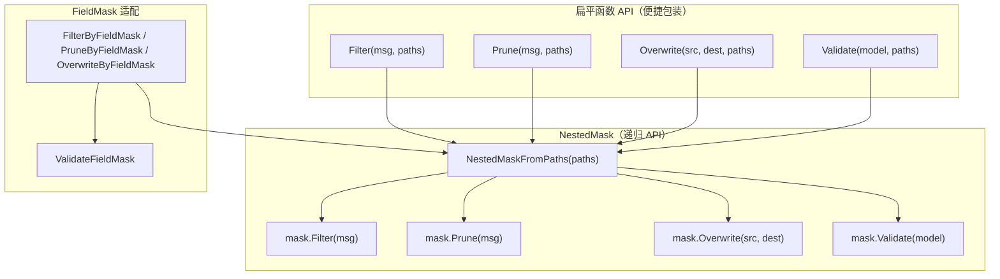

# Bald 字段掩码设计

> Title: fieldmaskutil——proto FieldMask 的过滤/剪除/覆写/校验
>
> 适用包：`pkg/fieldmaskutil`
>
> Author(s): bald 团队
>
> Last updated: 2026-09-18
>
> Status: Accepted（已实现；2026-09-10 自 bald-utils/fieldmaskutil 吸收）

## 摘要

`pkg/fieldmaskutil` 提供 proto `FieldMask` 的四个核心操作——**Filter**（只保留掩码内字段）、**Prune**（清除掩码内字段）、**Overwrite**（按掩码从 src 覆写到 dest）、**Validate**（校验路径对消息是否合法），以及配套的**路径归一化**（snake_case + `id_`/`_id` 特例修正）。

它服务于一个具体场景：**PATCH 部分更新**。gRPC/HTTP 的部分更新语义靠 `FieldMask` 表达「这次请求要动哪些字段」——没有这层，要么全量覆盖（丢并发修改）、要么手写反射代码（每个实体重写一遍）。

包只有两个文件、498 行，但导出面有 18 个符号，分两层：**扁平函数 API**（便捷包装）+ **`NestedMask` 递归 API**（复用掩码处理多条消息）。

> 本文为补缺而生：`fieldmaskutil` 此前**无专属设计文档**，公开 API 面只能从源码读取。

## 背景与动机

### 为什么需要这层

proto 的 `FieldMask` 是标准类型（`google.protobuf.FieldMask`），但它本身只做两件事：`Normalize()`（规范路径）与 `IsValid()`（校验路径）。真正的**字段操作**——递归遍历、按路径过滤/剪除/覆写——proto 库不提供。

业务要用「部分更新」就必须自己写这套反射递归。bald 的选择是收口成包：`fieldmaskutil` 基于 `protoreflect` 实现递归遍历，支持标量/消息/重复字段/map 四类字段形态。

### 为什么从 bald-utils 吸收

包注释记录：2026-09-10 自 `bald-utils/fieldmaskutil` 吸收。理由是**proto FieldMask 与 bald 的 proto 契约（`storev1`/`crudbridge`）天然相关**——PATCH 部分更新是 CRUD 标配，放在框架侧才能被 `pkg/store`、`crudbridge` 共同消费，而不是每个业务仓各copy 一份。

## 设计

### 两层 API：扁平包装 vs 递归复用



**扁平 API** 的注释统一写着同一句话：「If the same paths are used to process multiple proto messages use NestedMask.X method directly.」——即扁平版每次都重建 `NestedMask`，**适用于一次性调用**；若同一组路径要处理多条消息，应显式构造 `NestedMask` 复用，避免重复解析路径树。

**`NestedMask`** 是路径的递归表示（`map[string]NestedMask`）：

```go
NestedMaskFromPaths(["foo.bar", "foo.baz"])  // → {"foo": {"bar": nil, "baz": nil}}
```

`FieldMask` 适配层（`FilterByFieldMask` 等）在调用 `NestedMask` 前会先 `Normalize()` + `ValidateFieldMask()`——**带校验的安全路径**；而裸 `Filter(msg, paths)` 的注释明确警告：「Paths are assumed to be valid and normalized otherwise the function may panic」。

### 四操作的语义

| 操作 | 语义 | 空掩码行为 |
|---|---|---|
| `Filter` | **只保留**掩码内字段，其余 `Clear` | 空掩码 = 全部保留（no-op） |
| `Prune` | **清除**掩码内字段，其余不动 | 空掩码 = 全部不动（no-op） |
| `Overwrite` | 按掩码把 src 的字段值覆写到 dest | 空掩码 = 不覆写 |
| `Validate` | 校验掩码路径对消息是否合法 | 逐路径检查字段存在性与嵌套可达性 |

`Filter` 与 `Prune` 是**对偶操作**：`Filter` 清掩码外的、`Prune` 清掩码内的，恰好相反。

### 四类字段形态的递归

`overwrite`/`validate` 对字段形态分支处理（`nested_mask.go`）：

- **标量**：直接 `Set`/`Clear`（`Overwrite` 中若 src 值为空或等于默认值则 `Clear` dest）；
- **消息**：dest 为 nil 时**先初始化父消息**再递归；
- **repeated message**：按索引覆写已有项、超出则 `AppendMutable`；src 短于 dest 时 `Truncate` 截断多余项；
- **map（value 为 message）**：dest map 无效时先 `Set`；逐 key 递归覆写，src 没有的 key `Clear`。

`validate` 的对称分支：list 取 `NewElement()`、map 取 `NewValue()` 检查是否为 message kind，非 message 则报错「can't get nested fields」。

### 路径归一化：snake_case + id 特例

```go
func NormalizeFieldMaskPaths(fm *fieldmaskpb.FieldMask)  // 就地规范 fm.Paths
func NormalizePaths(paths []string) []string             // 返回新切片
```

两者都做两件事：①`stringcase.ToSnakeCase` 归一为 snake_case；②特例修正 `id_` / `_id` → `id`。

**为什么有 `id_`/`_id` 特例**：客户端可能把主键字段写成 `id`、`ID`、`id_`、`_id` 等形式（不同序列化习惯），归一后统一落到 proto 的 `id` 字段名。这是**宽容输入、规范输出**——避免因大小写/下划线差异导致掩码失配（失配的后果是 `Validate` 报错，或更糟：`Filter` 静默清掉不该清的字段）。

注意 `NormalizeFieldMaskPaths` 会先调 `fm.Normalize()`（proto 标准规范化），再叠加 snake_case；`PruneByFieldMask`/`OverwriteByFieldMask` 只调 `fm.Normalize()` 不调 `NormalizeFieldMaskPaths`，而 `FilterByFieldMask` 两者都调——**这是一处不对称**（见「兼容性」）。

### 路径工具

| 函数 | 用途 |
|---|---|
| `PathsFromFieldNumbers(msg, nums...)` | 把 proto 字段号转为字段路径（不存在的号跳过；无参数返回 nil） |
| `NilValuePaths(msg, paths)` | 返回 paths 中**未设置**（`Has` 为 false）的子集 |

`NilValuePaths` 服务于「置 NULL 区分语义」——需要判断哪些字段本次未赋值（用于构造只更新非空字段的 UPDATE）。它是 `crudbridge` 的租户/数据范围注入之外的另一个 CRUD 辅助。

## 理由与取舍

### 为什么保留两层 API 而非只留一层

**被放弃方案：只留 `NestedMask`**。理由是不必维护「扁平包装」的重复代码。但扁平 API 的价值在于**降低常见场景的调用门槛**——一次性 PATCH 处理一条消息时，`fieldmaskutil.Filter(msg, paths)` 比 `NestedMaskFromPaths(paths).Filter(msg)` 少一层心智负担。两层并存 + 注释明确指向「多消息场景用 NestedMask」，是**便捷性与复用的平衡**。

### 为什么 validate 与 overwrite 分开实现递归

`overwrite` 与 `validate` 的递归结构相似（都按字段形态分支），但**不合并**：`validate` 只读不写（`msg.Get`）、`overwrite` 需要 dest 可写（`Mutable`/`Set`/`Clear`）。合并需要一个「是否写入」的开关参数贯穿递归，可读性反而下降。两段各自清晰的递归优于一段带开关的。

### 为什么路径归一化放在本包而非调用方

`id_`/`_id` 特例修正依赖 `stringcase.ToSnakeCase`（`pkg/stringcase`）——放调用方意味着每个消费方都要重写这层归一。本包吸收后，`Validate`/`Filter` 的输入宽容度由包统一保证。

## 兼容性

### ⚠️ `OverwriteByFieldMask` 是自我覆写（缺陷，零消费者未暴露）

**现象**：函数注释写「overwrites all the fields ... in the **dest** msg using values from **src** msg」，但签名只有一个 `msg` 参数，实现是：

```go
func OverwriteByFieldMask(msg *proto.Message, fm *fieldmaskpb.FieldMask) error {
    ...
    NestedMaskFromPaths(fm.GetPaths()).Overwrite(*msg, *msg)  // src == dest
}
```

`Overwrite(src, dest)` 的 src 与 dest 是**同一个对象**——按掩码从自己覆写到自己，语义上是 no-op（`overwrite` 内部对每个字段先取 src 值再 `Set` 回 dest，同源同目标）。

**对照**：`NestedMask.Overwrite(src, dest)` 与扁平版 `Overwrite(src, dest, paths)` 都有独立的 src/dest 参数，语义正确；只有 `OverwriteByFieldMask` 少了 src 参数。

**影响面**：全仓 `OverwriteByFieldMask` **零消费者**（grep 确认），故缺陷未被暴露。但它作为公开 API 存在，外部仓若按注释语义调用会得到 no-op。

**判定**：签名设计缺陷——应为 `OverwriteByFieldMask(src, dest *proto.Message, fm *fieldmaskpb.FieldMask)`。**本文如实记录，未修**（超出文档任务边界）。

### `FilterByFieldMask` 与另两个 ByFieldMask 的归一化不对称

`FilterByFieldMask` 调 `Normalize()` + `NormalizeFieldMaskPaths()`（含 snake_case + id 特例）；而 `PruneByFieldMask`/`OverwriteByFieldMask` 只调 `fm.Normalize()`（proto 标准，不含 id 特例）。

**影响**：传 `paths: ["id_"]` 给 `FilterByFieldMask` 会被修正为 `id`；传给 `PruneByFieldMask`/`OverwriteByFieldMask` 则保持 `id_` → 大概率 `Validate` 报错「unknown path」。**这是当前实现的不对称**，不是有意设计。使用三个 ByFieldMask 时，若路径含 `id_`/`_id` 形式，需自行先归一。

### `NormalizePaths` 就地修改入参

`NormalizePaths(paths)` 直接改写入参切片元素（`paths[i] = ...`）并返回同一底层数组——调用方若需保留原切片，应先自行 copy。与其他归一函数一样是**就地/半就地**语义。

### 从 bald-utils 迁移

2026-09-10 吸收；旧引用路径 `bald-utils/fieldmaskutil` 的调用方需改 import。API 面在吸收时保持不变。

## 实现与验证

### 测试覆盖

`fieldmaskutil_test.go` 含 6 个测试，其中 `Test_NilValuePaths`（`fieldmaskutil_test.go:105`）钉住置 NULL 区分语义。

> **文档-现状校正（2026-09-18）**：《设计评审-第三轮-2026-09-12.md:215》仍把 `NilValuePaths` 记为「主模块副本确无测试……唯一真欠账：补 `Test_NilValuePaths`」——**该欠账已落地**，测试存在。

### 消费方

- **`pkg/store`**：部分更新路径按掩码覆写实体；
- **`crudbridge`**：数据范围/租户注入辅助；
- 业务层 PATCH handler。

### 与其他文档的分工

| 文档 | 关系 |
|---|---|
| [框架契约总览](./框架契约总览.md) | 速查表（**此前缺 fieldmaskutil 节**，本文补齐了专文） |
| [Bald 存储设计](./Bald%20存储设计.md) | `pkg/store` 的部分更新消费本包 |

### FAQ

**Q：为什么 `Overwrite` 要把 src 的空值也覆写到 dest（Clear）？**
部分更新语义下「显式清空某字段」是合法意图——若 src 该字段为空且掩码包含它，说明请求要把它清掉。区分「未包含在掩码」（不动）与「包含但为空」（清空）正是 FieldMask 的表达力所在。

**Q：`NestedMask.Filter` 对 map 的语义为什么是「清掉掩码外的 key」而非「只保留匹配的子键」？**
map 的 key 是数据而非 schema，掩码无法预先穷举 key。当前实现：遍历 dest map，key 在掩码子节点里则递归，否则 `Clear(mk)`。这允许按 key 白名单过滤 map 项。

**Q：为什么路径校验失败要报具体路径而非泛化错误？**
`validate` 报 `unknown path: 'foo.bar'`（`fullPath` 拼出完整路径）——部分更新场景下，用户写错字段名是最常见故障，精确到路径的错误信息让排查省一轮猜测。
