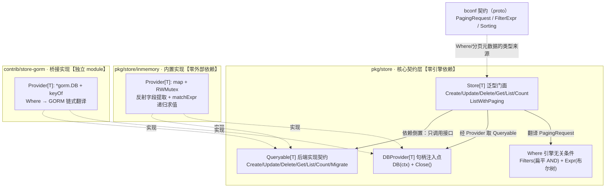
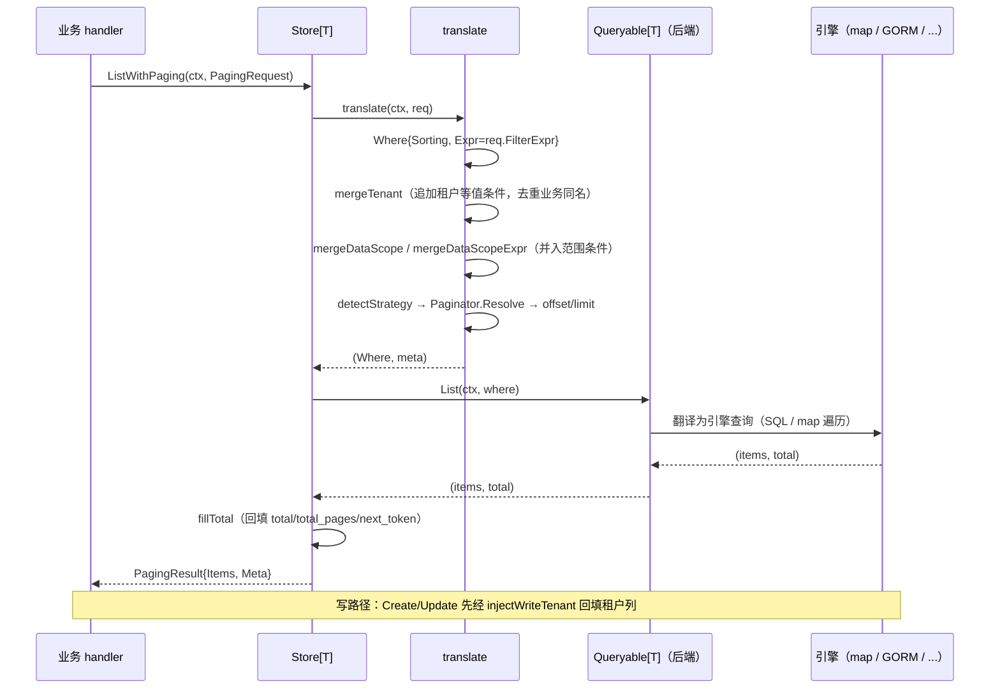

# Bald 存储设计：契约层零引擎依赖，隔离与分页下沉 DAL

> Author(s): bald 团队
>
> Last updated: 2026-09-23
>
> Discussion at: 源码 `pkg/store/{store,where,paging,tenant,scope,errors,mapper,logger}.go` + 内置实现 `pkg/store/inmemory/`；桥接子模块 `contrib/store-gorm/`；契约 `bconf/proto/bald/store/v1/store.proto`（生成至 `bconf/gen/go/bald/store/v1`）；消费方 `pkg/crudbridge/data_scope.go`、`_example/bald/user/`
>
> Status: Accepted（核心契约 + inmemory 实现已落地；桥接子模块 GORM 已落地；本文为 `pkg/store` 模块的现状设计文档）
>
> 与 [数据存储设计](./数据存储设计.md) 的分工：那篇是**早期方案对比与决策记录**（对比 go-crud / onexstack 的取舍，其 §2/§3 的接口草案自承与现状有偏差）；本篇是**模块现状的专属展开**——API 形状以本篇的 file:line 与源码为准。

## 摘要

`pkg/store` 是 bald 的数据访问层（DAL）抽象。它的设计主线与 `registry` / `config` 一致：**核心只定义最小接口与契约，不绑定任何具体存储引擎**。三层结构——

- **核心契约层**（`pkg/store` 根包）：泛型 `Store[T]` 门面 + `Queryable[T]` 后端实现契约 + `DBProvider[T]` 句柄注入点 + 引擎无关的 `Where` 条件表达。零引擎依赖、零序列化耦合。
- **内置实现层**（`pkg/store/inmemory`）：map + 反射的零外部依赖实现，供 e2e / 单测 / 原型。
- **桥接实现层**（`contrib/store-gorm` 等独立 module）：GORM / MongoDB 各自独立 module，经 `DBProvider` 注入，核心 `go.mod` 不引入任何引擎。

本模块承载三条横切关注点，全部**下沉到 DAL 而非散落业务 handler**：多租户隔离（读路径自动注入租户条件、写路径自动回填租户列）、数据权限范围（五级 Viewer 范围的 `FilterExpr` 布尔树翻译）、分页策略（Page / Offset / Token / NoPaging 四策略自动识别）。最重要的承诺：**隔离条件不可被业务条件覆盖或绕过**——租户列一旦注册，任何 `ListWithPaging` 查询都会被强制附加等值条件，即便 `NoPaging` 全量列出也如此。

本文回答四个问题：为什么契约要拆成 `Store` / `Queryable` / `DBProvider` 三层、隔离为什么必须下沉 DAL、分页为什么做成可替换策略、以及当前实现有哪些尚未闭合的边界。

---

## 背景与动机

### 每个业务仓储都在手写同一段样板

没有 DAL 抽象时，每个业务仓储都是这段（示意代码，非仓库摘录）：

```go
func (r *UserRepo) ListUsers(ctx context.Context, tenantID string, page, size int) ([]*User, int64, error) {
    q := r.db.Model(&User{}).Where("tenant_id = ?", tenantID) // 漏写就是跨租户泄漏
    // 数据权限？每个 handler 自己判角色、拼 owner 条件……
    // 分页？page/offset/token 三种前端传法各写一遍……
}
```

三处问题。其一，**租户条件漏写即数据泄漏**——这是安全缺陷，不该依赖开发者记性。其二，**数据权限推导散落各 handler**——同一份"仅本人/本部门/全部"的策略在 N 个查询里各写一遍，行为漂移。其三，**分页参数三种传法**（页码 / 偏移 / 游标）在每个列表接口重复解析。

### 为什么核心不能内置引擎实现

bald 是**框架**，不是 DAL 库。把 8 种引擎实现塞进核心，会违反 `registry` / `config` 已确立的「核心只定接口、实现由调用方桥接」范式，且让 `go build ./...` 拖进 gorm + mongo + redis 全部依赖。因此本模块的取舍是：**契约 + proto 标准化留在核心，具体引擎实现留独立子模块**。这条主线与《数据存储设计》§1 的结论一致，本文不再重复论证，只展开落地形态。

---

## 设计

### module 布局与依赖方向



依赖方向单一：`inmemory` / `contrib/store-gorm` → 核心契约；核心 → `bconf` 契约（仅 proto 生成的类型，非引擎）。桥接子模块各自独立 `go.mod`（`github.com/kalandramo/bald/contrib/store-gorm`），业务 `go get` 按需引入，主模块 `go build ./...` 零引擎依赖。

### 核心契约三件套

三层接口，各司其职（`store.go:30` / `store.go:43` / `store.go:50`）：

```go
// Queryable 是后端对具体存储引擎的 CRUD 实现契约（依赖倒置）。
type Queryable[T any] interface {
    Create(ctx context.Context, obj *T) error
    Update(ctx context.Context, obj *T) (rows int64, err error)
    Delete(ctx context.Context, where *Where) (rows int64, err error)
    Get(ctx context.Context, where *Where) (*T, error)
    List(ctx context.Context, where *Where) (items []*T, total int64, err error)
    Count(ctx context.Context, where *Where) (int64, error)
    Migrate(ctx context.Context, models ...any) error // 可选，业务按需调用
}

// DBProvider 提供存储句柄，由调用方注入具体引擎实现。
type DBProvider[T any] interface {
    DB(ctx context.Context) (Queryable[T], error)
    Close() error // 可选
}

// Store 是引擎无关的泛型 CRUD 门面。
type Store[T any] struct {
    provider DBProvider[T]
    logger   Logger
    opts     options
}
```

**为什么拆三层而不是两层？** `Store[T]` 与 `Queryable[T]` 的分离是关键：`Store` 承载**引擎无关的横切逻辑**（租户注入、范围合并、分页翻译、元数据回填），`Queryable` 承载**引擎相关的翻译**（`Where` → SQL/NoSQL）。如果把两者合并，每个后端都要重复实现一遍横切逻辑——租户隔离会在 gorm / mongo / inmemory 里各写一遍，正是我们要消除的样板。`DBProvider` 再退一层，是因为 `Queryable` 的获取可能需要 per-request 的会话/事务（`DB(ctx)` 带 ctx），且生命周期（`Close`）与句柄构造归调用方。

`NewStore[T](provider, opts...)`（`store.go:81`）用函数式 Option 配置：`WithPageSize`（默认 `DefaultPageSize=10`，`store.go:22`）、`WithMaxPageSize`（默认 `MaxPageSize=100`，`store.go:25`，防恶意大页）、`WithLogger`（默认 `NopLogger`）。`Store` 另暴露 `Provider()`（`store.go:93`）供需要直接触达引擎的场景。

### Where：引擎无关的条件表达

`Where`（`where.go:16`）是核心与后端之间的**唯一查询语言**，以「DTO 字段名 + 操作符」表达，不感知引擎方言：

```go
type Where struct {
    Offset  int
    Limit   int
    Filters []*storev1.FilterCondition // 扁平 AND 条件（框架注入隔离也走这里）
    Expr    *storev1.FilterExpr        // 复杂布尔树（AND/OR 嵌套，可承载 DataScope 多范围 OR）
    Sorting []*storev1.Sorting
}
```

条件语义恒为 **`WHERE = AND(Filters..., Expr)`**（`where.go:11`）。这个"扁平 + 树"双通道设计有明确分工：`Filters` 承载**框架注入的隔离条件**（租户、数据范围）与业务简单条件，`Expr` 承载**业务复杂布尔树**。两者按 AND 连接，互不干扰——隔离条件永远无法被业务的 OR 树"吞掉"。

便捷构造族（`where.go:30`–`where.go:103`）覆盖常用操作符：`Eq`/`Ne`/`Gt`/`Gte`/`Lt`/`Lte`（比较）、`In`/`Nin`（集合）、`Like`/`Contains`（模糊）、`And`/`Or`（树）、`Sort`/`SortDesc`（排序）。这些构造器是**形状契约**——`where_test.go:TestWhereConstructors` 用同一断言族钉住全部成员（含零调用的 `Lt`/`Lte`/`Nin`），防翻译层语义漂移时无测试可依。

### 分页策略：四策略自动识别

分页做成可替换的 `Paginator` 策略（`paging.go:21`），由 `detectStrategy`（`paging.go:29`）按请求字段自动选择，**优先级：NoPaging > Token > Page > Offset > 默认页码**：

| 策略 | 触发条件 | offset/limit 计算 | 元数据填充 |
|---|---|---|---|
| `noPaginator` | `no_paging=true` | `(0, 0)`，`limit<=0` 由后端解释为全量 | 不填（全量无页概念） |
| `tokenPaginator` | `token` 非空 | 解码 token 为偏移；空 token 从头 | `next_token` |
| `pagePaginator` | `page` 存在 | `(page-1)*size, size`，`page<1` 归正为 1 | `current_page`/`total_pages` |
| `offsetPaginator` | `offset`/`limit` 存在 | 直接用；仅给 offset 时按默认页大小限制 | `current_offset` |

`clampPageSize`（`store.go:385`）把页大小归一化到 `[defaultSize, maxSize]`——这是 proto 契约里"服务端必须设置合理上限"那条安全规约的落地。

`ListWithPaging`（`store.go:311`）→ `translate`（`store.go:331`）→ `fillTotal`（`store.go:395`）是分页主链路。**NextToken 的填充被刻意推迟到 `fillTotal`**（`store.go:380`–`store.go:381` 注释）：token 需等拿到 `total` 才能判定是否真有下一页，否则末页会产生"空翻页死循环"。`fillTotal` 里 `hasMore := where.Limit > 0 && total > offset+limit`（`store.go:404`）——只有确实还有下一页才下发 token。

**Token 的当前语义是「偏移游标」不是「真游标」**（`paging.go:7`–`paging.go:9` 文件头自承）：token 是 base64 编码的十进制偏移量（兼容裸十进制，向后兼容），`encodeToken`（`paging.go:109`）产出，解码在 `tokenPaginator.Resolve`（`paging.go:78`）。这与"基于主键/排序键的游标分页"不同——后者需后端配合 last-key 过滤，是未来平滑升级路径，业务调用方无感知。

### 多租户隔离：读路径注入 + 写路径回填

多租户是**下沉到 DAL 的强制隔离**，而非业务 handler 的自律。注册表（`tenant.go:19`）以列名为 key：

```go
store.RegisterTenant("tenant_id", store.DefaultTenantFunc) // 显式开启，不在 init 中隐式注册
```

**为什么不在 `init` 中隐式注册？** 因为对存量非多租户业务静默注入隔离条件会造成"查询突然查不到数据"的诡异故障。显式注册把开启时机交给业务，代价为零（`tenant.go:25`–`tenant.go:26` 注释）。`DefaultTenantFunc`（`tenant.go:27`）从 `contextx.TenantIDFromContext` 取值——认证中间件（`pkg/middleware/{gin,grpc}/authn.go`）在认证通过后写入。

**读路径**：`translate` 在构造 `Where` 后立即调用 `mergeTenant`（`store.go:340`）与 `mergeDataScope`/`mergeDataScopeExpr`（`store.go:343`–`store.go:344`）。`mergeTenant`（`tenant.go:94`）把每个已注册维度的等值条件追加进 `Filters`，并**去重业务已手写的同名条件**——业务若已写该租户列（任一操作符，如 `NEQ`），系统不再叠加 `EQ`，避免 `EQ + NEQ` 叠加产生恒假或歧义（`tenant_test.go:TestMergeTenant` 锁定）。

**写路径**：`Create`/`Update`（`store.go:96`/`store.go:133`）在委托后端前调用 `injectWriteTenant`（`store.go:149`），反射把 ctx 解析到的租户值写回实体字段。字段匹配优先级（`tenantFieldIndex`，`store.go:188`）：`gorm:"column:tenant_id"` tag > `json:"tenant_id"` tag > 字段名 CamelCase→snake_case 直接相等（`fieldToSnake`，`store.go:215`）。**语义是无条件覆写**（`store.go:181` 的 `fd.SetString`）——业务试图写入他租户值（越权改归属）会被 ctx 真实租户覆盖，`write_tenant_test.go:TestInjectWriteTenant` 明确锁定"越权租户值应被 ctx 租户覆盖"。

读写两路径**对称闭环**：读不泄漏、写不改归属。这是本模块的核心安全承诺。

### 数据权限范围：五级 Viewer 的布尔树翻译

`scope.go` 是 bald-crud 的 Viewer（五级范围 SELF/UNIT/USER/ALL/NONE）在 bald 的依赖倒置实现。核心只定义函数签名（`scope.go:18`/`scope.go:22`），具体范围策略由业务经 `RegisterDataScope`（扁平版）或 `RegisterDataScopeExpr`（布尔树版）注入：

```go
type DataScopeFunc func(ctx context.Context, claims *authn.AuthClaims) []*storev1.FilterCondition
type DataScopeExprFunc func(ctx context.Context, claims *authn.AuthClaims) *storev1.FilterExpr
```

`mergeDataScope`（`scope.go:46`）把扁平条件并入 `Filters`；`mergeDataScopeExpr`（`scope.go:63`）把布尔树按 **`Expr = AND(scopeExprs..., 业务 Expr)`** 合并——多范围 OR 组合（如"本人 OR 本部门"）走布尔树版。`pkg/crudbridge/data_scope.go` 是实际消费者：把五级范围翻译成 `FilterExpr` 布尔树，**fail-closed**——身份缺失返回空 OR 节点（恒假，`where.go:89` 的 `Or(nil)`），宁可查不到也不放行。

### 内置 inmemory 实现

`inmemory`（`inmemory.go:29`）是零外部依赖的 `Provider[T]`：`map[string]*T` + `sync.RWMutex`，键由调用方注入的 `KeyFunc`（`inmemory.go:26`）提取（典型为业务主键）。`NewProvider[T](keyOf)`（`inmemory.go:36`）在 `keyOf` 为 nil 时 panic——fail-fast 而非静默退化。

`memQuery[T]`（`inmemory.go:58`）实现 `Queryable[T]`，过滤经反射读取导出字段值做字符串比较（`fieldString`，`inmemory.go:307`），`matchOne`（`inmemory.go:213`）以 20 个 case 分支覆盖 24 个操作符常量（含 `EQ/EXACT`、`LIKE/CONTAINS` 等合并分支），从等值/比较到正则/前后缀。**字段名双向归一**（`snake`，`inmemory.go:288`）保证同一 `Where` 语义在 inmemory 与 gorm 后端行为一致——`UserID` 与 `user_id` 都能命中。布尔树求值 `matchExpr`（`inmemory.go:175`）递归实现 AND/OR 语义，**空 AND 恒真、空 OR 恒假**（与 proto 契约一致，`inmemory_test.go:TestStore_OrExpr` 锁定）。数值比较 `cmpNum`（`inmemory.go:352`）先试 `ParseFloat`，失败回退字典序——注意这对字符串型数字列（如 `"10"` vs `"9"`）会走字典序，是已知取舍（见「已知边界」）。

不支持的操作符（`JSON_CONTAINS`/`ARRAY_CONTAINS`/`EXISTS`/`SEARCH`）在 `matchOne` 的 default 分支返回 `false`——**宁缺勿假**（`inmemory.go:280` 注释）。

### 可选能力：Mapper 与 Logger

**Mapper**（`mapper.go:16`）提供 DTO↔Entity 分离的可选桥接。`CopierMapper[DTO, Entity]`（`mapper.go:25`）基于反射做同名字段复制——仅复制导出字段中名字相同且 kind 兼容的字段，不匹配字段静默忽略（`copyFields`，`mapper.go:51`）。它**不进 `Store[T]` 的内部流程**：`Store` 默认直接操作实体 `T`（含 gorm tag），需要 DTO/Entity 分离的业务在 Provider 层自行组合。这一取舍见「理由与取舍」。

**Logger**（`logger.go:7`）是最小日志接口（`Error`/`Info` 两方法），刻意只对齐 `pkg/log` 的子集以避免核心反向依赖框架 log 包。`FromLogger`（`logger.go:38`）用结构断言适配任意满足签名的对象（含 `*log.Logger`），`NopLogger`（`logger.go:15`）为空转默认。当前 `Store` 持有 logger 但主链路尚未产生日志调用（见「已知边界」）。

### 请求到后端的完整数据流



---

## 理由与取舍

**为什么 `Get` 未命中返回 `ErrNotFound` 而不是 `(nil, nil)`？** `store.go:277` 明确：两个 provider 一致返回哨兵错误。调用方须判 error 而非只判 nil——这消除了"零值实体 vs 未命中"的歧义。**注意 `Delete`/`Update` 的语义与此不同**（见下两条），三者是独立契约。

**`Delete` 是幂等语义：0 行匹配返回 `(0, nil)`**（`store.go:251` 长注释，2026-09-23 决策）。它返回受影响行数，删除不存在的资源是**合法结果**——不再报 `ErrNotFound`。这消除了旧语义的缺陷（框架缺陷报告 D12）：`Delete` 曾对 0 行硬失败，把「集合删除本就为空」误报为 not found，逼得 `bald-admin` 的 message/mfa 两域写容忍样板。需要「必须存在才能删」的调用方，**由上层显式实现**——判 `rows == 0` 即可，无需额外 `Get` 往返。**代价**：无前置 `Get` 的单条删除路径，其「删不存在 → 404」会退化为 200（有意变更）。

**`Update` 与 `Delete` 同族：0 行匹配返回 `(0, nil)`**（`store.go:105` 长注释，2026-09-24 决策）。更新对齐 SQL 原生语义——`UPDATE` 影响 0 行是正常执行，ORM 不擅自增加底层没有的错误；「更新到本就是目标值」是成功而非失败（面向最终状态，非过程）。影响行数属**业务状态**，经 `RowsAffected` 通道交业务判断，`Result.Error` 只承载系统错误。**代价**：无前置 `Get` 的单条更新路径，其「更不存在 → 404」退化为 200（与 `Delete` 同性质的有意变更）。两 provider 对称：`inmemory` 返回 `1`/`0`、`gorm` 返回 `RowsAffected`。

⚠️ **`rows == 0` 不能作为「记录不存在」的判据**——返回的是**受影响行数**而非匹配行数，且跨后端不一致：MySQL 默认对「UPDATE 到与现有值相同」返回 0（行确实存在），SQLite 返回 1。需要精确存在性判断时应显式 `Get`（`Delete` 侧同理，其「集合删除」语义天然容忍 0 行，故该差异对 `Delete` 影响较小）。

**为什么 Mapper 不进 Store 内部流程？** 泛型 `Store[T]` 一旦内建 `Mapper[T, Entity]`，就需要 `EntityOf[T]` 这类类型级推导（早期草案里出现过，全仓零落地）。代价是核心复杂度暴涨、`T` 的语义变模糊。当前设计把 DTO/Entity 分离留给 Provider 层组合——`Store[T]` 只管 `T`，业务要分离就在构造 Provider 前包一层。**能力面完整，复杂度不进核心。**

**为什么隔离必须下沉 DAL 而不是留在业务？** 因为"漏写租户条件"是**安全缺陷**而非编码风格问题。下沉后，隔离成为框架的默认行为而非开发者的自律项——这正是 `Registry` / `config` 之外，本模块的独特价值。

**为什么 `Filters` 与 `Expr` 双通道而非统一成布尔树？** 隔离条件必须**不可被业务的 OR 树吞掉**。若统一成单棵布尔树，业务的 OR 根节点会让注入的租户条件变成 OR 的成员——一个 `Or(业务条件)` 就能绕过隔离。双通道按 AND 连接从结构上杜绝了这种绕过。

---

## 已知边界与缺口

以下为**当前实现的事实记录**（均以 file:line 核实），不是设计意图：

1. **隔离仅覆盖 `ListWithPaging`**。`mergeTenant`/`mergeDataScope` 只在 `translate`（`store.go:340`–`store.go:344`）中调用，而 `translate` 只被 `ListWithPaging` 使用。`Get`/`List`/`Count`/`Delete`（`store.go:265`–`store.go:295`）直接透传 `Where`，**不自动注入隔离**——调用方须自行 `where.T(ctx)`（`tenant.go:69`）。这是隔离面上的重要边界：多租户应用若用 `Get`/`List` 直查而忘了 `T(ctx)`，会读到全租户数据。

2. **`Where.T(ctx)` 丢失 `Expr`**。`Where.T`（`tenant.go:69`–`tenant.go:76`）构造副本时只复制 `Sorting`/`Offset`/`Limit`/`Filters`，**不复制 `Expr`**。当前该方法是零生产调用点（仅 `pkg/middleware/{gin,grpc}/authn.go` 注释提及），所以未暴露为实际缺陷；但一旦业务用 `where.T(ctx)` 显式隔离，业务布尔树会被静默丢弃。

3. **`injectWriteTenant` 注释与实现不符**。`store.go:142`–`store.go:143` 注释称"反射写入已跳过非导出字段与已有非空值之外的全部维度"，措辞暗示"跳过已有非空值"；实现（`store.go:179`–`store.go:181`）实际是**无条件覆写**（仅检查 `CanSet` 与 `Kind==String`），`write_tenant_test.go` 也锁定"越权值被覆盖"。注释应改为"无条件覆写"。

4. **proto 的字符串 DSL 与 field_mask 零消费**。`PagingRequest` 声明了 `query`(10)/`filter`(11)/`order_by`(20)/`field_mask`(30)，但 `translate`（`store.go:333`–`store.go:334`）只读取 `GetSorting()` 与 `GetFilterExpr()`。字符串 DSL 与字段掩码在核心层**未接线**——proto 契约的安全规约第 4 条（"字符串 DSL 仅作前端便捷通道，服务端必须严格校验"）目前无对应实现。

5. **`Mapper`/`CopierMapper` 零生产调用点**（仅 `mapper_test.go`）；**`DBProvider.Close()` 零调用点**，`Store` 也未暴露 `Close`（资源生命周期完全归调用方）。

6. **`PaginationResponseMeta.CurrentSize` 未被填充**。`fillTotal`（`store.go:395`）回填 `Total`/`TotalPages`/`NextToken`，未填 `CurrentSize`（当前页实际返回条数）。

7. **token 是偏移游标不是真游标**（`paging.go:7`–`paging.go:9` 文件头自承），深度翻页时后端的 `OFFSET` 成本仍随页数增长；升级为 last-key 游标的路径已在该注释中预留。

8. **`inmemory.Provider.Migrate` 与 `memQuery.Migrate` 重复定义**（`inmemory.go:52`/`inmemory.go:55`）——`Provider` 上的 `Migrate` 并非 `Queryable` 接口要求（接口方法实现在 `memQuery`），是冗余成员。

9. **`detectStrategy` 的 NoPaging 分支不可达**（`paging.go:30`）：`translate` 在 `store.go:346` 已提前 `if req.GetNoPaging()` 返回，从不带 `NoPaging` 请求进入 `detectStrategy`。该分支仅由 `paging_test.go:TestPaging_DetectStrategy` 直接测试覆盖。

10. **字符串型数字列走字典序**：`cmpNum`（`inmemory.go:352`）对无法 `ParseFloat` 的值按字典序比较，`"10" < "9"`。仅影响 inmemory 后端对**字符串存数字**的排序/范围比较；gorm 后端由数据库类型系统决定。

---

## 兼容性

核心契约稳定。**破坏性变更记录**：`Update`/`Delete` 签名由 `error` 改为 `(int64, error)`（0 行返回 `(0, nil)`，幂等语义，2026-09-23/24 两次决策）——下游调用点须同步为 `rows, err := ...`。已发布 tag：`store` 随主模块（`go.mod` `module github.com/kalandramo/bald`）；桥接子模块 `contrib/store-gorm` 为独立 module（`github.com/kalandramo/bald/contrib/store-gorm`，当前 require `bald v0.9.0` + `bconf v0.7.2`）。

跨 module 使用者注意：引用 GORM 桥接须 require `contrib/store-gorm` 本身（非主模块）；`bconf` 契约类型（`storev1.*`）来自 `github.com/kalandramo/bald/bconf`。

`RegisterTenant` 重复注册同一 key 会**覆盖**（`tenant.go:40`），`UnregisterTenant`（`tenant.go:58`）是幂等逆操作——e2e 测试用 `t.Cleanup(func() { store.UnregisterTenant("tenant_id") })` 做隔离。

---

## 实现与过渡

- [x] 核心契约：`Queryable[T]` / `DBProvider[T]` / `Store[T]` + Option 族（`store.go`）。
- [x] 条件表达：`Where` + 便捷构造族（`where.go`）。
- [x] 分页策略：四 `Paginator` + `detectStrategy` + `fillTotal`（`paging.go` / `store.go`）。
- [x] 多租户：读路径 `mergeTenant` + 写路径 `injectWriteTenant` + 注册/注销（`tenant.go` / `store.go`）。
- [x] 数据权限：`RegisterDataScope`/`RegisterDataScopeExpr` + 合并（`scope.go`）。
- [x] 内置 inmemory 实现（`inmemory/`）。
- [x] 桥接子模块 GORM（`contrib/store-gorm`，独立 module，SQLite 内存库测试）。
- [ ] 上述「已知边界」1/2/3/6/8/9 的收敛——按需排期（1 为安全边界，优先级最高）。
- [ ] `contrib/store-mongo`——同构实现 `Queryable[T]` + `DBProvider[T]` 即可，业务代码零改动。

**验证**（2026-09-23，HEAD `7b53571`）：

- `go test ./pkg/store/...` → `ok github.com/kalandramo/bald/pkg/store` + `ok .../inmemory`（exit 0）。
- `go vet ./pkg/store/...` → exit 0。
- 测试覆盖：根包 15 例（paging 7 / where 3 / tenant 3 / mapper 1 / write_tenant 1），inmemory 2 例；契约行为由 `where_test.go`（构造器形状）、`tenant_test.go`（隔离注入与去重）、`write_tenant_test.go`（越权覆写）、`paging_test.go`（四策略 + 元数据 + NextToken 边界）钉住。
- **未验证**：`contrib/store-gorm` 为独立 module，本次未单独跑其测试；「已知边界」各条为静态阅读 + grep 结论，除第 3 条有 `write_tenant_test.go` 的行为锁定外，其余未写复现测试。

---

## 附录：关联文档

- [数据存储设计](./数据存储设计.md)：DAL 的早期方案对比与决策记录（go-crud / onexstack 取舍），与本篇为「决策沿革 / 现状展开」关系。
- [Bald CRUD 桥接设计](./Bald%20CRUD%20桥接设计.md)：`pkg/crudbridge` 如何把身份与五级范围翻译成 `storev1.FilterExpr` 注入本模块。
- [认证与授权抽象设计](./认证与授权抽象设计.md)：`AuthClaims` 的 `TenantID` 如何经 `contextx` 流入本模块的隔离机制。
- [上下文契约设计](./上下文契约设计.md)：`tenant_id` 等五个标准 context 键的定义。
- [框架契约总览](./框架契约总览.md)：§11.5 为本模块公开契约速查。
- [Bald 缓存设计](./Bald%20缓存设计.md)：同为「契约层零依赖 + 实现独立 module + 装配桥接」模式的架构先例。
