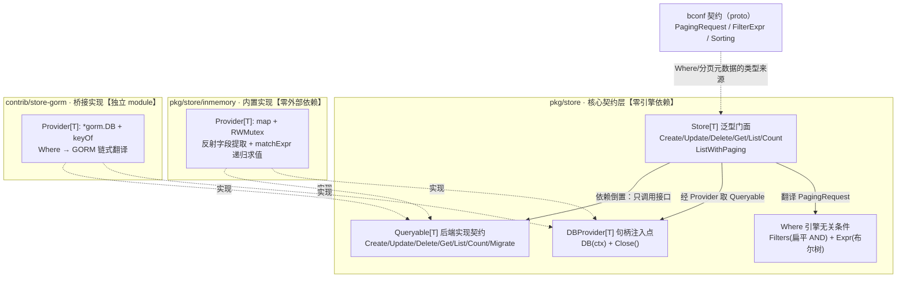
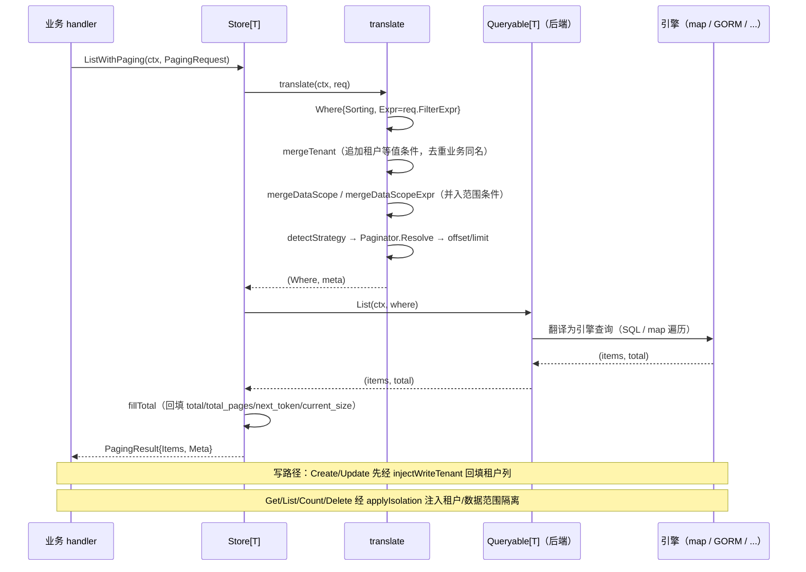

# Bald 存储设计：契约层零引擎依赖，隔离与分页下沉 DAL

> Author(s): bald 团队
>
> Last updated: 2026-09-24
>
> 锚点基线：`bald` @ `058b2b2`、`bald-crud` @ `dc1c05e`
>
> Discussion at: 源码 `pkg/store/{store,where,paging,tenant,scope,errors,mapper,logger}.go` + 内置实现 `pkg/store/inmemory/`；桥接子模块 `contrib/store-gorm/`；契约 `bconf/proto/bald/store/v1/store.proto`（生成至 `bconf/gen/go/bald/store/v1`）；消费方 `pkg/crudbridge/data_scope.go`、`_example/bald/user/`
>
> Status: Accepted（核心契约 + inmemory 实现已落地；桥接子模块 GORM / MongoDB 已落地；本文为 `pkg/store` 模块的现状设计文档）
>
> 本文档以**当前代码实现**为唯一基准——每条 API 形状断言都指到源码 file:line。模块的早期方案取舍见文末「决策沿革」（外部参照项目仅作脚注，不作为论证主语）；本域未修缺陷见《待处理事项》。

## 摘要

`pkg/store` 是 bald 的数据访问层（DAL）抽象。它的设计主线与 `registry` / `config` 一致：**核心只定义最小接口与契约，不绑定任何具体存储引擎**。三层结构——

- **核心契约层**（`pkg/store` 根包）：泛型 `Store[T]` 门面 + `Queryable[T]` 后端实现契约 + `DBProvider[T]` 句柄注入点 + 引擎无关的 `Where` 条件表达。零引擎依赖、零序列化耦合。
- **内置实现层**（`pkg/store/inmemory`）：map + 反射的零外部依赖实现，供 e2e / 单测 / 原型。
- **桥接实现层**（`contrib/store-gorm` 等独立 module）：GORM / MongoDB 各自独立 module，经 `DBProvider` 注入，核心 `go.mod` 不引入任何引擎。

本模块承载三条横切关注点，全部**下沉到 DAL 而非散落业务 handler**：多租户隔离（读路径自动注入租户条件、写路径自动回填租户列）、数据权限范围（五级 Viewer 范围的 `FilterExpr` 布尔树翻译）、分页策略（Page / Offset / Token / NoPaging 四策略自动识别）。最重要的承诺：**隔离条件不可被业务条件覆盖或绕过**——租户列一旦注册，任何 `ListWithPaging` 查询都会被强制附加等值条件，即便 `NoPaging` 全量列出也如此。

本文回答四个问题：为什么契约要拆成 `Store` / `Queryable` / `DBProvider` 三层、隔离为什么必须下沉 DAL、分页为什么做成可替换策略、以及当前实现有哪些尚未闭合的边界。

---

## 名词解释

**DAL（Data Access Layer，数据访问层）**：介于业务逻辑与具体存储引擎之间的抽象层。它对上层以引擎无关的形式暴露数据操作（增删改查、条件过滤、分页、隔离），对下层把统一的条件表达翻译到具体引擎（内存 map / SQL / NoSQL）。在 bald 中，DAL 即 `pkg/store` 模块——核心只定义 `Store[T]` / `Queryable[T]` / `DBProvider[T]` 三层契约与引擎无关的 `Where` 条件表达，具体引擎实现（`inmemory` / `contrib/store-gorm` / `contrib/store-mongo`）留在独立 module 经 `DBProvider` 桥接，核心 `go.mod` 不引入任何引擎。

DAL 的意义在于把横切关注点从业务层收口：没有它时，「漏写租户条件」是安全缺陷、「数据权限推导」散落各 handler 行为漂移、「分页参数三种传法」在每个列表接口重复解析（见「背景与动机」）。隔离与分页下沉到 DAL 后，它们成为框架的默认行为而非开发者的自律项。

本文出现的其余缩写：

| 缩写 | 全称 | 含义 |
|---|---|---|
| DAL | Data Access Layer | 数据访问层，见上 |
| DTO | Data Transfer Object | 数据传输对象；与持久化实体（Entity）分离时经可选 `Mapper` 桥接 |
| ORM | Object-Relational Mapping | 对象关系映射；本模块的 GORM 桥接（`contrib/store-gorm`）属此 |
| CRUD | Create / Read / Update / Delete | 增删改查，即 `Queryable[T]` 的契约方法集 |

---

## 背景与动机

### 每个业务仓储都在手写同一段样板

没有 DAL 抽象时，每个业务仓储都是这段（示意代码，非仓库摘录）：

```go
func (r *UserRepo) ListUsers(ctx context.Context, tenantID string, page, size int) ([]*User, int64, error) {
    q := r.db.Model(&User{}).Where("tenant_id = ?", tenantID) // 漏写就是跨租户泄漏
    // 数据权限？每个 handler 自己判角色、拼 owner 条件……
    // 分页？page/offset/token 三种前端传法各写一遍……
}
```

三处问题。其一，**租户条件漏写即数据泄漏**——这是安全缺陷，不该依赖开发者记性。其二，**数据权限推导散落各 handler**——同一份"仅本人/本部门/全部"的策略在 N 个查询里各写一遍，行为漂移。其三，**分页参数三种传法**（页码 / 偏移 / 游标）在每个列表接口重复解析。

### 为什么核心不能内置引擎实现

bald 是**框架**，不是 DAL 库。把 8 种引擎实现塞进核心，会违反 `registry` / `config` 已确立的「核心只定接口、实现由调用方桥接」范式，且让 `go build ./...` 拖进 gorm + mongo + redis 全部依赖。因此本模块的取舍是：**契约 + proto 标准化留在核心，具体引擎实现留独立子模块**。取舍的来路见「决策沿革」，本文不再重复论证，只展开落地形态。

---

## 设计

### module 布局与依赖方向



依赖方向单一：`inmemory` / `contrib/store-gorm` → 核心契约；核心 → `bconf` 契约（仅 proto 生成的类型，非引擎）。桥接子模块各自独立 `go.mod`（`github.com/kalandramo/bald/contrib/store-gorm`），业务 `go get` 按需引入，主模块 `go build ./...` 零引擎依赖。

### 核心契约三件套

三层接口，各司其职（`store.go:30` / `store.go:43` / `store.go:50`）：

```go
// Queryable 是后端对具体存储引擎的 CRUD 实现契约（依赖倒置）。
type Queryable[T any] interface {
    Create(ctx context.Context, obj *T) error
    Update(ctx context.Context, obj *T) (rows int64, err error)
    Delete(ctx context.Context, where *Where) (rows int64, err error)
    Get(ctx context.Context, where *Where) (*T, error)
    List(ctx context.Context, where *Where) (items []*T, total int64, err error)
    Count(ctx context.Context, where *Where) (int64, error)
    Migrate(ctx context.Context, models ...any) error // 可选，业务按需调用
}

// DBProvider 提供存储句柄，由调用方注入具体引擎实现。
type DBProvider[T any] interface {
    DB(ctx context.Context) (Queryable[T], error)
    Close() error // 可选
}

// Store 是引擎无关的泛型 CRUD 门面。
type Store[T any] struct {
    provider DBProvider[T]
    logger   Logger
    opts     options
}
```

**为什么拆三层而不是两层？** `Store[T]` 与 `Queryable[T]` 的分离是关键：`Store` 承载**引擎无关的横切逻辑**（租户注入、范围合并、分页翻译、元数据回填），`Queryable` 承载**引擎相关的翻译**（`Where` → SQL/NoSQL）。如果把两者合并，每个后端都要重复实现一遍横切逻辑——租户隔离会在 gorm / mongo / inmemory 里各写一遍，正是我们要消除的样板。`DBProvider` 再退一层，是因为 `Queryable` 的获取可能需要 per-request 的会话/事务（`DB(ctx)` 带 ctx），且生命周期（`Close`）与句柄构造归调用方。

`NewStore[T](provider, opts...)`（`store.go:105`）用函数式 Option 配置。当前 Option 族共 4 个（`store.go:70`/`75`/`80`/`97`）：

| Option | 作用 | 默认 |
|---|---|---|
| `WithPageSize(n)` | 默认页大小 | `DefaultPageSize=10`（`store.go:22`） |
| `WithMaxPageSize(n)` | 页大小上限，防恶意大页 | `MaxPageSize=100`（`store.go:25`） |
| `WithLogger(l)` | 注入日志适配器 | `NopLogger` |
| `WithPlatformLevel()` | **平台级豁免**：声明该 Store 操作的表**无租户维度**，隔离注入对其实例整体跳过 | 不豁免（fail-closed） |

`Store` 另暴露 `Provider()`（`store.go:117`，供直接触达引擎）与 `IsPlatformLevel()`（`store.go:102`，查询豁免状态）。

#### `WithPlatformLevel`：平台级豁免的语义与边界

`tenant_id` 是**数据的固有属性**——某些表本身就没有租户维度（如 `menu`、`language`、全局权限定义）。隔离自动注入若对这些表生效，会因目标列不存在而查询失败（`no such column: tenant_id`）。

`WithPlatformLevel` 提供显式豁免，设计要点：

- **默认隔离**（fail-closed）：不调用即强制注入。豁免必须**显式声明**，与 `RegisterTenant` 的「不在 `init` 隐式注册」同一取舍——让开启/关闭的时机都由业务掌握。
- **实例级而非全局**：豁免挂在 `Store` 实例的 `opts.platformLevel`（`store.go:97`），不是包级开关。同一张表用不同 `Store` 构造可有不同行为。
- **与「超级管理员」正交**：豁免是「这张表没有租户列」，不是「这个身份能看所有租户」——后者是权限问题（同表不同身份见不同行），应由数据范围（`RegisterDataScope`）承担。二者混淆会导致权限模型漏洞。

`bald-admin` 的 6 个平台级 Store（Role/RolePolicy/Menu/Permission/Language/Tenant）以「模型结构体无 `TenantID` 字段」为判据声明豁免。

### Where：引擎无关的条件表达

`Where`（`where.go:16`）是核心与后端之间的**唯一查询语言**，以「DTO 字段名 + 操作符」表达，不感知引擎方言：

```go
type Where struct {
    Offset  int
    Limit   int
    Filters []*storev1.FilterCondition // 扁平 AND 条件（框架注入隔离也走这里）
    Expr    *storev1.FilterExpr        // 复杂布尔树（AND/OR 嵌套，可承载 DataScope 多范围 OR）
    Sorting []*storev1.Sorting
}
```

条件语义恒为 **`WHERE = AND(Filters..., Expr)`**（`where.go:11`）。这个"扁平 + 树"双通道设计有明确分工：`Filters` 承载**框架注入的隔离条件**（租户、数据范围）与业务简单条件，`Expr` 承载**业务复杂布尔树**。两者按 AND 连接，互不干扰——隔离条件永远无法被业务的 OR 树"吞掉"。

便捷构造族（`where.go:30`–`where.go:103`）覆盖常用操作符：`Eq`/`Ne`/`Gt`/`Gte`/`Lt`/`Lte`（比较）、`In`/`Nin`（集合）、`Like`/`Contains`（模糊）、`And`/`Or`（树）、`Sort`/`SortDesc`（排序）。这些构造器是**形状契约**——`where_test.go:TestWhereConstructors` 用同一断言族钉住全部成员（含零调用的 `Lt`/`Lte`/`Nin`），防翻译层语义漂移时无测试可依。

### 操作符覆盖与跨后端语义差异

`store.proto` 的 `Operator` 枚举共 28 个（另有 `OPERATOR_UNSPECIFIED`）。三后端覆盖情况（**2026-09-24 逐 case 核实**）：

| 操作符 | inmemory | store-gorm | store-mongo |
|---|---|---|---|
| EQ/EXACT、NEQ、GT/GTE/LT/LTE | ✅ | ✅ | ✅ |
| LIKE、ILIKE、NOT_LIKE | ✅ | ✅ | ✅ |
| IN、NIN、BETWEEN | ✅ | ✅ | ✅ |
| IS_NULL、IS_NOT_NULL | ✅ | ✅ | ✅ |
| REGEXP、IREGEXP | ✅ | ✅ | ✅ |
| CONTAINS、STARTS_WITH、ENDS_WITH | ✅ | ✅ | ✅ |
| ICONTAINS、ISTARTS_WITH、IENDS_WITH、IEXACT | ✅ | ✅ | ✅ |
| **ARRAY_CONTAINS** | ❌ 恒假 | ❌ 恒真 | ✅ 原生 |
| **JSON_CONTAINS** | ❌ 恒假 | ❌ 恒真 | ✅ 原生 |
| **EXISTS** | ❌ 恒假 | ❌ 恒真 | ✅ 原生 |
| **SEARCH** | ❌ 恒假 | ❌ 恒真 | ❌ 恒真 |

**差异只落在最后 4 个操作符上**，且三后端行为**互相冲突**：

- `inmemory`（`inmemory.go:288`）default 返回 `false`（**恒假**，"宁缺勿假"——查不到任何行）；
- `store-gorm`（`gorm.go:313`）default 返回 `"1 = 1"`（**恒真**，条件被安全忽略）；
- `store-mongo`：`ARRAY_CONTAINS`/`JSON_CONTAINS`/`EXISTS` **有原生实现**（2026-09-24 补），`SEARCH` 恒真。

⚠️ **这是真实隐患**：同一个 `Where` 带 `ARRAY_CONTAINS` 条件时，inmemory 恒假（拦截）、gorm 恒真（放行）——若这类条件被用于 fail-closed 的数据范围（DataScope）场景，两个后端行为**相反**。当前无生产影响（`crudbridge` 的数据范围只用 `Eq` + OR 树，不构造这 4 个操作符），但业务若自行使用需显式注意后端选择。

#### 为什么 store-mongo 补了三个、store-gorm 不补？

**判定依据是「引擎原生能力 + 可验证性」，不是「工作量」**：

- **MongoDB 有直接对应**（mongosh 实测确认）：`ARRAY_CONTAINS` → 数组字段等值匹配（`{tags:"b"}` 命中 `tags:[a,b]`）；`JSON_CONTAINS` → 点号路径匹配嵌套子文档（`{meta.role:"admin"}`）；`EXISTS` → `$exists`。故**补**。
- **`SEARCH` 三后端都不补**：MongoDB 的 `$text` **需预先建 text 索引**，无索引时查询直接报错（实测 `text index required for $text query`）——盲目映射会把"条件被静默忽略"换成运行期硬错误，是更坏的后果。全文检索应由业务显式建索引 + 原生查询。
- **store-gorm 不补**：桥接刻意**保持方言无关**——`condSQL`（`gorm.go:245`）生成硬编码 SQL 字符串（如 `col REGEXP ?` 已是 MySQL 语法，注释自承"PostgreSQL 需扩展、SQLite 不支持"），不检测 dialect。补这些操作符需引入「操作符 × 方言」矩阵：
  - `JSON_CONTAINS`：MySQL `JSON_CONTAINS(col,?)` / PostgreSQL `col @> ?::jsonb` / SQLite 无原生（需 `json_each`）；
  - `ARRAY_CONTAINS`：PostgreSQL `?` / MySQL 需借 `JSON_CONTAINS` / SQLite 无；
  - `EXISTS`：proto 语义是"子查询/存在性"，SQL 的 `EXISTS` 是子查询谓词，字段存在性在 SQL 无直接对应——语义本身模糊。
  
  技术上**可行**（`gorm.DB` 内嵌 `*Config`，`Config.Dialector.Name()` 返回 `mysql`/`postgres`/`sqlite`，可据此分支），但代价是：方言矩阵 + **当前测试引擎 SQLite 覆盖不了多数分支**（需真实 MySQL/PostgreSQL 环境）+ 这 3 个操作符**全仓零生产调用方**（`crudbridge` 不用）。**成本/收益不成立，判定不做**。若将来有真实需求，路径是：`condSQL` 改方法持有 `*gorm.DB` 取 `Dialector.Name()`，按方言分支，并补真实 MySQL/PostgreSQL 测试。

### 分页策略：四策略自动识别

分页做成可替换的 `Paginator` 策略（`paging.go:21`），由 `detectStrategy`（`paging.go:29`）按请求字段自动选择，**优先级：NoPaging > Token > Page > Offset > 默认页码**：

| 策略 | 触发条件 | offset/limit 计算 | 元数据填充 |
|---|---|---|---|
| `noPaginator` | `no_paging=true` | `(0, 0)`，`limit<=0` 由后端解释为全量 | 不填（全量无页概念） |
| `tokenPaginator` | `token` 非空 | 解码 token 为偏移；空 token 从头 | `next_token` |
| `pagePaginator` | `page` 存在 | `(page-1)*size, size`，`page<1` 归正为 1 | `current_page`/`total_pages` |
| `offsetPaginator` | `offset`/`limit` 存在 | 直接用；仅给 offset 时按默认页大小限制 | `current_offset` |

`clampPageSize`（`store.go:452`）把页大小归一化到 `[defaultSize, maxSize]`——这是 proto 契约里"服务端必须设置合理上限"那条安全规约的落地。

`ListWithPaging`（`store.go:448`）→ `translate`（`store.go:403`）→ `fillTotal`（`store.go:462`）是分页主链路。**NextToken 的填充被刻意推迟到 `fillTotal`**（`store.go:447`–`store.go:448` 注释）：token 需等拿到 `total` 才能判定是否真有下一页，否则末页会产生"空翻页死循环"。`fillTotal` 里 `hasMore := where.Limit > 0 && total > offset+limit`（`store.go:475`）——只有确实还有下一页才下发 token。

**Token 的当前语义是「偏移游标」不是「真游标」**（`paging.go:7`–`paging.go:9` 文件头自承）：token 是 base64 编码的十进制偏移量（兼容裸十进制，向后兼容），`encodeToken`（`paging.go:109`）产出，解码在 `tokenPaginator.Resolve`（`paging.go:78`）。这与"基于主键/排序键的游标分页"不同——后者需后端配合 last-key 过滤，是未来平滑升级路径，业务调用方无感知。

### 多租户隔离：读路径注入 + 写路径回填

多租户是**下沉到 DAL 的强制隔离**，而非业务 handler 的自律。注册表（`tenant.go:19`）以列名为 key：

```go
store.RegisterTenant("tenant_id", store.DefaultTenantFunc) // 显式开启，不在 init 中隐式注册
```

**为什么不在 `init` 中隐式注册？** 因为对存量非多租户业务静默注入隔离条件会造成"查询突然查不到数据"的诡异故障。显式注册把开启时机交给业务，代价为零（`tenant.go:25`–`tenant.go:26` 注释）。`DefaultTenantFunc`（`tenant.go:27`）从 `contextx.TenantIDFromContext` 取值——认证中间件（`pkg/middleware/{gin,grpc}/authn.go`）在认证通过后写入。

**读路径**：`ListWithPaging` 经 `translate` 在构造 `Where` 后立即调用 `mergeTenant`（`store.go:412` 起）与 `mergeDataScope`/`mergeDataScopeExpr`；`Get`/`List`/`Count`/`Delete` 经 `applyIsolation`（`store.go:293`）注入同源隔离条件（2026-09-24 收敛，此前仅 `ListWithPaging` 有隔离）。`mergeTenant`（`tenant.go:98`）把每个已注册维度的等值条件追加进 `Filters`，并**去重业务已手写的同名条件**——业务若已写该租户列（任一操作符，如 `NEQ`），系统不再叠加 `EQ`，避免 `EQ + NEQ` 叠加产生恒假或歧义（`tenant_test.go:TestMergeTenant` 锁定）。**触发条件**：仅当 ctx 携带租户值（维度已注册）或 `AuthClaims` 时注入，非多租户应用/匿名请求零影响。

**写路径**：`Create`/`Update`（`store.go:120`/`store.go:157`）在委托后端前调用 `injectWriteTenant`（`store.go:175`），反射把 ctx 解析到的租户值写回实体字段。字段匹配优先级（`tenantFieldIndex`，`store.go:214`）：`gorm:"column:tenant_id"` tag > `json:"tenant_id"` tag > 字段名 CamelCase→snake_case 直接相等（`fieldToSnake`，`store.go:241`）。**语义是无条件覆写**（`store.go:207` 的 `fd.SetString`）——业务试图写入他租户值（越权改归属）会被 ctx 真实租户覆盖，`write_tenant_test.go:TestInjectWriteTenant` 明确锁定"越权租户值应被 ctx 租户覆盖"。

读写两路径**对称闭环**：读不泄漏、写不改归属。这是本模块的核心安全承诺。

### 数据权限范围：五级 Viewer 的布尔树翻译

`scope.go` 是 bald-crud 的 Viewer（五级范围 SELF/UNIT/USER/ALL/NONE）在 bald 的依赖倒置实现。核心只定义函数签名（`scope.go:18`/`scope.go:22`），具体范围策略由业务经 `RegisterDataScope`（扁平版）或 `RegisterDataScopeExpr`（布尔树版）注入：

```go
type DataScopeFunc func(ctx context.Context, claims *authn.AuthClaims) []*storev1.FilterCondition
type DataScopeExprFunc func(ctx context.Context, claims *authn.AuthClaims) *storev1.FilterExpr
```

`mergeDataScope`（`scope.go:46`）把扁平条件并入 `Filters`；`mergeDataScopeExpr`（`scope.go:63`）把布尔树按 **`Expr = AND(scopeExprs..., 业务 Expr)`** 合并——多范围 OR 组合（如"本人 OR 本部门"）走布尔树版。`pkg/crudbridge/data_scope.go` 是实际消费者：把五级范围翻译成 `FilterExpr` 布尔树，**fail-closed**——身份缺失返回空 OR 节点（恒假，`where.go:89` 的 `Or(nil)`），宁可查不到也不放行。

### 内置 inmemory 实现

`inmemory`（`inmemory.go:29`）是零外部依赖的 `Provider[T]`：`map[string]*T` + `sync.RWMutex`，键由调用方注入的 `KeyFunc`（`inmemory.go:26`）提取（典型为业务主键）。`NewProvider[T](keyOf)`（`inmemory.go:36`）在 `keyOf` 为 nil 时 panic——fail-fast 而非静默退化。

`memQuery[T]`（`inmemory.go:58`）实现 `Queryable[T]`，过滤经反射读取导出字段值做字符串比较（`fieldString`，`inmemory.go:314`），`matchOne`（`inmemory.go:220`）以 20 个 case 分支覆盖 24 个操作符常量（含 `EQ/EXACT`、`LIKE/CONTAINS` 等合并分支），从等值/比较到正则/前后缀。**字段名双向归一**（`snake`，`inmemory.go:295`）保证同一 `Where` 语义在 inmemory 与 gorm 后端行为一致——`UserID` 与 `user_id` 都能命中。布尔树求值 `matchExpr`（`inmemory.go:182`）递归实现 AND/OR 语义，**空 AND 恒真、空 OR 恒假**（与 proto 契约一致，`inmemory_test.go:TestStore_OrExpr` 锁定）。数值比较 `cmpNum`（`inmemory.go:359`）先试 `ParseFloat`，失败回退字典序——注意这对字符串型数字列（如 `"10"` vs `"9"`）会走字典序，是已知取舍（见「已知边界」）。

不支持的操作符在 `matchOne` 的 default 分支返回 `false`——**宁缺勿假**（`inmemory.go:287` 注释）。⚠️ **跨后端差异**：`ARRAY_CONTAINS`/`JSON_CONTAINS`/`EXISTS` 在 inmemory 恒假、在 `contrib/store-mongo` 有原生实现、在 `contrib/store-gorm` 恒真（`1 = 1`）——同一 `Where` 带这三类条件时三后端行为不同，业务若依赖需注意后端选择。

### 可选能力：Mapper 与 Logger

**Mapper**（`mapper.go:16`）提供 DTO↔Entity 分离的可选桥接。`CopierMapper[DTO, Entity]`（`mapper.go:25`）基于反射做同名字段复制——仅复制导出字段中名字相同且 kind 兼容的字段，不匹配字段静默忽略（`copyFields`，`mapper.go:51`）。它**不进 `Store[T]` 的内部流程**：`Store` 默认直接操作实体 `T`（含 gorm tag），需要 DTO/Entity 分离的业务在 Provider 层自行组合。这一取舍见「理由与取舍」。

**Logger**（`logger.go:7`）是最小日志接口（`Error`/`Info` 两方法），刻意只对齐 `pkg/log` 的子集以避免核心反向依赖框架 log 包。`FromLogger`（`logger.go:38`）用结构断言适配任意满足签名的对象（含 `*log.Logger`），`NopLogger`（`logger.go:15`）为空转默认。当前 `Store` 持有 logger 但主链路尚未产生日志调用（见「已知边界」）。

### 请求到后端的完整数据流



---

## 理由与取舍

**以下三条是「设计哲学 → 写操作面向最终状态」的具体落地**（原则论述见该节，此处只记决策与代价）。

**为什么 `Get` 未命中返回 `ErrNotFound` 而不是 `(nil, nil)`？** `store.go:343` 明确：两个 provider 一致返回哨兵错误。调用方须判 error 而非只判 nil——这消除了"零值实体 vs 未命中"的歧义。**注意 `Delete`/`Update` 的语义与此不同**（见下两条），三者是独立契约。

**`Delete` 是幂等语义：0 行匹配返回 `(0, nil)`**（`store.go:311` 长注释，2026-09-23 决策）。它返回受影响行数，删除不存在的资源是**合法结果**——不再报 `ErrNotFound`。这消除了旧语义的缺陷（框架缺陷报告 D12）：`Delete` 曾对 0 行硬失败，把「集合删除本就为空」误报为 not found，逼得 `bald-admin` 的 message/mfa 两域写容忍样板。需要「必须存在才能删」的调用方，**由上层显式实现**——判 `rows == 0` 即可，无需额外 `Get` 往返。**代价**：无前置 `Get` 的单条删除路径，其「删不存在 → 404」会退化为 200（有意变更）。

**`Update` 与 `Delete` 同族：0 行匹配返回 `(0, nil)`**（`store.go:129` 长注释，2026-09-24 决策）。更新对齐 SQL 原生语义——`UPDATE` 影响 0 行是正常执行，ORM 不擅自增加底层没有的错误；「更新到本就是目标值」是成功而非失败（面向最终状态，非过程）。影响行数属**业务状态**，经 `RowsAffected` 通道交业务判断，`Result.Error` 只承载系统错误。**代价**：无前置 `Get` 的单条更新路径，其「更不存在 → 404」退化为 200（与 `Delete` 同性质的有意变更）。两 provider 对称：`inmemory` 返回 `1`/`0`、`gorm` 返回 `RowsAffected`。

⚠️ **`rows == 0` 不能作为「记录不存在」的判据**——返回的是**受影响行数**而非匹配行数，且跨后端不一致：MySQL 默认对「UPDATE 到与现有值相同」返回 0（行确实存在），SQLite 返回 1。需要精确存在性判断时应显式 `Get`（`Delete` 侧同理，其「集合删除」语义天然容忍 0 行，故该差异对 `Delete` 影响较小）。

**为什么 Mapper 不进 Store 内部流程？** 泛型 `Store[T]` 一旦内建 `Mapper[T, Entity]`，就需要 `EntityOf[T]` 这类类型级推导（早期草案里出现过，全仓零落地）。代价是核心复杂度暴涨、`T` 的语义变模糊。当前设计把 DTO/Entity 分离留给 Provider 层组合——`Store[T]` 只管 `T`，业务要分离就在构造 Provider 前包一层。**能力面完整，复杂度不进核心。**

**为什么隔离必须下沉 DAL 而不是留在业务？** 因为"漏写租户条件"是**安全缺陷**而非编码风格问题。下沉后，隔离成为框架的默认行为而非开发者的自律项——这正是 `Registry` / `config` 之外，本模块的独特价值。

**为什么 `Filters` 与 `Expr` 双通道而非统一成布尔树？** 隔离条件必须**不可被业务的 OR 树吞掉**。若统一成单棵布尔树，业务的 OR 根节点会让注入的租户条件变成 OR 的成员——一个 `Or(业务条件)` 就能绕过隔离。双通道按 AND 连接从结构上杜绝了这种绕过。

**为什么 `ErrNotFound`/`ErrConflict`/`ErrInvalidToken` 用 `errors.New` 哨兵而非 `berrors`？**（2026-09-24 明确，此前未记载）

依赖**可用**——主模块 `go.mod:44` 已 `require bald/berrors v0.1.1`，所以这不是"依赖不了"的妥协，而是**分层职责**的取舍。`pkg/store/errors.go:12-16` 的三个哨兵是**引擎错误的规范化信号**：三后端各自把驱动原生错误翻译成统一哨兵（GORM 的 `ErrRecordNotFound`、Mongo 的 `ErrNoDocuments`、内存的 map miss → `ErrNotFound`），供 store 家族内部与业务层做 **`errors.Is` 匹配**（补偿/降级分支、幂等判定）。`pkg/store` 全包**零 `berrors` 引用**，保持对上层错误模型的不绑定。

与之相对，**边界投影**由 `berrors` 承担——`transport/web/response.go:58`、`pkg/middleware/grpc/audit.go:107` 都用 `berrors.FromError(err)` 提取 `Code` 做 HTTP/gRPC 映射。这与《Bald 错误模型设计》§「产生→匹配→投影」三段模型一致（`:97-98`：DAL 层只 import 根包做 `WithCause` 包装，投影段被框架收口）。

**现状与待接链路（诚实标注）**：全仓目前**没有任何地方把 store 哨兵投影成 `berrors`**（grep 零命中），store 家族之外的消费点仅 `_example/bald/user/entity.go:93` 的演示断言。即"store 哨兵 → 边界投影"这条链路**尚无真实业务兑现**——因为 `pkg/store` 目前没有生产级消费者（仅 example）。业务接入时的预期用法是：biz 层用 `berrors.NotFound("user/not_found").WithCause(err)` 包装（`err` 可能来自 `store.Get` 的 `ErrNotFound`），由边界收口层投影出去。

**若改为 `berrors` 投影**：`store.ErrNotFound` 会从 `errors.New` 变为 `*berrors.Error`，属**破坏性变更**（下游 `errors.Is(err, store.ErrNotFound)` 的匹配语义依赖哨兵身份），且让 DAL 内部信号绑上边界错误模型——与"核心零上层耦合"的一贯风格相悖。故**维持现状**。

---

## 设计哲学

本节的原则都是从本模块的取舍里提炼的，每条附源码证据。**不完整是刻意的**——只写能由代码印证的部分，未印证的宁可不写。

### 核心只定契约，实现由调用方桥接

`pkg/store` 根包零引擎依赖：不 import gorm / mongo / redis。GORM、MongoDB 各自是独立 module（`contrib/store-gorm`、`contrib/store-mongo`），经 `DBProvider[T]` 注入。业务 `go get` 按需引入，主模块 `go build ./...` 不拖入任何引擎。

这是 bald 的一贯范式（与 `registry` / `config` / `log` 同构）——**框架不是库**：把 8 种引擎实现塞进核心，会让所有使用者被迫承担全部依赖。

证据：`store.go:30-47`（三个接口定义，零引擎 import）；主模块 `go.mod` 中 gorm/mongo-driver 均无直接 require（mongo-driver 为 `// indirect`，来自测试依赖传递，生产代码零 import）。

### 依赖倒置到「句柄获取」而非仅「接口」

三层拆分里最容易被质疑的是 `DBProvider[T]`——为什么不让 `Store` 直接持有 `Queryable`？

因为 `Queryable` 的获取可能需要 **per-request 的会话/事务**（`DB(ctx)` 带 ctx），且生命周期（`Close`）与句柄构造归调用方。`Store` 与 `Queryable` 的分离则承载「引擎无关的横切逻辑」（租户注入、范围合并、分页翻译）vs「引擎相关的翻译」（`Where` → SQL/NoSQL）——合并会让每个后端重复实现一遍横切逻辑。

证据：`store.go:43-47`（`DBProvider.DB(ctx)` 带 ctx）；`store.go:50`（`Store` 持 provider 而非 queryable）。

### 安全边界 fail-closed，且必须显式声明

隔离与数据范围都是安全边界，本模块的默认一律是「拒绝/强制」：

- **隔离默认开启**：`RegisterTenant` 一旦注册，所有查询强制附加租户条件；豁免需显式 `WithPlatformLevel()`。
- **不在 `init` 隐式注册**：对存量非多租户业务静默注入隔离会造成「查询突然查不到数据」的诡异故障——显式注册把开启时机交给业务（`tenant.go:25`–`tenant.go:26` 注释）。
- **数据范围身份缺失返回恒假**：`crudbridge` 的 `DataScopeFilter` 在 `vc == nil` 时返回空 OR（拒绝一切行），而非放行。

### 隔离条件不可被业务条件绕过

`Where` 用**双通道**（扁平 `Filters` + 布尔树 `Expr`）而非统一单棵布尔树。因为若统一，业务的 OR 根节点会让注入的租户条件变成 OR 的成员——一个 `Or(业务条件)` 就能绕过隔离。

条件语义恒为 `WHERE = AND(Filters..., Expr)`（`where.go:11`），从结构上杜绝绕过。`Filters` 承载框架注入的隔离条件，`Expr` 承载业务复杂布尔树。

### 拒绝「自动注入剥夺调用方选择权」

隔离自动注入（`b04dc78`）曾剥夺调用方选择权——对本身无 `tenant_id` 列的表，查询会因目标列不存在而失败。修法不是让业务绕行，而是**恢复选择权**：新增 `WithPlatformLevel()` 显式豁免 + 默认 fail-closed。

这与框架其它处的取舍一致：**框架提供默认正确，但保留显式退出**。

### 写操作面向最终状态，对齐 SQL 原生语义

`Update` 与 `Delete` 对 0 行匹配一律返回 `(0, nil)`，**不报错**。这不是「宽松」，而是五条相互支撑的判断：

**一、面向最终状态，而非过程。** `Delete` 的目标是让数据不存在，只要最终满足，操作就算成功——记录本来就不存在时，目标状态已达成。同理 `Update` 的目标是让数据变成目标值；本来就是目标值，操作本身成功。过程（"这次调用是否真的改了行"）不是契约要回答的问题。

**二、对齐 SQL 原生语义，不擅自增加底层没有的错误。** SQL 的 `DELETE`/`UPDATE` 影响 0 行是**正常执行**，不是异常。ORM 私自把它变成 `ErrNotFound`，是在底层语义之上叠加了底层没有的约定——调用方会依赖这个非标准行为，迁移到裸 SQL 或其他 ORM 时行为突变。

**三、区分系统错误 vs 业务状态。** 数据库层错误（网络中断、锁冲突、连接失效）走 `Result.Error`；**受影响行数属业务状态**，走 `RowsAffected` 通道交业务代码判断。二者混在一个 error 返回值里，会让"该重试的系统故障"和"合法的业务空操作"无法区分。

**四、幂等优先。** 分布式与重试场景下，同一操作可能被执行多次。默认幂等意味着重试不会因"第二次发现记录已不存在"而误报错——这正是 `Delete` 在 REST 语义中天然幂等的原因，也是本模块对齐的方向。旧语义（0 行报错）在重试链路里会把成功伪装成失败。

**五、最小假设，把业务判断权交给开发者。** ORM 不替业务假设"删除一定要求记录预先存在"——不同业务需求不同：有些场景删不存在是错误（用户点错 ID），有些场景是正常（清理任务重复跑）。不做强绑定，需要严格语义的调用方**自己判** `rows == 0`，无需额外 `Get` 往返。

**为什么 `Get` 是例外？** `Get` 未命中仍返回 `ErrNotFound`（`store.go:338`）。查询场景的"空结果"与"取到了零值"在调用方无法区分——`(*T)(nil)` 和"取到一条所有字段为零值的记录"是两个完全不同的结论，必须用错误区分。这是**开发体验**上的必要封装，与写操作的最终状态语义不冲突。三者是独立契约。

**代价（必须说清）**：无前置 `Get` 的单条删除/更新路径，其"操作不存在资源 → 404"会**退化为 200**。这是有意变更——需要 404 语义的调用方显式判 `rows == 0`。

⚠️ 且 `rows == 0` **不是「记录不存在」的可靠代理**：返回的是**受影响（被改变）行数**而非匹配行数，且跨后端不一致——MySQL 默认（未开 `CLIENT_FOUND_ROWS`）对「UPDATE 到与现有值相同」返回 0（行确实存在），SQLite 返回 1。需要精确存在性判断时应显式 `Get`（`store.go:129-155` 注释已载明正误对照）。

**证据**：`store.go:129-155`（`Update` 幂等长注释）、`store.go:311-326`（`Delete` 幂等长注释）、`store.go:336-343`（`Get` 的例外语义）；行为由 `contrib/store-gorm/delete_idempotent_test.go`、`contrib/store-gorm/update_idempotent_test.go` 锁定（含 MySQL/SQLite 差异实测）。

### 与框架已有原则的关系

| 本模块原则 | 呼应的框架原则 |
|---|---|
| 契约/实现分离 | P5（零后端耦合）——与 `registry`/`config`/`log` 同构 |
| fail-closed 默认 | `appkit` 能力声明 fail-fast、`bootstrap` Build 失败回滚 |
| 显式优于隐式 | P0（模板装配纪律）、`config` 拒绝 `init()` 隐式全局副作用 |
| 写操作幂等（最终状态语义） | 对齐 SQL 原生语义；`berrors` 的「产生→匹配→投影」分层（DAL 不越界抛上层错误） |

---

## 决策沿革

本模块的早期方案曾参照两个外部项目，但**它们不是设计依据**——设计依据是本模块自己的约束。此处记录取舍的来路，供追溯；外部项目仅作脚注。

> 早期参照：`go-crud`（独立多后端 DAL 库，8 引擎各为子 module + 泛型 `Repository` + 统一 proto 分页契约）与 `onexstack/pkg/store`（应用内 GORM-only 轻封装，泛型 `Store[T]` + `DBProvider` + 函数式条件构造器）。

### 契约 + proto 标准化，但实现不入核心

**需要**：统一的查询语言（`Where`）与分页/过滤契约，使业务代码不因换后端而改。
**不需要**：把多引擎实现放进核心——bald 是框架，核心必须零引擎依赖。

因此取「契约层 + 独立桥接 module」的形态：`Where` 与 `storev1.*` 契约留在核心，`inmemory` 作为内置零依赖实现，GORM/MongoDB 留独立 module。proto 契约精简自既有设计（去掉 OpenAPI 注解），仅依赖 protobuf WKT，可离线 `buf generate`。

### 泛型封装 + 注入接口，但不引入全局 Registry

**需要**：泛型 CRUD 门面（`Store[T]`）+ 引擎句柄注入点（`DBProvider[T]`）。
**不需要**：全局单例 `Registry`（自动 AutoMigrate）——它与多租户场景冲突（全局单例无法按租户隔离），且违反框架「显式装配」的一贯风格。

替代方案：显式的 `provider.Migrate(models...)`，由调用方决定何时对哪个 provider 建表。

### 不内建缓存 / 审计 / 数据权限的实现

这三者都是横切关注点，但实现方式因业务而异（缓存策略、审计落点、权限模型）。本模块只提供**接入点**（`RegisterDataScope` / `RegisterDataScopeExpr`），具体策略由业务注入——数据范围的实际消费者是 `pkg/crudbridge`，而非核心。

### 曾被放弃的设计：`Store[T]` 内建 `Mapper`

早期草案让 `Store[T]` 持有 `mapper Mapper[T, EntityOf[T]]`，内部自动 `DTO→Entity→DB→Entity→DTO`。**放弃**：泛型一旦内建 `EntityOf[T]` 这类类型级推导，核心复杂度暴涨且 `T` 的语义变模糊（全仓零落地）。

当前做法：`Store[T]` 只管 `T`，DTO/Entity 分离留给 Provider 层组合——**能力面完整，复杂度不进核心**。`CopierMapper`（`mapper.go:25`）作为可选工具保留，不进主流程。

---

## 已知边界与缺口

未修条目已抽到《待处理事项》集中登记（避免多处漂移），本节只保留指向与已修记录。

### 当前未修（详见《待处理事项》）

| # | 条目 | 状态 |
|---|---|---|
| #4 | proto 字符串 DSL 与 `field_mask` 零消费——`translate`（`store.go:405`–`store.go:406`）只读 `GetSorting()`/`GetFilterExpr()` | 🔵 设计留白 |
| #5 | `Mapper`/`CopierMapper` 零生产调用点（仅 `mapper_test.go`）；`DBProvider.Close()`（`store.go:46`）零调用点 | 🔵 有意设计 |
| #7 | `Store.logger`（`store.go:52`）存而不用，主链路零日志调用，`WithLogger` 为空接线 | 🟡 待定 |
| #8 | `Paginator`（`paging.go:21`）无外部注册入口，四实现未导出、`detectStrategy` 硬编码 | 🟡 待定 |
| #9 | token 是偏移游标不是真游标（`paging.go:7`–`paging.go:9` 文件头自承） | 🔵 已知取舍 |
| #10 | 字符串型数字列走字典序：`cmpNum`（`inmemory.go:359`）对无法 `ParseFloat` 的值按字典序比较 | 🔵 已知取舍 |
| #11 | `rows == 0` 不能作为「记录不存在」的判据（跨后端不一致：MySQL 返回 0、SQLite 返回 1） | 🔵 已知约束 |
| #12 | `inmemory` 的 `Migrate` 双份空壳（`inmemory.go:52`/`:55`）——**判定保留**，与 gorm 侧构成 Provider 层跨后端对称 API | ⚪ 保留 |

### 决策史（已修，保留供追溯）

以下为**曾经存在、现已收敛**的缺陷。保留记录是因为它们揭示了本模块的安全边界演化。

1. **隔离仅覆盖 `ListWithPaging`**（**已修，2026-09-24——安全边界收敛**）。原缺陷：`mergeTenant`/`mergeDataScope` 只在 `translate`（`store.go:412` 起）中调用，`Get`/`List`/`Count`/`Delete` 直接透传 `Where`——多租户应用若用它们直查而忘了 `where.T(ctx)`，会读到/删到全租户数据。现新增 `applyIsolation`（`store.go:293`），`Get`/`List`/`Count`/`Delete` 委托后端前自动注入租户/数据范围隔离（与 `ListWithPaging` 同源）。`TestStore_IsolationOnGetListCountDelete` + `TestStore_Isolation_NoTenantCtxUnaffected` 锁定两面。**代价**：多租户应用此前依赖"直查不过滤"的写法会变为按租户过滤（有意变更，属安全修复）。

2. **`Where.T(ctx)` 丢失 `Expr`**（**已修，2026-09-24**）。`Where.T`（`tenant.go:72`）构造副本时曾只复制 `Sorting`/`Offset`/`Limit`/`Filters`，**丢弃 `Expr`**——业务用 `where.T(ctx)` 显式隔离时布尔树会被静默吞掉。现已补 `Expr` 复制，`TestWhere_T_PreservesExpr` 锁定。

3. **`injectWriteTenant` 注释与实现不符**（**已修，2026-09-24**）。原注释措辞暗示"跳过已有非空值"，实现（`store.go:207` 的 `fd.SetString`）实际是**无条件覆写**（仅检查 `CanSet` 与 `Kind==String`）。现已把注释改为"无条件覆写"（`store.go:172`–`store.go:175`），与 `write_tenant_test.go` 锁定的"越权值被覆盖"一致。

4. **`PaginationResponseMeta.CurrentSize` 未被填充**（**已修，2026-09-24**）。`fillTotal`（`store.go:462`）现回填 `Total`/`TotalPages`/`NextToken`/`CurrentSize`（当前页实际返回条数 = `len(items)`），`TestStore_ListWithPaging_CurrentSize` 锁定（满页/末页/空页三态）。

5. **`detectStrategy` 的 NoPaging 分支不可达**（**已修，2026-09-24**）。原缺陷：`translate` 提前 `if req.GetNoPaging()` 返回，从不带 `NoPaging` 请求进入 `detectStrategy`——两处重复处理 NoPaging，`paging.go:30` 的分支成死代码。现 `translate` 统一走 `detectStrategy`（单一路径），`noPaginator` 分支可达；NoPaging 时经类型判定跳过元数据填充，语义不变（`paging_test.go:TestPaging_TranslateMetadata` 表征锁定 offset=limit=0、不填页大小）。

6. **隔离注入无「表无租户维度」的表达能力**（**已修，2026-09-24**）。原缺陷：隔离自动注入（`b04dc78`）剥夺了调用方选择权，对本身无 `tenant_id` 列的表会因目标列不存在而查询失败。现新增 `WithPlatformLevel()` 显式豁免（见「核心契约三件套」），默认仍隔离（fail-closed）。

---

## 兼容性

核心契约稳定。**破坏性变更记录**：`Update`/`Delete` 签名由 `error` 改为 `(int64, error)`（0 行返回 `(0, nil)`，幂等语义，2026-09-23/24 两次决策）——下游调用点须同步为 `rows, err := ...`。

**已发布 tag**（2026-09-24 核实）：

| module | tag | 备注 |
|---|---|---|
| `github.com/kalandramo/bald`（含 `pkg/store`） | `v0.12.0` | `store` 随主模块发版 |
| `contrib/store-gorm` | `v0.1.4` | require `bald` + `bconf` |
| `contrib/store-mongo` | `v0.1.0` | require `bald` + mongo-driver v2 |

跨 module 使用者注意：引用 GORM 桥接须 require `contrib/store-gorm` 本身（非主模块）；`bconf` 契约类型（`storev1.*`）来自 `github.com/kalandramo/bald/bconf`。

**租户类型变更（跨仓）**：`bald-crud` 的 `viewer.Context.TenantID()` 由 `uint64` 统一为 `string`（`viewer/v0.2.0`）。这是与 `pkg/store` 的 `tenant_id` 维度直接相关的破坏性变更——下游凡自行实现 `viewer.Context` 者须同步改签名（详见《待处理事项》#1）。

`RegisterTenant` 重复注册同一 key 会**覆盖**（`tenant.go:40`），`UnregisterTenant`（`tenant.go:58`）是幂等逆操作——e2e 测试用 `t.Cleanup(func() { store.UnregisterTenant("tenant_id") })` 做隔离。

---

## 实现与过渡

- [x] 核心契约：`Queryable[T]` / `DBProvider[T]` / `Store[T]` + Option 族（`store.go`）。
- [x] 条件表达：`Where` + 便捷构造族（`where.go`）。
- [x] 分页策略：四 `Paginator` + `detectStrategy` + `fillTotal`（`paging.go` / `store.go`）。
- [x] 多租户：读路径 `mergeTenant`/`applyIsolation` + 写路径 `injectWriteTenant` + 注册/注销（`tenant.go` / `store.go`）。
- [x] 数据权限：`RegisterDataScope`/`RegisterDataScopeExpr` + 合并（`scope.go`）。
- [x] 内置 inmemory 实现（`inmemory/`）。
- [x] 桥接子模块 GORM（`contrib/store-gorm`，独立 module，SQLite 内存库测试）。
- [x] 桥接子模块 MongoDB（`contrib/store-mongo`，独立 module，mongo-driver v2，真实 mongod 测试；2026-09-24 落地）。
- [x] 上述「已知边界」1/2/6/9 的收敛（2026-09-24）；3 随注释修正消解；8 经复核判定保留；10/11 为记录性取舍。
- [x] `contrib/store-mongo` 的深化——覆盖 CRUD/过滤/排序/分页/布尔树/幂等；并原生实现 `ARRAY_CONTAINS`/`JSON_CONTAINS`/`EXISTS`（2026-09-24，超出 gorm/inmemory 的能力面）。仅 `SEARCH` 未实现（`$text` 需预建 text 索引，恒真保守放行）。

**验证**（2026-09-24，HEAD `b51218c` 起）：

- `go test ./pkg/store/...` → `ok github.com/kalandramo/bald/pkg/store` + `ok .../inmemory`（exit 0）。
- `go vet ./pkg/store/...` → exit 0。
- `contrib/store-gorm`（独立 module）：`go test ./...` → ok（exit 0），含 `gorm_test.go`（CRUD/过滤/排序/分页/OR 树）、`conn_test.go`（连接配置 12 例）、`delete_idempotent_test.go`、`update_idempotent_test.go`。
- `contrib/store-mongo`（独立 module，2026-09-24 新增）：`go test ./...` → ok（exit 0，连真实 MongoDB 8.3），含 `mongo_test.go`（CRUD/冲突/过滤/排序/分页/OR 树/嵌套 OR/空 OR 恒假/Update·Delete 幂等）。**测试依赖真实 mongod**（MongoDB 无嵌入式等价物）。
- 消费方 `pkg/crudbridge`：`go test ./...` → ok。
- 测试覆盖：根包 16 例（paging 7 / where 3 / tenant 4 / mapper 1 / write_tenant 1），inmemory 7 例（CRUD+paging、OR 树、Delete 幂等、Update 幂等、CurrentSize、隔离×2）；契约行为由 `where_test.go`（构造器形状）、`tenant_test.go`（隔离注入/去重/`Where.T` 保留 Expr）、`write_tenant_test.go`（越权覆写）、`paging_test.go`（四策略 + 元数据 + NextToken/CurrentSize 边界）、`{delete,update}_idempotent_test.go`（0 行幂等契约）、`isolation_test.go`（Get/List/Count/Delete 隔离 + 无租户 ctx 无副作用）钉住。
- **未验证**：「已知边界」9（NoPaging 分支不可达）、10（字符串数字字典序）、11（rows 跨后端）为静态阅读 + grep 结论或跨后端推断；1/2/6 已有行为锁定，3 已消解，8 为保留判定。

---

## 接入示例

最小可用接入（内存后端，零外部依赖）：

```go
import (
    "github.com/kalandramo/bald/pkg/store"
    "github.com/kalandramo/bald/pkg/store/inmemory"
    storev1 "github.com/kalandramo/bald/bconf/gen/go/bald/store/v1"
)

type User struct {
    ID   string
    Name string
    Age  int
}

// 1) 选后端：内存（演示/测试）或 contrib/store-gorm 的 Provider（生产）。
provider := inmemory.NewProvider[User](func(u *User) string { return u.ID })

// 2) 构造 Store（可注入 pkg/log 适配器）。
repo := store.NewStore[User](provider, store.WithLogger(store.FromLogger(logger)))

// 3) CRUD / 分页。
_ = repo.Create(ctx, &User{ID: "1", Name: "alice", Age: 30})
res, _ := repo.ListWithPaging(ctx, &storev1.PagingRequest{
    Page:    proto.Uint32(1),
    Sorting: []*storev1.Sorting{store.SortDesc("age")},
    FilterExpr: &storev1.FilterExpr{
        Type: storev1.FilterExpr_AND,
        Conditions: []*storev1.FilterCondition{store.Gt("age", "18")},
    },
})
// res.Items []*User；res.Meta 含 total / current_page / page_size / total_pages。
```

多租户应用需额外一行显式开启隔离（`tenant.go:25`–`tenant.go:26`）：

```go
store.RegisterTenant("tenant_id", store.DefaultTenantFunc)
```

**无租户维度的表**（如全局配置、菜单）在构造时声明平台级豁免：

```go
repo := store.NewStore[Menu](provider, store.WithPlatformLevel())
```

完整可运行示例见 `_example/bald/user/`（内存与 GORM 两版，用 build tag 隔离后端依赖）。

---

## 附录：关联文档

- [待处理事项](./待处理事项.md)：本域（`pkg/store` / `pkg/crudbridge` / `bald-crud/viewer`）未修缺陷与约束的集中登记。
- [Bald CRUD 桥接设计](./Bald%20CRUD%20桥接设计.md)：`pkg/crudbridge` 如何把身份与五级范围翻译成 `storev1.FilterExpr` 注入本模块。
- [认证与授权抽象设计](./认证与授权抽象设计.md)：`AuthClaims` 的 `TenantID` 如何经 `contextx` 流入本模块的隔离机制。
- [上下文契约设计](./上下文契约设计.md)：`tenant_id` 等五个标准 context 键的定义。
- [框架契约总览](./框架契约总览.md)：§11.5 为本模块公开契约速查。
- [Bald 缓存设计](./Bald%20缓存设计.md)：同为「契约层零依赖 + 实现独立 module + 装配桥接」模式的架构先例。
