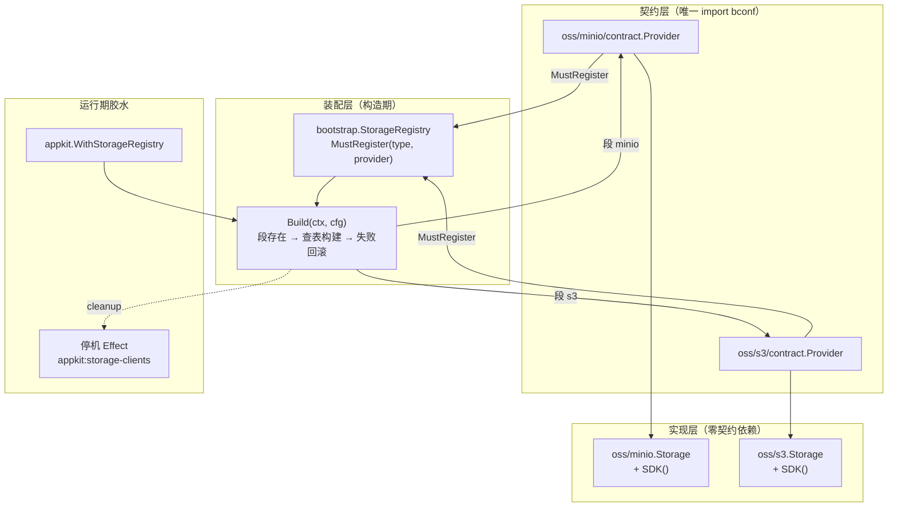

# Bald 对象存储设计：门面 + SDK 双出口，契约映射单独成包

> Author(s): bald 团队
>
> Last updated: 2026-09-18
>
> Discussion at: 源码 `oss/minio/{client,config}.go`、`oss/s3/{client,config,errors,storage}.go`、两个 `contract/` 子包；装配面 `bootstrap/storage.go`、`pkg/appkit/storage.go`；契约 `bconf/proto/bootstrap/v1/storage.proto`
>
> Status: Accepted（两后端已落地、契约装配链完整；**装配期静默降级已于 2026-09-18 修复**，见「兼容性」§1）

## 摘要

`oss` 是 bald 的对象存储接入域，两个独立 module：`oss/minio`（MinIO / S3 兼容）与 `oss/s3`（AWS S3 及兼容实现）。它们回答一件事：**对象怎么存取**。

设计上做了三个取舍：

1. **门面 + SDK 双出口**。每个后端既提供类型化的 `Storage` 门面（`PutObject`/`GetObject`），也通过 `SDK()` 暴露底层客户端——业务需要高级特性（分片上传、预签名 URL、生命周期）时不必等门面补齐。
2. **契约映射单独成包**。`contract/` 子包是唯一 import `bconf` 的地方，`oss/minio` 与 `oss/s3` 本体保持**零契约依赖**（纯 SDK 封装）。依赖图因此全程可见：业务按需 import 契约包，不引就不进依赖图。
3. **显式注册**。与框架一致：`bootstrap.StorageRegistry` 在 main 里逐个 `MustRegister`，段存在但未注册 Provider 即 fail-fast。

## 背景与动机

### 为什么不像 database 那样做成"一个接口多实现"

`database` 域有统一的 `Store` 契约，多后端实现同一接口。对象存储**没有**这样做，因为两后端的语义差异是**真实的**：

- **s3 有 bucket 概念**：`Config.Bucket` 必填，`PutObject(ctx, key, body, contentType)` 只收 key，bucket 由门面持有。
- **minio 无 bucket 概念**：`PutObject(ctx, bucket, key, body, contentType)` 每次传 bucket。

强行抽公共接口要么让 s3 多一个冗余 bucket 参数，要么让 minio 丢掉多 bucket 能力。**取舍**：不抽公共接口，两后端各自独立，`StorageRegistry` 只保证"按段名构造、返回实例"这一层契约统一。代价是业务换后端要改调用点——但换对象存储后端本就罕见，且语义差异需要业务显式处理。

## 设计

### 数据流



### 两后端对比

| 维度 | `oss/minio` | `oss/s3` |
|------|-------------|----------|
| module | `bald/oss/minio` | `bald/oss/s3` |
| SDK | `minio-go/v7` | `aws-sdk-go-v2/service/s3` |
| bucket | 每次调用传参（支持多 bucket） | `Config.Bucket` 持有（单 bucket 门面） |
| 凭据 | 静态 V4（AccessKey/SecretKey/Token） | 静态凭据或 SDK 默认链 |
| 端点 | `Endpoint` + `UseSsl` | `Endpoint` + `Region` + `ForcePathStyle` |
| 门面方法 | `PutObject(ctx, bucket, key, body, ct)`、`GetObject(ctx, bucket, key)` | `PutObject(ctx, key, body, ct)`、`GetObject(ctx, key)`、`Bucket()` |
| SDK 出口 | `SDK() *minio.Client` | `SDK() *awss3.Client` |
| 错误值 | `ErrNilClient`/`ErrEmptyBucket`/`ErrEmptyObjectKey`/`ErrNilObjectBody` | 同左（各自包内定义） |

### 门面契约

两后端的门面方法遵循同一套校验顺序（s3 侧示例，`storage.go:41-56`）：

1. `s == nil || s.client == nil` → `ErrNilClient`
2. `bucket == ""` → `ErrEmptyBucket`（s3 用 `s.bucket`）
3. `key == ""` → `ErrEmptyObjectKey`
4. `isNilReader(body)` → `ErrNilObjectBody`

`isNilReader` 用反射处理**类型化的 nil reader**（`var r *bytes.Reader = nil` 传给 `io.Reader` 时接口非 nil）——两后端各有一份（`minio/client.go:100`、`s3/client.go:83`），是同构复制。

`prepareBody` 同样是两份同构实现：`io.ReadSeeker` 走 `readerSize`（三段 Seek 求长度），否则 `io.ReadAll` 缓冲。前者避免大文件全量入内存。

### 契约映射（`contract/` 子包）

```go
// 签名与 bootstrap.StorageProvider 结构化兼容
func Provider(ctx context.Context, cfg *bootstrapv1.Storage) (any, func(), error)

// 类型守卫（编译期）
var _ func(context.Context, *bootstrapv1.Storage) (any, func(), error) = Provider
```

Provider 做**三段校验**（以 minio 为例，`contract.go:30-45`）：

1. `cfg.GetMinio() == nil` → `storage: type="minio" but minio section is missing`
2. `sec.GetEndpoint() == ""` → `storage: minio.endpoint is required`
3. **`client.SDK() == nil` → 构造失败**（2026-09-18 新增，见「兼容性」§1）

s3 侧对应校验 `Region` 必填 + 客户端构造成功。

`cleanup` 两者都返回 `nil`——minio 的 HTTP 传输由 SDK 自管、aws-sdk 客户端无显式 Close 语义。

## 理由与取舍

### 为什么 `SDK()` 是必要的出口

门面只覆盖 `PutObject`/`GetObject` 两个最常见操作。对象存储的高级特性（分片上传、预签名 URL、版本控制、生命周期规则、对象标签）**不适合**全塞进门面——那会让门面变成 SDK 的镜像，失去抽象意义。

`SDK()` 让业务在需要时直达底层。**代价**：业务可能写出与门面并行的调用路径（绕过 nil 校验），所以两后端的门面方法都做完整校验，SDK 出口则是"你自担责任"。

### 为什么 `contract` 单独成包

如果 Provider 写在后端包里，`oss/minio` 就必须 import `bconf`——而 `bconf` 是重依赖（proto 生成物）。业务只想用 minio 的 SDK 封装时，会被拖进整套契约。

单独成包后：`oss/minio` 的 `go.mod` 只有 `minio-go` + `bald/log`；只有 `contract` 子包 require `bconf`。**代价**：多一层目录、两处 `go.mod` 维护。

### 为什么两个后端不共享 `isNilReader`/`prepareBody`

它们是纯函数、无状态、约 20 行，且分属两个**独立 module**——共享需要一个公共 module（如 `oss/internal`），而那会让两个本可独立演进的模块产生耦合。**取舍**：接受两份同构复制，换取模块独立。

## 兼容性

### 1. 装配期静默降级 —— ✅ 已修（2026-09-18）

**现象**：`NewClient` 在构造失败时 `log.Error` 后 **`return nil`**（`minio/client.go:27-45`、`s3/client.go:41-46`），而 `NewStorage` 无条件把结果包进非 nil 门面（`minio/client.go:47-49`、`s3/storage.go:18-28`）。Provider 据此返回 `(client, nil, nil)`——**装配期看似成功**，配置错误被推迟到首次 `PutObject` 才以 `ErrNilClient` 暴露。

**影响**：凭据无效、endpoint 语法错误等配置问题在启动时无任何信号，故障延迟到业务首次调用。这与框架 fail-closed 的基调冲突。

**修法**：Provider 在返回前校验 `client.SDK() == nil`，失败即返回 error。不改 `NewClient`/`NewStorage` 签名（避免波及面扩大）。

**验证**：`oss/minio/contract/contract_test.go` 的 `TestProvider_ClientConstructionFailureFailsClosed` 覆盖三个可复现的失败 endpoint（`://bad`、`"a b c"`、`bad::host`，探针实测均使 `minio.New` 失败）。移除修复时该测试报 `Provider returned nil error`，恢复后 PASS——RED→GREEN 闭环。

**诚实标注**：s3 侧无法构造真实红灯——`awsconfig.LoadDefaultConfig` 在本环境对空 region/无凭据等误配依然成功（探针实测）。s3 的守卫是**防御性代码**，其测试覆盖「合法配置不被误伤」而非伪造红灯。

### 2. 两后端接口不对称 —— 设计取舍，非缺陷

见「背景与动机」的 bucket 语义差异。若业务需要跨后端统一调用，应在自己层做适配，不要期待本域提供公共接口。

### 3. 无生产调用方

`oss/minio/contract`、`oss/s3/contract` 的 Provider 在全仓**仅被各自 `contract_test.go` 引用**，`_example/` 未接线 storage 段。这是「显式注册」设计的必然结果——接线责任在下游业务。装配链本身完整（bootstrap Registry + appkit 注入 + 停机 Effect），段存在但未注册时 fail-fast。

## 实现与过渡

### 现状清单

| 项 | 状态 |
|----|------|
| 两后端实现 | ✅ 落地，门面 + `SDK()` 双出口 |
| 契约映射 | ✅ 两个 `contract/` 子包，含类型守卫 |
| 装配链 | ✅ `bootstrap.StorageRegistry` + `pkg/appkit/storage.go` + 停机 Effect |
| fail-closed | ✅ 2026-09-18 修复（§1） |
| 测试 | ✅ 两 module 的包 + contract 子包均有测试 |
| 生产接入 | ⚠️ 全仓无生产调用方（§3） |

### 修复记录

| # | 缺口 | 处置 | 提交 |
|---|------|------|------|
| 1 | 装配期静默降级 | Provider 校验 `SDK() != nil`，失败返回 error；minio 侧补 RED→GREEN 回归 | `efb75cd` |

## 附录

### 关键锚点速查

```
oss/minio/client.go:27-45     NewClient（失败 return nil）
oss/minio/client.go:47-49     NewStorage（无条件包装）
oss/minio/contract/contract.go:30-45  Provider 三段校验
oss/s3/client.go:41-46        NewClient（LoadDefaultConfig 失败 return nil）
oss/s3/storage.go:18-28       NewStorage
oss/s3/storage.go:41-56       PutObject 四段校验
bootstrap/storage.go:16       StorageProvider 签名
bootstrap/storage.go:82-120   Build（段枚举 + 失败回滚）
pkg/appkit/storage.go:34      WithStorageRegistry
pkg/appkit/storage.go:42      buildStorages（阶段 B 装配）
pkg/appkit/storage.go:63/70   AppKit.Storage / Storages（运行期取用）
```

### 与姊妹文档的关系

| 文档 | 关系 |
|------|------|
| [框架契约总览](./框架契约总览.md) §14 | 本域在契约总览中的登记 |
| [Bald 消息代理设计](./Bald%20消息代理设计.md) | 同为「独立 module + contract 子包 + 显式注册」模式 |
| [Bald 存储设计](./Bald%20存储设计.md) | database 域——与 oss 的分层对比（前者抽公共接口，后者不抽） |
