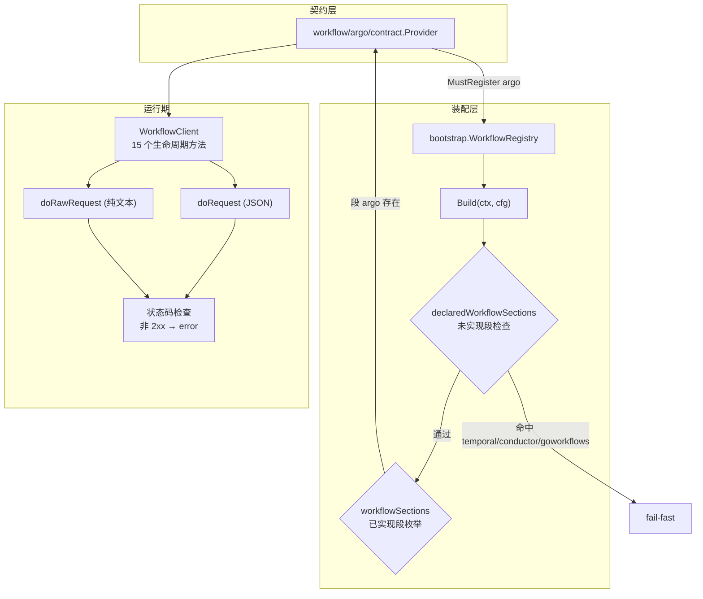

# Bald 工作流设计：REST 客户端 + 契约段装配，未实现段 fail-fast

> Author(s): bald 团队
>
> Last updated: 2026-09-18
>
> Discussion at: 源码 `workflow/argo/{client,options,logger}.go`、`workflow/argo/contract/`；装配面 `bootstrap/workflow.go`、`pkg/appkit/workflow.go`；契约 `bconf/proto/bootstrap/v1/workflow.proto`
>
> Status: Accepted（argo 已落地、契约装配链完整；**契约段静默丢弃与 logs 不查状态码已于 2026-09-18 修复**，见「兼容性」§1/§2）

## 摘要

`workflow` 是 bald 的工作流引擎接入域，当前只有一个后端：`workflow/argo`——Argo Workflows 的 **REST 客户端**（不是 SDK 封装）。

它回答一件事：**工作流怎么提交、查询、控制**。15 个公开方法覆盖全生命周期：`SubmitWorkflow`、`GetWorkflow`、`ListWorkflows`、`DeleteWorkflow`、`SuspendWorkflow`、`ResumeWorkflow`、`TerminateWorkflow`、`ResubmitWorkflow`、`RetryWorkflow`、`StopWorkflow`、`GetWorkflowLogs`。

三个设计取舍：

1. **REST 而非 SDK**。Argo 官方 Go SDK 依赖庞大（拉入 k8s client-go 整套）；本项目只需要 HTTP 调用，自己写 REST 客户端。代价是要手维护类型定义（`options.go` 里的 `Workflow`/`WorkflowSpec`/`Template` 等）。
2. **契约声明 4 段、实现 1 段，但未实现段 fail-fast**。proto 预留了 `temporal`/`conductor`/`goworkflows`，当前只实现 `argo`。配置写了未实现的段**必须报错**，不能静默跳过。
3. **`doRequest`/`doRawRequest` 双通道**。JSON 响应走前者（自动 unmarshal），纯文本响应（日志）走后者——但**两者共享同一套状态码检查**。

## 背景与动机

### 为什么不用 Argo 官方 SDK

Argo Workflows 的官方 Go 客户端（`argoproj/pkg`）依赖 k8s 生态（client-go、apimachinery）。bald 的 `workflow` 段只需要"通过 REST API 提交/查询工作流"，引入整套 k8s 客户端不成比例。

**取舍**：手写 REST 客户端 + 手维护类型。代价是 Argo API 升级时要手动跟进字段；收益是 `workflow/argo/go.mod` 保持精简（无 k8s 依赖）。

## 设计

### 数据流



### 客户端构造与超时

```go
const defaultHTTPTimeout = 30 * time.Second  // client.go:19
const defaultServerURL   = "https://localhost:2746"  // options.go:87
```

`NewClient(ClientOptions{ServerURL, Namespace, Token, ...})`。`ServerURL` 为空时回退 `defaultServerURL`；`http.Client` 带 30s 超时——**这是 CR4 的修复**：无超时的 `http.Client` 会随调用方 ctx 永久挂起（漏传 ctx 的调用点即挂死）。

### 双请求通道（2026-09-18 收敛）

| 通道 | 用途 | 行为 |
|------|------|------|
| `doRequest(req, result)` | JSON 响应 | 状态码检查 → `json.Unmarshal` 到 result |
| `doRawRequest(req) ([]byte, error)` | 纯文本响应 | 状态码检查 → 返回原始字节 |

两者**共用同一套状态码检查**（`resp.StatusCode < 200 \|\| >= 300` → `HTTP %d: %s` 错误）。`doRequest` 内部**复用** `doRawRequest`——这是 §2 修复后的结构，消除了"两条路径检查不一致"的隐患。

### 契约段装配

```go
// 已实现段（client.go 对应）
var workflowSections = []workflowSection{
    {"argo", func(w *bootstrapv1.Workflow) bool { return w.GetArgo() != nil }},
}

// 已声明但未实现（2026-09-18 新增）
var declaredWorkflowSections = []struct{...}{
    {"temporal", ...}, {"conductor", ...}, {"goworkflows", ...},
}
```

`Build` 的顺序：**先查未实现段 → 再枚举已实现段**。命中未实现段立即返回错误，点名段名并给出处置建议。

## 理由与取舍

### 为什么契约声明 4 段却只实现 1 段

proto 的 4 段是**契约设计**（表达"工作流引擎可多后端"的意图），实现按需跟进。这是"契约超前、实现滞后"的正常演进——**但必须让用户感知到差距**。

初版 `Build` 只枚举 `workflowSections`，配置里写 `temporal` 时循环直接跳过、**无任何 error**——用户以为装配了，实际没接线。这是 fail-open。

**修法选择**（2026-09-18）：不引入通用的"未枚举段检测"（会波及 6 个 Registry，且"proto 预声明"本身是正常情况），而是在 `workflow.go` 内**显式列出**未实现段。新增后端时把段名从 `declaredWorkflowSections` 移到 `workflowSections` 即可。

### 为什么 `namespace` 参数在每个方法里

`GetWorkflow(ctx, name, optsNamespace)` 等方法的 `optsNamespace` 为空时回退 `wc.options.Namespace`（`client.go:136`）。这是"每调用可覆盖默认命名空间"的设计——比在每个方法签名里塞 `namespace string` 更灵活。

## 兼容性

### 1. 契约段静默丢弃 —— ✅ 已修（2026-09-18）

**现象**：proto 声明 `temporal`/`argo`/`conductor`/`goworkflows` 四段，`workflowSections` 只枚举 `argo`。配置写其余三段时 `Build` 静默跳过。

**影响**：用户以为已装配、实际未接线，故障在首次调用时才暴露（甚至永不暴露——若业务从不调 workflow）。

**修法**：新增 `declaredWorkflowSections`，`Build` 先检查未实现段，命中即 fail-fast。

**验证**：`bootstrap/workflow_test.go` 的 `TestWorkflowRegistry_UnimplementedSectionFailsFast` 覆盖三段——修复前均静默成功，修复后均报错且点名段名。附 argo 正向对照。

### 2. `GetWorkflowLogs` 不查 HTTP 状态码 —— ✅ 已修（2026-09-18）

**现象**：该方法绕过 `doRequest` 直接 `wc.client.Do(req)` + `io.ReadAll(resp.Body)` 返回 `string(data), nil`——401/404/500 的**错误响应体被当正常日志正文返回**，且 `err == nil`。

**影响**：调用方拿到的是错误 JSON 而非日志，且以为成功。CR4 曾记录此问题，但同条目里的"默认 Timeout"已修、这条一直存活。

**修法**：抽出 `doRawRequest`（统一状态码检查、返回原始字节），`doRequest` 改为复用它，`GetWorkflowLogs` 改走 `doRawRequest`。

**验证**：`workflow/argo/client_test.go` 的 `TestGetWorkflowLogs_RejectsNon2xx` 覆盖 401/404/500——修复前三种状态码下 `logs` 均为错误体内容且 `err=nil`，修复后均返回含状态码的 error 且 `logs` 为空。附 2xx 正向对照 `TestGetWorkflowLogs_Success`。

### 3. 假连接日志与 `running` 死字段 —— 未修

- `NewClient` 未发起任何连接即打印 `connected to Argo Server at %s`（`client.go:50`）——**假连接日志**。CR4 记录，当前仍存活。
- `WorkflowClient.running` 字段仅被赋值（`NewClient`=true、`Close`=false），全仓无读取点（`client.go:27/56/64`）。
- `workflow/argo/logger.go` 定义 10 个 `Log*` 函数，仅 `LogInfo`/`LogInfof` 被调用。

**判定**：假连接日志是**误导性日志**（建议改为"configured for"或加轻量探测）；`running`/未用 logger 是死代码。三者均为低危，本轮未动。

### 4. `argo.Provider` 不校验 `ServerURL` 非空 —— 未修

Provider 直接透传 `sec.GetServerUrl()`，空值由 `NewClient` 回退 `defaultServerURL`（`https://localhost:2746`）——**配置缺省时静默连本地**而非 fail-closed。

**判定**：与 §1 同类（静默降级），但**当前仅一个后端且默认值有实际意义**（本地开发）。建议改为显式报错或至少在日志中提示回退。本轮未动。

### 5. 无生产调用方

`workflow/argo/contract` 的 Provider 在全仓仅被 `contract_test.go` 引用，`_example/` 未接线 workflow 段。装配链完整，接线责任在下游。

## 实现与过渡

### 现状清单

| 项 | 状态 |
|----|------|
| argo REST 客户端 | ✅ 15 个生命周期方法 |
| 契约映射 | ✅ `contract/` 子包 + 类型守卫 |
| 装配链 | ✅ `bootstrap.WorkflowRegistry` + `pkg/appkit/workflow.go` + 停机 Effect |
| 未实现段 fail-fast | ✅ 2026-09-18（§1） |
| logs 状态码检查 | ✅ 2026-09-18（§2） |
| 假连接日志 / 死字段 | ⚠️ 未修（§3） |
| ServerURL 空值校验 | ⚠️ 未修（§4） |
| 生产接入 | ⚠️ 无生产调用方（§5） |

### 修复记录

| # | 缺口 | 处置 | 提交 |
|---|------|------|------|
| 1 | 契约段静默丢弃 | 新增 `declaredWorkflowSections` + Build 前置检查；补 RED→GREEN 回归 | `efb75cd` |
| 2 | logs 不查状态码 | 抽出 `doRawRequest`，`doRequest` 复用，`GetWorkflowLogs` 改走它；补 3 状态码 + 1 正向测试 | `efb75cd` |

## 附录

### 关键锚点速查

```
workflow/argo/client.go:19          defaultHTTPTimeout = 30s
workflow/argo/client.go:99-135      doRequest / doRawRequest（共用状态码检查）
workflow/argo/client.go:149-382     15 个生命周期方法
workflow/argo/client.go:383-396     GetWorkflowLogs（2026-09-18 改走 doRawRequest）
workflow/argo/options.go:87         defaultServerURL
workflow/argo/contract/contract.go  Provider
bootstrap/workflow.go:69-71         workflowSections（已实现：argo）
bootstrap/workflow.go:73-90         declaredWorkflowSections（未实现三段）
bootstrap/workflow.go:96-140        Build（先查未实现段，再枚举）
pkg/appkit/workflow.go:33           WithWorkflowRegistry
pkg/appkit/workflow.go:41           buildWorkflows（阶段 B 装配）
pkg/appkit/workflow.go:62/68        AppKit.Workflow / Workflows（运行期取用）
```

### 与姊妹文档的关系

| 文档 | 关系 |
|------|------|
| [框架契约总览](./框架契约总览.md) §15 | 本域在契约总览中的登记 |
| [Bald 对象存储设计](./Bald%20对象存储设计.md) | 同为「独立 module + contract 子包 + 显式注册 + 段枚举」模式 |
| [Bald 消息代理设计](./Bald%20消息代理设计.md) | 同为「契约段 → Provider 查表装配」，但 broker 是 13 段声明/4 段实现（同类问题的更大规模） |
| 不合理设计评审 | CR4 记录 argo 三缺陷的原始出处 |
