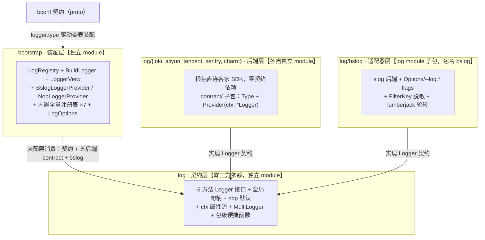

# Bald 日志设计：一个瘦契约、nop 默认、装配期注入后端的日志体系

Author(s): bald 团队
Last updated: 2026-09-13
Discussion at: `设计评审-第三轮-2026-09-12.md`
Status: Accepted（已实现，随 bald v0.3.x 发布）

## 摘要

`bald/log` 为整个框架提供**唯一的日志抽象**：6 方法的 `Logger` 接口、并发安全的全局句柄、零成本的 nop 默认。契约层零第三方依赖；标准库 `log/slog` 适配器（`log/bslog` 子包，包名 `bslog`）开箱即用；五个远端/终端后端（loki / aliyun / tencent / sentry / charm）各自独立成 module，经 `contract` 子包接入契约装配；`logger.backends` 声明即多后端广播（本地 + 远程双写，2026-09-13）。本文回答三个问题：为什么契约这么瘦、为什么后端独立成 module、为什么装配保持显式注册（反 init 纪律）而业务侧又能零注册代码（内置全量注册表，2026-09-13）。最重要的承诺：**框架核心永远不 import 任何具体日志库，新后端接入对框架零改动。**

> 本文是按当前代码（v0.3.x）整理的设计文档，已并入并取代《Bald 日志平面接口设计.md》（演进决策日志，2026-09-13 删除以收敛文档入口，git 历史可溯）——历史时间线与更名前的 API 名以 git 记录为准，独有决策记录见文末附录。

---

## 背景与动机

bald 融合的三个上游项目对日志的处理各不相同，其中一家的做法我们明确不想要。

**onexstack/pkg/log 是反面教材**：zap 胖封装成 14+ 方法接口，内嵌 kratos 与 gorm 日志接口，配置非法时 `NewLogger` 直接 panic。接口胖到只能由自己的实现满足，换后端等于换框架。onexstack 还同时存在三套日志抽象（`pkg/log`、`pkg/logger`、`pkg/otelslog`），业务不知道该用哪个。

**go-lulu/log 与 kratos/log 是正面的**：前者证明了"极简接口 + 全局注册 + 零后端默认"足以撑起一个框架；后者证明了薄封装标准库 `log/slog` 干净可行，其 `ContextWithAttrs` 上下文属性流值得保留。

bald 的需求一句话定性：**日志后端的选择是横切关注点，归进程入口（bootstrap）管，不归框架核心管。** 框架核心要打日志，但不能绑死任何日志库。

---

## 设计

### 三层架构与 module 布局



依赖方向单一向上：后端 → 契约；装配 → 契约 + 后端 + bconf；框架核心 → 仅契约。远端后端独立 module 是有意的——阿里云 SLS SDK 一个 import 就拖进 prometheus 全家桶（见 `log/aliyun/go.mod` 的 indirect 列表），module 边界让这份代价只由真正使用该后端的项目承担；bootstrap 的内置全量注册是该边界外的**聚合点**付费（同 bconfig 捆绑配置源），不改变纯契约层/适配器层的零依赖承诺。

### 契约层：`Logger` 接口（log/log.go）

```go
type Level int // LevelDebug=0 .. LevelError=3，值越大越严重

type Logger interface {
	Debug(ctx context.Context, msg string, args ...any)
	Info(ctx context.Context, msg string, args ...any)
	Warn(ctx context.Context, msg string, args ...any)
	Error(ctx context.Context, msg string, args ...any)

	// Enabled 报告后端是否会输出给定级别，用于守卫昂贵参数构造。
	Enabled(level Level) bool

	// With 返回携带给定 key-value 的新 Logger，不可变语义。
	With(args ...any) Logger
}
```

```go
log.Info(ctx, "server started", "addr", ":8080")          // key-value 结构化输出

if log.Enabled(log.LevelDebug) {                          // 昂贵参数守卫
	log.Debug(ctx, "dump", "payload", expensiveRender())
}

moduleLog := log.With("module", "registry")               // 可长期持有的子 Logger
```

边界：无 Fatal/Panic（4 级对齐 slog，业务用 `Error` + `os.Exit`）、无 `f`/`w` 变体、不内嵌任何外部接口。

### 全局句柄与包级函数

- `SetLogger(l)`：注入后端，nil 回退 nop，RWMutex 保护并发安全；`GetLogger()`：取当前后端。
- 包级函数 `Debug/Info/Warn/Error/Enabled/With`（global_helpers.go）转发到当前全局后端。**框架内一律用包级函数，`log.GetLogger().Xxx` 链式写法已全量替换并禁止**（2026-09-13 惯例，192 处，bald `e1819d5` + bald-admin `de64f00`）。
- 语义差异注意：`log.With(...)` 每次基于**当前**全局后端派生，热更新后自然切到新后端；先 `GetLogger()` 捕获的旧实例不会切换。

### nop 默认与 ctx 属性流

- 未注入时全局句柄为 `nopLogger{}`：全部空实现、`Enabled` 恒 false。`import log` 零副作用，bald-crud 这类库可放心引用契约而不强迫宿主初始化日志。`NewNop()` 导出该实现，供装配层按契约 `type: nop` 显式选择静默。
- `ContextWithAttrs(ctx, attrs...)` / `ContextAttrs(ctx)`（context.go）：中间件在请求入口挂 `trace_id` 等字段，请求范围内日志自动携带。契约层只挂载/读取（私有 key，重复挂载合并），**不解释属性**——slog 适配器在落盘前合并进参数列表。observability 中间件经此路让每条请求日志带 `trace_id`；SpanContext 无效时 `middleware.LogTraceIDs` 生成随机兜底 ID，零配置也有可关联的日志链路。

### MultiLogger：多源广播（log/multi.go）

`NewMultiLogger(loggers ...Logger) Logger`——每条日志广播到全部子 Logger（本地 + 远程并存）。四级方法顺序广播、单个失败不影响其余；`Enabled` 任一子启用即启用（保守放行，多投的代价是带宽、漏投的代价是排障缺失证据）；`With` 对每个子 Logger 派生后重新组合；nil 构造期过滤，零参数等价 nop。它是纯 `Logger` 装饰器，故放契约层顶层。

契约装配已接入（2026-09-13）：`logger.backends` 声明多项后端（每项自带 `type` 与参数段，形状与单选模式平行），**非空时优先于单 `type`**——与 `output_paths` 优先于 `output_path` 同一优先级模式。装配层逐项构造后经 MultiLogger 广播合并，任一项失败 fail-fast 并回滚已构造项；`Enabled` 语义即 MultiLogger 的保守放行（任一后端启用该级别即写）。热更新/停机链路同样生效：重建时逐项重造并合并 cleanup，停机顺序释放全部后端。

### 默认后端：slog 适配器（log/bslog，包名 bslog）

包名 `bslog` 取 bald+slog 之意，目录=包名（2026-09-13 由 `slog`/`slogadapter` 改名——旧名目录≠包名导致全部消费点被 goimports 强制加别名），既避标准库冲突又免别名。pflag / lumberjack / errgroup 收敛在此子包，契约使用者二进制不受影响。

```go
type Options struct {
	Level       string         // debug|info|warn|error，默认 info
	Format      string         // console|json，默认 console
	OutputPaths []string       // "stdout"/"stderr"/文件路径，默认 ["stdout"]
	Rotate      *RotateOptions // lumberjack：MaxSize=100MB, MaxBackups=7, MaxAge=30d, Compress=true
}
// NewOptions / AddFlags(--log.level 等全套) / Validate
// New(o *Options, opts ...Option) log.Logger
```

三条行为边界，均为实测踩坑后确定：

1. **配置非法回退 info，不 panic**（与 onexstack 相反）——级别写错不值得崩进程；
2. **文件路径先自动创建缺失父目录，打开仍失败才回退 stdout**——直写与轮转两路径行为对称（轮转的 lumberjack 首写本就 MkdirAll；2026-09-13 `log/v0.3.1` 修复直写路径不对称：此前嵌套目录缺失时静默回退 stdout，配置错误被掩盖——文件无产出、json 行混进控制台）；可观测性不因一个路径问题全丢；
3. **多目标 errgroup 并发写**，但为**复制分流**（每个目标收全量日志），不支持按级别分流到不同文件。

扩展点收在 `Option`：`WithFilter(FilterKey("password"))` 脱敏、`WithAttrs` 固定属性、`WithHandler`/`WithOTelHandler` 换底层 handler。脱敏的实现细节：slog 把 `WithAttrs` 固化的属性交给内层 handler 在 `Handle` 阶段直接合并，会绕过外层装饰器——`filterHandler.WithAttrs` 必须**先过滤再下沉**，否则 `logger.With("password", ...)` 的脱敏静默失效。

OTel 桥接刻意零依赖：核心不 import otel，`WithOTelHandler` 只是 `WithHandler` 的语义别名，调用方自带 `otelslog.NewHandler` 注入，otel 依赖树谁用谁背。

### 远端/终端后端 ×5 与 contract 子包模式

`log/{loki,aliyun,tencent,sentry,charm}` 各自独立 module，统一两包模式——根包直连 SDK 零契约依赖；`contract/` 子包是唯一 import bconf 处，导出 `Type` 常量 + `Provider(ctx, *bootstrapv1.Logger) (log.Logger, func(), error)`。

| 后端 | 定位 | 关键语义 |
| --- | --- | --- |
| `loki` | Grafana Loki 直推 | HTTP Push API；内存缓冲 batchSize=100 触发冲刷；`Close` 冲刷剩余缓冲；`With` 派生实例共享缓冲（任一 `Close` 全量冲刷）；必填 endpoint |
| `aliyun` | 阿里云 SLS | 官方 producer 异步聚合；`Close(5000ms)` 关停 |
| `tencent` | 腾讯云 CLS | 官方 AsyncProducerClient；`Close(5000ms)` |
| `sentry` | 错误追踪 | `Error` 上报事件（带堆栈），其余级别记 breadcrumb；必填 DSN |
| `charm` | 本地开发终端 | Charmbracelet 彩色输出，默认 stderr + Info + 时间戳 |

诚实记录一个限制：**loki 无后台定时冲刷**，缓冲未满且不 `Close` 时日志停留在内存——停机 Effect 链对带缓冲的后端是必须兑现的。（历史上还有第二个限制：`With` 派生实例曾各自持有独立缓冲，派生日志不进原实例缓冲、原实例 `Close` 无法冲刷——2026-09-13 由 ctx 属性流测试暴露并同日修复：缓冲与发送配置抽为 `shared` 结构体，派生实例经指针共享，任一实例 `Close` 全量冲刷，含 httptest 端到端回归测试。）

ctx 属性流的跨后端落地（2026-09-13）：**全部六后端已在构造日志条目时同步合并 ctx 属性**。契约层新增 `ContextAttrsToArgs(ctx)` 导出 helper（把属性流拍平为 kv 序列，无属性返回 nil）；bslog 原有 `ContextAttrs` 合并保留，其余五后端（aliyun/tencent/loki/sentry/charm）经 helper 在**入队/构建事件时**提取——此时刻同步执行，不受异步 flush 的 ctx 失效影响。合并顺序统一为 `With 属性 → ctx 属性 → 调用参数`，同名 key 时调用参数覆盖 ctx 属性（与 bslog/slog 语义一致）。设计边界保持：**取值用 ctx、IO 不绑 ctx**——日志发送不随请求 ctx 取消而丢弃，loki flush 自建 `Background+timeout`，producer 型后端由 SDK 管理重试。

### 装配层：注册表 + 三级工厂 + 两阶段

`bootstrap.LogRegistry` 按名注册后端工厂，**显式 `MustRegister`，无 `init()` 自注册**（blank import 是 no-op，bald 全框架反 init 纪律）：

```go
lr := bootstrap.NewLogRegistry()
lr.MustRegister(lokicontract.Type, lokicontract.Provider) // 用哪个注册哪个

logger, cleanup, err := lr.BuildLogger(ctx, cfg.GetLogger()) // 按契约 logger.type 查表
log.SetLogger(logger)
defer cleanup()
```

`BuildLogger` 全 fail-fast：cfg 为 nil、type 为空、type 未注册（错误列出全部已注册名）、provider 返回 nil Logger 均报错——日志是必需品，与配置源"nil=跳过"语义刻意不同。cleanup 恒非 nil，可直接 `defer`。

更常用的是 AppKit（`appkit.FromBootstrap`）三级工厂分发：

```text
WithLoggerFactory（显式工厂） > WithLogRegistry（契约查表） > 内置全量注册表
```

**内置全量注册表（2026-09-13）**：默认路径不再固定为 bslog 工厂，改走 `bootstrap.NewBuiltinLogRegistry()`——slog / nop / loki / aliyun / tencent / sentry / charm 七后端全量预注册，**业务侧纯配置声明 `logger.type` 即生效、零注册代码**。内置名单为编译期固定的包级名单（Go 切片无法 `const`，`var` 固定内容等效编译期确定；`RegisterBuiltinLogProviders` 亦可对自定义注册表组合调用，重名 fail-fast）；`NewLogRegistry()` 保持空表语义不变。依赖账本裁定：bootstrap 经 bconfig 已捆绑全部配置源 SDK（consul/vault/nacos/etcd/apollo/k8s），日志后端「多选一、全捆绑」与之同模式。逃生口保留：介意二进制体积或需自定义后端时，显式 `WithLogRegistry` 精选注册，行为与此前完全一致。

内置路径四分派：阶段 A（契约装载前）回退默认 bslog；`backends` 非空走多后端广播（逐项构造 + MultiLogger 合并，slog 项同样走 deco 特例——与单选对称）；`type=slog` 走 `LogOptions` + 业务装饰器（`WithLogDecorators` 是 `bslog.Option`，仅 bslog 后端可消费）；其余 type 查内置表构造。此改造同时修复一个缺陷：此前默认路径**静默忽略 `logger.type`**（配 `type: loki` 不报错却产出 bslog），现在未实现的 type fail-fast 并列出可用项——诚实报错优于静默降级。

两阶段语义解决"契约装载过程的日志往哪打"：**阶段 A（契约装载前）回退默认 slog 保证启动日志可见；阶段 B 装载校验后按 `logger.type` 重建。** 契约热更新时 `rebuildLogger` 重建后端并原子替换 cleanup 钩子，失败只记错误不中断（换后端失败不应杀死正在服务的进程）。换后端时旧钩子被同步兑现（先切全局句柄再冲刷旧后端）——带缓冲后端（loki 尾批）不因热切换丢日志；停机 Effect 链同样释放最新钩子。

### 业务接入示例：零代码装配

业务 `main.go` 不写任何日志代码——FromBootstrap 默认路径已内置全量注册表，`logger.type` 是唯一开关：

```go
// main.go 全部日志相关代码：没有。
app := appkit.FromBootstrap(cfg) // Bind/装载/校验/两阶段日志/热更新全内化
```

本地多输出 + 轮转（`configs/app.yaml`，flag > env > 本地文件 > 远程四源同构）：

```yaml
logger:
  type: slog
  slog:
    level: info
    format: json
    output_paths: ["stdout", "/var/log/myapp/app.log"] # 控制台 + 文件双写（复制分流）
    rotate:            # 仅对文件目标生效（lumberjack）
      enabled: true
      max_size: 100    # MB；只写关心的字段，缺省回退默认（100/7/30/gzip）
      max_backups: 7
      max_age: 30      # 天
      compress: true
```

切远端 Loki 只换 `type`（同仓可运行示例见 `_example/bald`）：

```yaml
logger:
  type: loki
  loki:
    endpoint: http://loki:3100/loki/api/v1/push
    labels: { app: myapp }
```

本地 + 远程双写用 `backends`（非空时优先于单 `type`，逐项独立 level/format）：

```yaml
logger:
  backends:
    - type: slog          # 本地：stdout 全量排障
      slog: { level: debug, format: console, output_path: stdout }
    - type: loki          # 远程：生产级采集（level 独立过滤）
      loki: { endpoint: http://loki:3100/loki/api/v1/push, labels: { app: myapp } }
```

热更新：`WithWatchConfig(true)` 下改 yaml 即重建后端（副本试装载 + 校验 + 原子替换），改坏只记错不杀进程。唯一仍需代码的场景是业务装饰器（脱敏/固定属性，`WithLogDecorators`）与自定义后端（`WithLogRegistry` 精选注册）。

契约形状差异已收口（2026-09-13）：`Slog` 段补齐 `output_paths`（多输出，优先于单值 `output_path`）与 `rotate` 段（enabled / max_size / max_backups / max_age / compress，零值字段回退 bslog 默认 100MB/7 份/30 天/gzip），`LogOptions` 全量映射——契约装配与 CLI/Options 直构路径能力对齐，多目标复制分流 + lumberjack 轮转纯配置声明即生效。单值 `output_path` 保留（与 Zap/Zerolog 家族同形），既有配置零迁移。

---

## 理由与取舍

**为什么 6 方法瘦接口？** 接口越胖，用户自带后端的适配成本越高。onexstack 的 14+ 方法接口实际只有它自己的 zap 封装能实现，"可插拔"名存实亡。6 方法是打日志的最小完备集：四级是事实标准，`Enabled` 守卫昂贵参数，`With` 支持模块化标签——少了哪个都有场景卡住，多了哪个都开始绑定实现。

**为什么默认 slog 而非 zap？** 标准库零依赖、与 kratos 同源、`slog.Record` 可直接转 OTel（桥接天然）。zap 的性能优势对默认后端非刚需；真有极端吞吐需求的项目本来就会换后端，这正是接口存在的意义。**我们不选 zap，但保留你用 zap 的权利。**

**为什么 nop 默认而非 panic？** 库不该强迫宿主先初始化日志，更不该因此崩溃。忘记注入的最坏结果是没日志，不是进程死掉。这与"配置非法回退 info"是同一条原则：**日志系统的问题用日志系统的方式兜底，不用崩溃解决。**

**为什么远端后端独立 module 而 slog 是子包？** slog 的依赖轻且人人要用；云端 SDK 重且仅特定部署形态用。Go module 是依赖隔离的唯一硬边界（同 module 子包的依赖仍进 go.mod），用 module 边界把依赖代价精确到"用的人付"。2026-09-13 内置注册落地后此边界依然成立：只 import 契约层或 slog 的库零新增依赖；全量捆绑的代价由 bootstrap 这个聚合点支付——与 bconfig 捆绑全部配置源 SDK 同一裁定，介意者经 `WithLogRegistry` 精选。

**为什么 contract 子包模式？** 后端根包保持纯 Logger 实现，不 import bconf 就能被直构/测试场景单独使用；把 proto 契约耦合压缩到几十行的 `contract` 包，后端实现与契约演进互不拖累。与全框架 registry 家族纪律一致。

**为什么显式注册而非 init() 自注册？** init 自注册让依赖关系不可见、重名冲突运行期随机爆发；显式注册把"支持哪些后端"变成可 grep 的代码——内置注册后这张名单收敛到 `bootstrap/log_builtin.go` 一处编译期常量表（仍无任何 init 副作用），自定义后端仍在 main 里显式注册。go-wind 大量 init 自注册，bald 迁移时一律改造。

**被放弃的方案：**

| 方案 | 放弃原因 |
| --- | --- |
| onexstack 式胖接口 | 绑死实现，无法适配自有后端；三套抽象并存正是它的病 |
| 配置非法 panic | 启动期崩溃换不来正确性 |
| 搬运 gookit/slog 自研日志栈 | 与"slog 适配层"定位冲突，拖入 color/goutil/rotatefile 全家桶；轮转/脱敏/多输出用 lumberjack + Filter + multiWriter 等价实现 |
| OTel 依赖进核心 | 依赖树庞大，语义别名已足够表达意图 |
| zap 默认后端 | 性能非默认后端刚需 |

---

## 兼容性

纯增量、无破坏：契约层 API 自落地以来签名未变；包级函数是纯新增。唯一内部约定变更是"包级函数取代 `GetLogger().Xxx` 链式"——风格约定而非 API 破坏，已全量替换并纳入评审检查项。

跨 module 使用者注意（非破坏但易踩）：`bald/log` 是独立 module，外部引用须 require + replace 它本身；远端后端 contract 包同时依赖 `bconf` 与 `log` 两个 module，replace 要配齐；gopls 对嵌套 module 常报 BrokenImport 假阳性，以命令行 build/test 为准。

---

## 实现与过渡

全部已落地，无过渡安排：

- [x] 契约层：接口 / 全局句柄 / nop / ctx 属性流 / MultiLogger / 包级函数（含并发与广播语义单测）。
- [x] slog 适配器：Options + flags + Validate、console/json、lumberjack 按大小轮转、FilterKey 脱敏（含 WithAttrs 预过滤修复）、多目标并发写、OTel 别名。
- [x] 远端/终端后端 ×5（2026-09-06 移植 go-wind-plugins/log）：独立 module + contract 子包，契约各后端段全部有消费者。
- [x] ctx 属性流六后端全量落地（2026-09-13）：契约 `ContextAttrsToArgs` helper + aliyun/tencent/loki/sentry/charm 入队时同步合并，含 key 覆盖顺序与 nil ctx 单测。
- [x] loki With 派生实例缓冲共享修复（2026-09-13）：`shared` 状态结构体重构，派生实例写入同一缓冲、任一实例 `Close` 全量冲刷（httptest 端到端回归测试）。
- [x] 装配层：LogRegistry（显式注册、fail-fast、cleanup 恒非 nil）+ BslogLoggerProvider + NopLoggerProvider + LogOptions + 内置全量注册表（`NewBuiltinLogRegistry` / `RegisterBuiltinLogProviders`，七后端预注册，2026-09-13）。
- [x] 契约 nop 类型（2026-09-13）：proto Type 枚举 `NOP = 15` + 契约层 `NewNop()` 导出构造——配置 `type: nop` 显式选择静默后端（测试、只需业务指标的场景）。
- [x] AppKit 集成：三级工厂（默认路径升级为内置全量注册表，修复 `logger.type` 静默忽略缺陷）、两阶段装载、热更新 `rebuildLogger` 原子换后端。
- [x] Slog 契约补齐多输出 + 轮转（2026-09-13）：proto `output_paths` + `Rotate` 段，`LogOptions` 全量映射（output_paths 优先 / 零值回退默认），bconf 校验（空串项 / 负值 fail-fast）——契约装配与 CLI/Options 直构路径能力对齐。
- [x] 多后端广播契约接入（2026-09-13）：proto `Logger.backends`（repeated Backend，项形状与单选平行，非空优先于单 type）+ `bootstrap.LoggerView` 视图归一化 + `BuildLogger` 多后端分支（逐项构造、MultiLogger 合并、失败回滚）+ appkit 内置路径四分派（slog 项 deco 对称）——MultiLogger 从纯装饰器升级为契约可达能力，本地 + 远程双写纯配置声明。
- [x] trace 关联闭环：observability 中间件经 `ContextWithAttrs` 挂 `trace_id`，零 TracerProvider 时随机 ID 兜底。
- [x] 框架内包级函数惯例全量替换（192 处）。

验证：`log` module 及各后端、`bootstrap` 均随 bald CI（build + vet + test -short）全绿；backends 多后端广播另经 `_example/bald` e2e 冒烟（双后端独立 level/format、坏值 fail-fast 带 `backends[i]` 定位、文件路径父目录自动创建）。

---

## 附录：演进决策记录（并入自《日志平面接口设计.md》，该文档已删除）

### AppKit 为什么不持有日志（2026-08-24 拍板）

日志是横切关注点，后端选择属于进程入口（bootstrap）职责，AppKit 只消费全局句柄、不做全局副作用。若由 AppKit 注入并临时改动全局句柄：① 编排层带全局副作用；② 与 AppKit 字段边界分叉；③ 多个 AppKit 实例互相干扰。（FromBootstrap 装配路径是"进程入口委托"形态——main 把装配权交给 FromBootstrap，副作用归属入口而非编排层，边界仍成立。）

### gookit/slog 能力评估（2026-09-01，为什么不搬运自研日志栈）

它与 bald「标准库 `log/slog` 适配层」的定位是替代 vs 适配关系，且拖入 `gookit/color`/`goutil`/`rotatefile` 全家桶。取其**能力意图**，用已有依赖等价实现：

| gookit/slog 能力 | 落地状态 | 方式 |
|---|---|---|
| 文件轮转（按大小 + 清理 + gzip） | 已落地 | **lumberjack** + `Options.Rotate` |
| 文件轮转（按**时间**切割） | 未迁移 | lumberjack 不支持；确需时引 `gookit/rotatefile` 或系统 logrotate |
| 彩色 / 模板化控制台 | 可选（阶段 2） | 引入 `tint`（仅标准库依赖）；charm 后端已覆盖彩色终端场景 |
| Processor（字段注入） | 已有等价 | `ContextWithAttrs` / `WithAttrs` |
| Filter / 脱敏 | 已有等价 | `FilterKey` |
| 多 Handler 同时输出 | 已有等价 | `multiWriter`（复制分流） |
| Fatal/Panic 8 级 | 不迁移 | slog 4 级；业务用 `Error` + `os.Exit` |
| 整套自研 Handler/Formatter/Record | 不引入 | 违背「标准库 slog 适配层」定位 |

能力边界（诚实记录）：lumberjack 仅按 `MaxSize` 触发切割，`MaxAge`/`MaxBackups` 只控制历史备份保留，**不是**按天/小时切割；多目标输出是**复制分流**，不是按级别分流——确需按级别落不同文件时，用 `logger.backends` 声明多个不同 level 的后端。

### 桥接适配器预留（未实现，按需新建子包，不污染核心契约）

| 预留位置 | 作用 |
|---|---|
| `log/zap/zap.go` | `NewZapAdapter(*zap.Logger) log.Logger`（对齐后端独立 module 模式） |
| `log/kratos/kratos.go` | `ToKratos(log.Logger) kratoslog.Logger`（把 bald logger 喂给 kratos 组件） |
| `log/gorm/gorm.go` | `NewGormAdapter(log.Logger) gormlogger.Interface`（gorm 日志接入） |

### 历史锚点

关键拍板时间线（详见 git 记录）：2026-08-24 日志归 bootstrap、AppKit 零副作用；08-29 OTel 桥接 + observability 中间件闭环；09-01 lumberjack 轮转落地 + gookit 评估；09-05 契约+子包布局（后演进为独立 module）；09-06 五远端/终端后端移植；09-13 bslog 更名、内置全量注册表、ctx 属性流六后端、多输出/轮转契约、backends 广播、父目录自动创建。

关联文档：`Bald 配置系统设计.md`（四源配置）、`应用框架设计.md`（AppKit 生命周期）、`AppKit FromBootstrap 约定装配.md`（装配全景）、`指标抽象设计.md`（可观测性闭环）。
