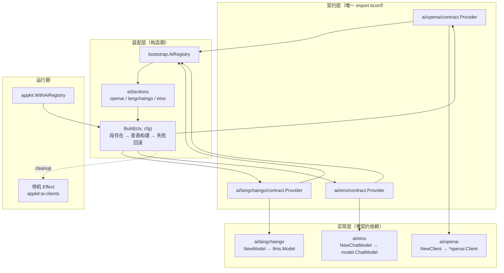

# Bald 智能模型设计：三后端各自独立 module，能力面刻意不统一

> Author(s): bald 团队
>
> Last updated: 2026-09-18
>
> Discussion at: 源码 `ai/{eino,langchaingo,openai}/`、三个 `contract/` 子包；装配面 `bootstrap/ai.go`、`pkg/appkit/ai.go`；契约 `bconf/proto/bootstrap/v1/ai.proto`
>
> Status: Accepted（三后端已落地、契约 3 段与实现对齐；**发现两处后端间行为不一致未修**——见「兼容性」）

## 摘要

`ai` 是 bald 的智能模型接入域，**3 个独立 module**：`ai/openai`、`ai/langchaingo`、`ai/eino`。它们回答一件事：**模型怎么调**。

设计上做了三个取舍：

1. **能力面刻意不统一**。三者不是"同一接口的三种实现"——`openai` 只有 client+config（146 行、2 个直接依赖、1 个传递依赖），`eino` 有完整编排（chain/compose/prompt/tool，564 行、4 个直接依赖、30 个传递依赖），`langchaingo` 有 agent/embedding/memory/vectorstore（492 行、2 个直接依赖、28 个传递依赖）。抽公共接口会把最轻的拖到最重的依赖面。
2. **契约段与实现 1:1 对齐**。proto 声明 3 段（`openai`/`langchaingo`/`eino`），`aiSections` 枚举 3 段——**无未实现段**（与 workflow 域 4 声明/1 实现形成对比）。
3. **`Organization` 字段的不对称是已知且已文档化**。eino-ext 无 organization 概念，故 `eino.CloudConfig` 不含该字段，`bootstrap/ai.go` 的注释明确记录了这点。

## 背景与动机

### 为什么三个后端不抽公共接口

对象存储域（oss）不抽公共接口是因为**语义真实冲突**（bucket 语义）。ai 域不抽，是因为**能力面真实不重叠**：

| 能力 | openai | langchaingo | eino |
|------|--------|-------------|------|
| ChatModel 客户端 | ✅ | ✅ | ✅ |
| Chain 编排 | ❌ | ✅（`chain.go`） | ✅（`chain.go`） |
| Prompt 模板 | ❌ | ❌ | ✅（`prompt.go`） |
| Tool 调用 | ❌ | ❌ | ✅（`tool.go`） |
| Agent | ❌ | ✅（`agent.go`） | ❌ |
| Embedding | ❌ | ✅（`embedding.go`） | ❌ |
| Memory | ❌ | ✅（`memory.go`） | ❌ |
| VectorStore | ❌ | ✅（`vectorstore.go`） | ❌ |
| 直接依赖 | 2 | 2 | 4 |
| 传递依赖 | 1 | 28 | 30 |
| 代码行数（非测试） | 146 | 492 | 564 |

三者的**唯一交集是"能创建 ChatModel"**，而那一层的返回类型就不同：`*openai.Client` / `llms.Model` / `model.ChatModel`。抽公共接口只能覆盖最薄的那一层，收益极低。

**代价**：业务换后端要改调用点；跨后端统一调用需自己适配。

## 设计

### 数据流



### 契约段字段 → Config 映射（三后端同形）

三个 `contract/buildConfig` 是**同形实现**（非复用），逻辑一致：

```go
switch modelType {
case 1:  // ModelTypeLocal — 须 local.host
    if local == nil || local.GetHost() == "" { return error }
case 2:  // ModelTypeCloud — 须 cloud.api_key
    if cloud == nil || cloud.GetApiKey() == "" { return error }
default: // fail-fast
    return fmt.Errorf("model_type=%d invalid (1=local, 2=cloud)", modelType)
}
```

> **注意**：`ai/openai/contract/contract.go` 的 `buildConfig` 注释称"三后端段同构，由 openai 版实现，eino/langchaingo 复用同形映射"——**该表述有误导**：三处各有独立的 `buildConfig` 函数，是"同形复制"而非"复用"。见「兼容性」§3。

### 本地/云端模型的端点构造

| 后端 | 本地（Ollama）端点 | 云端 |
|------|-------------------|------|
| openai | `http://{host}:{port}/v1` | `Cloud.BaseUrl` 或 SDK 默认 |
| langchaingo | `http://{host}:{port}`（无 `/v1`） | 同上 |
| eino | `http://{host}:{port}/v1` | 同上 |

三者默认值一致（`host` 空 → `localhost`、`port` 0 → `11434`），但 **langchaingo 的 URL 不带 `/v1` 后缀**——这是 langchaingo 的 Ollama 适配器约定，非缺陷。

## 理由与取舍

### 为什么 eino 的 `CloudConfig` 没有 `Organization`

eino 底层是 `cloudwego/eino-ext/components/model/openai`，其 `ChatModelConfig` **没有 organization 概念**（go-openai 有 `OrgID`，eino-ext 没有）。因此 eino 段配置了 `cloud.organization` **无效**。

`bootstrap/ai.go` 的注释已明确记录：

> 契约字段消费注记：`ai.*.cloud.organization` 仅 openai/langchaingo 消费（SDK 支持）；eino-ext openai 无 organization 概念，eino 段不消费该字段（配置了也无效，文档须提示）。

**取舍**：保持契约字段统一（三段的 proto 都有 `organization`），由各后端决定是否消费。代价是 eino 段配置该字段静默无效——**目前只有源码注释提示，无运行时告警**。

### 为什么 openai 后端这么薄

`ai/openai` 只有 146 行、2 个直接依赖（`go-openai v1.41.2` + `bconf`）。它的价值是**最小依赖的 OpenAI 兼容客户端**——业务只需要"调 OpenAI 兼容 API"时，不必被 langchaingo（28 个传递依赖）或 eino（30 个传递依赖）拖累。

**取舍**：它不提供编排能力，需要编排就换后端。

## 兼容性

### 1. 三后端默认超时行为不一致 —— 未修（本轮发现）

**现象**：不配置 `timeout_seconds` 时，三后端行为**不同**：

| 后端 | 默认超时 | 证据 |
|------|---------|------|
| `openai` | **30s** | `client.go:83` `timeout := 30 * time.Second` |
| `langchaingo` | **30s** | `client.go:54` 同上 |
| `eino` | **0（永不超时）** | `client.go:46/73` 仅在 `TimeoutSeconds > 0` 时设 `config.Timeout`；eino-ext `chatmodel.go:206` 为 `&http.Client{Timeout: config.Timeout}` |

**影响**：eino 后端在未配超时时，`http.Client{Timeout: 0}` 意味着**请求永不超时**——服务端无响应即永久挂起（除非调用方 ctx 取消）。这是 `workflow` 域 CR4 记录过的同类问题（"无默认超时的 http.Client 会随调用方 ctx 永久挂起"）。

**为什么未修**：需要决策——是让 eino 对齐 30s 默认（改 `ai/eino/client.go`），还是让另两个后端也接受"无超时=不设"（行为变更）。前者更符合 fail-safe 基调，但会改变 eino 现有部署的语义。

**建议**：让 eino 对齐 30s 默认，并在三处统一为一个共享常量或注释交叉引用。

### 2. `organization` 在 eino 段静默无效 —— 已知，仅注释提示

见「理由与取舍」。契约字段存在但 eino 不消费，配置了无任何反馈。**建议**：`buildConfig` 检测到 eino 段带 `organization` 时打一条 warn 日志，或在该字段的 proto 注释里标注"eino 不消费"。

### 3. 契约注释声称"复用"实为"同形复制" —— 文档缺陷

`ai/openai/contract/contract.go` 的 `buildConfig` 注释：

> 三后端段同构，由 openai 版实现，eino/langchaingo 复用同形映射

实际三处**各有独立的 `buildConfig` 函数**（`eino/contract.go:46`、`langchaingo/contract.go:46`、`openai/contract.go:47`），没有任何复用关系。注释的"由 openai 版实现…复用"会被读成"其他两个调 openai 的"。

**判定**：注释措辞误导（"复用"→ 应为"同形复制"）。修法：改注释，或真抽出共享 helper（但三者在**独立 module** 里，共享需引入公共包，与"零契约依赖"取舍冲突）。

### 4. 无生产调用方

三个 `contract/` 的 Provider 在全仓**仅被各自 `contract_test.go` 引用**，`_example/` 未接线 ai 段。装配链完整（Registry + appkit 注入 + 停机 Effect），接线责任在下游业务。

### 5. 编译期断言只覆盖 contract 层

三个 contract 子包有 `var _ func(...) = Provider` 类型守卫（保证签名与 `bootstrap.AiProvider` 兼容），但**三个后端的实现层**（`NewClient`/`NewModel`/`NewChatModel`）**无编译期断言**——它们的返回类型本就不同，无法用统一接口断言。这是能力面不统一的必然结果，非缺陷。

## 实现与过渡

### 现状清单

| 项 | 状态 |
|----|------|
| 三后端实现 | ✅ 落地（openai 146 行 / langchaingo 492 行 / eino 564 行，均非测试） |
| 契约映射 | ✅ 三个 `contract/` 子包，含签名类型守卫 |
| 契约段对齐 | ✅ proto 3 段 = `aiSections` 3 段（无未实现段） |
| 装配链 | ✅ `bootstrap.AiRegistry` + `pkg/appkit/ai.go` + 停机 Effect |
| 测试 | ✅ 三 module 各有 `*_test.go` 与 `contract/*_test.go` |
| 默认超时一致 | ⚠️ eino 与其他两个不一致（§1） |
| `organization` 提示 | ⚠️ 仅注释（§2） |
| 契约注释准确性 | ⚠️ "复用"措辞误导（§3） |
| 生产接入 | ⚠️ 无生产调用方（§4） |

### 建议的修复顺序

1. **eino 默认超时对齐**（低风险，需决策）：改 `ai/eino/client.go` 加 30s 默认。
2. **`organization` 告警**（低风险）：eino `buildConfig` 检测到该字段时 warn。
3. **契约注释修正**（零风险）："复用"改"同形复制"。

> 本轮为**评审 + 生成文档**任务，未改动任何代码。上述三项均为建议。

## 附录

### 关键锚点速查

```
ai/openai/client.go:83        默认 30s 超时（setHTTPClient）
ai/openai/client.go:32-75     云端/本地客户端构造（newCloudClient:32 / newLocalClient:53）
ai/langchaingo/client.go:54   默认 30s 超时（newCloudModel 内）
ai/langchaingo/client.go:34-93 云端/本地模型构造（newCloudModel:34 / newOllamaModel:69）
ai/eino/client.go:46,73       仅在 TimeoutSeconds>0 时设 Timeout（无默认）
ai/eino/client.go:15-31       NewChatModel 分派（newCloudChatModel:33 / newOllamaChatModel:54）
ai/*/contract/contract.go:46  buildConfig（eino:46 / langchaingo:46 / openai:47，三处同形独立实现）
ai/*/contract/contract.go:71/74  签名类型守卫（eino:71 / langchaingo:71 / openai:74）
bootstrap/ai.go:73-77         aiSections（openai/langchaingo/eino）
bootstrap/ai.go:26-28         Organization 字段消费注记
bootstrap/ai.go:87-131        Build（段枚举 + 失败回滚）
pkg/appkit/ai.go:37           WithAiRegistry
pkg/appkit/ai.go:45           buildAis（阶段 B 装配）
bconf/proto/bootstrap/v1/ai.proto:52-54  三段的 proto 声明
```

### 与姊妹文档的关系

| 文档 | 关系 |
|------|------|
| [框架契约总览](./框架契约总览.md) | ai 域的契约登记 |
| [Bald 对象存储设计](./Bald%20对象存储设计.md) | 同为「独立 module + contract 子包 + 显式注册」，但 oss 不抽接口的理由是语义冲突，ai 是能力不重叠 |
| [Bald 工作流设计](./Bald%20工作流设计.md) | 同为「契约段 → Provider 查表装配」；对比点：workflow 4 声明/1 实现（需 fail-fast 保护），ai 3 声明/3 实现（对齐） |
| [六域 Registry 迁入 bootstrap](./六域%20Registry%20迁入%20bootstrap.md) | AiRegistry 迁入的原始记录 |

### 本次评审的验证记录

- 三 module 的 `go vet` / `go test` 状态：见「现状清单」。
- 关键断言均以源码行号锚定（`ai/openai/client.go:83`、`ai/eino/client.go:46/73`、eino-ext `chatmodel.go:206`）。
- **未验证项**：三后端的默认超时差异**未经运行时探针实测**（`go-openai` 的 `ClientConfig.HTTPClient` 是 `HTTPDoer` 接口类型，无法直接读取 `Timeout`）。结论建立在**源码静态证据**上——`openai`/`langchaingo` 显式赋 30s、eino 仅在条件成立时赋值、eino-ext 源码 `&http.Client{Timeout: config.Timeout}` 三处行号均可复核。
- 无生产调用方的结论来自全仓 `grep bald/ai/`（排除 `ai/` 自身与 `.rivet/`）零命中。
