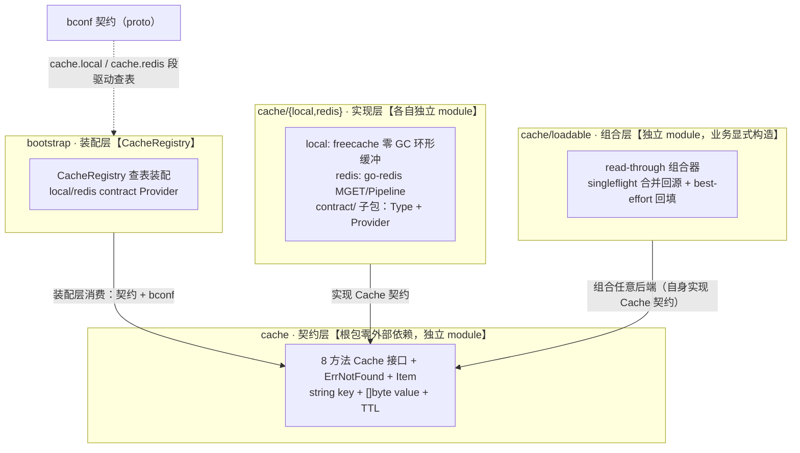

# Bald 缓存设计：契约层守住 []byte 边界，回源击穿交给 loadable 组合器

> Author(s): bald 团队
>
> Last updated: 2026-09-16
>
> Discussion at: 本文档替代《缓存抽象设计.md》（决策沿革见 git 历史）
>
> Status: Accepted（已实现，随 cache/v0.1.0 + cache/loadable/v0.1.0 发布）

## 摘要

bald 的缓存分两层：**契约层**（`cache.Cache`）定义后端无关的 KV 抽象——`string` key + `[]byte` value + TTL，零序列化耦合、零外部依赖；**组合层**（`cache/loadable`）在 Get miss 时经 singleflight 合并并发回源并 best-effort 回填，业务侧省去「查缓存 → miss → 查库 → 写缓存」样板，同时根治进程内缓存击穿。最重要的承诺：**契约层不放泛型、不替业务做编解码决策**——序列化责任留在调用方，`[]byte` 边界清晰。实现层（`local` freecache / `redis` go-redis）各自独立 module 并经 `CacheRegistry` 契约装配；loadable 不进 Registry，由业务代码显式构造。本文回答三个问题：为什么契约这么瘦、为什么回源必须合并并发、为什么组合器不进契约装配。

> 本文是按当前代码（cache/v0.1.0 + cache/loadable/v0.1.0）整理的设计文档。

---

## 背景与动机

### 每个读路径都在手写同一段回源样板

没有组合器时，业务代码里每个走缓存的读路径都是这段（示意代码，非仓库摘录）：

```go
func getUser(ctx context.Context, id string) ([]byte, error) {
	val, err := c.Get(ctx, "user:"+id)
	if errors.Is(err, cache.ErrNotFound) {
		val, err = queryUser(ctx, id) // 查库
		if err != nil {
			return nil, err
		}
		_ = c.Set(ctx, "user:"+id, val, 5*time.Minute) // 回填失败怎么办？
	}
	return val, err
}
```

这段代码有两个问题。样板本身：每个读路径重复一遍，回填失败是 `_ =` 吞掉还是向上报错，每个调用点自己拍板，行为漂移。更严重的是击穿：热 key 过期的瞬间，N 个并发请求同时 miss，N 次查库同时打到数据库——防击穿本该是缓存框架的本职。

### onex 的前车之鉴：两个已经踩过的坑

我们评审了 onex/pkg/cache，它验证了装饰器组合模式的可行性，也留下了两个具体教训。其一，onex 的 `LoadableCache` 没有做并发合并——击穿发生时，并发 miss 全部打到 loader，回源语义名不副实。其二，onex 的 `L2Cache`（ristretto + 远程）没有失效广播——`Del` 只清本节点本地缓存，其他节点脏读直到 TTL 自然过期；短 TTL 只是掩盖。这两个坑直接决定了本设计的两个硬性要求：**回源必须合并并发**，**不做无失效广播的 L2**。

---

## 设计

### 四层架构与 module 布局



依赖方向单一向上：实现/组合 → 契约；装配 → 契约 + bconf；业务 → 装配产出的后端实例 + 按需包 loadable。loadable 依赖仅 `golang.org/x/sync`，不 import bconf、不进 CacheRegistry——组合器是代码声明的能力，不是配置驱动的后端。

### 契约层：8 方法瘦接口 + ErrNotFound 哨兵（cache/cache.go）

```go
type Cache interface {
	Get(ctx context.Context, key string) ([]byte, error)          // miss 返回 ErrNotFound
	Set(ctx context.Context, key string, value []byte, ttl time.Duration) error // ttl=0：local 走默认 TTL，redis 永不过期
	SetNX(ctx context.Context, key string, value []byte, ttl time.Duration) (bool, error)
	Delete(ctx context.Context, key string) error
	Has(ctx context.Context, key string) (bool, error)
	GetMulti(ctx context.Context, keys []string) ([][]byte, error) // 单次往返；missing 处 nil + ErrNotFound
	SetMulti(ctx context.Context, items []Item) error
	Close() error
}
```

三条纪律。`string` key 直白可调试——redis-cli 可按 key 排查问题。`[]byte` value 把序列化责任留在调用方——框架不替业务决定用 JSON 还是 protobuf。`SetNX` 提供分布式锁原语但**不做锁语义**——跨进程协调（租约、续期、活锁规避）由业务在原语之上组合，不属于本层职责。

`GetMulti` 的对齐规则值得单独说明：返回切片恒为 `len(keys)` 长、与输入顺序对齐；任一 key 缺失则对应位置为 `nil` 且整体错误为 `ErrNotFound`。这让调用方无需在「部分命中」场景下区分错误处理分支。

### 实现层：local 与 redis 各自独立 module（cache/{local,redis}）

`cache/local` 基于 freecache：预分配环形缓冲带来零 GC 开销，segment 级锁支撑高并发，容量耗尽时 LRU 淘汰。`WithSize` 控制预分配大小（默认 256MB），`WithDefaultTTL` 兜底 `Set(ttl=0)` 的语义。另暴露 `HitCount`/`MissCount`/`EvacuateCount` 等指标方法，供业务接指标系统。

`cache/redis` 适配 go-redis v9：`MGET` 单次网络往返实现 `GetMulti`，`Pipeline` 批量实现 `SetMulti`；`WithKeyPrefix` 做命名空间隔离。契约装配支持三种部署模式（互斥，fail-fast）：`redis.cluster` 段 → `NewClusterClient`（种子节点自动发现，不支持 db）、`redis.sentinel` 段 → `NewFailoverClient`（经哨兵发现主节点）、均缺 → 单节点 `NewClient`；cluster 模式下 MGET/Pipeline 由 go-redis 按 slot 拆分组执行，「单次往返」退化为按 slot 分组的若干次。两个边界要如实说明。其一，`New(client)` 注入 client，`Close()` **不关闭**底层 client——连接池、TLS、生命周期归调用方管理。其二，local 的 `SetNX` 是进程内 check-then-set，两次调用之间存在极小竞态窗口，**严格互斥场景必须用 redis 后端**（原生 `SET NX` 原子命令）。

### 组合层：loadable 用 singleflight 合并并发回源（cache/loadable/loadable.go）

```go
// LoadFunc 从数据源加载 key 对应的值（通常是 DB 查询）。
// 返回错误时 Get 透传错误且不回填缓存；返回 (nil, nil) 或空切片也会回填——
// 调用方可借此实现业务自定义的负缓存。
type LoadFunc func(ctx context.Context, key string) ([]byte, error)

func New(backend cache.Cache, loader LoadFunc, opts ...Option) *Cache
func WithTTL(ttl time.Duration) Option // 回填默认 TTL，0=语义同 Set
```

用法一行说清：

```go
v, _ := app.Cache(rediscontract.Type) // Run 期取回装配实例（段名即契约段名）
c := loadable.New(v.(cache.Cache), loadFromDB, loadable.WithTTL(5*time.Minute))
val, err := c.Get(ctx, "user:1") // miss → singleflight 合并 → 回填 → 返回
```

Get 关键路径四步：

1. `backend.Get` 命中 → 直接返回（命中路径零额外开销，loader 不被触碰）；
2. miss（`errors.Is(err, cache.ErrNotFound)`）→ `singleflight.Group.Do(key)` 把同 key 并发 miss 合并为一次 loader 调用；
3. loader 成功 → `backend.Set` 回填（`WithTTL` 默认 TTL）→ 返回值；
4. loader 失败 → 错误透传，**不回填**——不留脏数据，下次请求自然重试。

两个语义边界。回填是 best-effort：`backend.Set` 失败时已拿到有效数据的读**不该失败**，值照常返回，下次请求再 miss 再回填。context 传播：合并加载由第一个 caller 的 context 驱动，若它中途取消，同 flight 的所有 caller 都观察到取消错误——这是 singleflight 的固有语义，文档明示而非隐藏。

透传族：`Set/SetNX/Delete/Has/SetMulti/Close` 直通 backend；`GetMulti` 逐 key 走 Get 路径——Get 会回源则 GetMulti 也回源，语义一致，any miss → `ErrNotFound` 对齐契约。

### 装配层：后端进 CacheRegistry，组合器不进（cache/{local,redis}/contract）

local 与 redis 各有 `contract/` 子包：bconf 契约段（`cache.local` / `cache.redis`）→ `Provider(ctx, *bootstrapv1.Cache) (any, func(), error)` → `CacheRegistry` 调度。单独成包的原因是实现包保持零契约依赖（local 纯 SDK、redis 纯适配），只有 contract 包 import bconf，依赖图全程可见。redis 的 contract 自建 client 并在 cleanup 中负责关闭；复用已有 client 的场景绕过 contract 直接用 redis 包的 `New`。

loadable **不进 CacheRegistry**。Registry 装配的是后端实例（配置驱动），组合器由业务代码显式构造（代码声明能力）——loader 是业务函数，框架无法从配置里变出它。这条分工对齐 FromBootstrap 的总原则：「配置驱动参数，代码声明能力」。

---

## 理由与取舍

**为什么进程内合并用 singleflight，跨进程协调留给 SetNX？** 我们没选 SetNX 锁做回源合并。进程内合并用 singleflight 零 RTT 开销，无需额外 key 与 TTL 协商；SetNX 锁在同一进程内是杀鸡用牛刀，还引入锁超时、误删他人锁等新问题。跨进程合并（多副本同时 miss）确实存在，但框架不预设分布式锁语义——它带活锁、租约续期等复杂度，不属于本层职责。需要跨进程合并的业务，用契约层的 `SetNX` 原语自行组合，能力面完整。

**为什么 loader 失败不回填，也不做框架级负缓存？** 防穿透的负缓存需要「空值标记」成为一等公民——契约层加 `Empty bool` 字段或哨兵字节串。哨兵值会污染 `[]byte` 的数据语义：业务合法存空值时无法区分「源里没有」和「存的就是空」。这违背「契约不动」承诺，我们砍掉了它。代价是穿透场景每次都打到源；补偿路径是 `LoadFunc` 返回 `(nil, nil)` 也会被回填——业务想要负缓存，在 loader 里自己决定空值策略即可，等价于业务自定义负缓存，且语义归业务所有。

**为什么借鉴 onex 的组合模式，却规避它大半能力？** onex 验证了装饰器组合模式的可行性，但其泛型契约与无广播 L2 的代价大于收益。逐项对照：

| onex 设计 | bald 取舍 |
| --- | --- |
| 装饰器组合模式（L2/Chain/Loadable/Noop 正交组合） | 借鉴——loadable 即组合模式的 P1 落地 |
| LoadableCache 的 loader 回填语义 | 借鉴并修正——回填必须 singleflight 合并（onex 缺失，击穿时并发 miss 全部打到 loader） |
| 泛型 `Cache[T]` + `any` key（MD5 hash） | 规避——key 语义不透明、序列化耦合进契约层 |
| L2Cache（ristretto + 远程，无失效广播） | 规避——`Del` 只清本节点，其他节点脏读直到 TTL；根治需要 Pub/Sub 失效广播，复杂度高且需求未实证 |
| cacheserver（集中式缓存微服务） | 规避——网络 RTT 抵消本地缓存收益，与 bald「进程内契约装配」哲学冲突 |
| `GetWithTTL` 两次 RTT | 规避——需要 TTL 感知的场景由后端原生能力承担 |

**显式不做的方案（留档防 YAGNI 争议回潮）：**

| 方案 | 不做原因 |
| --- | --- |
| 框架级负缓存 | 哨兵值污染 `[]byte` 数据语义；业务可经 loader 返回空值获得等价能力 |
| L2 两级缓存 | 无失效广播的 `Del` 只清本节点（onex 已踩）；带广播的版本等真实多副本高 QPS 读需求再排期 |
| typed 泛型便利层 | 纯便利可随带，不进契约层 |
| 组合器契约装配 | loader 是业务函数，配置变不出来；对齐「配置驱动参数，代码声明能力」分工 |

---

## 兼容性

纯增量，无破坏。契约层与 local/redis 实现零改动；loadable 是新增独立 module（依赖仅 `golang.org/x/sync`），不进 CacheRegistry。已发布 tag：`cache/v0.1.1` + `cache/loadable/v0.1.1` + `cache/local/v0.1.0` + `cache/redis/v0.1.0`。2026-09-16 增补：`cache.redis` 契约段新增 `cluster` / `sentinel` optional 子消息（字段 5/6，纯增量），contract 按段选建 `ClusterClient` / `FailoverClient` / 单节点 `Client`——旧配置零影响。

跨 module 使用者注意（非破坏但易踩）：`bald/cache` 系四个 module 相互独立，外部引用须 require 对应 module 本身（均已发 tag）；gopls 对嵌套 module 常报 BrokenImport 假阳性，以命令行 build/test 为准。

---

## 实现与过渡

全部已落地，无过渡安排：

- [x] 契约层：8 方法 `Cache` 接口 + `ErrNotFound` + `Item`（接口契约单测）。
- [x] 实现层 local：freecache 适配——`WithSize`（默认 256MB）/ `WithDefaultTTL` + `EntryCount`/`HitCount`/`MissCount`/`EvacuateCount`/`ExpiredCount` 指标五件套。
- [x] 实现层 redis：go-redis v9 适配——`MGET` 单次往返 / `Pipeline` 批量 + `WithKeyPrefix` 命名空间隔离；契约装配三模式（单节点 / cluster / sentinel，互斥 fail-fast，cluster 不支持 db）。
- [x] 双 contract 装配：`cache.local` / `cache.redis` 段 → `Provider` → `CacheRegistry`（redis 自建 client、cleanup 负责关闭；local cleanup 清空内存）。
- [x] 组合层 loadable：`New` + singleflight 回源合并 + best-effort 回填 + 透传族。
- [ ] L2 两级缓存（须带失效广播）、typed 泛型便利层——按真实需求排期，见不做清单。

验证：`cache`、`cache/local`、`cache/redis`、`cache/loadable` 各 module 随 bald CI（build + vet + test -short）全绿；loadable 14 例单测 `-race` 通过，核心并发合并保证经「50 goroutine 同 key → loader 计数=1」与「4 key × 25 并发 → 计数=4」双用例验证，另含命中不回源 / 失败透传不回填 / 回填失败仍返回值 / `WithTTL` 回填 TTL / GetMulti 混合命中 / 透传族全量语义覆盖。

---

## 附录：关联文档

`AppKit FromBootstrap 约定装配.md`（CacheRegistry 装配全景）、`数据存储设计.md`（store 层与缓存的关系）、`Bald 日志设计.md`（同为「契约层零依赖 + 实现独立 module + contract 子包接入装配」模式的架构先例）。
