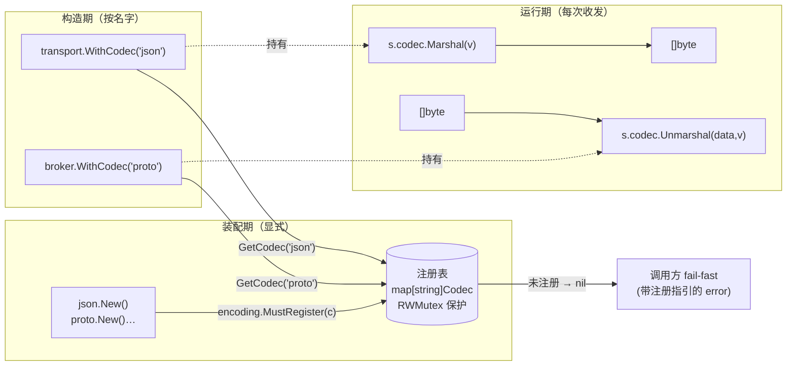

# Bald 编解码设计：名字取用、代码装配，13 个 module 各自独立

> Author(s): bald 团队
>
> Last updated: 2026-09-18
>
> Discussion at: 源码 `encoding/{encoding,encoding_test}.go`、12 个格式子包 `encoding/{json,xml,yaml,toml,proto,msgpack,bson,cbor,gob,thrift,avro,flatbuffers}/`；消费面 `transport/{tcp,websocket,sse,asynq,webrtc,redis,kafka,rabbitmq,rocketmq}/`、`broker/`；姊妹篇 [Bald 消息代理设计](./Bald%20消息代理设计.md)
>
> Status: Accepted（契约与 12 格式已落地、**13/13 module 有测试全绿**；**兼容性列出的五个缺口已于 2026-09-18 全部处理**——§1/§2/§3 修代码与文档，§4 判定为文档缺口并已写入 README，§5 修消费侧守卫，见「兼容性」各条）

## 摘要

`encoding` 是 bald 的编解码契约层。它只定义一件事：**字节和值怎么互相转**。`Codec` 接口三个方法（`Marshal`/`Unmarshal`/`Name`，`encoding.go:19-23`），加一个全局注册表（`MustRegister`/`GetCodec`/`Names`）。所有传输面——HTTP、gRPC、TCP、WebSocket、SSE、以及 broker 的四个后端——都通过**名字**取用编解码器，格式切换不改业务代码。

我们做了三个承诺：

1. **名字取用，代码装配**。传输层写 `WithCodec("json")`，但「json 是什么」由装配期显式 `encoding.MustRegister(jsoncodec.New())` 决定——注册表不猜、不默认、不自动。
2. **注册期 fail-fast，取用期 fail-closed**。nil / 空名 / 重名注册一律 `panic`（`encoding.go:34/38/43`）；未注册格式 `GetCodec` 返回 `nil`，由调用方报错——**已明确废除「静默回落 gob」的旧行为**（`broker/encoding.go:31-35` 的注释记录了这次废除）。
3. **一个格式一个 module**。根包零三方依赖（`encoding/go.mod` 只有 `module` 与 `go` 两行）；12 个格式各住独立 module，用哪个引哪个，不引入的不进二进制、不进依赖图。

这个 module 是随三域（transport / broker / 各格式）分批落地的。落地时**没有独立设计文档**——它与 [Bald 消息代理设计](./Bald%20消息代理设计.md) 是姊妹关系：broker 那篇的「codec 静默降级 gob」章节讲的是消费侧的疤，本篇讲的是契约本身。本文补齐这块。

## 背景与动机

### 为什么要抽一层编解码契约

没有这层时，每个传输面各带一套序列化：

- HTTP 用 `encoding/json`，gRPC 用 protobuf，WebSocket 用 json，broker 用 gob——**同一份业务结构在不同面上被不同的库读**，字段 tag 语义、时间格式、数字精度各自为政；
- 想给某个面换格式（如 WebSocket 换 MessagePack 省带宽），得改传输层内部代码，业务侧跟着动；
- 测试要 mock 序列化时，没有统一接缝。

`encoding` 把所有面收敛到「按名字取一个 `Codec`」。代价是**多一次间接**（接口调用 vs 直接调库）和**一个全局注册表**（框架一贯警惕的全局状态）；换来的是格式可拔插、装配点唯一、测试有接缝。

### 为什么是「显式注册」而不是 `init()` 自注册

框架的对手续一致性有一条硬纪律：**不用 `init()` + blank import 自注册**。理由有三：

1. **装配顺序可预测**。`init()` 的执行时机由 import 图决定，业务无法控制；显式 `MustRegister` 让"谁在什么时候注册了什么"是装配代码里读得出来的事实。
2. **重名冲突可检测**。`init()` 自注册时重复注册要么 panic（进程起不来且难定位）要么静默覆盖（更糟）；显式注册把冲突暴露在装配期的一个确定位置。
3. **未引入的格式真的不在二进制里**。`init()` 自注册依赖 blank import 把包链进来，引了就进；显式注册下，不调用构造器、不 import 格式包，编解码器代码根本不参与链接。

这条纪律的直接后果是一条**使用约束**：`MustRegister` 必须先于任何 `GetCodec`，也就是**必须先于构造任何消费它的 transport / broker**。这个约束有代价，见「兼容性」第 4 条。

## 设计

### Codec 契约

```go
// encoding/encoding.go:19-23
type Codec interface {
    Marshal(v any) ([]byte, error)
    Unmarshal(data []byte, v any) error
    Name() string
}
```

三个方法刻意保持最小：没有 `MarshalString`、没有 `ContentType()`、没有流式接口。原因见「理由与取舍」。

### 注册表语义

| 操作 | 行为 | 锚点 |
|------|------|------|
| `MustRegister(c)` — `c == nil` | `panic` | `encoding.go:33-34` |
| `MustRegister(c)` — `c.Name() == ""` | `panic` | `encoding.go:36-38` |
| `MustRegister(c)` — 名字已存在 | `panic` | `encoding.go:42-43` |
| `MustRegister(c)` — 正常 | 以**小写**名字存入 map | `encoding.go:39` |
| `GetCodec("")` | 返回 `nil`（不 panic） | `encoding.go:50-52` |
| `GetCodec(name)` — 未注册 | 返回 `nil` | `encoding.go:56` |
| `GetCodec(name)` — 已注册 | 大小写无关命中 | `encoding.go:53` |
| `Names()` | 升序名称切片，仅诊断用 | `encoding.go:60-71` |

注册表用 `sync.RWMutex` 保护（`encoding.go:26-27`），`MustRegister`（`:32`）持写锁、`GetCodec`（`:49`）/`Names`（`:60`）持读锁。**注册是并发安全的，但语义上预期发生在装配期**——运行期注册会让已构造的消费者看不到（见「兼容性」第 4 条）。

### 数据流



图里两个刻意的断层：**装配期到构造期是「按名字」的间接**（消费者不认识具体格式），**构造期到运行期是「持有实例」的直连**（不每次查表）。后一个断层正是「兼容性」第 4 条的根因。

### 13 个 module 的依赖面

| module | 三方依赖 | 测试 |
|--------|----------|------|
| `encoding`（根） | **无**（零三方依赖） | ✅ |
| `json` | 无（标准库） | ✅ |
| `xml` | 无（标准库） | ✅ |
| `gob` | 无（标准库） | ✅ |
| `yaml` | `gopkg.in/yaml.v3` | ✅ |
| `toml` | `github.com/BurntSushi/toml` | ✅ |
| `proto` | `google.golang.org/protobuf` | ✅ |
| `msgpack` | `github.com/vmihailenco/msgpack/v5` | ✅ |
| `bson` | `go.mongodb.org/mongo-driver` | ✅ |
| `cbor` | `github.com/fxamacker/cbor/v2` | ✅ |
| `avro` | `github.com/linkedin/goavro/v2` | ✅ |
| `thrift` | `github.com/apache/thrift` | ❌ 无测试 |
| `flatbuffers` | `github.com/google/flatbuffers` | ❌ 无测试 |

根 module 的零依赖是刻意的：契约层不该把任何具体格式的依赖传染给消费者。每个格式 module 都 `require bald/encoding v0.0.0` + `replace => ..`，本地开发直接连源码。

### 三个「非通用签名」格式的桥接方式

12 个格式里，9 个是「直接转发底层库」（`json`/`xml`/`yaml`/`toml`/`gob`/`msgpack`/`bson`/`cbor` 一行转发，`proto` 多一层 `proto.Message` 断言）。剩下 3 个的底层 API 与 `Codec` 的 `any` 签名对不上，各用一种桥接：

**proto**（`:21-25`）——`Marshal`/`Unmarshal` 前做 `v.(proto.Message)` 断言，不符返回 `error`。参数必须是通过 protoc 生成的结构体。

**thrift**（`:39-51`）——同上，断言 `thrift.TStruct`。Thrift 的序列化是流式的（`TSerializer.Write(ctx, t)`），codec 每次都 `thrift.NewTSerializer()` 现场建。

**flatbuffers**（`:44-62`）——FlatBuffers 没有通用 `Marshal/Unmarshal`，只有生成的 Builder 和 FlatBuffer 类型。本包约定：值实现 `FlatBufferMarshaler`（`PackFlatBuffer() ([]byte, error)`）才能 Marshal，目标实现 `fb.FlatBuffer` 才能 Unmarshal。

**avro**（`:33`、`:56-58`、`:74-77`）——唯一有「双构造器」的格式：`New()` 返回的默认 codec 无 schema（用于名字注册占位），`NewCodec(schema)` 才接受真实 Avro schema。默认 codec 内部用 `goavro.NewCodec("\"null\"")` 兜底。

## 理由与取舍

### 为什么 `Codec` 只有三个方法

曾经考虑过加 `ContentType() string`（给 HTTP `Content-Type` 用）和 `MarshalString`（省一次 `[]byte`↔`string` 转换）。都没加：

- `ContentType` 是传输层的事，不是编解码的事。同一个 `json` codec 在 HTTP 上是 `application/json`、在 WebSocket 帧里根本不需要——把它塞进契约会让编解码器知道自己的传输上下文，破坏分层。
- `MarshalString` 是性能优化，不是语义需求。9/12 的格式底层就是 `[]byte` API，为少数场景给所有实现加一个方法，收益不抵契约膨胀。

**代价**：调用方要自己做 `string(data)`；`ContentType` 各传输自己映射。

### 为什么注册表是全局的

备选是「每个消费者持有自己的注册表实例」（依赖注入式）。选了全局，因为：

- 传输层的 `WithCodec("json")` 签名里只有**一个字符串**，没有地方塞注册表实例。要改成注入式，得给 12 个 `WithCodec` 全部加一个注册表参数——`transport` 12 处定义点（`tcp/client_options.go:13`、`websocket/options.go:97`、`sse/options.go:36`、`asynq/options.go:395` 等）。
- 「同一个名字在所有面上指同一个东西」是符合直觉的默认，注入式下每个面的注册表可能不同，反而要解释。

**代价**：全局可变状态（框架一贯警惕的东西）。缓解是注册期 fail-fast + 注册后基本只读。但这仍是本文列出的最重的设计债，见「兼容性」第 4 条。

### 为什么 `Names()` 保留但只作诊断

`Names()` 全仓生产代码零调用（仅 `encoding_test.go:96` 的 `TestNames` 消费）。按框架已确立的判据（「框架能力零调用不是问题，缺测试才是」——见 设计评审-第三轮 R4 裁决），它保留：有测试钉住行为、是合法的诊断/文档能力面。

### 为什么 12 个格式各建 module 而非 build tag

备选是「单 package + build tag」（`//go:build codec_msgpack`）。选了独立 module，因为：

- build tag 下所有格式的依赖都在同一个 `go.mod` 里——想用 json 却被拖进 `mongo-driver`（bson）和 `apache/thrift`；
- 独立 module 让「按需引入」是真的：`go.sum` 里没有没用的格式。

**代价**：13 个 `go.mod` 要各自维护，`go build ./...` 在根 module 覆盖不到子 module（与 `_example`、`cobramcp` 同一个坑，Taskfile 用 `find go.mod` 兜底）。

### 为什么 avro 要 `NewCodec(schema)`

Avro 是 schema 驱动格式——没有 schema 就不知道字节怎么切。`Codec` 接口的 `Marshal(v any)` 签名里**没有地方带 schema**，所以 avro 只能：要么让 `New()` 无参、默认 codec 退化（当前选择），要么破坏 `Codec` 接口。

`New()` 的默认 codec 因此只能占位。这带来一处**文档与实现的偏差**，见「兼容性」第 3 条。

## 兼容性

本节列出**四个已核实的缺口**。均已用工具独立复核（源码阅读 + `grep` 交叉验证），锚点到 file:line。

### 1. `thrift.serializer`/`deserializer` 是死字段 —— ✅ 已修（2026-09-18）

**现象**：`codec` 结构体声明了两个指针字段（`thrift.go:33-34`），但**全仓无任何赋值点**——`New()` 返回零值 `codec{}`（`:29`），`Marshal`/`Unmarshal` 每次走 `if s == nil` 分支现场新建（`:44-46`、`:58-60`）。

**影响**：当前**不构成并发缺陷**（每次调用都是新实例，且方法是值接收者 `func (c codec)`）。但字段的存在误导读者以为有池化复用；若日后有人填入共享实例，值接收者会让所有调用共享同一 `TSerializer`——而 Thrift 的 `TSerializer` 不是文档保证线程安全的。

**判定**：死代码。修法二选一——删字段（诚实），或补齐复用并加锁（优化但要担并发正确性）。

### 2. `flatbuffers.Unmarshal` 对畸形 buffer 静默成功 —— ✅ 已修（2026-09-18）

**现象**（`flatbuffers.go:55-62`）：

```go
func (codec) Unmarshal(data []byte, v any) error {
    t, ok := v.(fb.FlatBuffer)
    if !ok {
        return fmt.Errorf("flatbuffers: target %T does not implement flatbuffers.FlatBuffer", v)
    }
    fb.GetRootAs(data, 0, t)   // 无 error 返回
    return nil                 // 无条件成功
}
```

**影响**：FlatBuffers 的 `GetRootAs` 不做边界校验（零拷贝的反面代价）。截断的、越界的、根本不是 FlatBuffer 的 `data` 都会被「解成功」，字段读到垃圾值或触发后续访问 panic。

**判定**：`flatbuffers` 无测试文件，这个缺口没有任何测试拦截。修法：Unmarshal 前做 buffer 合法性校验（至少校验长度与 vtable 偏移），或至少在文档里显式声明「本 codec 不校验 buffer 合法性」。

### 3. 文档高估 avro 默认 codec 的能力 —— ✅ 已修（2026-09-18）

**现象**：`README.md` 与 `avro.go` 包注释都称默认 codec「使用空 schema，仅支持原始类型」。实际实现用的是 `goavro.NewCodec("\"null\"")`（`:58`、`:77`）——这是 **Avro 的 `null` 类型 schema**，不是「空 schema」。它只接受 Avro `null` 值，连 `string`/`int` 都不接受。

**影响**：使用者按文档以为 `New()` 的 codec 能处理原始类型，实际全部报错。

**判定**：文档-实现偏差。修法：改文档（默认 codec 仅供名字注册占位，实际使用必须 `NewCodec(schema)`），或改实现（若真想让默认 codec 支持原始类型，得重设计）。

### 4. `MustRegister` 必须先于构造：一条未文档化的使用约束

**现象**：所有消费者（`broker/options.go:66` 的 `NewOptions()`、`transport/tcp/client.go:47` 的 `NewClient()`、`transport/asynq/server.go:122`、`transport/webrtc/client.go:58` …）都在**构造期** `GetCodec(name)` 并**把结果缓存进字段**。构造之后注册的编解码器，这些点永远看不到。

> **修正记录**：本文初稿曾把此处描述为「broker 惰性查表 vs transport 急切查表**不一致**」——该判断有误。broker 注释里的「惰性」是相对**包初始化期**而言（若写成包级 `var DefaultCodec = encoding.GetCodec(...)`，会在 init 期求值、注册表必然为空）；`NewOptions()` 与 `NewClient()` 实际是**同一时机**（构造期）。消费侧的查表时机是**统一的**，不存在不一致。

**这不是缺陷，是使用约束**。理由：codec 为 `nil` 在本框架里**不必然是错误**——asynq（`else { payload = task.Payload() }`）、tcp（`if payload == nil { payload = msg.Payload }`）、broker（`Marshal`/`Unmarshal` 在 `codec == nil` 时对 `[]byte`/`string` 直通）都支持**无 codec 的原始字节透传**。因此：

- **不能**在 `Start`/`Connect` 期对 `codec == nil` fail-fast——那会误伤「全部走透传、根本不需要编解码器」的合法用法；
- 现有设计（在**真正需要 codec 的那一行**才判空并报错）是**正确的**——错误出现在需要它的位置，且文案已给出注册指引。

**影响**：唯一的实际代价是**时序约束没被文档化也没被强制**。应用若在构造 transport 之后才 `MustRegister`，且随后走了类型化编解码路径，错误会推迟到首次收发消息才暴露（位置远离根因）。按框架的「显式装配」哲学，`MustRegister` 先于构造本就是预期用法，只是此前没有一处把它写清楚。

**判定**：文档缺口，非代码缺陷。修法 = 把约束写进 `README.md`（已在「快速开始」补注），**不改代码**——改成惰性查表会引入每次收发的额外查表或 `sync.Once` 复杂度，收益（容忍错误顺序）不抵成本，且与该框架「装配期显式」的一贯取舍相悖。

### 5. 消费侧的两处 nil 未防护（补充发现）—— ✅ 已修（2026-09-18）

核验过程中发现 transport 层有两处「直接调 `codec.Unmarshal` 未判空」，与其他 transport 的 fail-fast error 语义不一致：

- `transport/asynq/server.go:428`、`:481`：`creator != nil` 分支直接 `s.codec.Unmarshal(...)`，无 nil 守卫。
- `transport/tcp/client.go:226`：接收路径直接 `c.codec.Unmarshal(...)`，而同文件 `:161` 的发送路径却有 nil 守卫——同一客户端两种语义。

codec 为 nil 时是 nil interface 方法调用，**panic 而非返回 error**。对照 `transport/tcp/server.go:310`、`websocket/server.go:404`、`sse/server.go:362` 的「带注册指引的 error」，这两处是遗漏。修法：补 nil 守卫，文案对齐其余 transport。

> **边界说明**：第 5 条属消费侧（transport）而非契约侧（encoding），且不在本次评审的 `encoding/` 目录范围内。列出是因为它与 encoding 的注册语义直接相关——但修它属于 transport 的工单。

## 实现与过渡

### 现状清单

| 项 | 状态 |
|----|------|
| `Codec` 契约 + 注册表 | ✅ 已落地，`encoding_test.go` 覆盖 9 个用例（含 3 个 panic 路径） |
| 12 个格式 module | ✅ 全部落地，构造器 `New()` / 常量 `Name` 齐备 |
| 根 module 零三方依赖 | ✅ 已核实（`go.mod` 仅两行） |
| 编译期接口断言 `var _ encoding.Codec = codec{}` | ✅ 12 个包已补（2026-09-18） |
| 测试覆盖 | ✅ **13/13 module 有测试全绿**；`thrift`、`flatbuffers` 已补（2026-09-18） |
| 消费侧集成 | ✅ transport 12 处 `WithCodec` + broker 链路，组装完整 |
| 生产装配注册 | ⚠️ 全仓生产代码**零处** `encoding.MustRegister`；`_example/` 也零处——即默认路径下所有 transport 的 codec 兜底都落空 |

> 最后一行值得展开：这不是缺陷（示例本就不必然覆盖全部能力面），但它意味着**「装配期必须先 MustRegister」这个约束在仓库内没有任何活样本演示**。使用者照 `_example/` 抄，抄不到这一步，会直接撞上「运行期 codec is nil」。2026-09-18 已在 `encoding/README.md`「快速开始」补注装配顺序约束（兼容性 §4）。

### 修复记录（2026-09-18，全部完成）

| # | 缺口 | 处置 | 提交 |
|---|------|------|------|
| 1 | thrift 死字段 | 删 `serializer`/`deserializer`，改无状态；补 `thrift_test.go` | `8786d2f` |
| 2 | flatbuffers 静默解码 | 新增 `validateRootBuffer`（长度 + 根偏移校验）；补 `flatbuffers_test.go` 5 例 | `8786d2f` |
| 3 | avro 文档偏差 | 改 `README.md` 与 `avro.go` 注释为「仅供名字注册占位，实为 null schema」 | `8786d2f` |
| 4 | 装配顺序约束 | 判定为文档缺口（非代码缺陷）；约束写入 `encoding/README.md` | 本次 |
| 5 | 消费侧 nil 未防护 | asynq ×2 + tcp client ×1 补 fail-fast 守卫；删 webrtc `"bytes"` 死回落；顺带修 tcp `go.mod` 版本漂移 | `c22f50f` |
| — | 编译期接口断言 | 12 个格式包各补 `var _ encoding.Codec = codec{}` | `8786d2f` |

> **§4 的方案修正**：本文初稿建议「构造期 fail-fast」，实测核实后推翻——codec 为 `nil` 在本框架支持**原始字节透传**的合法用法（asynq / tcp / broker 均有 `[]byte`/`string` 直通分支），构造期 fail-fast 会误伤它们。现有「在真正需要 codec 的那一行判空」是正确的，改动收敛为补文档。

## 附录

### 与姊妹文档的关系

| 文档 | 讲什么 | 与本文关系 |
|------|--------|------------|
| [Bald 消息代理设计](./Bald%20消息代理设计.md) | broker 契约 + 四后端，含 `derefAnyPointer`、双装配路 | **消费侧**：它的「codec 静默降级 gob」讲的是 encoding 旧行为造成的疤；该缺口已于 2026-09-18 修复（`fail-fast + errNoCodec`） |
| [应用框架设计](./应用框架设计.md) | appkit 装配层 | 装配时机的上游 |
| 设计评审-第三轮 | 全局设计评审 | R4 裁决确立了「框架能力零调用不是删除依据」的判据，本文 §Names 沿用 |

### 关键锚点速查

```
encoding/encoding.go:19-23   Codec 接口定义
encoding/encoding.go:26-27   注册表 + RWMutex
encoding/encoding.go:32-46   MustRegister（panic 在 :34/:38/:43）
encoding/encoding.go:49-57   GetCodec
encoding/encoding.go:60-71   Names
encoding/avro/avro.go:33     New() 默认 codec（nil schema）
encoding/avro/avro.go:58,77  goavro.NewCodec(`"null"`) 兜底
encoding/flatbuffers/flatbuffers.go:55-62  Unmarshal 恒返回 nil
encoding/thrift/thrift.go:33-34           死字段
broker/encoding.go:31-35     废除静默 gob 的注释
broker/options.go:13         注册时机约束的注释
transport/tcp/client.go:161  SendMessage 有 nil 守卫
transport/tcp/client.go:226  接收路径无 nil 守卫（对照）
```

### 本次评审的验证记录

- `go test ./...`：根 module + 11 个格式 module 全绿；`flatbuffers`/`thrift` 无测试文件（`exit 0`）。
- 7 条关键断言经独立核验（源码 `sed` 定位 + `grep` 交叉搜索）：生产代码零 `MustRegister`、flatbuffers 静默成功、avro `null` schema、asynq/tcp-client nil 未防护、webrtc `"bytes"` 回落为死代码（全仓无 bytes codec）。
- 消费面用 `delegate_batch` 并行侦察，其结论（标注 `unverified`）已逐条回读源码复核后才写入本文。
