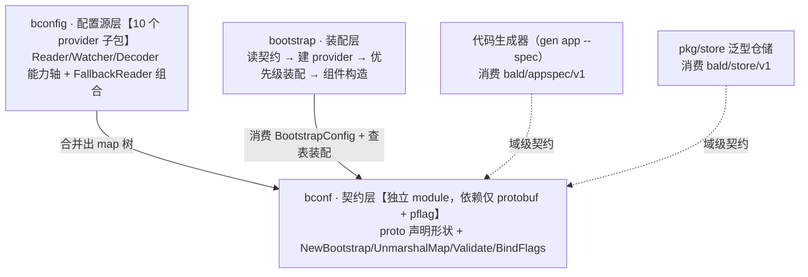

# Bald 配置契约设计：proto 声明形状、map 合并桥接、一份描述符驱动默认值/校验/flag

> Author(s): bald 团队
>
> Last updated: 2026-09-14
>
> Discussion at: `Bald 配置源层设计.md`（兄弟篇：源层专属展开，本文 §2 内容的前身与收编来源）、`Bald 日志设计.md`（logger 域契约的演进篇）
>
> Status: Accepted（已实现，随 bald bconf v0.5.0 发布）

## 摘要

`bconf` 是配置形状的单一真相源：用 Protobuf 声明「一个应用长什么样」（17 个 proto、14 个顶层配置域），`buf` 生成强类型 Go 包，四个 Go API（`NewBootstrap` 默认值 / `UnmarshalMap` 合并桥接 / `Validate` 启动校验 / `BindFlags` flag 绑定）中，`UnmarshalMap` 与 `BindFlags` 按 proto 描述符自动工作——`--http.addr` 这类层级 flag 真零样板；默认值集中在 `NewBootstrap`、校验规则集中在 `Validate` 各一处维护——新增一个配置项 = 声明形状 + 两处各补内容，无需 interface/struct/flag 多处同步。模块仅依赖 protobuf 与 pflag，不含任何后端 SDK，不读配置（bconfig 的事）、不装配（bootstrap 的事）。本文回答三个问题：为什么用 proto 作契约而不是 Go struct、为什么桥接层要自建类型规范化与合并语义、为什么校验只到形状层不认后端。最重要的承诺：**已知键写错类型、取值越域或枚举名非法，在启动期报错，而不是静默落到零值——配置错误显式暴露。**边界同样如实：拼错的未知键名（`https` 而非 `http`）会像业务自定义段一样被 `DiscardUnknown` 静默放行、落默认值——键名级防呆未实现，代价见 §API 二。

> 本文按当前代码整理；五后端段级校验（§API 三）为随本文补齐的增量，超出 v0.5.0 已发布内容，下次发版随附。

---

## 背景与动机

早期版本用 Go struct + mapstructure 反序列化配置（viper 时代）。两个缺陷无法根治，都有实锤：

1. **flag 压不过配置文件**。`viper.BindPFlag` 绑定的 flag 若未显式传入，`pflag.Value` 的零值（`""`、`false`）会覆盖配置文件里已设置的值——除非逐字段判断 `Changed`，必漏。
2. **嵌套段静默丢失**。配置文件里写错的键名（`https` 而非 `http`），mapstructure 直接忽略——曾出现 **TLS 配置静默失效**，进程照常启动，行为却不对。

写错键名静默落零值，是配置系统最危险的故障模式：没有报错、没有日志，只有不对的行为。

---

## 设计

### 三层定位：契约不读不装



`bconf` 只回答「有什么配置」，不关心「怎么读」（bconfig）、不关心「怎么装配」（bootstrap）。契约是稳定接口，源与装配各自演进。

### 模块布局与生成链

```text
bald/bconf/                       module github.com/kalandramo/bald/bconf
├── go.mod                        仅 protobuf + pflag 两依赖
├── buf.yaml                      buf v2 module：buf.build/kalandramo/bald-bconf
├── buf.gen.yaml                  managed mode，go_package_prefix 裁决生成路径
├── bootstrap.go / unmarshal.go / bindflags.go / util.go
├── proto/bootstrap/v1/           框架级契约 15 个（package bootstrap.v1）
│   └── bootstrap.proto 顶层 BootstrapConfig + app/server/config/registry/
│       log/tracer/metrics/broker/storage/ai/workflow/cache/script/database
├── proto/bald/
│   ├── store/v1/store.proto      分页/过滤/排序契约（pkg/store 消费）
│   └── appspec/v1/appspec.proto  应用规格契约（代码生成器消费）
└── gen/go/                       *.pb.go 生成物（包名 bootstrapv1/storev1/appspecv1）
```

生成物入库，业务方无需装 buf 工具链即可构建。改 proto 后跑 `buf generate` 重新生成——**不要手改 `.pb.go`**：rawDesc 内嵌描述符带长度前缀，改长字符串会让长度错位、运行期 panic。

### 契约形状：BootstrapConfig 十四个域

顶层消息声明式描述应用完整拓扑：`app`（元数据，含全契约唯一 Duration 字段 `stop_timeout`）、`server`（HTTP/gRPC 可混合）、`config`（九种配置源可混合）、`registry`、`logger`、`tracer`、`metrics`、`broker`、`storage`、`ai`、`workflow`、`cache`、`script`、`database`。多态域（配置源、日志后端、传输协议）一律 `optional` 子消息 + `repeated`——「同时配多种」是一等公民。

三条形状设计纪律，各对应一类真实语义需求：

1. **三态语义用显式子消息**（如 `server.http.tls` → `message TLS`）：启用 TLS 是未配置/禁用/启用+参数三态，标量 bool 表达不了；子消息天然有 presence，`GetTls() == nil` 即未配置。
2. **Duration 用 `google.protobuf.Duration`**：换类型安全与 protojson 标准序列化，代价见下文坑 1。无跨语言需求的配置项，秒数 int 字段反而省心——全契约目前仅 `app.stop_timeout` 一处用 Duration。
3. **repeated 是替换语义**：配置中出现列表整体覆盖默认值而非追加（桥接层保证，见下文）——契约层面无需为「覆盖 vs 追加」引入任何标记。

### API 一：NewBootstrap——默认值的单一来源

```go
cfg := bconf.NewBootstrap()   // App.Id=主机名、Http=:8080、Grpc=:9090、
                              // Logger=backends[单 slog 项 info/console/stdout]
```

默认值住在 Go 代码而非 proto 注解：proto default 注解不被 protoc-gen-go 物化到生成代码，读它要再过一层反射——不如一处 `NewBootstrap()` 直接可断点、可测试。

### API 二：UnmarshalMap——map 树到 proto 的合并桥接

```go
cfg := bconf.NewBootstrap()                    // 先填默认值
bconf.UnmarshalMap(settings, cfg)              // 配置覆盖默认值（合并语义）
bconf.Validate(cfg)                            // 启动前校验
```

加载器（bootstrap/config 层合并、bconfig KV 源、测试桩）只需先合并出 `map[string]any`。流水线：

```text
map → coerce 类型规范化 → json.Marshal
    → protojson.Unmarshal（DiscardUnknown，解析到同类型空消息）
    → clearPresentLists → proto.Merge（合并进带默认值的 msg）
```

**合并而非替换**是刻意的：不能直接 `protojson.Unmarshal(data, msg)`——它的语义是替换，会先重置整个 msg，把 `NewBootstrap()` 填的默认值一并清掉。`DiscardUnknown` 放行业务自定义配置段：proto 只约束框架级配置，业务段自行解析。代价是拼错的框架级键名与业务段无法区分、同样被静默丢弃落默认值——显式报错的如实边界是「已知键的类型错误（coerce）、值域错误（Validate）、非法枚举名（coerceEnum）」三类，不含键名级防呆。

三个坑，实现内建防御，业务侧须知其存在：

1. **Duration 格式化**。protojson 的 Duration 只接受十进制秒 + `"s"` 结尾（`"90s"`）；`time.Duration.String()` 产生 `"1m30s"` 复合表示会解析失败。flag 传入的 Duration 经 `strconv.FormatFloat(d.Seconds(),'f',-1,64)+"s"` 格式化（`coerceDuration` 内建）。
2. **proto.Merge 对 repeated 是 append**。默认值 `["stdout"]` 与配置值 `["stdout"]` 会合并成 `["stdout","stdout"]`——日志向 stdout 写两遍的真实案例。`clearPresentLists` 在合并前清掉「配置中显式出现的」list 字段旧值，使其表现为替换；配置未出现的 list 保留默认值。
3. **proto3 标量无 presence**。无法区分「未配置」与「显式配置为零值」——`http.addr` 默认 `:8080`，配置里显式写空串**不会**覆盖它。这是 proto3 固有行为不是缺陷；确需三态语义时在 proto 用 `optional` 或显式子消息。

### coerce：map 侧与 proto 侧的类型缓冲层

env（AutomaticEnv）与 flag 的值在配置树里可能是字符串或任意数值，而 protojson 是严格模式——`"8080"` 不会自动转 int32，纳秒整数不会自动变 `"10s"`。`coerceMessage` 按 msg 的字段描述符把 map 值规范化成 protojson 能接受的类型：

- 标量：字符串/数字/布尔互转（`"8080"`→int32、`true`→`"true"`），整数字符串按 flag/env 常见写法放行；
- 枚举：值名（`"json"`）与编号（`0`）都收，非法值列出全部合法名报错；
- Duration：三种来源形态（yaml 串 / env 串 / flag 的 time.Duration 或纳秒整数）归一；
- 键名：`json_name`（camelCase）与 proto 原名（snake_case）都识别，kebab-case（`output-paths`）折叠 `-` 后等价匹配；
- 边界诚实：float64 精度高于 int64，超界值显式拒绝（边界用 `1<<63` 精确常量——`float64(math.MaxInt64)` 恰为 2^63，`>` 会放过它）；repeated 字段接受单值标量包成单元素切片。

新加配置类型支持时改这里，不要在加载器里散落特判——这是 map 与 proto 之间唯一的类型适配点。

### API 三：Validate——校验只到形状，不认后端

```go
bconf.Validate(cfg)  // app.id/name 非空、addr 为合法 :port 或 ip:port、
                     // backends 至少一项、六种后端段级规则、filter_keys 无空串
```

分层是刻意的：契约层只校验**形状可判定**的规则（非空、格式、数值域）；后端是否已注册由装配层 `bootstrap.LogRegistry` 查表 fail-fast——契约层不硬编码后端清单，新后端接入零契约改动。六种后端段各有段级规则，错误带 `backends[i].<seg>` 级定位：

- **slog**：level/format 值域、输出目标（output_paths 优先，回退 output_path）、rotate 数值非负；
- **charm**：level（debug|info|warn|error）与 format（json|text）值域——contract 对未知值**静默回退默认**（"fatal" 落 info、"console" 落 text），值域校验把静默错配变启动报错；output_path 空串放行（contract 明确空值与 "stderr" 等价，非漏配）；
- **loki**：endpoint 必填（contract 同款 required 前移到契约层，错误更早）；batch_size/flush_interval 非负（contract 仅 >0 生效，负数会静默用默认）；
- **sentry**：dsn 必填（同 loki 前移）；格式不校——Sentry SDK 构造期的解析错误更专业，留在装配层；
- **aliyun/tencent**：连接目标必填（endpoint/project/logstore 与 endpoint/topic_id）——空值静默发往 options 层占位默认（"projectName"/"app"）或 deferred 到 send 期、且 SendLog 错误被丢弃；**凭证一律不校验非空**——SDK 环境变量凭证链（ALIBABA_CLOUD_ACCESS_KEY_ID 等）是合法配置路径。

两个校验语义的边界裁定：

- **空串项 fail-fast**（`filter_keys[i]`、`output_paths[i]`）：空 key 永不命中任何属性，配置错误应显式暴露而非静默吞掉。
- **level/format 空串放行**：repeated 新元素不继承 `NewBootstrap` 默认值，字段缺省是常态；装配层 `LogOptions` 对空值回退默认——与 Validate 总则「缺省字段视为未启用，跳过」一致。

### API 四：BindFlags——描述符驱动的 flag 绑定

```go
fs := pflag.NewFlagSet("app", pflag.ExitOnError)
bconf.BindFlags(fs, cfg, "server")   // 递归注册 --server.http.addr 等层级 flag
```

三个设计点：

1. **传 FlagSet 而非全局**：flag 注册作用域可控，避免重复 loadConfig 时污染 `pflag.CommandLine` 造成 "flag redefined" panic。
2. **nil 子消息跳过**：`Mutable` 会实例化空子消息，而契约对开关型子消息（`Server_TLS`）采用「非 nil 即启用」语义——nil 被实例化会让 server 误入 TLS 路径（cert 为空 → 启动失败）。要经 flag 配置这类子树，先用配置文件/默认值使子消息非 nil。
3. **不可绑定字段注册指引 flag**：repeated/map 自动绑定不支持（列表压平进单值 flag 需发明 DSL 且与合并模型冲突），但也不再静默跳过——注册同名隐藏 flag，误用时 Set 返回带指引的错误（「经配置文件/env 配置，或用自定义 binder」）而非 unknown flag。不传零感知、`--help` 零噪音、自定义 binder 先注册则让位。注意判断顺序：map 与 repeated message 的 `Kind()` 均为 MessageKind，list/map 判断必须在 MessageKind 分支之前。Duration 绑定为字符串 flag（`"10s"`）。

---

## 理由与取舍

**为什么 proto 作契约而非 Go struct + tag？** 契约要同时喂四个消费者（默认值/校验/flag/文档），Go struct 的 tag 只有反射期能读且无标准格式；proto 描述符是机器可读的标准元数据，四个消费者共享同一份。已知键写错类型或取值，从「静默零值」变成启动期报错（coerce 与 Validate 两道闸）；未知键名因 `DiscardUnknown` 放行业务段的需要无法报错——键名级防呆未实现，边界如实声明。

**为什么默认值在 Go 而不是 proto 注解？** protoc-gen-go 不物化 default 注解，读它需要运行期反射再一层缓存——复杂度买不回任何能力。`NewBootstrap()` 直接、可测、可断点。

**为什么 coerce 住在 bconf 而不是各加载器？** 类型不匹配是 map 树与 proto 之间的系统性间隙，不是某个加载器的局部问题。放加载器里每个源都要重写一遍特判，且行为漂移；放契约层一处收敛，加载器只管「合并出 map」。

**为什么契约层不校验后端注册？** 后端注册名单在装配层运行期才知道（显式注册纪律），契约层校验它就要 import 全部后端——依赖爆炸且违反三层定位。形状校验（type 非空、段规则）在契约，存在性校验（type 已注册）在装配，错误都在启动期暴露，只是先后两道闸。

**被放弃的方案：**

| 方案 | 放弃原因 |
| --- | --- |
| Go struct + mapstructure | flag 压不过文件、写错键名静默落零值（TLS 失效实锤），不可根治 |
| onexstack 式 IOptions + 手写构造 | 每加配置项改 3-4 处（interface/struct/flags/New），样板爆炸 |
| proto default 注解 | 生成代码不物化，运行期反射读，复杂度无收益 |
| 契约层校验后端注册名单 | 必须 import 全部后端 SDK，依赖爆炸且违反三层定位 |
| rawDesc 手工修补 | 内嵌描述符带长度前缀，改字符串会让长度错位、运行期 panic |

---

## 兼容性

契约演进两条铁律：

1. **字段号不复用**：删除的字段号一律 `reserved`（fs/redis/zookeeper/oss/polaris 死源先例）——旧二进制读新配置时字段号冲突会产生静默错解。
2. **新增纯增量**：`backends`、`filter_keys`、`output_paths`、`rotate` 均为增量字段，既有配置零迁移。

破坏性变更一处：**v0.5.0 契约唯一化瘦身**——删单 `type` 顶层选法与八个未实现后端段（zap/fluentd/filelog/stdout/logrus/zaplog/simple/complex），`Logger` 消息字段重排（`backends=1`、`filter_keys=2`）。消费者已查证零引用，配置残留会在启动期 fail-fast。原则：**契约只为已实现的后端承诺形状**——未实现的段躺在契约里就是撒谎，删掉比注释掉诚实。

跨 module 使用者注意（非破坏但易踩）：`bconf` 是独立 module，外部引用须 require + replace 它本身；`bald/log` 的后端 contract 包同时依赖 `bconf` 与 `log` 两个 module，replace 要配齐；gopls 对嵌套 module 常报 BrokenImport 假阳性，以命令行 build/test 为准。

---

## 实现与过渡

全部已落地，无过渡安排：

- [x] 契约 17 proto：bootstrap.v1 框架级 15 个 + 域级 store.v1（分页/过滤/排序，pkg/store 消费）+ appspec.v1（应用规格，`gen app --spec` 消费）。
- [x] buf v2 module（`buf.build/kalandramo/bald-bconf`）+ managed mode 生成，生成物入库。
- [x] `NewBootstrap` 默认值（hostname 作 App.Id，对齐 onexstack AppInfo）。
- [x] `UnmarshalMap` 合并桥接：coerce 规范化 + DiscardUnknown + clearPresentLists + proto.Merge；Duration/repeated/presence 三坑内建防御。
- [x] `Validate` 形状校验：addr 格式（:0 动态端口放行）、backends 非空、六种后端段级规则（值域/必填连接目标/数值非负，凭证走 env 链不校）、filter_keys/output_paths 空串项 fail-fast，错误带 `backends[i].<seg>` 定位。
- [x] `BindFlags` 描述符驱动：八种标量 + Duration 字符串化，nil 子消息跳过防 TLS 误启用，FlagSet 作用域可控；repeated/map 注册隐藏指引 flag（误用报「怎么办」、自定义 binder 让位）。
- [x] 测试 14 例锁语义：默认值快照、合并语义、标量 coerce、Duration 格式化、backends/filter_keys/output_paths/五后端段级校验、指引 flag 五态（零感知/隐藏/误用指引/map/让位）。

**版本演进（v0.1.0 → v0.5.0，全部随日志体系需求驱动）**：

| 版本 | 契约变更 | 性质 |
| --- | --- | --- |
| v0.1.0 | 初始发布（15 框架域 + 2 域级） | — |
| v0.2.x | `Logger.Type` 枚举新增 NOP；`backends` 多后端广播声明 | 增量 |
| v0.3.0 | Slog 段补 `output_paths` 多输出 + `rotate` 轮转段 | 增量 |
| v0.4.0 | `filter_keys` 全局脱敏清单（空串项 fail-fast） | 增量 |
| v0.5.0 | 契约唯一化瘦身：删单 type 选法、八个未实现后端段、NOP；字段重排 | **破坏性** |

NOP 枚举加了又删是诚实的记录：v0.2.x 为「契约层可声明静默日志」加了 `type: nop`，v0.5.0 收缩时查证零业务消费——nop 是框架内部默认行为（未注入时的全局句柄），不需要配置入口，删。

验证：bconf module 随 bald CI（build + vet + test -short）全绿；logger 域契约变更均经 `_example/bald` e2e 冒烟（双后端独立 level/format、坏值 fail-fast 带定位）。

---

## 附录

### 与《Bald 配置源层设计.md》的分工

那篇是**源层的专属展开**（配置从哪读、怎么组合、怎么感知变更——能力轴、FallbackReader、10 个 provider），本文是**契约层的专属展开**（形状怎么声明、map 怎么桥接、怎么校验）。两篇在「源吐字节 → `UnmarshalMap` 类型化」的桥接点交接；系统全景（含装配层）见《Bald 配置系统设计.md》——与《Bald 日志设计.md》/《AppKit 日志装配设计.md》的分篇模式一致。

### 域级契约为什么住在 bconf

`store.v1`（分页/过滤/排序）与 `appspec.v1`（应用规格）不是配置，但与配置共享同一诉求：**形状单一真相源 + 强类型生成物 + 跨模块消费**。放 bconf module 里复用 buf 工具链与发布通道，不为两个 proto 单开 module；`pkg/store` 与代码生成器只 require bconf 一个轻依赖（直接依赖仅 protobuf 与 pflag）。

### FAQ

**为什么不用 buf.validate 注解？** 当前 `Validate` 的规则量（非空/格式/数值域）手写更直接，且错误信息可定制（带 `backends[i]` 定位、列出合法枚举名）。注解方案要引入 PGV 依赖与代码生成链，规则复杂到需要表达式时再评估——YAGNI。

**配置文件里能写业务自定义段吗？** 能。`DiscardUnknown` 放行，proto 只约束框架级配置，业务段自行解析。

**为什么 kebab-case 也认？** 配置文件生态里 `output-paths` 与 `output_paths` 都常见（yaml 惯例 vs proto 惯例），lookupField 折叠 `-` 后等价匹配——宽容输入、规范输出（一律归一到 JSON name）。

### 关联文档

`Bald 配置源层设计.md`（源层专属：能力轴 + FallbackReader + 10 provider）、`Bald 配置系统设计.md`（系统全景与装配层）、`Bald 日志设计.md`（logger 域契约的主要消费者与演进驱动方）、`AppKit 日志装配设计.md`（装配策略）、`应用框架设计.md`（AppKit 生命周期）。
