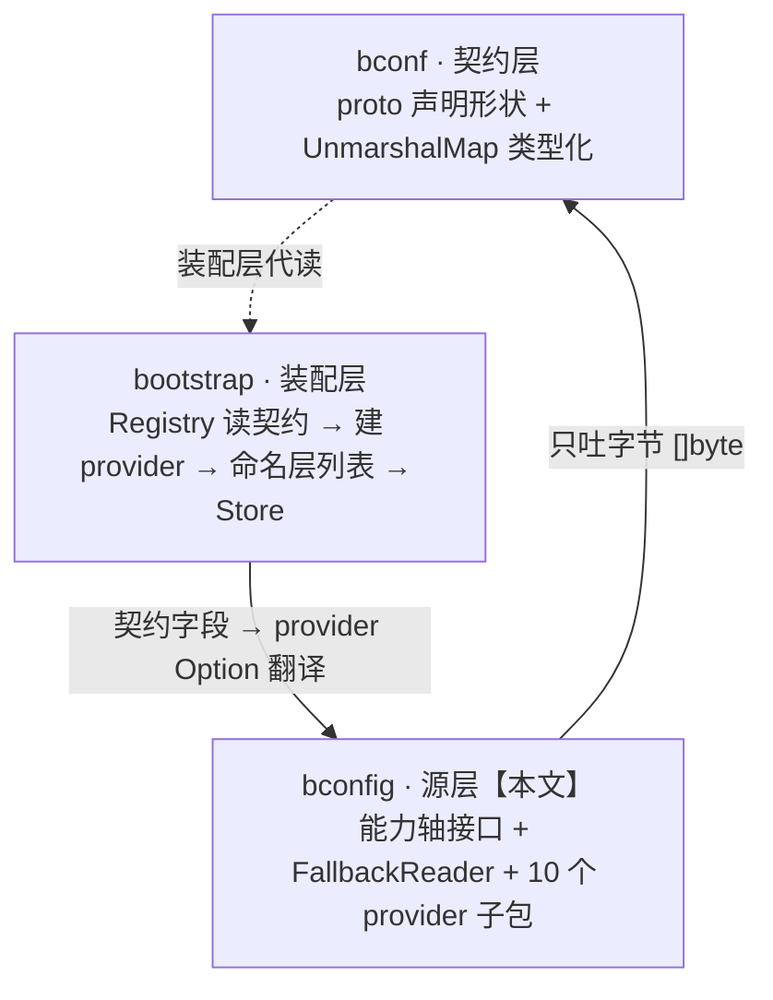

# Bald 配置源层设计：字节进字节出——能力轴、级联回退与 provider 自治理

> Author(s): bald 团队
>
> Last updated: 2026-09-14
>
> Discussion at: `Bald 配置契约设计.md`（兄弟篇：契约层专属展开）、`Bald 配置系统设计.md`（早期四源优先级决策记录的收编处——原《配置中心设计》已并入该篇，该文件已不存在）
>
> Status: Accepted（已实现，随 bald bconfig module 演进）

## 摘要

`bconfig` 是配置源层：一个 module 回答「配置从哪读、怎么组合、怎么感知变更」，自身不解析任何格式、不认识任何契约。核心是两件东西——**能力轴**（Reader/Watcher/ValueWatcher/Decoder 等小接口，后端按需实现、调用方类型断言发现）与**级联回退组合器**（FallbackReader：按优先级取第一个成功源，watch 事件触发重算而非转发推送值）。十个 provider 子包（file/env/fs/http/etcd/consul/nacos/apollo/kubernetes/vault）各自引入后端 SDK——不用的源不进二进制。本文最重要的承诺：**源只吐字节，类型化只发生在契约层的 UnmarshalMap 一处**——任何源与任何格式自由组合，新增源零契约改动。

> 本文按当前代码（bconfig，2026-09-14）整理；契约层见兄弟篇《Bald 配置契约设计.md》，系统全景与装配层（Registry/Store）见《Bald 配置系统设计.md》，本文只作消费者视角的必要交代。

---

## 背景与动机

### viper 留下的两个实锤

早期配置栈建立在 viper 上（Go struct + mapstructure 反序列化），两个缺陷无法根治：

1. **flag 压不过配置文件**。`viper.BindPFlag` 绑定的 flag 若未显式传入，`pflag.Value` 的零值（`""`、`false`）会覆盖配置文件里已设置的值——除非逐字段判断 `Changed`，必漏。
2. **嵌套段静默丢失**。配置文件里写错的键名（`https` 而非 `http`），mapstructure 直接忽略——曾出现 **TLS 配置静默失效**，进程照常启动，行为却不对。

2026-09-05 格局定型时 viper 整体退役：装载内核换为自建 merge-store（`bootstrap/config`），源抽象换为本文的 bconfig。viper 的 `RemoteProvider` 体系（etcd/consul 支持残缺、无 kubernetes/vault）一并退役。

### 需求侧：九种配置源、三种部署形态

教学级到生产级的完整谱系要求源层至少覆盖：本地文件、环境变量、编译期内嵌（embed）、HTTP 拉取、etcd/consul/nacos/apollo 四大配置中心、kubernetes ConfigMap、vault 密钥库。这些后端的共同点只有一件事：**能给出字节**。SDK 形态（连接参数、watch 能力、凭证方式）千差万别——抽象必须贴着这个最小公分母设计。

---

## 设计

### 三层定位：源层不解析、不装配



`bconfig` 只回答「配置从哪读」，不关心「长什么样」（bconf 契约）、不关心「怎么装配」（bootstrap Registry）。依赖方向单向：provider 子包只 import 根包的接口，**零契约依赖**——「只读文件系统的配置源」不需要认识 protobuf。

### 模块布局与依赖纪律

```text
bald/bconfig/                     module github.com/kalandramo/bald/bconfig
├── bconfig.go                    能力轴：7 个接口（本文 §能力轴）
├── fallback.go                   FallbackReader 组合器
├── file/     fsnotify watch      env/      纯 os.LookupEnv
├── fs/       go:embed 只读       http/     ETag 条件轮询
├── etcd/     原生 watch 推送     consul/   watch plan 推送
├── nacos/    ListenConfig 推送   apollo/   变更事件推送
├── kubernetes/ ConfigMap watch   vault/    30s 轮询模拟
└── go.mod                        直依赖 9 条 = 6 个后端 SDK（k8s 生态占 3 条）+ fsnotify
```

依赖纪律一条：**每个后端 SDK 关进自己的子包**。十个 provider 中七个引外部依赖（file/etcd/consul/nacos/apollo/kubernetes/vault），env/fs/http 纯标准库。主程序只 import 用到的子包，apollo 的阿里云 SDK 链（几十个 indirect）就不会污染纯文件部署的二进制。根包自身零第三方依赖（仅标准库）。

### 能力轴：小接口 + 类型断言发现

```go
type Reader       interface{ Load(ctx, key) ([]byte, error) }        // 必需
type Closer       interface{ Close() error }                          // 可选
type ReadCloser   interface{ Reader; Closer }                         // 组合便利
type Watcher      interface{ Watch(ctx, key) (<-chan struct{}, error) }      // 信号
type ReadWatcher  interface{ Reader; Watcher }                        // 组合便利
type ValueWatcher interface{ WatchValue(ctx, key) (<-chan []byte, error) }   // 推值
type Decoder      interface{ Decode(data []byte, out any) error }    // 正交
```

设计要点：

1. **没有 `Provider` 大接口**。后端按需实现：`env`/`fs` 只实现 `Load` 就能当配置源用；`file` 加 `Close` 与 `ValueWatcher`；调用方用类型断言在运行期探测能力（`r.(Closer)`、`r.(ValueWatcher)`）。给接口加方法会立刻破坏全部实现——`bconfig_test.go` 的 7 行编译期断言把形状钉死。
2. **两种 watch 语义并存，但组合层只认一种**。`Watcher` 只通知「变了」（普适但多一次 IO）；`ValueWatcher` 连新值一起推（etcd/consul/nacos 等 SDK 本就能给）。`FallbackReader` **只合并 `ValueWatcher`**——只能给信号的后端，在 provider 内部收到信号后 `Load` 回读再转推值，转换责任下沉，框架只认一种契约。
3. **`Decoder` 与读取完全正交**。源吐字节，格式由调用方注入（file 源配 YAMLDecoder、http 源配 JSONDecoder 都行）——这正是「字节进字节出」的直接收益。
4. **约定优于配置的键语义**：`Load(ctx, "")` 返回整份文档（装配层的整文档源模式）；`(nil, nil)` 表示「键不存在」而非错误（级联回退据此跳过该源继续尝试）。

### FallbackReader：级联回退 + 重算语义

```go
remote, _ := bconfig.NewFallbackReader(etcdSrc, consulSrc)  // etcd 兜底 consul
all, _    := bconfig.NewFallbackReader(fileSrc, remote)     // 本地 > 远程组（嵌套）
```

`Load` 按序尝试、第一个「无 error 且 data 非 nil」者胜出；全失败用 `errors.Join` 聚合；`Close` 只关实现了 `Closer` 的子源。

**本包最重要的一条语义在 `WatchValue`**：任一子源推送变更时，**丢弃推送来的值，重新走一遍 `Load` 全链路**，把「重算后的有效值」转发。低优先级源变更但高优先级源仍有值时，合并 channel 推出的仍是高优先级的值——若直接转发推送值，多源**遮蔽（shadowing）语义就会崩**。这条可推广为通用原则：

> 永远不要把「事件里带着的值」当真值，只把事件当作「该重算了」的触发器。

工程细节三则（`fallback_test.go` 逐条固化）：先收集齐全部 sub channel 再起 goroutine，杜绝监听器启动失败时的协程泄漏；`NewFallbackReader()` 无参直接返回 error，不造「永远失败」的对象；输出 channel 缓冲为 1 且发送为阻塞式——慢消费者下组合器背压而非丢值，事件依序送达；事件携带的推送值被丢弃，每次发送时重算当前生效值（合并去重语义）。

**嵌套是抗组合爆炸的标准答案**：`FallbackReader` 自身实现 `Reader`（编译期断言钉死），因此可以塞进另一个 `FallbackReader` 表达任意优先级树——不为每种组合命名接口，而是让组合器自己实现接口。

### provider 实现矩阵

| provider | 能力组合 | watch 语义 | 构造 |
|---|---|---|---|
| `env` | `Load` | — | `New(opts...)` |
| `fs` | `Load` | —（编译期资源，静态） | `New(fsys, opts...)` |
| `file` | `Load`+`Close`+`ValueWatcher` | fsnotify watch **父目录**（编辑器原子 rename 不丢事件） | `New(opts...)` |
| `http` | `Load`+`Close`+`ValueWatcher` | ETag 条件轮询（`If-None-Match`） | 双模式 |
| `etcd` | `Load`+`Close`+`ValueWatcher` | 原生 watch 推送 | 双模式 |
| `consul` | `Load`+`Close`+`ValueWatcher` | watch plan 推送 | 双模式 |
| `nacos` | `Load`+`ValueWatcher` | ListenConfig 推送 | 双模式 |
| `apollo` | `Load`+`ValueWatcher` | 变更事件推送 | 双模式 |
| `kubernetes` | `Load`+`ValueWatcher` | ConfigMap watch 推送 | `New(opts...)` 单模式 |
| `vault` | `Load`+`ValueWatcher` | **30s 轮询模拟**（无原生推送） | 双模式 |

两条横向纪律：

1. **双模式构造**：`New(opts...)` 从连接参数自建 client（契约装配路径，etcd/nacos 惰性建连），`NewWithClient(c, opts...)` 注入既有连接（复用注册发现场景，本源不负责关闭）。自建与否用 `owned` 标记，`Close` 只释放自己建的——注入方保有生命周期主权。两个例外：`kubernetes` 仅有 `New(opts...)`（不返回 error，clientset 由首次 Load/WatchValue 惰性初始化，无注入模式）；`consul` 的 `Close` 为空操作（consul api.Client 无可释放连接池，仅为 owned 语义完整）。
2. **watch 能力分级诚实**：SDK 本就推送的（etcd/consul/nacos/apollo/kubernetes）直通推送；SDK 不支持的（vault/http）用轮询模拟而不是不实现——调用方拿到的是统一契约，不必关心底下是推送还是轮询。apollo 相比 go-wind 原版修正两点：`New` 连接失败返回 error 而非 panic；watcher 修复了注册后立即反注册的 bug。

### provider 编写纪律（新增源的五条 checklist）

1. 编译期断言钉能力：`var _ bconfig.Reader = (*source)(nil)`（实现了什么声明什么）；
2. `resolveKey` 约定：key 参数非空覆盖默认路径，空串回落构造期默认——整文档源即「默认路径 + key 恒空」；
3. 键不存在返回 `(nil, nil)`，错误留给真失败——级联回退靠这个区分「跳过」与「出错」；
4. SDK 关进本包，根包不新增依赖；
5. 能给推送就实现 `ValueWatcher`；只能给信号就 provider 内部回读转推值——**不要**只实现 `Watcher` 指望组合层识别（它不识别，注释里写着）。

### 消费者：装配层怎么用这些能力

装配层（`bootstrap`）的 `Registry` 读契约（bconf 的 `Config` 段）→ 调 provider 工厂翻译成 `Option` → 构造源 → 包装为命名层：

```go
type Layer struct {
    Name   string          // 层名（日志定位，如 "nacos"）
    Reader bconfig.Reader  // 整文档源：Load(ctx, "") 返回整份配置
    Format string          // yaml/json；空则按 yaml（JSON 是 YAML 超集）
    Watch  bool            // true 时 Reader 须实现 ValueWatcher（Build 期校验）
}
```

`Build` 按注册序产出层列表（注册序即优先级），失败栈式回滚已构造源。层进入 Store 后的完整优先级链：`flag > env > 本地文件 > 契约源层（列表首最高）> 远程桥（基准）`；任一层实现 `ValueWatcher` 且 `Watch=true` 即参与热更新（变更 → decode → 层缓存 → 全量重合并）。

**FallbackReader 的退守**：装配主链路是命名层列表（map 深合并，字段级覆盖），不是 FallbackReader——key 级 first-wins 做不到字段级合并（本地只覆盖部分字段时其余字段无法从远程基准继承），且热更新回读会被高优先级源永久屏蔽。FallbackReader 退守它擅长的域：**同一 key 的多候选降级**（如 etcd 兜底 consul 的容灾读），不再出现在装配主链路上。

---

## 理由与取舍

**为什么源只吐字节（`[]byte`）而不是 `map[string]any` 或泛型 `T`？** 类型化只应发生一次。若源直接吐 map，每个源都要内置 YAML/JSON 解析、处理锚点与类型歧义，且契约层失去了对「原始字节 → 强类型」这条路径的完整控制。字节进字节出让格式成为调用方的一次性选择：file 源 + JSON 契约、vault 源 + YAML 文档，自由组合；类型化收口在 `bconf.UnmarshalMap`（含 coerce 类型缓冲），一处演进全局受益。代价是「读个配置要两层调用」——装配层已经把这层样板封装掉了。

**为什么能力轴而非大接口？** 大接口（viper 的 `Provider` 类设计）强迫每个后端实现全部方法，纯读源被迫写空 watch。小接口 + 类型断言让 `env` 的实现只有一个 `Load` 方法——能力即实现清单，读代码即知后端能干什么。代价是调用方写 `r.(Closer)` 这类断言——集中在 FallbackReader 与 Build 两处，可接受。

**为什么组合层不识别 `Watcher`（信号源）？** 引入适配器层兼容信号源，意味着每次变更多一次无谓的 `Load`（即使 SDK 本就能推值），且「信号源在组合层被静默忽略」的误导仍在。转换下沉到 provider：只有信号的后端自己回读转推，框架契约唯一。我们没选「组合层同时识别两种 watch」——两种语义在多源遮蔽下行为不一致，统一成一种才可推理。

**为什么 watch 事件要重算而不是转发推送值？** 见 §FallbackReader。转发值在单源下省一次 IO，在多源下直接破坏遮蔽语义——这是正确性与性能的交换，正确性赢。

**为什么双模式构造（`New` / `NewWithClient`）？** 契约装配路径只有连接参数（自建）；复用场景（注册发现模块已建好 client）注入即可，且本源不拥有就不关闭。单一 `New` 要么放弃复用，要么引入「谁来关闭」的模糊——`owned` 标记把所有权说死。

**为什么 vault/http 用轮询模拟 watch 而不是不实现？** 不实现则这两个源在热更新体系里缺席，调用方要为「有推送」和「无推送」写两套逻辑。轮询对上层透明：`ValueWatcher` 契约一致，30s/ETag 的粒度损失换来体系完整性。轮询间隔可配（`WithPollInterval`），默认值保守。

**被放弃的方案：**

| 方案 | 放弃原因 |
| --- | --- |
| viper 全家桶（含 RemoteProvider） | flag 零值覆盖、键名静默失效两大实锤；远程支持残缺（无 k8s/vault）；依赖重 |
| `Provider` 大接口 | 纯读源被迫实现空方法；能力清单不可读 |
| 组合层的 Watcher 适配器 | 每次变更多一次 Load；静默忽略的误导仍在 |
| watch 事件值直通转发 | 多源遮蔽语义崩坏（低优先级源的推送会冒充有效值） |
| `Priority int` 优先级字段 | 注册序已表达全部场景；同优先级再排序只是第二层规则，徒增复杂度 |
| FallbackReader 作装配主链 | key 级回退做不到字段级合并；热更新回读被高优先级源永久屏蔽 |
| 8 格组合矩阵全命名（`ReadCloserValueWatcher` 等） | 只有形参需要时才命名（io 包先例）；嵌套组合器已是抗爆炸答案 |

---

## 兼容性

接口层面纯增量，无破坏。两次内部语义归一（均有记录）：

1. **viper 退役**（2026-09-05）：装载内核换自建 merge-store，行为差异（toml/hcl/ini 格式随 viper 退役、仅支持 yaml/yml/json）已在装配层文档声明。
2. **装配产出从 FallbackReader 归一为命名层列表**（2026-09-05）：字段级合并与热更新语义修正，`FallbackReader` 保留但退守同 key 降级域——API 不变，用途收窄。

**被放弃的方案带来的约束**：仅实现 `Watcher` 的源不会触发组合器通知——这是刻意行为且已在接口注释声明，不是 bug。新后端接入 checklist 见 §provider 编写纪律。

---

## 实现与过渡

全部已落地，无过渡安排：

- [x] 能力轴 7 接口 + 编译期/可组合性断言（`bconfig_test.go`）。
- [x] `FallbackReader`：级联回退、错误聚合、多源 watch 合并、重算语义、防协程泄漏（`fallback_test.go` 全语义覆盖）。
- [x] 10 个 provider 子包全部实现；**9 个有独立测试文件**（module 共 62 个 Test 函数；远程源测试经环境适配可在 CI 离线跑）——`env` 子包无 `_test.go`（其行为经 `bconfig` 根包与 `bootstrap` 侧 provider 测试间接覆盖），是测试覆盖的已知缺口。
- [x] 装配层消费链贯通：Registry → 9 个契约适配器（env/file/etcd/consul/nacos/apollo/kubernetes/vault/http；fs 走代码 API 无适配器）→ 命名层 → Store 优先级合并 → 热更新。
- [x] 实战验证：go-bald-admin（现 bald-admin）已接入 nacos/kubernetes 源跑通（2026-09-10）。

**版本演进**：

| 时间 | 变更 | 性质 |
| --- | --- | --- |
| 2026-09-03 | 初始抽象（`feat: 配置系统抽象`） | — |
| 2026-09-04 | 提升为顶层 module `bconfig`（与 bconf 兄弟） | 结构 |
| 2026-09-05 | 格局定型 + 远程源补齐：viper 退役；etcd/consul/nacos/apollo/kubernetes/vault 落地；契约死源瘦身（fs/redis/zookeeper/oss/polaris reserved） | 语义归一 |
| 2026-09-05 | 远程源与数值解组健壮性修复 | 修复 |
| 2026-09-10 | nacos/kubernetes 接入 bald-admin | 实战 |

验证：bconfig module 随 bald CI（build + vet + test）全绿；`fs` 源保留为代码级 API（embed 资源无法经契约表达），不参与契约装配。

---

## 附录

### 与《Bald 配置契约设计.md》的分工

本文是**源层的专属展开**（从哪读、怎么组合、怎么感知变更），那篇是**契约层的专属展开**（形状怎么声明、map 怎么桥接、怎么校验）。两篇在「字节 → 类型化」的桥接点交接：源吐 `[]byte`，`UnmarshalMap` 收口类型化。装配层（Registry/Store）的完整设计见全景篇《Bald 配置系统设计.md》§3，本文 §消费者章节是其在源层视角下的必要摘要。

### FAQ

**为什么 `Load` 返回 `(nil, nil)` 表示「不存在」而不是 error？** 级联回退需要区分「这个源没有此键（继续尝试下一个）」与「这个源坏了（聚合报错）」。env 源查一个未设置的变量是常态不是故障。

**为什么不用泛型 `Load[T]`？** 泛型解决类型化，而源层的立场恰恰是**不做类型化**（字节进字节出）——泛型在这里没有位置。类型化在契约层用描述符做，比泛型更彻底（还能喂校验与 flag 绑定）。

**etcd 的 prefix 模式是什么？** `Load` 聚合前缀下全部 KV 为一份嵌套文档（键剥前缀按点路径展开），而非字典序首键——单文档源语义要求整份文档，这是「整文档源」约定在 KV 型后端上的落地。

**新增一个配置中心要动几处？** 三处：`bconfig/<name>/`（源实现 + 测试）、`bconf` 的 `Config` 段加 optional 子消息（新字段号）、`bootstrap/<name>.go`（契约字段 → Option 适配器）。契约层与组合器零改动——这是「源层自治理」的直接收益。

### 关联文档

`Bald 配置系统设计.md`（全景：三层定位与装配层 Registry/Store；原《配置中心设计》的早期四源优先级决策记录已并入该篇）、`Bald 配置契约设计.md`（契约层：proto 形状 + UnmarshalMap 桥接）、`应用框架设计.md`（AppKit 生命周期与配置装载）。
