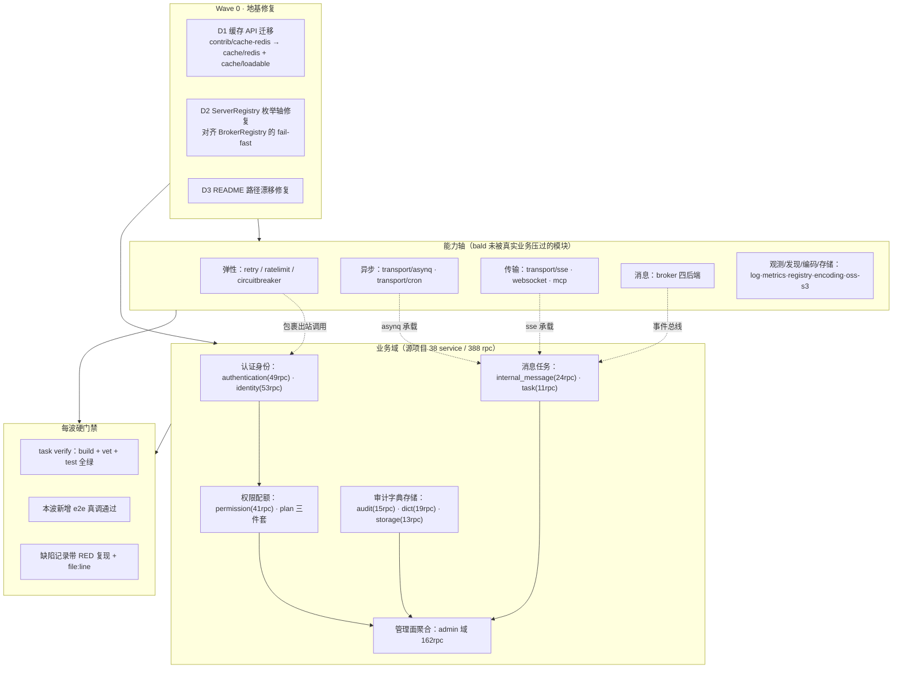

> **Model: deepseek-v4.1-flash (cheap)**

> **Status: APPROVED** — 2026-09-19T07:47:01.899Z

# bald-admin 全量复刻 go-wind-admin 后端 —— 能力轴与业务域并重

> **路径约定**：本计划所有文件引用均带仓库根前缀，相对工作区 `konglingfei/`：
> - `bald/...` —— 框架仓库（本地 HEAD = `v0.8.1`，`git describe` = `broker/kafka/v0.1.0`）
> - `bald-admin/backend/...` —— 目标仓库（module `github.com/kalandramo/bald-admin`）
> - `go-wind-admin/backend/...` —— 参考源（Ent ORM + gow 脚手架）
>
> 三者同处工作区 `konglingfei/`（该目录本身不是 git repo，三个子目录各自独立 repo）。

## 需求提炼

**用户原话**：「计划将 go-wind-admin 的后端使用 bald 框架在 bald-admin 实现一遍，以此验证 bald 框架能力和缺陷，帮我创建一个完善的计划文档，然后以此计划文档推进。」
后续澄清选择：「**全量复刻**：以源项目 388 rpc 全量功能对等为目标，能力轴与业务域并重推进」。

**提炼后的目标**（三层，不可降级任一层）：
1. **功能对等**——源项目 `go-wind-admin/backend` 的 388 个 rpc 在 bald-admin 有对应实现与可验证行为。
2. **能力验证**——bald 框架每一根能力轴（弹性/异步/传输/消息/缓存/观测/发现/编码/存储）至少被一条真实业务压过，而非仅编译通过。
3. **缺陷产出**——过程中发现的框架缺陷须以可复现的最小证据记录（RED 复现 + file:line），而非主观判断。

**非目标**（明确不做，避免范围蔓延）：
- 不改 bald 框架的**既有公开契约语义**（`transport.Server` 三方法、`appkit` Registry 模式、bconf proto 字段语义）——只做加法与缺陷修复。
- 不引入 Ent / kratos / gow / tx7do 生态依赖（`bald-admin/backend/docs/设计文档.md` §0 硬契约：外部依赖禁止 fake/mock/stub）。
- 不复刻源项目的 OPA 引擎、casbin 可插拔多引擎、MFA 硬件令牌等 YAGNI 项。
- 不为「跑通测试」引入 mock/fake 替代真实外部依赖；不可达的外部服务须显式 Skip 并标注。

## 〇、总体进度摘要（跨设备交接入口）

> **最后更新**：2026-09-20 · **代码仓**：`github.com/kalandramo/bald-admin`（后端在 `backend/`）
> **本文件位置**：`bald` 仓 `docs/devel/zh-CN/bald-admin-复刻验证/`（跨设备可获取；
> 同目录另有 `交接文档-跨设备续作.md` 与 `框架缺陷报告-D1-D15.md`）

### 进度一览

| Wave | 范围 | 状态 | 提交 |
|---|---|---|---|
| **0** | 地基修复与基线锁定（缓存迁移 D1） | ✅ 完成 | `75817ad` |
| **1** | 弹性轴 + 认证身份域（1.1–1.7，含 MFA/identity/org） | ✅ 完成 | `f2867e7`…`23e0571`（10 提交） |
| **2** | 异步轴 + 消息任务域（asynq/cron/task/message/broker） | ✅ 完成 | `5aa7f4d`…`6e2cb6e` |
| **3** | 传输轴 + SSE（装配 + 实时推送 + 决策记录 + dashboard） | ✅ 完成 | `5be35b3`/`4e70592`/`ccd286d` |
| **4** | 权限配额 + 观测/发现轴 | ✅ 可验证项完成 | `89f14e5`/`c044e5f`/`670a4a9`/`45c1598` |
| **5** | 审计字典存储 + 编码/存储轴 | ⬜ **未开始**（下一波） | — |
| **6** | 管理面聚合 API（admin 域 162 rpc） | ⬜ 未开始 | — |
| **7** | 前端对齐与收尾 | ⬜ 未开始 | — |

### 缺陷报告

`bald-framework-defects-D1-D15.md`（同目录）——**15 条**：4 条已修（Wave 0 ×3 + D14）、
11 条待上游确认。

**最高频模式**：D2/D5/D11.2/D13.2/D14 同属「契约声明但实现没接」——
其中 **D14（audit provider 未注册致启动失败）** 已在本项目修复（store 路径）。

### 下一波（Wave 5）开工前必读

1. 环境重建见 `HANDOFF.md`「环境与命令约定」；
2. 每波开工前先跑 `go build ./...` + `go test -shuffle=on -count=1 ./...` 确认基线绿；
3. Wave 4 的「未验证轴」（consul/kubernetes/otel/datadog/loki/sentry）**不是遗漏**，
   是无外部依赖环境，见计划 §4.3–4.5 的逐条说明。

---

## 一、已核验的现状基线

以下每条均来自本轮实测，非文档转述。

### 1.1 bald-admin/backend 已有相当完成度（**不是从零开始**）

| 项 | 实测事实 | 证据 |
|---|---|---|
| 构建 | `go build ./...` exit 0 | 本轮实测（cwd = `bald-admin/backend`） |
| 测试 | `go test -shuffle=on ./...` exit 0，全绿 | 本轮实测（e2e/gin/grpc/bootstrap/audit/casbin 全 ok） |
| 已实现业务 | 9 service / 42 rpc（tenant/user/menu/permission/dict/file/audit/secret/auth） | `bald-admin/backend/api/protos/` 实测计数 |
| 既有计划 | `bald-admin/backend/docs/go-wind-admin 业务移植计划.md`（551 行）T0–T10 + F1 全标 ✅ | 与实测一致 |
| 前端 | 7 个业务页（1622 行）已建 + 9 个 generated API 文件；`node_modules` 未装 | `bald-admin/frontend/src/pages/` 实测 |
| 依赖锁定 | bald v0.8.0 + contrib/* v0.1.0，**无 replace** | `bald-admin/backend/go.mod` 实测（依赖已发布 tag，clone 即可构建） |

### 1.2 源项目 388 rpc 的真实结构（**决定工作量数量级**）

实测分解，纠正了「388 rpc 全是独立业务」的直觉误判：

| 域 | proto 数 | service 数 | rpc 数 | 性质 |
|---|---|---|---|---|
| `admin` | 36 | 34 | **162** | **独立管理面 API**（路径前缀 `/admin/v1/*`，文件名 `i_*.proto` = interface），service 名与业务域重名但 package 不同 |
| `authentication` | 8 | 5 | 49 | 真实业务（含 MFA 7 rpc、OAuth、user_credential） |
| `identity` | 16 | 8 | 53 | 真实业务（user/tenant/org_unit/position/plan 三件套/user_profile） |
| `permission` | 13 | 6 | ~~41~~ **31**（实测修正） | 真实业务（role/menu/permission/api/group/policy_evaluation_log） |
| `internal_message` | 4 | 3 | 24 | 真实业务（消息/分类/收件人） |
| `dict` | 4 | 2 | 19 | 真实业务 |
| `audit` | 9 | 5 | 15 | 真实业务（operation/login/api/data_access/permission 五类审计） |
| `storage` | 4 | 2 | 13 | 真实业务（file/file_transfer/oss） |
| `task` | 2 | 1 | 11 | 真实业务（**源用 asynq**） |
| `redis_cache` | 1 | 1 | 1 | 真实业务（缓存监控） |

**去重后 38 个业务 service**，与源项目 `go-wind-admin/backend/app/admin/service/internal/service/*_service.go` 的 38 个实现文件精确一一对应。源项目另有 42 个 Ent schema（`go-wind-admin/backend/app/admin/service/internal/data/ent/schema/`）、503 个 data 层文件。

### 1.3 已核验的框架缺陷与漂移（本轮实测 + 瑶光反证结论）

这三条是计划的**前置修复项**，非可选。
（Wave 1 又实测出 D4–D7 四条新缺陷，见 §三「Wave 1 执行记录」的缺陷表。）

**D1 — 缓存模块 API 漂移（阻塞升级，已由对抗验证修正结论）**
本地 bald 已删除 `contrib/cache-redis`（`bald/bootstrap/cache.go:31-33` 注释载明「原 contrib/cache-redis 组件已删除（2026-09-18），能力被 cache/redis + cache/loadable 覆盖」），但 bald-admin 仍引用 `contrib/cache-redis v0.1.0`（`bald-admin/backend/go.mod`）。
**关键**：新 API **不是等价替换**——对抗验证推翻了我最初「能力全覆盖」的判断：
- `bald/cache/redis/redis.go:33` 的 `New(client goredis.UniversalClient, opts ...Option)` 接收**已构造的 client**，不是 addr 字符串；调用方须自建 client（连接池/TLS 自理）。
- `bald/cache/redis/options.go` 全文只有 `WithKeyPrefix` 一个 Option，**没有** `WithPassword`/`WithDB`/`Key()`/`Client()`。
- `WithTTL`/`WithDegradeOnError` 在 `bald/cache/loadable/options.go:16`/`:29`，不在 redis 适配器。
- 影响面：`bald-admin/backend/internal/bootstrap/providers.go:47-58`（CacheProvider）、`bald-admin/backend/internal/apiserver/biz/v1/dict/dict.go`、`bald-admin/backend/internal/apiserver/biz/v1/secret/secret.go`、`bald-admin/backend/internal/apiserver/e2e/t4_e2e_test.go`（用了 `rediscache.Key(...)`）均需重构，**不是改一处**。

**D2 — ServerRegistry 契约段静默失效（真实缺陷，根因经反正确认）**
`bald/bootstrap/server.go` 的 `BuildServers` 按**已注册 provider** 枚举（`names` 取自 `r.providers`），而 `bald/bootstrap/broker.go` 的 `Build` 按**契约段**枚举（`brokerSections` 表带 `implemented` 标志）。
后果：配置里写了 `server.sse`（或 websocket/tcp/http3/graphql/mcp）却无对应 provider 时，该段**根本不进入遍历集合**——不报错、不打日志、进程照常启动但不监听该协议。`bald/bootstrap/broker.go:64-67` 的注释恰好警告了这类危害：「配了未实现段会被 Build fail-fast 拒绝，**否则用户以为消息代理接上了、实际什么都没发生**」。
同仓两种语义，一处有防护一处没有，属不对称缺陷。

**D3 — transport/asynq 与 transport/cron 的 README 路径漂移**
`bald/transport/asynq/README.md:20` 与 `bald/transport/cron/README.md:17` 指引 `go get github.com/kalandramo/bald-plugins/transport/{asynq,cron}`，而 `bald/transport/asynq/go.mod:1` 实际声明 `module github.com/kalandramo/bald/transport/asynq`、`bald/transport/asynq/server.go:16` 注释亦指向 `bald/transport/...`。按 README 操作会拉错 module。

### 1.4 能力轴覆盖缺口（**这是"验证框架能力"的核心缺口**）

bald 有约 100 个独立 module，bald-admin 目前只消费 22 个。未被任何真实业务压过的轴：

| 能力轴 | 未验证 module | 装配现状（实测） |
|---|---|---|
| 弹性 | `retry`、`ratelimit`(+tokenbucket/bbr/sentinel)、`circuitbreaker`(+sres/vegas/hystrix/sentinel) | **纯运行期库**：无 bconf 契约段、无 Registry、无装配——业务侧直接构造。**Wave 1a–1c 已压过 `ratelimit/tokenbucket`、`circuitbreaker/hystrix`、`retry` 三个**（登录链路）；`bbr`/`sentinel`/`vegas`/`sres` 仍未验证（`sres` 已实测出缺陷 D4） |
| 异步 | `transport/asynq`、`transport/cron` | **有契约段（`bald/bconf/proto/bootstrap/v1/server.proto:314` Cron=13 / `:320` Asynq=19）但无 Provider**；契约字段面远小于实现 Option 面（Asynq 契约 3 字段 vs 实现约 50 个 Option） |
| 消息 | `broker` + kafka/rabbitmq/redis/rocketmq 四后端 | **装配完好**：`bald/bootstrap/broker.go` 有 13 段枚举 + implemented 标志 + fail-fast；`bald/pkg/appkit/broker.go:36` 的 `WithBrokerRegistry` 已就位 |
| 传输 | `transport/{sse,websocket,tcp,http3,graphql,mcp}` | 六者均有实现与 `transport.Server` 断言（http3/mcp 缺断言），但 appkit **只硬编码注册 http/grpc**（`bald/pkg/appkit/bootstrap.go:417`/`:427`）。**注**：`bald/pkg/appkit/bootstrap.go:392-396` 注释明载「能力声明在代码，是刻意的」——逃生舱是 `WithExtraServers`（`bald/pkg/appkit/bootstrap.go:186`），非缺陷；但与 D2 叠加即静默 |
| 缓存新轴 | `cache/loadable`、`cache/local` | 装配完好（`bald/bootstrap/cache.go` 的 `CacheRegistry` + `bald/pkg/appkit/cache.go:33` 的 `WithCacheRegistry`），但业务未用 |
| 观测后端 | `log/{loki,sentry,aliyun,tencent,charm}`、`metrics/{prometheus,otel,datadog}` | log 五后端有契约段；metrics 三后端**无 contract 子包**（装配集中在 `bald/contrib/observability-otlp/contract/`） |
| 发现 | `registry/{etcd,consul,kubernetes}` | 契约 + Provider 齐全，**但四个网络后端零测试**（仅 `bald/registry/inmemory/inmemory_test.go` 有测试） |
| 编码 | `encoding` 及 12 个子包 | `Codec` 接口（`bald/encoding/encoding.go:19`）+ 显式 `MustRegister`（`:32`）；avro 的 `New()` 带 nil schema 仅能编 null |
| 存储 | `oss/s3` | 契约 Type=`s3`（`bald/oss/s3/contract/contract.go:18`）；`PutObject` 签名与 minio **相反**（s3 隐含 bucket，minio 逐调用传） |
| 其他 | `contrib/database/{gorm,mongodb}`、`workflow/argo`、`cobramcp`、`ai/{openai,eino,langchaingo}` | 契约 + Provider 齐全；cobramcp 走 `Command(config)`（`bald/cobramcp/root.go:12`）非 Registry 模式 |

**零测试的能力轴**（缺陷风险高）：`bald/ratelimit/sentinel/`、`bald/broker/{kafka,rabbitmq,rocketmq}/`、`bald/registry/{etcd,consul,kubernetes,nacos}/`、`bald/transport/subscribe/`。

### 1.5 源项目剩余业务域的依赖拓扑（实测）

- **硬外部依赖（不可降级）**：`mfa`（`pquerna/otp` TOTP + Redis `MfaChallengeCache` fail-closed）、`task`（asynq + MinIO，`hasScheduler()` 未配置即报错）。
- **可降级**：`internal_message`（SSE 未配置 → `noopInternalMessagePublisher`；asynq 未配置 → `fanoutBroadcastGoroutine`）、`user_profile`（`BindContact`/`VerifyContact` 是 `return nil,nil` 空实现）。
- **拓扑层次**：`user`/`tenant` → `org_unit`（依赖 userRepo 回填 LeaderName）→ `position`（依赖 orgUnitRepo 回填 OrgUnitName）；`permission` → `role`/`menu`/`permission_group`；`plan` → `plan_module`/`plan_quota`（Edge 级联）。
- **测试覆盖**：38 个 service 中**仅 3 个有测试**（`mfa_service_test.go` 140 行纯函数级、`admin_portal_service_test.go`、`permission_service_test.go`）。

## 二、目标架构与推进路线

**核心设计决策**：能力轴与业务域**配对推进**，不串行。理由：能力轴需要真实业务作载体才有验证价值（asynq 需 task 域、sse 需 internal_message、broker 需事件流），单纯写 demo 属于「验证了个寂寞」。配对后每波同时产出功能与能力证据。

## 三、Wave 分波计划

> 每波的验收基线统一为：`task verify`（`go build ./...` + `go vet ./...` + `go test ./...`）全绿 + 本波新增 e2e 真调通过 + 缺陷记录带 RED 复现。
> 「真调」= 真实 gin/gRPC 栈 + 真实外部依赖（不可达则显式 Skip 并标注，禁止 fake）。

### Wave 0 · 地基修复与基线锁定

| # | 任务 | 涉及文件 | 验收 |
|---|---|---|---|
| 0.1 | **D1 缓存迁移**：`CacheProvider` 改为自建 `goredis.UniversalClient` 后接 `bald/cache/redis` 的 `New`；用 `bald/cache/loadable` 还原 Cache-Aside（含 `WithDegradeOnError` 降级语义）；dict/secret biz 的 `rediscache.Cache` 类型改为新接口；e2e 的 `rediscache.Key(...)` 改为 `WithKeyPrefix` 方案 | `bald-admin/backend/internal/bootstrap/providers.go`、`bald-admin/backend/internal/apiserver/biz/v1/dict/dict.go`、`bald-admin/backend/internal/apiserver/biz/v1/secret/secret.go`、`bald-admin/backend/internal/apiserver/e2e/t4_e2e_test.go` | `task verify` 全绿；字典 Cache-Aside 命中/失效 e2e 不回归；Redis 停机降级仍生效 |
| 0.2 | **D2 ServerRegistry 枚举轴修复**：`BuildServers` 改为遍历**契约段**（对齐 broker 的 `sections` 表 + `implemented` 标志），对「段已配置但无 provider」fail-fast | `bald/bootstrap/server.go` + `bald/bootstrap/server_test.go`（框架侧改动，**独立提交**） | 框架单测：配 `server.sse` 无 provider → 启动报错；未配段 → 正常跳过。存量 http/grpc 路径零回归 |
| 0.3 | **D3 README 修复**：import 路径改为 `github.com/kalandramo/bald/transport/...` | `bald/transport/asynq/README.md`、`bald/transport/cron/README.md` | 路径与 `bald/transport/asynq/go.mod:1` 一致 |
| 0.4 | **基线锁定**：记录 `task verify` 与 e2e 全量输出作为后续回归对照 | 无（产出记录） | 全绿基线存证 |

> 0.2 是**框架变更**，与 0.1 的**业务变更**分开提交——框架改动需在 bald 仓独立 commit，便于后续按 tag 发布。

#### Wave 0 执行记录（2026-09-19，已完成）

三个 commit 均已落地并验证：

| 提交 | 仓库 | 内容 |
|---|---|---|
| `75817ad` | bald-admin | `refactor(cache): D1 迁移 contrib/cache-redis → cache/redis + cache/loadable`（11 文件） |
| `8ec75cd` | bald | `fix(bootstrap): 契约段「配了但本仓无实现」改为 fail-fast（D2）`（2 文件） |
| `180bfc1` | bald | `docs(transport): 修复 README 的 import 路径漂移（D3）`（9 文件） |

**执行前三查发现的计划偏差（3 处，均已按实际修正）**：

1. **0.1 涉及文件数**：计划列 4 个，实测 **6 个**（多出 `internal/bootstrap/bootstrap.go`、`cmd/go-bald-admin/wire_gen.go`、`cmd/go-bald-admin/main.go`——`RedisCache` 类型变更波及全部引用点）。
2. **0.1 迁移性质**：计划表述为「用 loadable 还原 Cache-Aside」，实测**新旧 API 语义不兼容**，非等价替换：
   - `cache/redis.New` 接收已构造的 `goredis.UniversalClient` 而非 addr 字符串；
   - 适配器**不暴露底层 client**（`Close` 亦不关闭），而审计流需要 `*redis.Client` → 新增 `bootstrap.RedisClient` 持有连接；
   - `loadable` 的 loader 是**构造期绑定** `func(ctx,key)([]byte,error)`，旧 API 是**请求期**传入 → 参数化 key 由 loader 从 key 反解（租户段取自 ctx 与写键同源，业务键段经前缀裁剪**并校验**，不匹配即报错而非静默取错数据）。
   - 附带能力增强：`loadable` 以 singleflight 合并同 key 并发 miss（旧实现无此保护）。
3. **0.3 漂移面**：计划列 2 个文件（asynq/cron），实测 **9 个 transport README** 全部受影响（asynq/cron/kafka/rabbitmq/redis/rocketmq/sse/tcp/webrtc），另 4 个 MQ README 的 `broker` 路径也需同步。

**0.2 的范围界定（关键教训）**：fail-fast 必须**只针对「本仓无实现」（implemented=false）**的段，**不能**同时校验「provider 是否已注册」——后者是刻意的能力声明机制（`bald/pkg/appkit/bootstrap.go:392-396` 注释载明「未声明的能力不注册 provider——契约段存在也无 server 消费（能力声明在代码，是刻意的）」）。首版实现两条分支都 fail-fast，误伤 `pkg/appkit` 中 5 个「只关心 storage/workflow、不装配服务器」的既有测试；已收窄并加回归锁。**教训：框架改动后必须跑 `pkg/appkit` 与 `_example/bald`，不能只跑改动模块自身。**

**D2 的 RED→GREEN 证据**：修复前「配 `server.sse` + 只注册 http provider」→ `err=nil, len(servers)=1`（静默成功，无任何提示）；修复后 → 报错 `server.sse is configured but has no implementation in this repo (remove the section, or use appkit.WithExtraServers to mount it manually)`。新增 3 个回归测试固化（fail-fast / 多段聚合 / 不误伤能力声明）。

**Wave 0 验收基线（后续波次回归对照）**：
- bald 仓 `bootstrap` / `pkg/appkit` / `_example/bald` 三模块 build+vet+test 全 exit 0。
- bald-admin 仓 `go build` / `go vet` / `go test -shuffle=on` 全 exit 0；9 个测试包全 ok、FAIL=0：
  `cmd/go-bald-admin` / `biz/v1/auth` / `biz/v1/secret` / `e2e` / `handler/gin` / `handler/grpc` / `bootstrap` / `security/audit` / `security/casbin`。

**Wave 0 遗留项（不阻塞后续波次）**：
- `bald/docs/guide/Bald 配置系统.md` 同样引用 `bald-plugins`，但其内容**整体陈旧**——同时引用了本地不存在的模块（`log/zap`、`database/mysql`，实际为 `log/loki`、`contrib/database/gorm`）。需**重写**而非路径替换，不在 D3 范围。
- bald-admin 仍锁 `bald v0.8.0`（本地无 replace）。D1 已把缓存依赖切到 `cache/*` 新模块（tag 独立于主版本），故**无需**升主版本即可构建；但若后续波次需要 bald 主仓新能力（如 D2 的 fail-fast 修复），需 `go mod edit -replace=github.com/kalandramo/bald=../../bald` 联调，正式交付待框架发 tag。
- 本次未验证 `configs/go-bald-admin.yaml` 真实云端 Redis 连通性（本地无 Redis）；e2e 用 miniredis 覆盖语义。

### Wave 1 · 弹性轴 + 认证身份域

**能力轴**：`retry` / `ratelimit`(tokenbucket) / `circuitbreaker`(sres) 压到出站调用与 HTTP 中间件。
**业务域**：`authentication`（49 rpc）+ `identity` 的 user/tenant 扩展。

| # | 任务 | 验收 | 状态 |
|---|---|---|---|
| 1.1 | `retry` 包裹**主链路 DB 查询**（原计划写「JWT 验签重试」是反模式，已修正——见执行记录偏差 1） | 重试次数与退避可观测；分类器排除 `ErrNotFound` | ✅ `b33a91a` |
| 1.2 | `ratelimit/tokenbucket` 挂登录接口限流（对齐源项目 `LoginRateLimiter` 的 fail-open 语义） | 超限返回 429；Redis 不可用 fail-open | ✅ `f2867e7` |
| 1.3 | `circuitbreaker`（**`hystrix`，非 `sres`**——`sres` 契约不符见偏差 3）包裹**主链路 DB 查询**（原计划写「审计落库」收益极低，已修正） | 真故障达阈值 → Open；`ErrNotFound` 不计入 | ✅ `4a4eaa9` |
| 1.4 | `authentication` 域 rpc（源 proto 实为 **12 个**，计划写「8 个」是旧估） | e2e 全链路 | ✅ **12/12 全部完成**：Login/WhoAmI（既有）+ Logout/RefreshToken/ValidateToken `834dca3` + GenerateCaptcha/VerifyCaptcha `ab23aad` + RegisterUser `8fa1f17` + GetAccessTokens/RevokeTokenById/BlockToken/UnblockToken `3337069` |
| 1.5 | `mfa` 域（源 proto 实为 **10 个** rpc，计划写「7 个」是旧估；TOTP + Redis） | e2e：绑定→校验→偏差窗口；Redis 不可用 fail-closed | ✅ **7 实现 + 3 显式 501**（源仅落地 TOTP）：TOTP 七条真实现，StartMFAChallenge/GenerateBackupCodes/ListBackupCodes 返回 501（对齐源行为，不自创）。提交 `6143ba4` |
| 1.6 | `identity` 扩展：user_credential（10 rpc）+ login_policy（6 rpc）+ user_profile（2 rpc） | e2e：凭据管理、登录策略生效 | ✅ **16 实现 + 2 显式 501**：credential/login_policy 全实现；user_profile 的 BindContact/VerifyContact **已复认源为空实现**（`user_profile_service.go:200-207` `return nil,nil`）→ 501。提交 `1098120` |
| 1.7 | `org_unit`（7 rpc 树）+ `position`（7 rpc 关联回填） | e2e：树形 CRUD、父子层级、关联字段回填正确 | ✅ 全实现：树形（ParentID+Path）+ 双向防环 + 删除保护 + 关联回填。提交 `23e0571` |

**缺陷产出点**：retry/ratelimit/circuitbreaker **无 bconf 契约段、无 Registry**——评估是否需要在框架侧补契约（这是能力轴的可见缺口，需记录为「设计留白」或「待补」）。

#### Wave 1 执行记录（进行中，2026-09-19）

已完成 1.1 / 1.2 / 1.3 的场景修正版 + 1.4 的前三个子波（1d-1/1d-2/1d-3）。
**1.4 尚未全部完成**（token 管理 4 rpc 未做）、**1.5 / 1.6 / 1.7 未开始**。

| 提交 | 仓库 | 内容 |
|---|---|---|
| `f2867e7` | bald-admin | Wave 1a 登录限流（`ratelimit/tokenbucket`）+ 补离线配置源（7 文件） |
| `4a4eaa9` | bald-admin | Wave 1b 登录 DB 查询熔断（`circuitbreaker/hystrix`）（7 文件） |
| `b33a91a` | bald-admin | Wave 1c 登录 DB 查询重试（`retry`）+ 与熔断组合（6 文件） |
| `834dca3` | bald-admin | Wave 1d-1 authentication 域补全 Logout/RefreshToken/ValidateToken（8 文件） |
| `ab23aad` | bald-admin | Wave 1d-2 图片验证码 GenerateCaptcha/VerifyCaptcha（8 文件） |
| `8fa1f17` | bald-admin | Wave 1d-3 用户注册 RegisterUser + 修复策略热重载缺口（5 文件） |
| `3337069` | bald-admin | Wave 1d-4 token 管理 4 rpc——authentication 域 12 rpc 全部完成（5 文件） |
| `6143ba4` | bald-admin | Wave 1.5 MFA 域——TOTP 7 rpc + 3 条源未实现显式 501（13 文件） |
| `1098120` | bald-admin | Wave 1.6 identity 扩展域——credential 10 rpc + login_policy 6 rpc（9 文件） |
| `23e0571` | bald-admin | Wave 1.7 组织架构域——org_unit 树 7 rpc + position 7 rpc（8 文件） |
| `5aa7f4d` | bald-admin | Wave 2.1 异步轴装配——transport/asynq + WithExtraServers 逃生舱 |
| `9ad8bd8` | bald-admin | Wave 2.3 任务调度域——11 rpc + 真实 asynq 周期调度闭环 |

**Wave 1.4 已完成**（12/12 rpc）。**Wave 1.5 已完成**（TOTP 7 实现 + 3 显式 501）。
**Wave 1.6 已完成**（credential 10 + login_policy 6 实现，user_profile 2 显式 501）。
**Wave 1.7 已完成**（org_unit 7 + position 7 全实现）。

### Wave 2 执行记录（✅ 已完成，2026-09-19）

| # | 状态 |
|---|---|
| 2.1 asynq 装配 | ✅ `5aa7f4d`（决策：逃生舱，记录缺陷 D8） |
| 2.2 契约字段决策 | ✅ 按「记录缺陷 D8」处理（不扩） |
| 2.3 task 域 | ✅ `9ad8bd8`（真实周期触发已验证） |
| 2.4 cron 装配 | ✅ `59e94cd`（真实周期触发已验证） |
| 2.5 internal_message（24 rpc） | ✅ `5574c74`（含同不变量缺陷修复） |
| 2.6 broker redis 后端 | ✅ `6e2cb6e`（能力勘探，非替换 fanout——前提被推翻） |

**Wave 2 实测新增缺陷**：
- **D8**：契约 `server.proto` 的 Asynq 段仅 3 字段（redis_address/password/db），
  而 `bald/transport/asynq` 有约 30 个 Option——**契约驱动装配不可能**，
  必须走 `WithExtraServers` 逃生舱。
- **D9**：任务类型名必须与已注册处理器匹配，否则 asynq **静默不触发**
  （无显式日志）。CreateTask 目前不校验（定义与调度分离）——遗留项。
- **D10**：`bald/transport/asynq.Server.RemovePeriodicTask` 参数是 **taskId**
  而非 entryID（内部自行反查），但方法名与参数类型（string）未体现该差异——
  实测踩坑（传 entryID → `periodic task not found`）。
- **D12**：`Store.Delete` 对 0 行匹配一律返回 `ErrNotFound`，不区分单条/集合语义——
  两个真实违反点（消息级联删除、MFA 禁用未启用方法），均 RED→GREEN 修复；
  且 `store.go:224/233` 注释与实际行为矛盾（Get 注释写「(nil,nil)」实返 ErrNotFound；
  Delete 注释写「建议」实为硬要求）。提交 `5574c74`。
- **D11**：`transport/cron` 接受 **6 字段** cron（含秒，parser 硬编码
  `cron.Second`），而 `transport/asynq` 接受 **5 字段**——同一框架内两个调度
  组件字段数不一致；且契约 `server.cron.seconds` 字段的 `WithSeconds` 是**空实现**
  （配了无效）。提交 `59e94cd`。

### 📋 缺陷报告已产出

**`bald-framework-defects-D1-D15.md`**（同目录）——D1–D15 十一条缺陷的完整报告，
每条附可复核的 file:line 锚点 + 可直接执行的复现命令。4 条已修（Wave 0 ×3 + D14），
10 条待上游确认。报告附「核验方法」章节，记录了锚点漂移与自身修正。

### ✅ Wave 1 全部完成（2026-09-19）

1.1–1.3 弹性轴三件套（限流/熔断/重试压登录主链路）+ 1.4 authentication 12 rpc
+ 1.5 MFA + 1.6 identity 扩展 + 1.7 组织架构。**累计 10 个提交**（`f2867e7` →
`23e0571`）。下一步进入 **Wave 2（异步轴 + 消息任务域）**。

**执行前称量发现的计划偏差（3 处，均已按实际修正）**：

1. **计划 1.1 是反模式**：原写「`retry` 包裹 JWT 验签失败重试」——`bald/retry` 包注释明载面向 **transient failures**，而 JWT 验签是**确定性函数**（同 token + 同密钥必然同样失败），重试毫无意义。改为包裹**主链路 DB 查询**（与 1.3 熔断同一位置）。
2. **计划 1.3 收益极低**：原写「`circuitbreaker` 包裹审计落库」——审计是**旁路不阻断**语义（`recordSafely` 有 recover 兜底），给失败无感的旁路加熔断无意义。改为包裹**主链路 DB 查询**。
3. **计划 1.3 指定的 `sres` 语义与契约不符（实测）**：`sres` 是 SRE 概率式，`accept = (requests-K*errors)/(requests+1)` 恒 < 1，故 100 次**全成功**路径下仍概率拒绝（K=2 实测拒 12 次），且 `State` **永不返回 `StateClosed`**（恒 half-open），违反 `bald/circuitbreaker/circuitbreaker.go:22` 对 `StateClosed` 的定义「all requests are allowed」。改用 `hystrix`（阈值式）。**1.1/1.3 的正确场景都是主链路 DB 查询，且 retry 与熔断在此天然组合**（retry 处理偶发抖动、熔断处理持续故障）。

**Wave 1a–1d 实测发现的框架缺陷（新增，待上游确认）**：

| # | 缺陷 | 证据 | 影响 |
|---|---|---|---|
| D4 | `circuitbreaker/sres` 概率式语义与契约不符——恒不返回 `StateClosed`，全成功路径仍拒绝 | `bald/circuitbreaker/sres/`；实测 K=2 时 100 次全成功拒 12 次；契约定义见 `bald/circuitbreaker/circuitbreaker.go:22` | 用 `sres` 的调用方无法获得「已恢复」的确定性状态；阈值式场景应用 `hystrix` |
| D5 | 契约 `server.http.rate_limit` 段（rate/burst/wait）**零消费者**——`pkg/middleware/{gin,grpc}/` 无 ratelimit 中间件（双重交叉验证） | `bald/bconf/proto/bootstrap/v1/server.proto:92` | 违反 Wave 0.2 确立的 fail-fast 原则：配了限流段却无任何效果。Wave 1a 故走业务自持段 `login.rate_limit` |
| D6 | `contrib/authn-jwt` 的 `toJWT` **不设 jti**（`RegisteredClaims.ID`），且 `iat`/`nbf`/`exp` 为**秒级** `NumericDate`；RSA 签名确定性 → **同一秒内对相同 claims 签发得到字节完全相同的 token** | `bald/contrib/authn-jwt/jwt.go:208-221`（toJWT）、`:298-305`（时间戳） | 连续刷新时新 access_token 与旧相同（有效期不延展）；轮换出的 refresh_token 可能与刚消费的旧值重合，**破坏一次性语义**。Wave 1d 用 nonce scope 绕行 |
| D7 | `authz.Authorizer` 接口**只有 `Authorize`**，`contrib/authz-casbin` 也无热重载入口 → 运行期新增用户/改角色后权限**必须重启进程**才生效 | `bald/pkg/authz/authz.go:15-20`；`bald/contrib/authz-casbin/casbin.go:48/55/80` | 端到端实测：注册后立即访问受保护资源 403 `ACCESS_DENIED`。Wave 1d-3 用 `ReloadableAuthorizer` 装饰器绕行 |

**框架能力缺口（实测，非缺陷但需记录）**：
- bald v0.8.1 **不提供 captcha 组件**（`grep -rl "captcha" --include="*.go" bald/` 零命中）——Wave 1d-2 用源项目同款库 `mojocn/base64Captcha v1.3.8` 自建。
- bald **不提供 session/token 管理组件**——Wave 1d 自建 `internal/security/token`。
- `cache.Cache` 适配器接口**不足以**实现一次性刷新令牌（`Get`+`Delete` 两步有竞态窗口），需直接用 Redis 原生 `GETDEL`——「适配器接口够不够用」的一条实测结论。

**Wave 1d 的契约偏差（显式记录）**：源 `RegisterUserResponse.user_id` 是 `uint32`，而 bald-admin 的 `User.ID` 是 `string`（如 `u-admin`）——ID 体系不同，无法用 `uint32` 承载。当前 `user_id` 字段承载字符串 ID，并额外提供 `id` 字段。gRPC 侧将来引入 proto 时需在契约层重新裁定。

**Wave 1d 修的真实实现缺陷（自测抓到，非框架问题）**：
- **生产装配路径吊销失效**（最严重）：`RegisterRoutes` 在装配期执行，而 `RedisClient` 要 `BeforeStart` 才就绪——直接传装饰器会把 nil 快照固化。单测全绿（e2e 走显式注入路径）而**生产静默失效**（登出后 whoami 仍 200，但 ValidateToken 报 revoked）。修复：`bootstrap.LazyAuthenticatorWithRevocation`（请求期解析）。**教训：涉及包级桥接变量的接线，必须有走生产入口的回归测试**——这条与 §五「回归守护」第 3 条同源（「构造期快照」已踩坑四次）。
- **`/v1/auth/refresh` 端点位置错误**：首版放在需认证组，要求 access_token——但 refresh 的用途正是「access_token 过期时换新的」，逻辑循环。改为公开端点。
- **测试非隔离**：Wave 1d-3 首版用固定用户名 `newbie`，与 `store_login_e2e_test.go:110` 的固定 `Username: "newbie"` 冲突，`-shuffle=on` 时互相污染。改为时间戳唯一用户名。

**Wave 1a–1d 的验证证据**：
- 每波 e2e 全 PASS（Wave 1a 4 例 / 1b 3 例 / 1c 3 例 / 1d-1 7 例 / 1d-2 4 例 / 1d-3 5 例）。
- **真实 HTTP 端到端**（真实 server 进程 + Docker Redis + curl/Python）：Wave 1a 限流 429 实测；Wave 1b 25 次 NotFound 验证熔断器仍 Closed；Wave 1c NotFound 路径耗时 51ms（未重试）；Wave 1d-1 十项全过（含登出后 whoami 401）；Wave 1d-2 八项全过（含 PNG 120×40、Redis TTL=300s）；Wave 1d-3 九项全过（含注册后立即登录 + 权限立即生效）。
- **回归测试有效性反向验证**（3 次）：回滚 Wave 1d-1 吊销装饰器 → `ProductionWiring` 测试立即 RED（status=200, want 401）；禁用 Wave 1d-3 `ReloadPolicies` → `PolicyReload` 测试立即 RED（403 ACCESS_DENIED）。红的原因均来自被测层。
- 全量：`go build` / `go vet` / `go test -shuffle=on -count=1 ./...` 全 exit 0，9 包 ok、FAIL=0（连续 3 次 shuffle 验证稳定）。

**Wave 1 环境**：Docker Redis 容器 `bald-admin-redis`（`docker.m.daocloud.io/library/redis:7-alpine`，6379，Docker Hub 直连不通时用 daocloud 镜像源）；PostgreSQL 复用宿主已有的 `postgresql` 容器（5432）。
**注意**：`bald-admin/backend/configs/go-bald-admin.yaml` 含云端真实凭据，**全程未改动、未提交**；端到端验证经 env 注入（`BALD_ADMIN_REDIS_ADDR` / `BALD_ADMIN_DB_DSN`）绕开该文件。

### Wave 2 · 异步轴 + 消息任务域

**能力轴**：`transport/asynq`、`transport/cron`、`broker`(redis 后端)。
**业务域**：`internal_message`（24 rpc）、`task`（11 rpc）。

| # | 任务 | 验收 |
|---|---|---|
| 2.1 | **asynq 装配**：为 `bald/transport/asynq` 补 ServerProvider 或在 main 手工 `NewServer` + `WithExtraServers`（**二选一并记录决策**） | 任务入队→消费→完成可观测；asynqmon 可见 | ✅ **决策：走逃生舱不扩契约**。提交 `5aa7f4d` |
| 2.2 | 扩展 `bald/bconf/proto/bootstrap/v1/server.proto` 的 Asynq 段字段（3 → 覆盖 concurrency/queues 等关键 Option）**或**记录「契约不足以驱动装配」为缺陷 | 决策记录 + 若扩则生成码同步 |
| 2.3 | `task` 域（源 11 rpc，655 行）：任务 CRUD + 启停 + 定时调度 | e2e：创建→调度→执行；`hasScheduler()` 未配置时明确报错 | ✅ 全实现（**真实周期任务触发已验证**）。提交 `9ad8bd8` |
| 2.4 | `cron` 装配 + `NewTimerJob` 压真实周期任务 | 周期任务按表达式触发 |
| 2.5 | `internal_message` 三表（消息/分类/收件人）：收发/已读/撤回/收件箱 | e2e：发送→收件箱→已读→撤回 |
| 2.6 | ~~`broker` 承载事件总线（替换 goroutine fanout）~~ **修正为能力勘探**：源不用 broker、asynq 已覆盖扇出、appkit 零引用 → 勘探休眠组件可用性 | ✅ 跨实例扇出已验证；降级路径已验并记 D13 |

### Wave 3 · 传输轴 + SSE 推送

**能力轴**：`transport/sse`（+ 按需 websocket/mcp）。
**业务域**：internal_message 的实时推送 + dashboard 实时数据。

| # | 任务 | 验收 |
|---|---|---|
| 3.1 | `bald/transport/sse` 经 `WithExtraServers` 挂载 | ✅ `5be35b3`（5/5 e2e PASS；发现 3 个未文档化约束） |
| 3.2 | `internal_message` 实时推送改走 SSE | ✅ `4e70592`（端到端链路打通：发送→SSE 收到；授权 4/4；e2e 5/5） |
| 3.3 | websocket/mcp/graphql 场景评估 | ✅ **结论：均记为「未验证轴」**（证据见下） |
| 3.4 | `dashboard` 域（4 rpc）统计接口 | ✅ `ccd286d`（e2e 6/6；端到端受阻于 D14，已标注） |

#### 3.3 决策记录：websocket / mcp / graphql 均记为「未验证轴」

**结论**：三者**都不实现**，记为「未验证轴」。**不因框架提供了就不造无消费者**。

**依据（三条独立证据，非「我没搜到」）**：

1. **源项目的 server 装配目录** `go-wind-admin/backend/app/admin/service/internal/server/`
   只有 `rest_server.go` / `asynq_server.go` / `sse_server.go`（+ 与传输无关的
   `policy_eval_logging_engine.go`）——**没有 websocket/graphql/mcp 装配文件**。
2. **源配置** `configs/server.yaml` 只声明三段：`rest` / `asynq` / `sse`。
3. **全仓检索**（`--include=*.go,*.proto,*.yaml,*.yml`，排除 `_test.go`）：
   `websocket` / `graphql` / `mcp` 三个关键词**零命中**。

**称量的两端**（为何不做，而非「忘了做」）：

- **收益端**：源无该场景 → 复刻无对标物；本项目当前也没有需要双向实时
  （websocket）、图查询（graphql）、LLM 工具协议（mcp）的业务需求。
- **代价端**：强行装配会引入「无消费者的传输端点」——**恰是本项目在 D5
  （`rate_limit` 段零消费者）、D11.2（`cron.seconds` 空实现）反复验证的
  「契约声明但无实现」抗模式**。造一个假消费者去「验证能力」，验证的不是
  bald 的能力，而是我自己造的壳。

**与 3.1/3.2 的区别**：SSE 有真实业务场景（站内信实时推送，源即如此），
故实现并端到端验证；websocket/graphql/mcp 无——这个区别是**称量结果**，不是偏好。

**保留的可能性**：若未来出现真实场景（如前端需要 websocket 双向通信），
`bald/transport/{websocket,graphql,mcp}` 已实现且满足 `transport.Server` 接口，
可直接走 `WithExtraServers` 逃生舱接入——**接入成本已知、路径已验证**。

### Wave 4 · 权限配额域 + 观测/发现轴

**能力轴**：`metrics/{prometheus,otel,datadog}`、`registry/{etcd,consul}`、`log/{loki,sentry}`。
**业务域**：`permission` 剩余（41 rpc）+ `plan` 三件套 + `policy_evaluation_log`。

| # | 任务 | 验收 |
|---|---|---|
| 4.1 | `permission_group`(5) + `policy_evaluation_log`(2) | ✅ `89f14e5`（e2e 5/5；path 格式对齐源逐字节断言）。**剩余** permission/api/role/menu 扩展待后续子波 |
| 4.2 | `plan`(5) / `plan_module`(5) / `plan_quota`(4) | ✅ `c044e5f`（e2e 3/3；级联删除语义已锁，与 org 的 Restrict 相反） |
| 4.3 | `bald/metrics/{otel,datadog}` | ⛔ **datadog 用户明确排除**；otel 有 `withReader` 测试钩子但零消费者（同 broker 型休眠组件），未接入 |
| 4.4 | `bald/registry/{etcd,consul}` | ✅ etcd **真实验证**（`670a4a9`+`45c1598`：注册/发现/注销/namespace 隔离/Watch）；consul 无外部服务 → 未验证轴 |
| 4.5 | `bald/log/{loki,sentry}` | ⬜ loki 镜像拉取被中断未完成；sentry 需 DSN。两者均有既有测试（主包+contract） |
| 4.6 | 补零测试 | ✅ sentinel（6 用例）+ registry/etcd（6）+ etcd/contract（5）——`45c1598`。consul/kubernetes 无环境 → 未验证轴 |

### Wave 5 · 审计字典存储 + 编码/存储轴

**能力轴**：`encoding`(+json/proto/msgpack 等)、`oss/s3`、`contrib/database/{gorm,mongodb}`。
**业务域**：`audit` 五类审计 + `dict` 剩余 + `storage` 剩余。

| # | 任务 | 验收 |
|---|---|---|
| 5.1 | `audit` 五类（operation/login/api/data_access/permission）补全（当前仅 operation+login 两类） | e2e：五类审计各自落库 + 查询 |
| 5.2 | `data_access_audit_log` 走 SQL Driver 包装（源项目形态） | e2e：数据访问被记录 |
| 5.3 | `dict` 的 language/i18n 扩展 | e2e：多语言字典条目 |
| 5.4 | `storage` 的 file_transfer / oss 契约段 + `bald/oss/s3` 后端验证（注意 `PutObject` 签名与 minio 相反） | e2e：S3 上传/下载；签名差异处理正确 |
| 5.5 | `bald/encoding` 轴压真实业务（asynq 任务载荷编解码用 msgpack/proto 替代 json） | 编解码往返一致 |
| 5.6 | `bald/contrib/database/mongodb` 验证（如无真实场景则记录为未验证） | 决策记录 |

### Wave 6 · 管理面聚合 API（admin 域 162 rpc）

**范围**：源项目 `go-wind-admin/backend/api/protos/admin/` 的 34 个 service / 162 rpc——独立管理面 API（路径前缀 `/admin/v1/*`）。

| # | 任务 | 验收 |
|---|---|---|
| 6.1 | **范围裁定**：逐文件核对 admin 域 162 rpc，区分「包装其他域的真新增」与「独立管理面逻辑」 | 产出精确清单（避免重复实现） |
| 6.2 | `AdminPortalService` / `DashboardService` 等真新增管理面逻辑 | e2e：管理面接口可调 |
| 6.3 | 其余包装类接口按裁定结果复用 Wave 1–5 的 biz 层 | 零重复实现 |

### Wave 7 · 前端对齐与收尾

| # | 任务 | 验收 |
|---|---|---|
| 7.1 | 前端补齐新域页面（authentication/mfa/org_unit/position/plan/internal_message/task），复用 `bald-admin/frontend/src/api/generated/*` | `pnpm build` + `vue-tsc --noEmit` 通过 |
| 7.2 | proto → OpenAPI → TS 三段生成链路按序重跑（禁止手改生成物） | 生成物与 proto 零漂移 |
| 7.3 | README / 设计文档 / 移植计划状态列全面同步 | 文档描述与实测一致 |
| 7.4 | **缺陷报告汇总**：D1/D2/D3 + Wave 1–6 发现的全部框架缺陷，每条带 RED 复现 | 可独立成文提交 bald 上游 |

## 四、反证/复现

本节记录计划期已执行的复现证据与**未能复现、故降级为待验证假设**的条目。

### 已复现（本轮实测，构成计划的事实基础）

| 断言 | 复现方式 | 结果 |
|---|---|---|
| bald-admin 构建通过 | `go build ./...`（cwd = `bald-admin/backend`） | exit 0 |
| bald-admin 测试全绿 | `go test -shuffle=on ./...`（cwd = `bald-admin/backend`） | exit 0，全 ok（e2e 5.631s / bootstrap 5.621s / casbin 5.065s / audit 4.704s 等） |
| 源项目 388 rpc 构成 | `grep -rh "  rpc " api/protos/ \| wc -l` 分组统计（cwd = `go-wind-admin/backend`） | admin=162，非 admin=226，合计 388 |
| 38 业务 service 去重 | `grep -rh "^service " api/protos/ \| sort -u \| wc -l` = 38，与 `ls app/admin/service/internal/service/*_service.go` 的 38 精确对应 | 一致 |
| contrib/cache-redis 已从 bald 删除 | `ls bald/contrib/` 实测 8 个 module 无 cache 相关；`bald/bootstrap/cache.go` 注释载明删除 | 确认 |
| bald-admin 引用旧路径 | `grep rediscache bald-admin/backend/go.mod` → `contrib/cache-redis v0.1.0` | 确认 |
| cache 新 API 不覆盖旧 API | `read_file bald/cache/redis/options.go` 全文仅 `WithKeyPrefix`；`bald/cache/redis/redis.go:33` 接收 UniversalClient | 确认（**推翻了最初的"等价替换"判断**） |
| BuildServers 静默失效 | `read_file bald/bootstrap/server.go` 的 `BuildServers` — `names` 取自 `r.providers`；对比 `bald/bootstrap/broker.go` 的 `brokerSections` 枚举 + implemented | 确认根因是**枚举轴错配** |
| appkit 只注册 http/grpc | `read_file bald/pkg/appkit/bootstrap.go:401/417/427` | 确认；但 `:392-396` 注释载明「能力声明在代码，是刻意的」——**逃生舱 `WithExtraServers`（`:186`）存在，故非缺陷** |
| asynq/cron 无 Provider | `grep ServerProvider` 全仓，仅 `bald/bootstrap/server.go` 定义 http/grpc 两个 | 确认 |
| README 路径漂移 | `bald/transport/asynq/go.mod:1` = `bald/transport/asynq` vs `bald/transport/asynq/README.md:20` = `bald-plugins/transport/asynq` | 确认 |

### 待验证假设（**未能复现，不作为结论**）

- **C1 的版本轴**：`contrib/cache-redis` 究竟在哪个 tag 被删除（本轮以 `git ls-tree` 观察过 v0.8.0 有、v0.8.1 无，但删除 commit 未定位）。Wave 0.1 前需 `git log --diff-filter=D -- bald/contrib/cache-redis` 定位后再写缺陷报告。
- **asynq/cron 的「无装配路径」措辞**：contract 段存在、实现 module 存在、`WithExtraServers` 存在——只能说「无**契约驱动**装配路径」，不能说「无法装配」。Wave 2.1 需实测验证 `WithExtraServers` 挂 asynq 的完整生命周期（含健康探针、停机顺序）后再定论。
- **admin 域 162 rpc 的构成明细**：本轮只确认了性质（`/admin/v1/*` 前缀 + `i_*.proto` 命名 + package 与业务域不同），**未逐条核对**哪些是纯包装、哪些是真新增。Wave 6.1 专门裁定。
- **go-wind-admin 各 service 的移植难度评级**：来自 code_scout 的静态阅读，属待核验假设（worker 输出未经编译/运行验证）。
- **`user_profile` 的 `BindContact`/`VerifyContact` 是空实现**：code_scout 报告 `return nil,nil`，Wave 1.6 前需 `read_file go-wind-admin/backend/app/admin/service/internal/service/user_profile_service.go` 复认。
- **retry/ratelimit/circuitbreaker 的 API 签名**：来自 code_scout 静态阅读，Wave 1.1–1.3 动手前需 `read_file bald/retry/retry.go` 等复认行号与签名。

### 本波需复现的重启点

Wave 0.1（缓存迁移）与 0.2（ServerRegistry 修复）属**行为变更**，实施时须先写 RED 测试：
- 0.1：迁移前记录字典缓存命中/失效的 e2e 行为作为对照；迁移后同断言须通过。
- 0.2：先写「配 `server.sse` 段但无 provider」的测试，确认**当前会静默通过**（RED），再修 `BuildServers` 使其报错（GREEN）。

## 五、验收基线

**每波必过（硬门禁，不可跳过）**：
1. `go build ./...` exit 0 —— 类型门禁。
2. `go vet ./...` exit 0。
3. `go test ./...` 全绿 —— 存量 e2e 零回归（当前基线：e2e/gin/grpc/bootstrap/audit/casbin 全 ok）。
4. 本波新增 e2e **真调**通过（真实 gin/gRPC + 真实外部依赖；不可达则显式 Skip 并标注「未验证」）。
5. 消费方核对：改了导出符号签名后 `grep` 全部消费方确认同步。
6. 缺陷记录：每条框架缺陷带 RED 复现命令 + file:line，禁止主观判断。

**全局验收（复刻完成）**：
- 源项目 388 rpc 逐条有对应实现或**显式标注的未复刻理由**（不得静默遗漏）。
- 能力轴每根至少一条真实业务压过；未覆盖的轴显式列出为「未验证」。
- 前端 `pnpm build` + `vue-tsc --noEmit` 通过；proto→OpenAPI→TS 生成链路零漂移。
- 框架缺陷报告可独立成文（D1/D2/D3 + 过程中新增）。

**回归守护**（不得破坏）：
- 存量 e2e 全绿（secret 多租户隔离、审计热切换、网关转码、字典 Cache-Aside）。
- `bald-admin/backend/docs/设计文档.md` §0 契约：禁止 fake/mock/stub 替代真实外部依赖。
- `biz` 层引用 bootstrap 包级桥接**一律请求期读取或运行期 setter，禁止构造期快照**（T0 确立的时序约定，已踩坑三次）。

## 六、风险与决策记录

| # | 风险 | 处置 |
|---|---|---|
| R1 | Wave 0.1 缓存迁移是**破坏性重构**（API 不兼容，影响 4+ 文件），可能引入回归 | 先锁基线 → 迁移 → 用同断言对照；dict/secret 两个消费方逐一验证 |
| R2 | Wave 0.2 改框架核心 `BuildServers` 影响所有使用方（含 `bald/_example/bald/`、其他下游） | 改前 `grep` 全部 `BuildServers` 调用方；语义变更（静默→fail-fast）属**行为收紧**，须在 bald 仓独立提交并在 CHANGELOG 标注破例 |
| R3 | 源项目 `task`/`mfa` 硬依赖真实 asynq+Redis / TOTP+Redis，无降级 | 无真实依赖时该波 e2e 显式 Skip 并标注「未验证」，禁止 fake |
| R4 | 388 rpc 全量复刻工作量巨大（38 service vs 已做 9） | 分 8 波推进，每波独立可交付；admin 域 162 rpc 经 Wave 6.1 裁定后可能大幅缩减实际工作量 |
| R5 | asynq/cron 契约段字段不足以驱动装配 | Wave 2.2 二选一：扩 proto 字段（改框架契约）或记录为缺陷；**倾向先记录后扩**，避免为凑装配而设计契约 |
| R6 | 能力轴存在「无真实业务场景」的模块（如 graphql/mcp/argo/mongodb） | 记录为「未验证轴」而非强造 demo——强造 demo 违背「真实业务验证」的初衷 |
| R7 | 多会话共享工作区 | 每波完成即 `deliver_task commit=true` 提交，不积累；框架改动与业务改动分开提交 |
| R8 | bald-admin 当前锁 bald v0.8.0，Wave 0.2 若改框架需升版本 | 本地联调用 `go mod edit -replace=github.com/kalandramo/bald=../../bald`；正式交付需框架发 tag 后去 replace |

## 七、推进纪律

- **每波开工前**：建 todo 列有序步骤（恰好一个 in_progress）。
- **每波修复**：先写 RED 测试复现，再改，再 GREEN。
- **每波收尾**：清理临时探针（`.rivet/scratch/` 清空自建文件）→ `task verify` → `deliver_task` 提交。
- **框架改动 vs 业务改动**：框架侧（bald 仓）独立提交与发布；业务侧（bald-admin 仓）独立提交。
- **缺陷记录**：发现即记（RED 复现 + file:line），不在记忆里攒——收尾时一次性汇总为缺陷报告。
