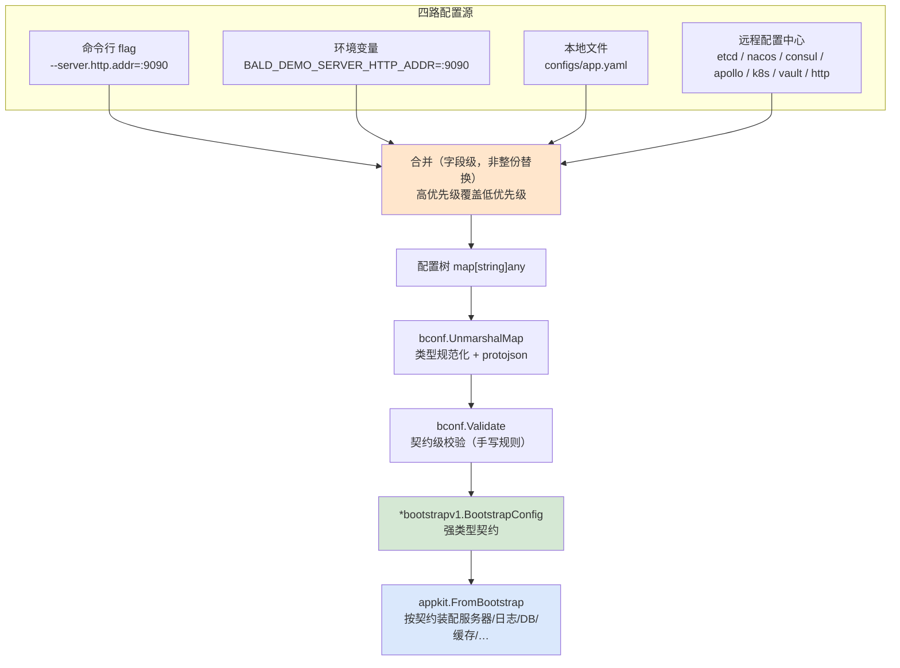

# Bald 配置系统

配置形状由 **proto 契约**声明（`bconf`），值可从 **flag / 环境变量 / 本地文件 / 远程配置中心**四路进入，
按固定优先级合并成一棵配置树，再由契约反序列化成强类型对象。改配置**不用改代码**，写错键名**不会静默生效**。

> 本文是使用指南：怎么配、怎么读、怎么排错。
> 设计动机与内部机制（为什么用 proto 而非 struct + mapstructure、`UnmarshalMap` 的三个坑、
> `FallbackReader` 的遮蔽语义）见 [Bald 配置系统设计](../devel/zh-CN/Bald%20配置系统设计.md)、
> [Bald 配置源层设计](../devel/zh-CN/Bald%20配置源层设计.md)、
> [Bald 配置契约设计](../devel/zh-CN/Bald%20配置契约设计.md)。

## 0. 什么都不做：默认行为

`main.go` 写 `bconf.NewBootstrap()`、不传配置文件：

- 拿到一份**全部取 proto 默认值**的契约对象（`server.http.addr` 等均为默认值），应用可直接跑起来。
- 没有配置文件、没有环境变量、没有远程源——**零配置可运行**，这是开发期的默认形态。
- 框架内置 `--config` flag（指定本地配置文件路径）；`appkit.FromBootstrap` 还会自动
  `Bind` `server.http` / `server.grpc` / `log` 三组 flag（见 §4.1）。业务自定义配置段需自行
  `appkit.Bind`（见 §4.3）。

```go
bootstrap := bconf.NewBootstrap()
bootstrap.GetServer().GetHttp().Addr = ":8080" // 代码内改默认值（业务默认值）
app, err := appkit.FromBootstrap(bootstrap, appkit.WithGRPC(registerGRPCService))
```

关键语义：**代码里设的值是「默认值」，可被四源任意一路覆盖**。上例 `Addr = ":8080"` 之后，
`--server.http.addr=:9090`、`BALD_DEMO_SERVER_HTTP_ADDR=:9090`、配置文件里的 `server.http.addr`
都能把它压掉——这正是「改配置不改代码」的实现方式。

## 1. 四源与优先级



**优先级（高 → 低）**：

```
flag  >  环境变量  >  本地文件  >  契约源层（列表首最高）  >  远程桥（基准）
```

三条容易踩的语义：

1. **flag 只取「用户显式传入」的**（`Changed==true`）。没传的 flag 不参与合并——
   否则 `--server.http.addr` 的零值会压掉配置文件里的值（这是 viper 时代的经典坑）。
2. **合并是字段级的**，不是整份替换。本地文件只写 `server.http.addr` 时，
   其余字段仍从低优先级层继承。
3. **任一层变更触发全量重合并**。所以底层更新不会冲掉上层覆盖，上层覆盖也不会污染底层基准。

## 2. 配置文件怎么写

键名即 **proto 契约的字段路径**（`bconf/proto/bootstrap/v1/*.proto`）。
同一套键路径同时适用于四源——这是「四源等价」的前提：

```yaml
# configs/app.yaml
server:
  http:
    addr: ":8080"
    driver: "grpc-gateway"   # 留空/其他值 = 业务 handler 直挂
  grpc:
    addr: ":9090"
    reflection: false        # grpcurl 等调试工具需要

logger:
  backends:
    - type: "slog"
      slog: {level: "info", format: "console", output_path: "stdout"}

registry:
  type: "nacos"
  nacos:
    server_addrs: ["127.0.0.1:8848"]
    namespace: "public"

cache:
  redis:
    addr: "localhost:6379"
    db: 0

database:
  sql:
    driver: "postgres"
    source: "host=db port=5432 user=app password=*** dbname=app sslmode=disable"
```

对应的四源写法（值等价）：

| 源 | 写法 |
|---|---|
| flag | `--server.http.addr=:8080` |
| 环境变量 | `BALD_DEMO_SERVER_HTTP_ADDR=:8080` |
| 本地文件 | `server.http.addr: ":8080"` |
| 契约源层 / 远程 | 同样的键路径（远程存同一份 yaml/json） |

> **只支持 yaml / json**。toml / hcl / ini 随 viper 退役，不再支持
> （`bootstrap/config/merge.go` 的 `decodeDocument` 会明确报错，不静默忽略）。

## 3. 环境变量命名规则

规则在 `bootstrap/config/merge.go` 的 `environMap`：**应用名前缀 + 点路径**。

```
前缀 = 应用名大写、连字符转下划线，加尾下划线
负载 = 去前缀 → 全小写 → 下划线/连字符 一律视为点路径分隔符
```

应用名 `bald-demo`（即 `app.name` / `appkit.Name("bald-demo")`）时：

```
BALD_DEMO_SERVER_HTTP_ADDR  →  server.http.addr
BALD_DEMO_LOGGER_BACKENDS   →  logger.backends
BALD_DEMO_CACHE_REDIS_ADDR  →  cache.redis.addr
```

两个必须知道的约束：

- **前缀不可省**。没有 `BALD_DEMO_` 前缀的变量根本不会被读（枚举驱动，非查询驱动）。
- **业务键别用下划线**。`_` 与 `-` 都被解释为路径分隔符，所以业务自定义键请用点路径命名，
  或干脆走 yaml / flag 覆盖——契约字段名都是单词，不受影响。

## 4. 主程序怎么接

### 4.1 推荐：`appkit.FromBootstrap` 约定装配

框架**内化**了 flag 绑定、四源装载、校验、热更新、服务器构造。业务只声明能力：

```go
func main() {
    bootstrap := bconf.NewBootstrap()   // 契约（唯一真相源）
    bootstrap.GetApp().StopTimeout = durationpb.New(15 * time.Second)

    app, err := appkit.FromBootstrap(bootstrap,
        appkit.WithConfigFile("configs/app.yaml"),  // 本地文件源
        appkit.WithWatchConfig(true),               // 监听文件变更（热更新）
        appkit.WithHTTP(router),                    // 声明 HTTP 能力
        appkit.WithGRPC(registerGRPCService),       // 声明 gRPC 能力
    )
    if err != nil {
        log.Fatal(err)
    }
    if err := app.Run(context.Background()); err != nil {
        log.Fatal(err)
    }
}
```

`FromBootstrap` 内部已自动 `Bind` 三组 flag（`pkg/appkit/bootstrap.go:490/636/639`）：
`server.http`、`server.grpc`、`log`（即 `--log.*`）。所以这三块的 flag 覆盖开箱即用，无需自己注册。

### 4.2 契约源层：追加远程配置中心

远程源经**注册表显式注册**（不用 `init()` + blank import 的隐式副作用）：

```go
reg := baldbootstrap.NewRegistry()
reg.MustRegister("file", baldbootstrap.FileProvider())
reg.MustRegister("nacos", baldbootstrap.NacosProvider())  // 按需追加

app, err := appkit.FromBootstrap(bootstrap,
    appkit.WithConfigRegistry(reg),
    // ...
)
```

**注册序即层优先级**（先注册者优先级高）。9 个适配器全部落地：
`env` / `file` / `etcd` / `consul` / `nacos` / `apollo` / `kubernetes` / `vault` / `http`。

若某源在契约里没配（如 `config.nacos` 段缺失），provider 返回 `nil` 层、`Build` 跳过——不是错误。

### 4.3 业务配置段：`appkit.Bind` 接入 flag 层

业务自己的配置对象要参与 flag 覆盖，必须经 `Bind` 注册进 AppKit 的 FlagSet：

```go
appkit.Bind("server.http", bootstrap.GetServer().GetHttp()),  // proto.Message → 自动生成 --server.http.addr 等
appkit.Bind("", logOpts),                                     // PlainBinder（自带 --log.* 前缀，prefix 须传空）
```

两种形态：`proto.Message` 走 `bconf.BindFlags` 按描述符生成层级 flag；
`PlainBinder`（实现 `AddFlags(fs)`）自注册无前缀 flag。

> **不要**再自行 `AddFlags(pflag.CommandLine, ...)`。只注册到全局 flagset 的话
> `config.Load` 拿不到它们，flag 层实际只有 `--config` 生效——`Bind` 正是为此缺口而生。

## 5. 读配置

装配后业务侧读的是**强类型契约对象**，不是 `map[string]any`：

```go
addr := bootstrap.GetServer().GetHttp().GetAddr()   // proto getter，nil-safe
```

`bootstrap` 子消息**指针直通**：`FromBootstrap` 构造的服务器在 `Start` 时实时读契约，
`BeforeStart` 阶段装载写回同一对象即生效，无需回填。

若需拿合并后的原始树（自定义段解析等）：`app.Settings()` 返回**深拷贝**快照——
已发布的快照不受后续热更新影响（copy-on-write，旧引用天然稳定）。

## 6. 热更新

三层粒度，按需选用。**注意两条装配路径的选项类型不同**（见下表「路径」列）：
`FromBootstrap` 用 `BootstrapOption`，`appkit.New` 用 `Option`——两者不可混用。

| API | 路径 | 粒度 | 说明 |
|---|---|---|---|
| `appkit.WithWatchConfig(true)` | FromBootstrap | 开关 | 监听本地文件变更（远程源自身 watch） |
| `appkit.WithOnKeyChange("server.http.addr", fn)` | FromBootstrap | 单键 | `fn(old, new string)`，仅值变化才触发 |
| `appkit.WithReconcile("audit.backends", fn)` | FromBootstrap | 期望态 | K8s controller 式 diff：只增删变动部分 |
| `appkit.WatchConfigFile(true)` | New | 开关 | 同上，`New` 路径版本 |
| `appkit.OnConfigChange(fn)` | New | 全量 | `fn(map[string]any)`，整份重载 |

`WithOnKeyChange` 语义（由 `keywatch_test.go` 固化）：

- 启动时以**首次加载值为基线**，首次变更前不触发；
- 仅当新值 ≠ 旧值才触发（同值刷新不触发）；
- 与全量回调共存时：**先跑全量回调，再分发 key 订阅**；
- 未开启 watch（本地 watch 与远程源都未配）时**永不触发**。

变更流程：任一层 watch 触发 → 全量重合并 → 重建配置树 → 回调解分发。
回调内应只做轻量操作（改状态、切引用、记日志），**不要**在回调里再触发配置重载或长时间阻塞。

**哪些段支持热更新**：只有**配置装载本身**（`config` 源层、本地文件）与 `logger` 段支持。
`logger` 走两阶段重建（启动默认 → 按契约重建）；`audit.backends` 支持运行期热切（走
`WithReconcile` 期望态协调器，是唯一的能力段热更新）。

**其余能力段都不支持**（`database` / `cache` / `registry` / `broker` / `storage` / `ai` /
`workflow` / `tracer` / `metrics` / `script`）——这些段的 client 重建侵入性大，变更需重启生效。
设计上它们在阶段 B（`BeforeStart`）一次性装配，不参与热更新重合并。

## 7. 报错解读

配置系统的设计目标是**坏配置响亮失败**，不静默落到零值。

| 报错 | 含义 | 处置 |
|---|---|---|
| `config: unsupported format "toml"` | 文件格式不在 yaml/json 内 | 转 yaml 或 json |
| `config: Name is required` | 没设应用名（env 前缀依赖它） | 设 `app.name` 或 `appkit.Name("my-app")` |
| `config: layer "nacos": Watch=true but Reader does not implement bconfig.ValueWatcher` | 层声明了 watch 但源不支持 | 去掉该层 `watch: true` |
| `bootstrap: no config source configured` | 契约 `config` 段一个源都没配，却走了 `Build` | 至少注册并配置一个源，或不用契约源层 |
| `bootstrap: provider <name>: layer Reader is nil` | provider 造了层但没给 Reader | provider 实现 bug |
| `appkit: Bind("x"): opt is nil` | `Bind` 传了 nil | 检查绑定对象 |
| `appkit: Bind("x"): opt registers its own flag prefix, prefix must be empty` | `PlainBinder` 配了非空 prefix | prefix 传 `""` |
| `bootstrap: invalid server config: server.sse is configured but has no implementation in this repo` | 配了本仓无实现的服务器段 | 删该段，或用 `appkit.WithExtraServers` 手工挂载 |
| 校验失败（`bconf.Validate`） | 值违反契约级校验规则（地址格式、必填段等） | 按错误信息修正取值 |
| 键写错但**无报错**、值没生效 | 未知键被放行（`DiscardUnknown`，为业务自定义段） | 用 `bconf.Validate` + 契约 getter 核对；确认键名拼写 |

最后一条要特别说明：proto 契约只约束**框架级**配置，业务自定义段允许自由键，
因此未知键**不会**报错。写错框架级键名时的表现是「值没生效」而非报错——
排查手段是核对契约字段路径（`bconf/proto/bootstrap/v1/*.proto`）。

## 8. 快速排错清单

值没生效时，按优先级从高到低逐层确认（高优先级会遮蔽低优先级）：

1. 有没有传 flag？`--server.http.addr` 传了就压过一切（`Changed==true` 才参与）。
2. 环境变量前缀对不对？必须是 `<APP_NAME>_`（`bald-demo` → `BALD_DEMO_`）。
3. 本地文件路径对不对？`WithConfigFile("configs/app.yaml")` 是**相对运行目录**的路径。
4. 键名是不是契约字段路径？下划线会被当路径分隔符。
5. 配置文件格式是不是 yaml/json？
6. 契约源层注册序对不对？先注册的优先级高。
7. 该段是否支持热更新？只有 `config` 源层/本地文件、`logger`、`audit.backends` 支持；
   `database`/`cache`/`registry`/`broker` 等能力段改动需重启。

## 9. 契约字段速查

顶层 `BootstrapConfig` 的 15 个域（`bconf/proto/bootstrap/v1/bootstrap.proto`）：

| 字段 | 内容 |
|---|---|
| `app` | 应用元数据（含 `stop_timeout`） |
| `server` | 传输层（http / grpc / 及 31 个协议段，可多选） |
| `config` | 配置中心来源（9 个源可混合） |
| `registry` | 服务注册发现 |
| `logger` | 日志（`backends` 清单，每项 type + 参数段） |
| `tracer` / `metrics` | 链路追踪 / 指标 |
| `broker` | 消息代理（kafka / rabbitmq / redis / rocketmq 等） |
| `storage` | 对象存储（minio / s3） |
| `ai` | AI 客户端（openai / langchaingo / eino） |
| `workflow` | 工作流引擎 |
| `cache` | 缓存（local / redis） |
| `script` | 脚本引擎 |
| `database` | 数据库（gorm / mongodb 等） |
| `audit` | 审计后端（log / store / stream） |

各段的具体启用方式见对应指南：[日志使用](./zh-CN/Bald%20日志使用.md)、[缓存使用](./zh-CN/Bald%20缓存使用.md)、
[指标埋点使用](./zh-CN/Bald%20指标埋点使用.md)、[审计使用](./zh-CN/Bald%20审计使用.md)、[健康检查](./zh-CN/Bald%20健康检查.md)。
